# Supervised Machine Learning: Regression

These are my notes and the code of the [IBM Machine Learning Professional Certificate](https://www.coursera.org/professional-certificates/ibm-machine-learning) offered by IBM & Coursera.

The Specialization is divided in 6 courses, and each of them has its own folder with its guide & notebooks:

1. [Exploratory Data Analysis for Machine Learning](https://www.coursera.org/learn/ibm-exploratory-data-analysis-for-machine-learning?specialization=ibm-machine-learning)
2. [Supervised Machine Learning: Regression](https://www.coursera.org/learn/supervised-machine-learning-regression?specialization=ibm-machine-learning)
3. [Supervised Machine Learning: Classification](https://www.coursera.org/learn/supervised-machine-learning-classification?specialization=ibm-machine-learning)
4. [Unsupervised Machine Learning](https://www.coursera.org/learn/ibm-unsupervised-machine-learning?specialization=ibm-machine-learning)
5. [Deep Learning and Reinforcement Learning](https://www.coursera.org/learn/deep-learning-reinforcement-learning?specialization=ibm-machine-learning)
6. [Specialized Models: Time Series and Survival Analysis](https://www.coursera.org/learn/time-series-survival-analysis?specialization=ibm-machine-learning)

This file focuses on the **second course: Supervised Machine Learning: Regression**

Mikel Sagardia, 2022.  
No guarantees

## Overview of Contents

1. [Introduction to Supervised Machine Learning](#1.-Introduction-to-Supervised-Machine-Learning)
	- 1.1 Interpretation vs. Prediction
2. [Linear Regression](#2.-Linear-Regression)
	- 2.1 Model Definition
	- 2.2 Model Evaluation: R2
	- 2.3 Python Code with Scikit-Learn
	- 2.4 Python Lab: `02a_LAB_Transforming_Target.ipynb`
3. [Training and Test Splits](#3.-Training-and-Test-Splits)
4. [Cross-Validation](#4.-Cross-Validation)
5. [Polynomial Regression](#5.-Polynomial-Regression)
6. [Regularization Techniques](#6.-Regularization-Techniques)
7. [Polynomial Features and Regularization](#7.-Polynomial-Features-and-Regularization)
8. [Further Details on regularization](#8.-Further-Details-on-Regularization)

## 1. Introduction to Supervised Machine Learning

A model is a small thing that captures a big thing; as such, it reduces the complexity while capturing the feeatures we are insterested in.

We distinguish between:

- Supervised learning: the data is labelled with real outcome
- Unsupervised learning: the data is not labelled, instead, we find structure in it.
- Semi-supervised learning: the data is sometimes labelled and sometimes it is not.

The model for any supervised learning:

`y_p = f(Omega, X)`

- `y_p`: predicted outcome, in contrast to `y`, real outcome
- `f`: model function
- `Omega`: model parameters, learned; we say that the model is fit to the data.
- `X`: past data-points x features
- Hyperparameters: any para,eger which is not learned, e.g., whether we have an intercept or not.

Within supervised learning we distinguish:

- Regression: numeric, continuous outcome/target.
- Classification: categorical outcome/target.

In order to learn, a loss function is defined, which evaluates the difference between the real target `y` and the predicted `y_p`:

`J(y,y_p)`

In this course, we're going to work on a **housing dataset**; we're going to apply regression on house features to predict the prices.

### 1.1 Interpretation vs. Prediction

In some cases, the primary goal of training a models is not the prediction of the target given new data points, but the interpretation of the model.

When we seek interpretation, we focus on the parameters `Omega`: we want parameters that are clearly **interpretable**. For that interpretation we get the **feature importances** and often plot them as a bar plot.

Examples of cases in which model interpretation is important:

- x: Customer demographics, y: sales data; Omega: examine to understand loyalty by segment.
- Safety features which prevent car accidents?

In contrast, when prediction is sought, the interpretability of the model is not that important. We want to predict the targets as accurately as possible. In that case the loss function and the plot `y` vs. `y_p` are more important.

Thus:

- Interpretation: feature impostances in focus
- Prediction: actual vs. predicted output in focus

Usually a balance is desired between interpretability and predictability. Also, note that not all models are equally interpretable:

- Linear regression: very interpretable.
- Deep learning: not very interpretable.

## 2. Linear Regression

Overall, I'd say that the explanations are not as good as in the course by Andrew Ng: Machine Learning. I suggest looking at the linear regression module of that course to get theoretical details -- my notes: [machine_learning_coursera](https://github.com/mxagar/machine_learning_coursera).

The added value of the current IBM section is that it is shown how linear regression is done with available libraries professionally.

### 2.1 Model Definition

Example used: Predict Box Office Revenue of a movie given its Budget.


The coefficients/parameters are found by minimizing the cost function = sum of all distances from the data points toa parametrized line.


### 2.2 Model Evaluation: R2

**Coefficient of determination, R2**: It measures the percentage of variance that is explained by the model. Interesting insight: ratio between

- Sum of squared Error (SSE) = `sum((y_pred - y)^2)`
- Total Sum of Squares (TSS) = Variance of observed `y` = `sum((mean(y) - y)^2)`

`R2 = 1 - (SSE/TSS)`


Notes:

- R2 is the ration between the variance captured by the model and the total variance.
- If we add features but these have no predictive power, R2 will not improve.
- SSE is used for minimizing the cost function but TSS is the total observed variance of the target in the dataset, which is always constant!


### 2.3 Python Code with Scikit-Learn

```python
from sklearn.linear_model import LinearRegression
lr = LinearRegression()
lr.fit(X_train, y_train)
y_pred = lr.predict(X_test)
```

**Important note**: even though it is not mentioned in the course, the linear regression model has an analytical solution. Thus, no learning rate is passed to the model -- the learning rate makes sense when we have an iterative optimization approach. For the case of the regularized models, no learning rate use used either; in those cases, a solver can be selected (default is `auto`). However, if we use the `SGDRegressor`, we can set a `learning_rate` and a decay policy. See section 7 for more details.

### 2.4 Python Lab: `02a_LAB_Transforming_Target.ipynb`

This notebook contains the following: 

- Different transformations of the target are tested; although it is not compulsory having a normally distirbuted target, it improves the model performance generally.
	- Log
	- Square root
	- Box cox = generalized power transformation, for which the optimum power coefficient is found: `boxcox = (y^lambda - 1)/lambda` 
- The linear model is loaded.
- Polynomial features are computed.
- Train/test split + scaling are applied.
- The model is fit.
- The inverse transformation is applied to the predicted values.
- Another fit is done with the untransformed target; the R2 is lower.

There is a helper script `helper.py` which loads the boston housing dataset from Scikit-Learn.

In the following, a summary of the most important parts in the notebook:

```python
import numpy as np
import pandas as pd
import matplotlib.pyplot as plt
%matplotlib inline

import warnings
warnings.simplefilter("ignore")

### -- 1. Load the dataset

from helper import boston_dataframe
boston_data, description = boston_dataframe(description=True)
# from sklearn.datasets import load_boston
# boston = load_boston()
# ...

boston_data.shape # (506, 14)
# Target: MEDV

print(description) # all variables described

### -- 2. Target transformation

# Even though it is not necessary to have a normally distributed target
# having it so often improves the R2 of the model.
# We can check the normality of a variable in two ways:
# - visually: hist(), QQ-plot
# - with normality checks, e.g., D'Agostino

# Normality check: D'Agostino
# if p-value > 0.05: normal;
# the larger the p-value, the larger the probability of normality
from scipy.stats.mstats import normaltest # D'Agostino K^2 Test
normaltest(boston_data.MEDV.values) # pvalue=1.7583188871696095e-20

# Square root transformation
sqrt_medv = np.sqrt(boston_data.MEDV)
plt.hist(sqrt_medv)
normaltest(sqrt_medv) # pvalue=3.558645701429252e-05

# Square root transformation
log_medv = np.log(boston_data.MEDV)
plt.hist(log_medv)
normaltest(log_medv) # pvalue=0.00018245472768345196

# Box-Cox transformation: Generalized power transformation
# boxcox = (y^lambda - 1)/lambda
# It requires y > 0; else apply y+y_min or use Yeo-Johnson
# However, Box-Cox seems easier to interpret/explain.
# Note: always save the lambda!
from scipy.stats import boxcox
bc_result = boxcox(boston_data.MEDV)
boxcox_medv = bc_result[0]
lmbd = bc_result[1]
plt.hist(boxcox_medv)
normaltest(boxcox_medv) # pvalue=0.104... NORMAL!

### -- 3. Model Fitting

from sklearn.linear_model import LinearRegression
from sklearn.metrics import r2_score
from sklearn.model_selection import train_test_split
from sklearn.preprocessing import (StandardScaler, 
                                   PolynomialFeatures)

lr = LinearRegression()

y_col = "MEDV"
X = boston_data.drop(y_col, axis=1)
y = boston_data[y_col]
X.shape # (506, 13)

# We create 2nd degree variables of the existing ones
# Note: bias will be added by the regression model
pf = PolynomialFeatures(degree=2, include_bias=False)
X_pf = pf.fit_transform(X)
X_pf.shape # (506, 104)
pf.get_feature_names_out() # get all feature names after the polynomial computation

# Train/test split
# ALWAYS set a random state!
X_train, X_test, y_train, y_test = train_test_split(X_pf, y, test_size=0.3, 
                                                    random_state=72018)

# Scale: after the PolynomialFeatures
s = StandardScaler()
X_train_s = s.fit_transform(X_train)

# Transform the target to be normal
bc_result = boxcox(y_train)
y_train_bc = bc_result2[0]
lmbd = bc_result2[1]

# Fit/Train
lr.fit(X_train_s, y_train_bc)

### -- 4. Evaluation

# Predict
X_test_s = s.transform(X_test)
y_pred_bc = lr.predict(X_test_s)

# Untransform the predicted y
# We need the inverse of the transformation function and its parameters!
from scipy.special import inv_boxcox
y_pred = inv_boxcox(y_pred_bc,lmbd)
r2_score(y_pred,y_test) # 0.8794001850404838

# What if we would have not used the box-cox transformation?
# The R2 would have been worse!
lr = LinearRegression()
lr.fit(X_train_s,y_train)
lr_pred = lr.predict(X_test_s)
r2_score(lr_pred,y_test) # 0.8555202098064152

```

## 3. Training and Test Splits

Since we are fitting the model parameters to a dataset, we need a new dataset to evaluate how well the fitted model performs. In order to tackle that, the dataset we have available is split into non-overlapping subsets: train and test. The model paramaters are computed with the train subset and the model is evaluated with the test subset.

### 3.1 Python Implementation Snippet

```python
from sklearn.model_selection import train_test_split

X = df.drop('target', axis=1)
y = df['target']

# Train/test split - ALWAYS set a random state!
X_train, X_test, y_train, y_test = train_test_split(X,
													y, 
													test_size=0.3, # 30% for 
                                                    random_state=101)
# Train/Fit
model.fit(X_train, y_train)

# Evaluate
y_pred = lr.predict(X_test)
r2_score(y_pred,y_test)

```

There are other split types in `sklearn`:

- `ShuffleSplit`: we can choose how many train-test splits to create, not just one
- `StratifiedShuffleSplit`: similar to the previous, but it can handle imbalanced labelings, such as medical data; basically, the ratios of labels can be maintained in the splits to avoid introducing bias.

### 3.2 Python Lab: `02b_LAB_Regression_Train_Test_Split.ipynb`

The dataset based on the [Housing prices in Ames, Iowa](https://www.kaggle.com/c/house-prices-advanced-regression-techniques) is used, with a shape of `(1379, 80)`.

Few new things are introduced in this notebook, however, some interesting takeaways are distilled and coding snippets are summarized.

Summary of actions:

- Object (string) and numerical columns are detected.
- The number of one-hot encoded columns is computed.
- One-hot encoding is applied with `sklearn`, which returns a sparse matrix (more memory efficient).
- A train-test split is carried out for numerical data and for the one-hot encoded binary data.
- A linear regression model is fit for each of the subsets: numerical data and one-hot encoded data.
- Different scalers are used to check the performance of the model.
- Model performanc eis visually analyzed plotting `y_test vs y_pred`.

Takeaways:

- The `OneHotEncoder` from `sklearn` returns a sparse matrix, which is much more memory efficient.
- The one-hot encoded data has a smaller error than the numerical data in the train split, but a much larger one in the test split. This is a sign of overfitting. It is obvious, because we have much more variables in the one-hot encoed subset! Many variables lead to overfitting. Overfitting performs badly on the test split.
- Using different scalers doesn't affect the performance of the linear regression; that is not true for regularized regression.

Code:

```python
### -- 1. Load Dataset

import pandas as pd
import numpy as np

# Import the data using the file path
filepath = os.sep.join(data_path + ['Ames_Housing_Sales.csv'])
data = pd.read_csv(filepath, sep=',')

data.dtypes.value_counts()
# object     43
# float64    21
# int64      16

### -- 2. Number of One-Hot Encoded Columns

# Select the object (string) columns
mask = data.dtypes == np.object
categorical_cols = data.columns[mask]

# Determine how many extra columns would be created
num_ohc_cols = (data[categorical_cols]
                .apply(lambda x: x.nunique())
                .sort_values(ascending=False))


# No need to encode if there is only one value
small_num_ohc_cols = num_ohc_cols.loc[num_ohc_cols>1]

# Number of one-hot columns is one less than the number of categories
small_num_ohc_cols -= 1

# This is 215 columns, assuming the original ones are dropped. 
# This is quite a few extra columns!
small_num_ohc_cols.sum()

### -- 3. One-Hot Encoding

from sklearn.preprocessing import OneHotEncoder, LabelEncoder

# Copy of the data
data_ohc = data.copy()

# The encoders
le = LabelEncoder()
ohc = OneHotEncoder()

for col in num_ohc_cols.index:
    
    # Integer encode the string categories
    dat = le.fit_transform(data_ohc[col]).astype(np.int)
    
    # Remove the original column from the dataframe
    data_ohc = data_ohc.drop(col, axis=1)

    # One hot encode the data--this returns a sparse array/matrix
    # A sparse matrix is a compressed sparse matrix
    # which contains almost only 0s; thus, only the locations where 1 appears are noted per row.
    # This saves alot of memory.
    new_dat = ohc.fit_transform(dat.reshape(-1,1))

    # Create unique column names
    n_cols = new_dat.shape[1]
    col_names = ['_'.join([col, str(x)]) for x in range(n_cols)]

    # Create the new dataframe
    new_df = pd.DataFrame(new_dat.toarray(), 
                          index=data_ohc.index, 
                          columns=col_names)

    # Append the new data to the dataframe
    data_ohc = pd.concat([data_ohc, new_df], axis=1)


# Remove the string columns from the dataframe
data = data.drop(num_ohc_cols.index, axis=1)

### -- 3. Train-Test Split

from sklearn.model_selection import train_test_split

y_col = 'SalePrice'

# Split the data that is not one-hot encoded
feature_cols = [x for x in data.columns if x != y_col]
X_data = data[feature_cols]
y_data = data[y_col]

X_train, X_test, y_train, y_test = train_test_split(X_data, y_data, 
                                                    test_size=0.3, random_state=42)
# Split the data that is one-hot encoded
feature_cols = [x for x in data_ohc.columns if x != y_col]
X_data_ohc = data_ohc[feature_cols]
y_data_ohc = data_ohc[y_col]

X_train_ohc, X_test_ohc, y_train_ohc, y_test_ohc = train_test_split(X_data_ohc, y_data_ohc, 
                                                    test_size=0.3, random_state=42)

# Compare the indices to ensure they are identical
(X_train_ohc.index == X_train.index).all()

### -- 4. Linear Regression

from sklearn.linear_model import LinearRegression
from sklearn.metrics import mean_squared_error

LR = LinearRegression()

# Storage for error values
error_df = list()

# Data that have not been one-hot encoded
LR = LR.fit(X_train, y_train)
y_train_pred = LR.predict(X_train)
y_test_pred = LR.predict(X_test)

error_df.append(pd.Series({'train': mean_squared_error(y_train, y_train_pred),
                           'test' : mean_squared_error(y_test,  y_test_pred)},
                           name='no enc'))

# Data that have been one-hot encoded
LR = LR.fit(X_train_ohc, y_train_ohc)
y_train_ohc_pred = LR.predict(X_train_ohc)
y_test_ohc_pred = LR.predict(X_test_ohc)

error_df.append(pd.Series({'train': mean_squared_error(y_train_ohc, y_train_ohc_pred),
                           'test' : mean_squared_error(y_test_ohc,  y_test_ohc_pred)},
                          name='one-hot enc'))

# Assemble the results
error_df = pd.concat(error_df, axis=1)
error_df
#		no enc			one-hot enc
# train	1.131507e+09	3.177268e+08
# test	1.372182e+09	4.698236e+16

### -- 5. Check Effect of Scalers

from sklearn.preprocessing import StandardScaler, MinMaxScaler, MaxAbsScaler


scalers = {'standard': StandardScaler(),
           'minmax': MinMaxScaler(),
           'maxabs': MaxAbsScaler()}

training_test_sets = {
    'not_encoded': (X_train, y_train, X_test, y_test),
    'one_hot_encoded': (X_train_ohc, y_train_ohc, X_test_ohc, y_test_ohc)}


# Get the list of float columns, and the float data
# so that we don't scale something we already scaled. 
# We're supposed to scale the original data each time
mask = X_train.dtypes == np.float
float_columns = X_train.columns[mask]

# initialize model
LR = LinearRegression()

# iterate over all possible combinations and get the errors
errors = {}
for encoding_label, (_X_train, _y_train, _X_test, _y_test) in training_test_sets.items():
    for scaler_label, scaler in scalers.items():
        trainingset = _X_train.copy()  # copy because we dont want to scale this more than once.
        testset = _X_test.copy()
        trainingset[float_columns] = scaler.fit_transform(trainingset[float_columns])
        testset[float_columns] = scaler.transform(testset[float_columns])
        LR.fit(trainingset, _y_train)
        predictions = LR.predict(testset)
        key = encoding_label + ' - ' + scaler_label + 'scaling'
        errors[key] = mean_squared_error(_y_test, predictions)

errors = pd.Series(errors)
print(errors.to_string())
print('-' * 80)
for key, error_val in errors.items():
    print(key, error_val)

# not_encoded - standardscaling        1.372182e+09
# not_encoded - minmaxscaling          1.372340e+09
# not_encoded - maxabsscaling          1.373232e+09
# one_hot_encoded - standardscaling    8.065328e+09
# one_hot_encoded - minmaxscaling      8.065328e+09
# one_hot_encoded - maxabsscaling      8.065328e+09

### -- 6. Evaluate the Model: y_test vs y_pred

import matplotlib.pyplot as plt
import seaborn as sns
%matplotlib inline

sns.set_context('talk')
sns.set_style('ticks')
sns.set_palette('dark')

ax = plt.axes()
# we are going to use y_test, y_test_pred
ax.scatter(y_test, y_test_pred, alpha=.5)

ax.set(xlabel='Ground truth', 
       ylabel='Predictions',
       title='Ames, Iowa House Price Predictions vs Truth, using Linear Regression')
```

## 4. Cross-Validation for Hyperparameter Tuning

Cross-validation consists in carrying out the train-test split on the dataset several times so that each test split does not overlap with the others. The idea is to improve the model performance evaluation by averaging the performance results; that way, we performance metric is closer to the truth. Note: **we call the test split the validation split** here. Of course, the process takes longer, because if we have `k=4` splits, we need to train and evaluate `k` models.

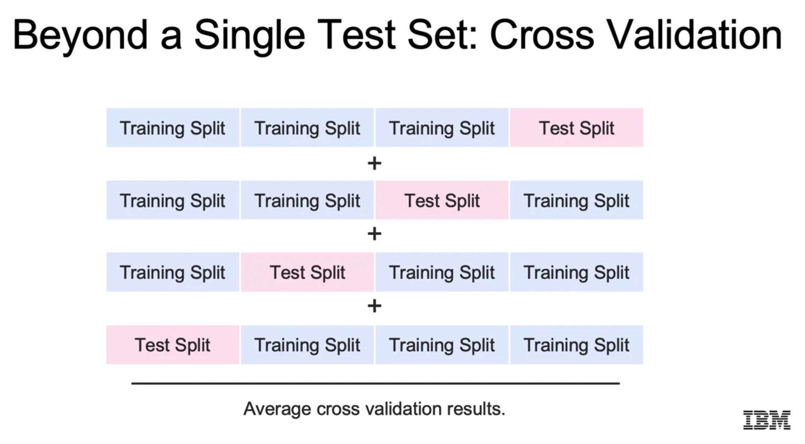

There are several approaches for cross-validation, which mainly depend on how the `k` splits are done. However, note that all of them explained here are different from the ones explained by Andrew Ng and Udacity. Andrew Ng and Udacity reserve a third split in the whole dataset for validation only. This validation split is tested, for instance, every epoch. At the end, the model is exposed to the test split with data-points it never saw. I think that checking the validation split every epoch makes sense when training the model is very time consuming.

I understand one could do the following to have the best of both worlds:

- Split the dataset in train & test splits.
- Take the train split and perform cross-validation with it; that implies it will be split into train-test/validation splits again `k` times.
- After the cross-validation is done, fit the model with the initial train split.
- Finally, test the fitted model with the initial test split, which was never shown to the model.

### 4.1 Underfitting vs. Overfitting

The cross-validation error is used to check whether we are (1) underfitting, (2) overfitting, or (3) just fine.

Underfitting models are too simplistic and their train or cross-validation errors are large and decreasing.

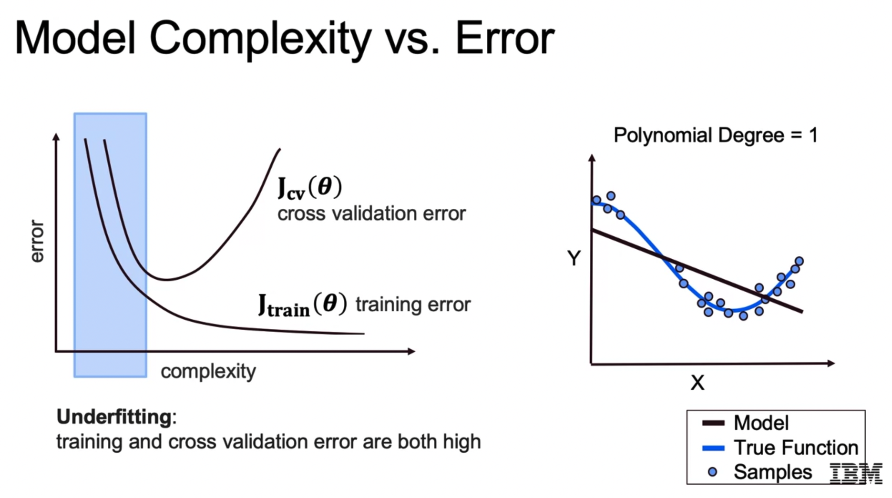

When we start overfitting, the train error decreases, but the cross-validation error has plateaud and started increasing. These models are too complex and fit the noise; thus, they don't generalize well.


### 4.2 Cross-Validation Approaches

- K-fold cross-validation: using each of `k` subsamples as a test sample; that's the approach explained before: `k` splits are evaluated and the performance is averaged.
- Leave one out cross-validation: using each observation as a test sample; that is using `k=rows-1`, i.e., we train many models and evaluate each time with a data point. Very time consuming.
- Stratified cross-validation: k-fold cross-validation with representative samples; we keep the ratios of classes in the validation split to avoid introducing bias.

### 4.3 Python Implementation Snippet

#### Manual

```python
from sklearn.model_selection import KFold
from sklearn.metrics import r2_score

# Create a splitter for k=3 train-test splits
kf = KFold(shuffle=True, random_state=72018, n_splits=3)

# Initialize model and empty array of scores (one for each split)
scores = []
lr = LinearRegression()

# Get indices of each split, fit model, evaluate and get metric/score
for train_index, test_index in kf.split(X):
    X_train, X_test, y_train, y_test = (X.iloc[train_index, :], 
                                        X.iloc[test_index, :], 
                                        y[train_index], 
                                        y[test_index])
    lr.fit(X_train, y_train)
    y_pred = lr.predict(X_test)
    score = r2_score(y_test.values, y_pred)
    scores.append(score)
```

#### Automatic

```python
from sklearn import linear_model
from sklearn.model_selection import cross_val_score

# We need to instantiate and pass the model to fit
model = linear_model.LinearRegression()
print(cross_val_score(model, X, y, cv=3, scoring='neg_root_mean_squared_error'))
## cv: number of subsets; if classification, StratifiedKFold, if regression KFold
# - None: 5-fold split
# - int: n-fold split
# - We can also pass a splitter object like KFold()
## Scoring
# https://scikit-learn.org/stable/modules/model_evaluation.html#scoring-parameter
# Regression: neg because we want to maximize the metric, thus negative MSE
# - neg_root_mean_squared_error
# - neg_mean_squared_error
# - r2
# - ...
# Classification
# - accuracy
# - f1
# - ...


from sklearn.model_selection import KFold, cross_val_predict

# Create a splitter for k=3 train-test splits
kf = KFold(shuffle=True, random_state=72018, n_splits=3)

# The data is split according to the cv parameter.
# Each sample belongs to exactly one test set, 
# and its prediction is computed with an estimator/model fitted on the corresponding training set.
predictions = cross_val_predict(model, X, y, cv=kf)
# IMPORTANT: the final model is not fitted yet, we need to do it!
```

That automatic way can be further automatized with `Pipelines` so that we can perform **hyperparameter tuning** either in a loop or in a **grid search**.

### 4.4 Python Lab: `02c_DEMO_Cross_Validation.ipynb`

This is a very interesting notebook in which the cross-validation approaches are applied to perform their ultimate goal: hyperparameter tuning.

In summary, the following processing is done:

1. Load Simplified Housing Dataset
2. Manual Cross-Validation
3. Cross-Validation with Pipeline and `cross_val_predict`
4. Hyperparameter Tuning: Finding Optimum Regularization Alpha
5. Grid Search Cross-Validation: Find the Optimal Value of Several Parameters

Summary of the most important code pieces:

```python

import numpy as np
import pickle
import pandas as pd
import matplotlib.pyplot as plt

from sklearn.preprocessing import StandardScaler, PolynomialFeatures
from sklearn.model_selection import KFold, cross_val_predict
from sklearn.linear_model import LinearRegression, Lasso, Ridge
from sklearn.metrics import r2_score
from sklearn.pipeline import Pipeline

### -- 1. Load Simplified Housing Dataset

# Note we are loading a slightly different ("cleaned") pickle file
# It is a dictionary in binary form.
boston = pickle.load(open('data/boston_housing_clean.pickle', "rb" ))
boston_data = boston['dataframe']
boston_description = boston['description']
boston_data.shape # (506, 14)
boston_data.columns # ['CRIM', 'ZN', 'INDUS', 'CHAS', 'NOX', 'RM', 'AGE', 'DIS', 'RAD', 'TAX', 'PTRATIO', 'B', 'LSTAT', 'MEDV']
X = boston_data.drop('MEDV', axis=1)
y = boston_data.MEDV

### -- 2. Manual Cross-Validation

# The train-test/valiation splits are all mutually exclusive,
# i.e., the test/validation splits do not overlap,
# but the train indices can overlap
kf = KFold(shuffle=True, random_state=72018, n_splits=3)

# Initialize model and empty array of scores (one for each split)
scores = []
lr = LinearRegression()

# Get indices of each split, fit model, evaluate and get metric/score
for train_index, test_index in kf.split(X):
    X_train, X_test, y_train, y_test = (X.iloc[train_index, :], 
                                        X.iloc[test_index, :], 
                                        y[train_index], 
                                        y[test_index])
    lr.fit(X_train, y_train)
    y_pred = lr.predict(X_test)
    score = r2_score(y_test.values, y_pred)
    scores.append(score)

### -- 3. Cross-Validation with Pipeline and cross_val_predict

s = StandardScaler()
lr = LinearRegression()

# The tuple objects have: (name, object)
# The object array must be a ssequence of objects with these properties
# - all need to have a fit() method
# - all but the last need to have a transform() method
# - the final one must have a predict() method
estimator = Pipeline([("scaler", s),
                      ("regression", lr)])

# We can now use the estimator as a model
estimator.fit(X_train, y_train)
estimator.predict(X_test) # ...

# The data is split according to the cv parameter.
# Each sample belongs to exactly one test set, 
# and its prediction is computed with an estimator fitted on the corresponding training set.
# Thus the predictions are a compilation of results on different non-overlapping test splits.
predictions = cross_val_predict(estimator, X, y, cv=kf)

# This is not a real R2, because the results are a compilation 
# of different models
r2_score(y, predictions) # 0.839054936432341

np.mean(scores) # 0.8507649765436147: almost identical!

### -- 4. Hyperparameter Tuning: Finding Optimum Regularization Alpha

# Regularization alpha: the larger, the less complex the model, less overfitting
# Logarithmic jumps in a range
alphas = np.geomspace(1e-9, 1e0, num=10)

pf = PolynomialFeatures(degree=3)

# Lasso and Ridge regression: alpha coefficient = factor of the regularization term
# Low alpha: more complex model, more similar to linear regression
# High alpha: less complex model
# We want to find the optimum alpha
# Perform cross-validation with varying alphas
scores = []
coefs = []
for alpha in alphas:
    las = Lasso(alpha=alpha, max_iter=100000)
    # We could also do:
    # ridge = Ridge(alpha=alpha, max_iter=100000)
    
    # For regular regression scaling does not affect so much
    # but for any regularized regression it does.
    # Always scale before fitting the model!
    estimator = Pipeline([
        ("polynomial_features", pf),
        ("scaler", s),
        ("lasso_regression", las)])

    predictions = cross_val_predict(estimator, X, y, cv = kf)
    score = r2_score(y, predictions)
    scores.append(score)

list(zip(alphas,scores))
# Small alpha values make coefficients do not remove the coefficients
Lasso(alpha=1e-6).fit(X, y).coef_
# Large alpha values make coefficients -> 0, i.e., we simplify our model
Lasso(alpha=1.0).fit(X, y).coef_
# Plot alpha vs. score: select optimum
# Note: we use semilogx
plt.figure(figsize=(10,6))
plt.semilogx(alphas, scores, '-o')
plt.xlabel('$\\alpha$')
plt.ylabel('$R^2$');

# Optimum alpha maximizes score
alphas[np.argmax(scores)] # 0.008858667904100823 ~ 0.01

# Once we have found the hyperparameter
# make the model and train it on ALL the data.
# Now, we should get a new test dataset that NEVER was exposed to the model.
# However, here we don't have one and we compute the score with the complete dataset we have instead.
# A way of doing that would be to make a train-test split at the beginning
# and then perform the k-fold cross validation on the train split.
best_estimator = Pipeline([
                    ("scaler", s),
                    ("polynomial_features", PolynomialFeatures(degree=2)),
                    ("lasso_regression", Lasso(alpha=0.01))])

best_estimator.fit(X, y)
best_estimator.score(X, y) # the default score is R2 for regression models
# 0.9241797703677183

# We can access the elements of the Pipeline with .named_steps["object_name"] 
# Note that many coefficients are zeroed out;
# that is usual with the Lasso regression.
best_estimator.named_steps["lasso_regression"].coef_ # ...

# Feature importances
df_importances = pd.DataFrame(zip(best_estimator.named_steps["polynomial_features"].get_feature_names_out(input_features=X.columns),
                 best_estimator.named_steps["lasso_regression"].coef_,
))
# Display and plot feature importances = ordered coefficients
df_importances.sort_values(by=1)
fig = plt.figure(figsize=(5,20))
plt.barh(df_importances.sort_values(by=1).iloc[:,0],df_importances.sort_values(by=1).iloc[:,1])

### -- 5. Grid Search Cross-Validation: Find the Optimal Value of Several Parameters

# In previous point 4, we looped different alpha values
# In practice, we should loop more all possible hyperparameters
# such as the degree of the PolynomialFeatures
# Instead of doing it manually, we can do it with GridSearchCV

from sklearn.model_selection import GridSearchCV

# Same estimator as before
estimator = Pipeline([
    ("polynomial_features", PolynomialFeatures()),
    ("scaler", StandardScaler()),
    ("ridge_regression", Ridge())])

# Definition of mutually exclusive k=3 valiadation splits
kf = KFold(shuffle=True, random_state=72018, n_splits=3)

# We copose a dictionary with parameter values to test or to look up
# If the estimator is a model: {'paramater':[value_array]}
# If the estimator is a Pipeline: {'object_name__parameter':[value_array]}; note the double '_'!
params = {
    'polynomial_features__degree': [1, 2, 3],
    'ridge_regression__alpha': np.geomspace(1e-3, 20, 30)
}

# Instantiate a grid search for cross-validation
grid = GridSearchCV(estimator, params, cv=kf)

# Find the optimal parameters
# Basically, the estimator is fit going through all parameter combinations:
# 3 degrees x 30 alphas = 90 combinations
grid.fit(X, y) # X_train, y_train

# Get best values: cross-validation score and parameters associated wwith it
grid.best_score_, grid.best_params_

# The best parameter set is taken and the estimator used to predict
# Notice that "grid" is a fit object!
# We can use grid.predict(X_test) to get brand new predictions!
y_predict = grid.predict(X) # X_test

# This includes both in-sample and out-of-sample
r2_score(y, y_predict) # y_test, y_predict

# We can access any Pipeline object of the best estimator
# and their attributes & methods!
# Here, the model coefficients
grid.best_estimator_.named_steps['ridge_regression'].coef_

# Get the model statistics/properties of each parameter combination
pd.DataFrame(grid.cv_results_)

```

## 5. Polynomial Regression

Even though we and higher degree terms, we still have a **linear regression** because we linearly add the features after weighting them with their coefficients.

With higher degree features we can analyze:

- The relation of the outcome with nonlinear features of higher order.
- Interactions between features.

This polynomial features are not exclusive to regression; we can use them with any type of model!

Other algorithms can help us extend our linear models:

- Logistic Regression
- K-Nearest Neighbors
- Decision Trees
- Support Vector Machines
- Random Forests
- Ensemble Methods
- Deep Learning Approaches

Python code snippet for polynomial features:

```python
from sklearn.preprocessing import PolynomialFeatures

# We create 2nd degree variables of the existing ones
# Note: bias will be added by the regression model
pf = PolynomialFeatures(degree=2, include_bias=False)
pf.fit(X)
X_pf = pf.transform(X)
# Alternative:
# X_pf = pf.fit_transform(X)
pf.get_feature_names_out() # get all feature names after the polynomial computation
```

## 6. Regularization Techniques

### 6.1 The Bias-Variance Trade-Off

As complexity increases, usually the error on the training set decreases, but from a point on, the error of teh cross-validation split starts increasing, because we're overfitting, thus, the model doesn't generalize well.

We want to find the sweet spot.

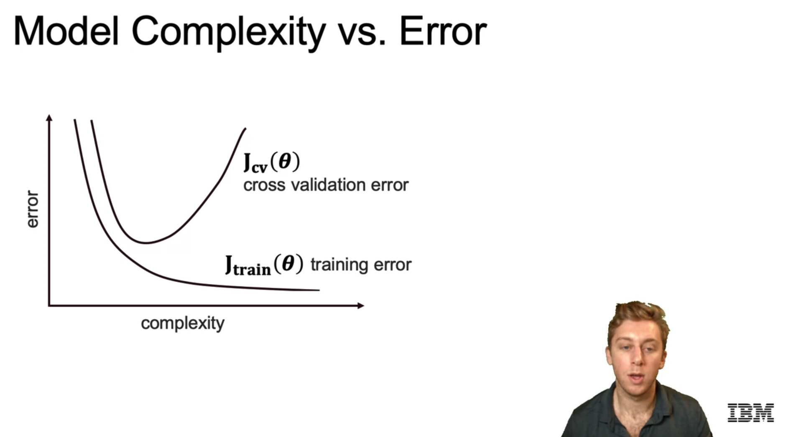

We differentiate between **bias** and **variance**. Both are errors that increase usually in opposite directions: when we increase the variance, the bias decreases, and vice versa.

- Bias is related to the tendency to miss; it appears with simplistic models with which we have undrfitting.
- Variance is related to the inconsistency in the inferences; it appears with too complex models with which we have overfitting, thus, we cannot generalize well.

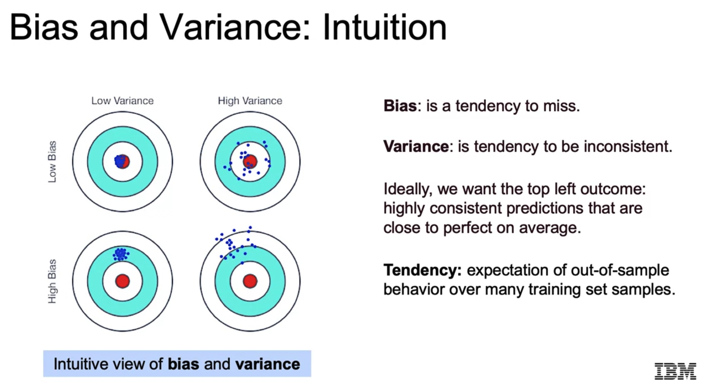

Thus, we distinguish 3 sources of errors:

1. Bias: being wrong
2. Variance: being unstable
3. Irreducible error: unavoidable randomness

The **bias-variance tradde-off**: as we decrease bias (increase complexity), the variance increases; since the total error is the sum of both and the error due to randomness, there is a sweet spot in which we have the minimum total error. We aim to find that spot: the model is complex enough, but not too complex, so that it generalizes well.

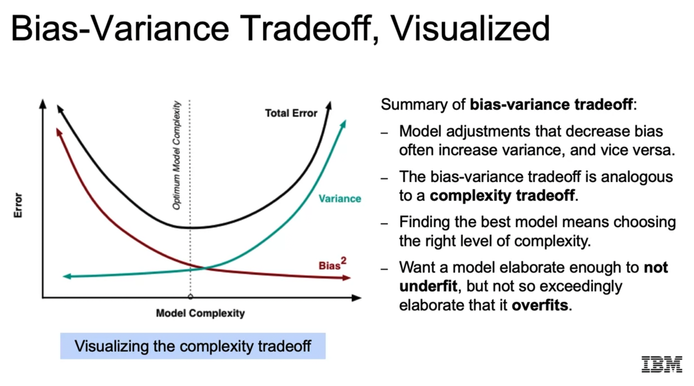

Example of the boas-variance tradeoff with polynomial features:

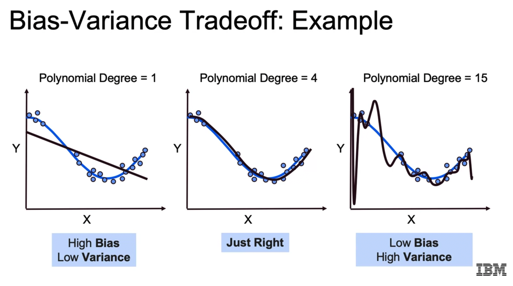

### 6.2 Regularization and Model Selection

One way of preventing overfitting (i.e., decresing variance error) is using regularization.

Regularization consists in adding a function of the weights to the cost function of the model. That way, **large weights are penalize and we don't fit the model so close to the data**.

```
E(w) <- E(w) + lambda * R(w)

E: error
w: weights, coefficients or model paramaters
lambda: regularization strength factor; the larger the more regularization
R: regularization funtion on the model paramaters, which increases with larger weights
```

The key idea is that we control the complexity of the model with `lambda`: the larger the `lambda` is, the smaller the weights will be, so the model will tend to be less complex, not fitting the dataset so accurately.

Thus, regularization imposes bias to the model, but it reduces variance!

We can select the best `lambda` value via cross-validation.

#### Feature Selection

Not all features are always relevant; sometimes the only thing they achieve is that we fit to the noise.

In that sense, regularization is very helpful: we fit the data while still decreasing the dominant features. In particular, the Lasso reguralization manages to shrink irrelevant features to 0, so we effectively achieve feature selection!

Feature selection is also important due to model interpretability: we want to have only the most relevant features to intepret what is going on.

### 6.3 Ridge Regression (L2)

Ridge regression is linear regression with L2 regularization, i.e., we add the sum of squares of the weights to the cost function:

```
E(w) <- E(w) + lambda * R(w)

R(w) = sum((w_j)^2)
```

With ridge regression, model parameters are decreased, but not completely shrunk to be 0, as happens with Lasso. Instead, they become more homogeneous. It is helpful in situations with high variance.

While scaling features was not that important with non-regularized linear regression, it is super important to scale with regularized regressions. That is because features with unscaled large values have smaller coefficients, but these might be in fact more dominanr in relation to others. In other words: we need to scale the variables to a common range to obtain a fair set of coefficients so that regularization can be applied in equal conditions for all coefficients.

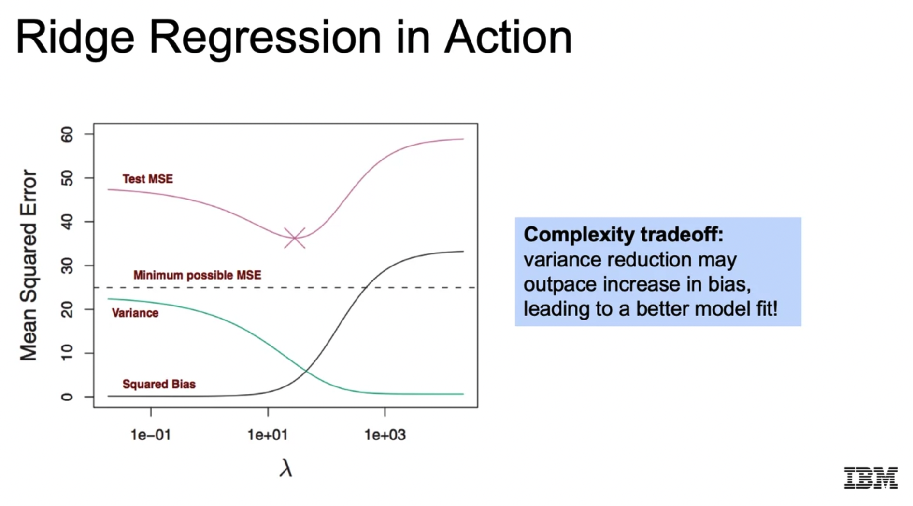

### 6.4 Lasso Regression (L1)

Lasso regression is linear regression with L1 regularization, i.e., we add the sum of absolute values of the weights to the cost function:

```
E(w) <- E(w) + lambda * R(w)

R(w) = sum(abs(w_j))
```

Lasso stands for: Least Absolute Shrinkage and Selection Operator.

It is similar to Ridge, but with Lasso some coefficients are selectively shrunk to 0, while the rest remain. Thus, Lasso can be used for feature selection! Meanwhile, with Ridge the coefficients shrink more homogeneously.

Lasso convergence is also lower and it takes longer. 

### 6.5 Elastic Net: Hybrid Ridge and Lasso Regularization

Elastic net consists in applying both Ridge and Lasso techniques with a weighting factor `alpha`:

```
E(w) <- E(w) + lambda * R(w)

R(w) = sum(alpha*(w_j)^2 + (1-alpha)*abs(w_j))
```

Cross-validation decides which `alpha` to use for an optimum bias-variance trade-off.

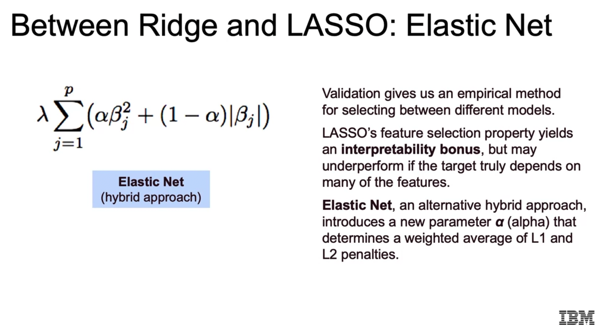

Note that this can be achieved by adding two regularization terms, each with its `lambda`:

```
E(w) <- E(w) + lambda_1 * R_Ridge(w) + lambda_2 * R_Lasso(w)
```

### 6.6 Recursive Feature Elimination

Recursive Feature Elimination (RFE) is another tool that Scikit-Learn provides to perform feature selection.

We choose

- a model
- and the number of paramaters we'd like

and RFE repeteadly tests the model and recursively removes the less important features.

Basically, the **features need to have a feature importance value** (e.g., regression with coefficients, random forests, etc.); the ones with the smallest value are removed.

```python
from sklearn.feature_selection import RFE, RFECV

rfe = RFE(estimator=model, n_features_to_select=5)
rfe.fit(X_train, y_train)
y_pred = rfe.predict(X_test)

# Recursive feature elimination with cross-validation to select the number of features
rfecv = RFECV(estimator=model, n_features_to_select=5)

```

## 7. Polynomial Features and Regularization: Demo

Notebook: `02d_DEMO_Regularization_and_Gradient_Descent.ipynb`

This notebook has three parts:

1. An artificial dataset of a noisy sine wave `y = sin(x)` is modelled with linear regression, Ridge regression and Lasso regression using polynomial features (degree of 20). The results are as expected:
	- Regularized regressions yield much lower RMSE
	- The coefficients are plotted for all 3 regressions: regularized regressions have much lower coefficients and they are almost 0 for higher degrees.
2. The Ames housing dataset is taken, processed and modelled with (1) linear regression, (2) Ridge regression, (3) Lasso regression and (4) ElasticNet using built-in cross-validation. The following steps are carried out:
	- String variables are one-hot encoded.
	- The skew of numerical variables is computed; those with `skew > 0.75` are transformed with `np.log1p`.
	- The dataset is split to `train` and `test`.
	- Scaling is performed.
	- The four models are computed with built-in cross-validation and their RMSE is computed; Ridge seems to achieve the best result. Note that ElasticNet is tried in discrete ratios, so the optimum value is not hit, probably.
3. The same Ames housing dataset is used with the `SGDRegressor` model. This is just a demonstration of how to configure stochastic gradient descent; Ridge, Lasso and ElasticNet penalties are used. Takeaway: always scale the data before using SGD!

In the following, the relevant code snippets related to the **second and third parts** (the first part has nothing new, it's just a demonstration of the theoretical insights):

```python
from sklearn.metrics import mean_squared_error

# Auxiliary function, since some estimators don't have a score output
def rmse(ytrue, ypredicted):
    return np.sqrt(mean_squared_error(ytrue, ypredicted))

### -- 1. Linear Regression

from sklearn.linear_model import LinearRegression

linearRegression = LinearRegression()
linearRegression.fit(X_train, y_train)
linearRegression_rmse = rmse(y_test, linearRegression.predict(X_test))

print(linearRegression_rmse) # 306369

### -- 2. Ridge Regression with Cross-Validation

# We could use Ridge(), but with RidgeCV we have cross-validation built-in;
# this is somehow equivalent to using GridCV, but we don't pass the model.
from sklearn.linear_model import RidgeCV

# Regularization strength values to test
alphas = [0.005, 0.05, 0.1, 0.3, 1, 3, 5, 10, 15, 30, 80]

# Ridge with Cross-Validation
ridgeCV = RidgeCV(alphas=alphas, cv=4)
ridgeCV.fit(X_train, y_train)
ridgeCV_rmse = rmse(y_test, ridgeCV.predict(X_test))

print(ridgeCV.alpha_, ridgeCV_rmse) # 15.0 32169.18

### -- 3. Lasso Regression with Cross-Validation

from sklearn.linear_model import LassoCV

alphas2 = np.array([1e-5, 5e-5, 0.0001, 0.0005])

lassoCV = LassoCV(alphas=alphas2,
                  max_iter=5e4,
                  cv=3)
lassoCV.fit(X_train, y_train)
lassoCV_rmse = rmse(y_test, lassoCV.predict(X_test))

print(lassoCV.alpha_, lassoCV_rmse)  # 0.0005 39257.39
# Number of coefficients
len(lassoCV.coef_)
# Number of non-zero coefficients
len(lassoCV.coef_.nonzero()[0])

### -- 4. ElasticNet with Cross-Validation

from sklearn.linear_model import ElasticNetCV

l1_ratios = np.linspace(0.1, 0.9, 9) # [0.1, 0.2, ..., 0.9]

elasticNetCV = ElasticNetCV(alphas=alphas2, 
                            l1_ratio=l1_ratios,
                            max_iter=1e4)
elasticNetCV.fit(X_train, y_train)
elasticNetCV_rmse = rmse(y_test, elasticNetCV.predict(X_test))

print(elasticNetCV.alpha_, elasticNetCV.l1_ratio_, elasticNetCV_rmse) # 0.0005 0.1 35001.23

### -- 5. Stochastic Gradient Descend Regresson

# Import SGDRegressor and prepare the parameters
from sklearn.linear_model import SGDRegressor

# SGDRegressor applies linear regression with stochastic gradient descend,
# i.e., we apply gradient descend by updating the weights/parameters iteratively.
# Thus, a learning rate `eta` is used; 
# however, this learning rate has a default value and it decays with the iterations (see the docs).
# Note that linear regression has an analytical solution, hence, no learning rate is required.
# The regularized regressions have their own solvers and no learning rate is passed either.
# The SGDRegressor can take several penalty values for regularization, with the regularization strength.

# We create four sets of parameters: LR, Ridge, Lasso, ElasticNet
model_parameters_dict = {
    'Linear': {'penalty': 'none'},
    'Lasso': {'penalty': 'l2',
           'alpha': lassoCV.alpha_},
    'Ridge': {'penalty': 'l1',
           'alpha': ridgeCV.alpha_},
    'ElasticNet': {'penalty': 'elasticnet', 
                   'alpha': elasticNetCV.alpha_,
                   'l1_ratio': elasticNetCV.l1_ratio_}
}

# ALWAYS scale the data with SGDRegressor!
scaler = MinMaxScaler()
X_train = scaler.fit_transform(X_train)
X_test = scaler.transform(X_test)

rmses = {}
for modellabel, parameters in model_parameters_dict.items():
    # Following notation passes the dict items as arguments
    # If we get very high RMSE values, we can pass a smaller learning rate eta0
    # than the default; note that by default eta0 is decreased after each iteration
    SGD = SGDRegressor(**parameters)
    SGD.fit(X_train, y_train)
    rmses[modellabel] = rmse(y_test, SGD.predict(X_test))
```

## 8. Further Details on Regularization

The key idea of regularization is to avoid the model fitting the data-points too strictly. Therefore, we increase the bias error expecting to reduce the variance error -- note that both are inversely related, so there is a tradde-off.

To that end, the cross-validation segregation is used: it is the subset of the data that checks whether we are fitting the data too much; if that were the case, we'd get low errors on the training split and higher errors on the cross-validation or test split.

In other words: regularization consists in systematically sending away the parameters from their optimum point so that we have a more relaxed model that generalizes better.

Regularization can be interpreted in several ways:

- Analytically
- Geometrically
- Probabilistically

#### Analytic Interpretation

If we plot the coefficient values as the `lambda` regularization strength increases, we see that they decrease. In fact, the possible range of the coefficients decreases, too, so they are not as sensitive; additionally, the variance decreases, too. Thus, we have a simpler model with a lower variance.

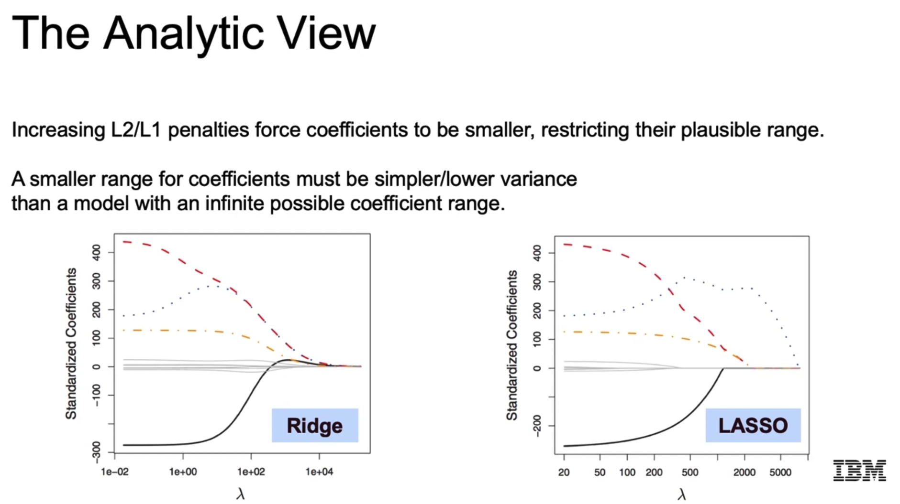

When we eliminate features (e.g., because they become 0 with Lasso), the variance associated to their features is cancelled, too.

#### Geometric Interpretation

Ridge and Lasso regularization is like applying a constrained optimization on a quadratic function (in the case of MSE):

- In the case of Ridge, the constrained region is a circle: `sum((beta_j)^2) < s`.
- In the case of Lasso, the constrained region is a polygon with corners in the parameter axes:  `sum(abs(beta_j)) < s`.

The loss function is a parabolloid, which will be centered in the optimum point; that optimum point will be usually outside.

Given that geometric description, we see that the constrained optimum must lie on the boundary of the constrained region, where region and the paraboloid intersect and the tangent of both is the same.

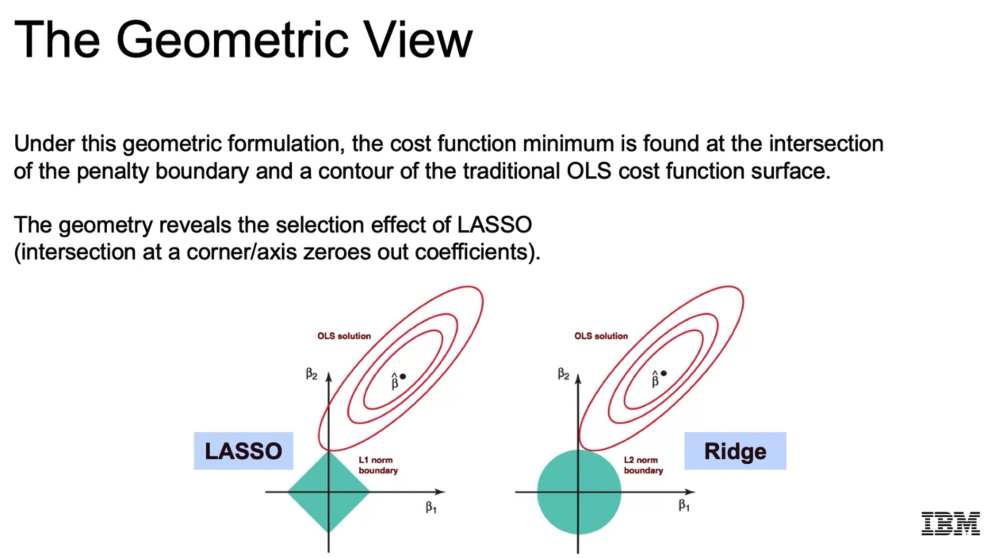

In the case of Lasso, that point must lie on one of the region corners, thus, some coefficients will be cancelled, because corners are in the parameter axes.

#### Probabilistic Interpretation

Regularization imposes prior distributions on the probability of the coefficients. In the case of Ridge, the prior is Gaussian, in the case of Lasso, it is Laplacian (a high peak in the center).

So, the posterior is:

`p(beta|X,Y) = f(Y|X,beta)*p(beta)`.

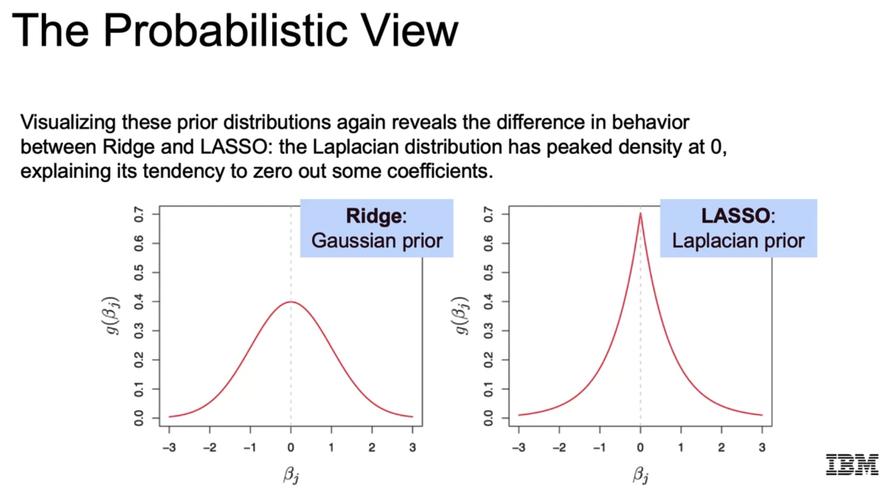

Since we have a high peak in the Laplacian prior, it's more likely to have parameters that become 0!

### 9. Python Lab: Regularization

Notebook: `02e_LAB_Regularization.ipynb`.

This notebook is not that interesting in terms of new techniques or API calls that are applied. Instead, the effect of using Lasso vs. Ridge with different `lambda` regularization strengths and scaling vs. not-scaling is analyzed.

Thus, I put here the insights only, not the code:

- Scaling is more important when we use regularization, because we are penalizing the parameter values; if these are in a known limited range, the value of the `lambda` regularization strength is affecting them in a more similar way.
- The expected behaviors are replicated: with Lasso, if we increase `lambda`, the number of cancelled coefficient increases, thus the model becomes simpler.
- We need to check which regularization is the best for our dataset: Lasso vs. Ridge, `labda` value? We test that by checking the loss with the test split.

### 10. Peer-Reviewed Project

