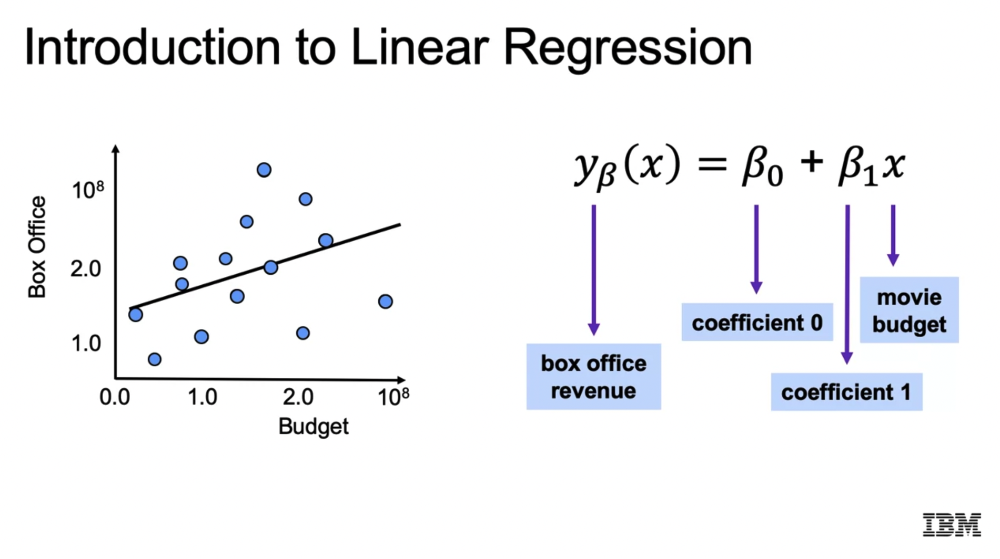
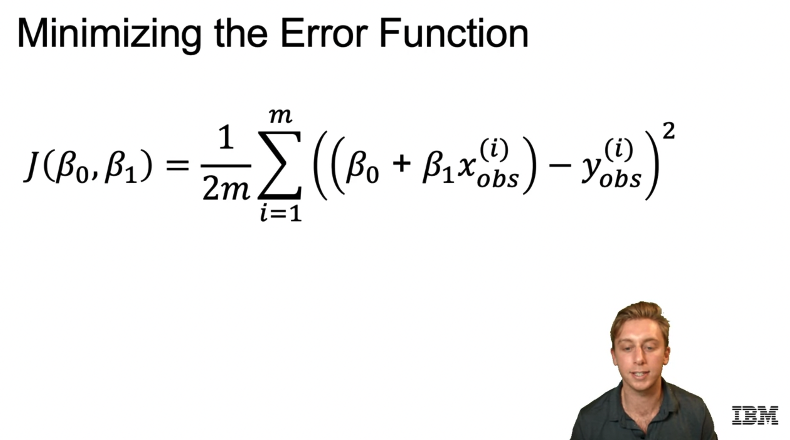
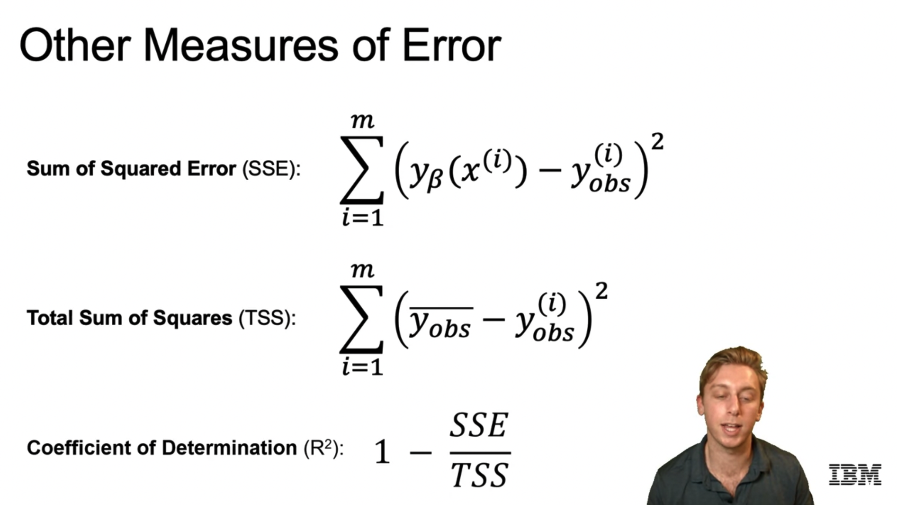

# Supervised Machine Learning: Regression

These are my notes and the code of the [IBM Machine Learning Professional Certificate](https://www.coursera.org/professional-certificates/ibm-machine-learning) offered by IBM & Coursera.

The Specialization is divided in 6 courses, and each of them has its own folder with its guide & notebooks:

1. [Exploratory Data Analysis for Machine Learning](https://www.coursera.org/learn/ibm-exploratory-data-analysis-for-machine-learning?specialization=ibm-machine-learning)
2. [Supervised Machine Learning: Regression](https://www.coursera.org/learn/supervised-machine-learning-regression?specialization=ibm-machine-learning)
3. [Supervised Machine Learning: Classification](https://www.coursera.org/learn/supervised-machine-learning-classification?specialization=ibm-machine-learning)
4. [Unsupervised Machine Learning](https://www.coursera.org/learn/ibm-unsupervised-machine-learning?specialization=ibm-machine-learning)
5. [Deep Learning and Reinforcement Learning](https://www.coursera.org/learn/deep-learning-reinforcement-learning?specialization=ibm-machine-learning)
6. [Specialized Models: Time Series and Survival Analysis](https://www.coursera.org/learn/time-series-survival-analysis?specialization=ibm-machine-learning)

This file focuses on the **second course: Supervised Machine Learning: Regression**

Mikel Sagardia, 2022.  
No guarantees

## Overview of Contents

1. [Introduction to Supervised Machine Learning](#1.-Introduction-to-Supervised-Machine-Learning)
	- 1.1 Interpretation vs. Prediction
2. [Linear Regression](#2.-Linear-Regression)
	- 2.1 Model Definition
	- 2.2 Model Evaluation: R2
	- 2.3 Python Code with Scikit-Learn
	- 2.4 Python Lab: `02a_LAB_Transforming_Target.ipynb`
3. [Training and Test Splits](#3.-Training-and-Test-Splits)
4. [Cross-Validation](#4.-Cross-Validation)
5. [Polynomial Regression](#5.-Polynomial-Regression)

## 1. Introduction to Supervised Machine Learning

A model is a small thing that captures a big thing; as such, it reduces the complexity while capturing the feeatures we are insterested in.

We distinguish between:

- Supervised learning: the data is labelled with real outcome
- Unsupervised learning: the data is not labelled, instead, we find structure in it.
- Semi-supervised learning: the data is sometimes labelled and sometimes it is not.

The model for any supervised learning:

`y_p = f(Omega, X)`

- `y_p`: predicted outcome, in contrast to `y`, real outcome
- `f`: model function
- `Omega`: model parameters, learned; we say that the model is fit to the data.
- `X`: past data-points x features
- Hyperparameters: any para,eger which is not learned, e.g., whether we have an intercept or not.

Within supervised learning we distinguish:

- Regression: numeric, continuous outcome/target.
- Classification: categorical outcome/target.

In order to learn, a loss function is defined, which evaluates the difference between the real target `y` and the predicted `y_p`:

`J(y,y_p)`

In this course, we're going to work on a **housing dataset**; we're going to apply regression on house features to predict the prices.

### 1.1 Interpretation vs. Prediction

In some cases, the primary goal of training a models is not the prediction of the target given new data points, but the interpretation of the model.

When we seek interpretation, we focus on the parameters `Omega`: we want parameters that are clearly **interpretable**. For that interpretation we get the **feature importances** and often plot them as a bar plot.

Examples of cases in which model interpretation is important:

- x: Customer demographics, y: sales data; Omega: examine to understand loyalty by segment.
- Safety features which prevent car accidents?

In contrast, when prediction is sought, the interpretability of the model is not that important. We want to predict the targets as accurately as possible. In that case the loss function and the plot `y` vs. `y_p` are more important.

Thus:

- Interpretation: feature impostances in focus
- Prediction: actual vs. predicted output in focus

Usually a balance is desired between interpretability and predictability. Also, note that not all models are equally interpretable:

- Linear regression: very interpretable.
- Deep learning: not very interpretable.

## 2. Linear Regression

Overall, I'd say that the explanations are not as good as in the course by Andrew Ng: Machine Learning. I suggest looking at the linear regression module of that course to get theoretical details -- my notes: [machine_learning_coursera](https://github.com/mxagar/machine_learning_coursera).

The added value of the current IBM section is that it is shown how linear regression is done with available libraries professionally.

### 2.1 Model Definition

Example used: Predict Box Office Revenue of a movie given its Budget.



The coefficients/parameters are found by minimizing the cost function = sum of all distances from the data points toa parametrized line.



### 2.2 Model Evaluation: R2

**Coefficient of determination, R2**: It measures the percentage of variance that is explained by the model. Interesting insight: ratio between

- Sum of squared Error (SSE) = `sum((y_pred - y)^2)`
- Total Sum of Squares (TSS) = Variance of observed `y` = `sum((mean(y) - y)^2)`

`R2 = 1 - (SSE/TSS)`



Notes:

- R2 is the ration between the variance captured by the model and the total variance.
- If we add features but these have no predictive power, R2 will not improve.
- SSE is used for minimizing the cost function but TSS is the total observed variance of the target in the dataset, which is always constant!


### 2.3 Python Code with Scikit-Learn

```python
from sklearn.linear_model import LinearRegression
lr = LinearRegression()
lr.fit(X_train, y_train)
y_pred = lr.predict(X_test)
```

### 2.4 Python Lab: `02a_LAB_Transforming_Target.ipynb`

This notebook contains the following: 

- Different transformations of the target are tested; although it is not compulsory having a normally distirbuted target, it improves the model performance generally.
	- Log
	- Square root
	- Box cox = generalized power transformation, for which the optimum power coefficient is found: `boxcox = (y^lambda - 1)/lambda` 
- The linear model is loaded.
- Polynomial features are computed.
- Train/test split + scaling are applied.
- The model is fit.
- The inverse transformation is applied to the predicted values.
- Another fit is done with the untransformed target; the R2 is lower.

There is a helper script `helper.py` which loads the boston housing dataset from Scikit-Learn.

In the following, a summary of the most important parts in the notebook:

```python
import numpy as np
import pandas as pd
import matplotlib.pyplot as plt
%matplotlib inline

import warnings
warnings.simplefilter("ignore")

### -- 1. Load the dataset

from helper import boston_dataframe
boston_data, description = boston_dataframe(description=True)
# from sklearn.datasets import load_boston
# boston = load_boston()
# ...

boston_data.shape # (506, 14)
# Target: MEDV

print(description) # all variables described

### -- 2. Target transformation

# Even though it is not necessary to have a normally distributed target
# having it so often improves the R2 of the model.
# We can check the normality of a variable in two ways:
# - visually: hist(), QQ-plot
# - with normality checks, e.g., D'Agostino

# Normality check: D'Agostino
# if p-value > 0.05: normal;
# the larger the p-value, the larger the probability of normality
from scipy.stats.mstats import normaltest # D'Agostino K^2 Test
normaltest(boston_data.MEDV.values) # pvalue=1.7583188871696095e-20

# Square root transformation
sqrt_medv = np.sqrt(boston_data.MEDV)
plt.hist(sqrt_medv)
normaltest(sqrt_medv) # pvalue=3.558645701429252e-05

# Square root transformation
log_medv = np.log(boston_data.MEDV)
plt.hist(log_medv)
normaltest(log_medv) # pvalue=0.00018245472768345196

# Box-Cox transformation: Generalized power transformation
# boxcox = (y^lambda - 1)/lambda
# It requires y > 0; else apply y+y_min or use Yeo-Johnson
# However, Box-Cox seems easier to interpret/explain.
# Note: always save the lambda!
from scipy.stats import boxcox
bc_result = boxcox(boston_data.MEDV)
boxcox_medv = bc_result[0]
lmbd = bc_result[1]
plt.hist(boxcox_medv)
normaltest(boxcox_medv) # pvalue=0.104... NORMAL!

### -- 3. Model Fitting

from sklearn.linear_model import LinearRegression
from sklearn.metrics import r2_score
from sklearn.model_selection import train_test_split
from sklearn.preprocessing import (StandardScaler, 
                                   PolynomialFeatures)

lr = LinearRegression()

y_col = "MEDV"
X = boston_data.drop(y_col, axis=1)
y = boston_data[y_col]
X.shape # (506, 13)

# We create 2nd degree variables of the existing ones
# Note: bias will be added by the regression model
pf = PolynomialFeatures(degree=2, include_bias=False)
X_pf = pf.fit_transform(X)
X_pf.shape # (506, 104)
pf.get_feature_names_out() # get all feature names after the polynomial computation

# Train/test split
# ALWAYS set a random state!
X_train, X_test, y_train, y_test = train_test_split(X_pf, y, test_size=0.3, 
                                                    random_state=72018)

# Scale: after the PolynomialFeatures
s = StandardScaler()
X_train_s = s.fit_transform(X_train)

# Transform the target to be normal
bc_result = boxcox(y_train)
y_train_bc = bc_result2[0]
lmbd = bc_result2[1]

# Fit/Train
lr.fit(X_train_s, y_train_bc)

### -- 4. Evaluation

# Predict
X_test_s = s.transform(X_test)
y_pred_bc = lr.predict(X_test_s)

# Untransform the predicted y
# We need the inverse of the transformation function and its parameters!
from scipy.special import inv_boxcox
y_pred = inv_boxcox(y_pred_bc,lmbd)
r2_score(y_pred,y_test) # 0.8794001850404838

# What if we would have not used the box-cox transformation?
# The R2 would have been worse!
lr = LinearRegression()
lr.fit(X_train_s,y_train)
lr_pred = lr.predict(X_test_s)
r2_score(lr_pred,y_test) # 0.8555202098064152

```

## 3. Training and Test Splits

Since we are fitting the model parameters to a dataset, we need a new dataset to evaluate how well the fitted model performs. In order to tackle that, the dataset we have available is split into non-overlapping subsets: train and test. The model paramaters are computed with the train subset and the model is evaluated with the test subset.

### 3.1 Python Implementation Snippet

```python
from sklearn.model_selection import train_test_split

X = df.drop('target', axis=1)
y = df['target']

# Train/test split - ALWAYS set a random state!
X_train, X_test, y_train, y_test = train_test_split(X,
													y, 
													test_size=0.3, # 30% for 
                                                    random_state=101)
# Train/Fit
model.fit(X_train, y_train)

# Evaluate
y_pred = lr.predict(X_test)
r2_score(y_pred,y_test)

```

There are other split types in `sklearn`:

- `ShuffleSplit`: we can choose how many train-test splits to create, not just one
- `StratifiedShuffleSplit`: similar to the previous, but it can handle imbalanced labelings, such as medical data; basically, the ratios of labels can be maintained in the splits to avoid introducing bias.

### 3.2 Python Lab: `02b_LAB_Regression_Train_Test_Split.ipynb`

The dataset based on the [Housing prices in Ames, Iowa](https://www.kaggle.com/c/house-prices-advanced-regression-techniques) is used, with a shape of `(1379, 80)`.

Few new things are introduced in this notebook, however, some interesting takeaways are distilled and coding snippets are summarized.

Summary of actions:

- Object (string) and numerical columns are detected.
- The number of one-hot encoded columns is computed.
- One-hot encoding is applied with `sklearn`, which returns a sparse matrix (more memory efficient).
- A train-test split is carried out for numerical data and for the one-hot encoded binary data.
- A linear regression model is fit for each of the subsets: numerical data and one-hot encoded data.
- Different scalers are used to check the performance of the model.
- Model performanc eis visually analyzed plotting `y_test vs y_pred`.

Takeaways:

- The `OneHotEncoder` from `sklearn` returns a sparse matrix, which is much more memory efficient.
- The one-hot encoded data has a smaller error than the numerical data in the train split, but a much larger one in the test split. This is a sign of overfitting. It is obvious, because we have much more variables in the one-hot encoed subset! Many variables lead to overfitting. Overfitting performs badly on the test split.
- Using different scalers doesn't affect the performance of the linear regression; that is not true for regularized regression.

Code:

```python
### -- 1. Load Dataset

import pandas as pd
import numpy as np

# Import the data using the file path
filepath = os.sep.join(data_path + ['Ames_Housing_Sales.csv'])
data = pd.read_csv(filepath, sep=',')

data.dtypes.value_counts()
# object     43
# float64    21
# int64      16

### -- 2. Number of One-Hot Encoded Columns

# Select the object (string) columns
mask = data.dtypes == np.object
categorical_cols = data.columns[mask]

# Determine how many extra columns would be created
num_ohc_cols = (data[categorical_cols]
                .apply(lambda x: x.nunique())
                .sort_values(ascending=False))


# No need to encode if there is only one value
small_num_ohc_cols = num_ohc_cols.loc[num_ohc_cols>1]

# Number of one-hot columns is one less than the number of categories
small_num_ohc_cols -= 1

# This is 215 columns, assuming the original ones are dropped. 
# This is quite a few extra columns!
small_num_ohc_cols.sum()

### -- 3. One-Hot Encoding

from sklearn.preprocessing import OneHotEncoder, LabelEncoder

# Copy of the data
data_ohc = data.copy()

# The encoders
le = LabelEncoder()
ohc = OneHotEncoder()

for col in num_ohc_cols.index:
    
    # Integer encode the string categories
    dat = le.fit_transform(data_ohc[col]).astype(np.int)
    
    # Remove the original column from the dataframe
    data_ohc = data_ohc.drop(col, axis=1)

    # One hot encode the data--this returns a sparse array/matrix
    # A sparse matrix is a compressed sparse matrix
    # which contains almost only 0s; thus, only the locations where 1 appears are noted per row.
    # This saves alot of memory.
    new_dat = ohc.fit_transform(dat.reshape(-1,1))

    # Create unique column names
    n_cols = new_dat.shape[1]
    col_names = ['_'.join([col, str(x)]) for x in range(n_cols)]

    # Create the new dataframe
    new_df = pd.DataFrame(new_dat.toarray(), 
                          index=data_ohc.index, 
                          columns=col_names)

    # Append the new data to the dataframe
    data_ohc = pd.concat([data_ohc, new_df], axis=1)


# Remove the string columns from the dataframe
data = data.drop(num_ohc_cols.index, axis=1)

### -- 3. Train-Test Split

from sklearn.model_selection import train_test_split

y_col = 'SalePrice'

# Split the data that is not one-hot encoded
feature_cols = [x for x in data.columns if x != y_col]
X_data = data[feature_cols]
y_data = data[y_col]

X_train, X_test, y_train, y_test = train_test_split(X_data, y_data, 
                                                    test_size=0.3, random_state=42)
# Split the data that is one-hot encoded
feature_cols = [x for x in data_ohc.columns if x != y_col]
X_data_ohc = data_ohc[feature_cols]
y_data_ohc = data_ohc[y_col]

X_train_ohc, X_test_ohc, y_train_ohc, y_test_ohc = train_test_split(X_data_ohc, y_data_ohc, 
                                                    test_size=0.3, random_state=42)

# Compare the indices to ensure they are identical
(X_train_ohc.index == X_train.index).all()

### -- 4. Linear Regression

from sklearn.linear_model import LinearRegression
from sklearn.metrics import mean_squared_error

LR = LinearRegression()

# Storage for error values
error_df = list()

# Data that have not been one-hot encoded
LR = LR.fit(X_train, y_train)
y_train_pred = LR.predict(X_train)
y_test_pred = LR.predict(X_test)

error_df.append(pd.Series({'train': mean_squared_error(y_train, y_train_pred),
                           'test' : mean_squared_error(y_test,  y_test_pred)},
                           name='no enc'))

# Data that have been one-hot encoded
LR = LR.fit(X_train_ohc, y_train_ohc)
y_train_ohc_pred = LR.predict(X_train_ohc)
y_test_ohc_pred = LR.predict(X_test_ohc)

error_df.append(pd.Series({'train': mean_squared_error(y_train_ohc, y_train_ohc_pred),
                           'test' : mean_squared_error(y_test_ohc,  y_test_ohc_pred)},
                          name='one-hot enc'))

# Assemble the results
error_df = pd.concat(error_df, axis=1)
error_df
#		no enc			one-hot enc
# train	1.131507e+09	3.177268e+08
# test	1.372182e+09	4.698236e+16

### -- 5. Check Effect of Scalers

from sklearn.preprocessing import StandardScaler, MinMaxScaler, MaxAbsScaler


scalers = {'standard': StandardScaler(),
           'minmax': MinMaxScaler(),
           'maxabs': MaxAbsScaler()}

training_test_sets = {
    'not_encoded': (X_train, y_train, X_test, y_test),
    'one_hot_encoded': (X_train_ohc, y_train_ohc, X_test_ohc, y_test_ohc)}


# Get the list of float columns, and the float data
# so that we don't scale something we already scaled. 
# We're supposed to scale the original data each time
mask = X_train.dtypes == np.float
float_columns = X_train.columns[mask]

# initialize model
LR = LinearRegression()

# iterate over all possible combinations and get the errors
errors = {}
for encoding_label, (_X_train, _y_train, _X_test, _y_test) in training_test_sets.items():
    for scaler_label, scaler in scalers.items():
        trainingset = _X_train.copy()  # copy because we dont want to scale this more than once.
        testset = _X_test.copy()
        trainingset[float_columns] = scaler.fit_transform(trainingset[float_columns])
        testset[float_columns] = scaler.transform(testset[float_columns])
        LR.fit(trainingset, _y_train)
        predictions = LR.predict(testset)
        key = encoding_label + ' - ' + scaler_label + 'scaling'
        errors[key] = mean_squared_error(_y_test, predictions)

errors = pd.Series(errors)
print(errors.to_string())
print('-' * 80)
for key, error_val in errors.items():
    print(key, error_val)

# not_encoded - standardscaling        1.372182e+09
# not_encoded - minmaxscaling          1.372340e+09
# not_encoded - maxabsscaling          1.373232e+09
# one_hot_encoded - standardscaling    8.065328e+09
# one_hot_encoded - minmaxscaling      8.065328e+09
# one_hot_encoded - maxabsscaling      8.065328e+09

### -- 6. Evaluate the Model: y_test vs y_pred

import matplotlib.pyplot as plt
import seaborn as sns
%matplotlib inline

sns.set_context('talk')
sns.set_style('ticks')
sns.set_palette('dark')

ax = plt.axes()
# we are going to use y_test, y_test_pred
ax.scatter(y_test, y_test_pred, alpha=.5)

ax.set(xlabel='Ground truth', 
       ylabel='Predictions',
       title='Ames, Iowa House Price Predictions vs Truth, using Linear Regression')
```


## 4. Cross-Validation


## 5. Polynomial Regression


