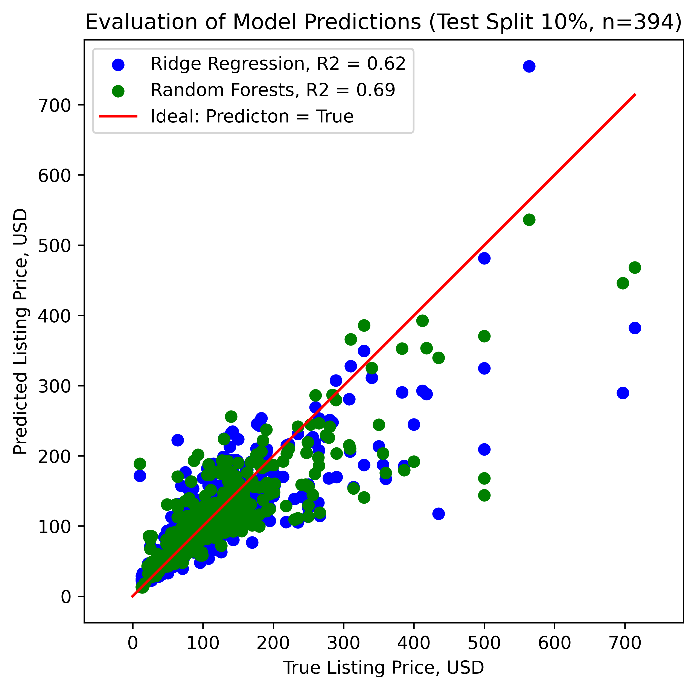
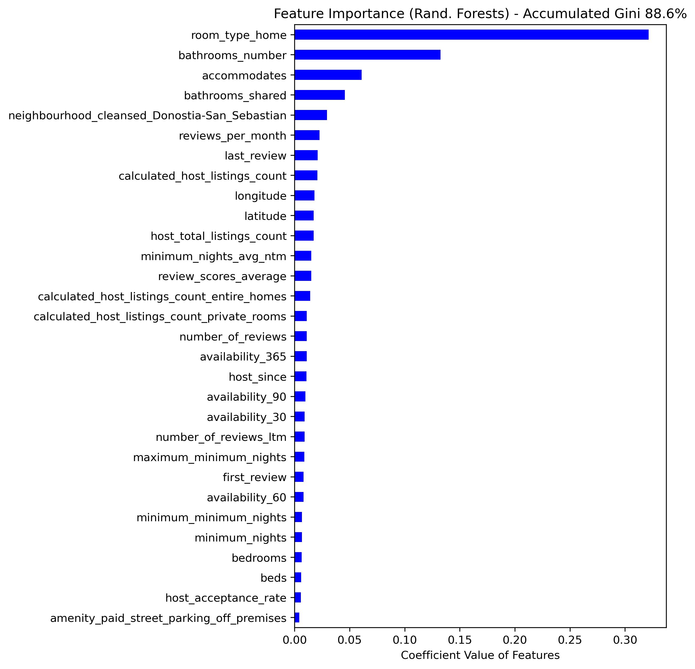
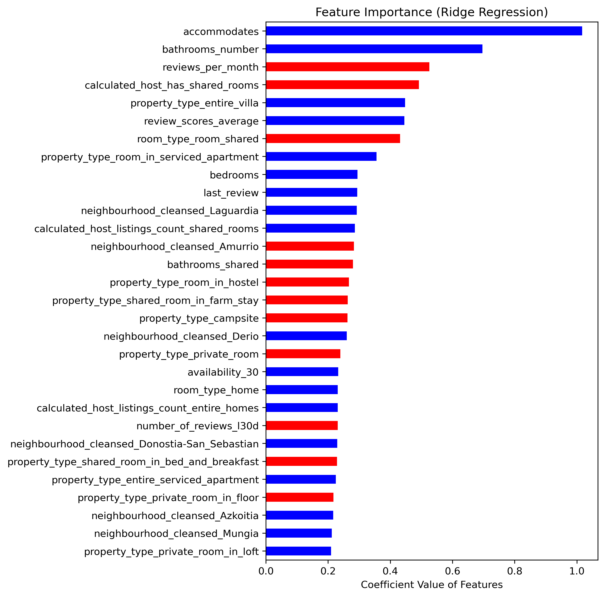
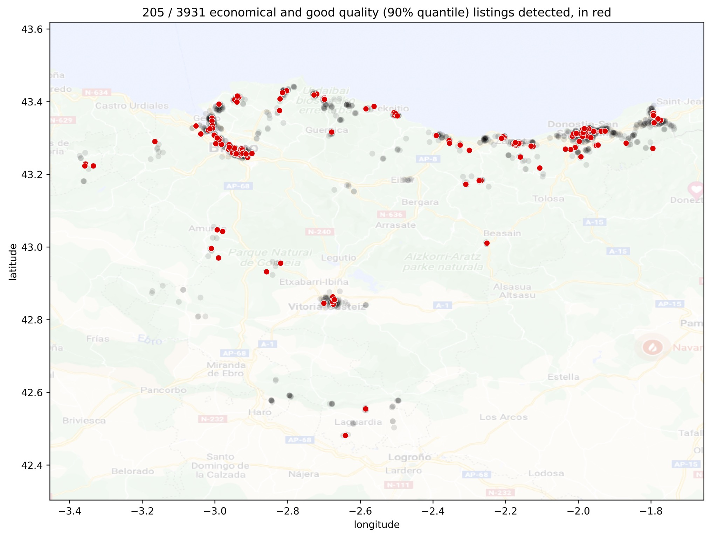

# Analysis of the Basque Country AirBnB Dataset

In this small project, I analyze the [AirBnB dataset from the Basque Country / *Euskadi*](http://insideairbnb.com/get-the-data/). The [Basque Country](https://en.wikipedia.org/wiki/Basque_Country_(autonomous_community)) (*Euskadi* in [Basque language](https://en.wikipedia.org/wiki/Basque_language)) is the region from northern Spain where I am from. After many years living in Germany, I moved back here in 2020. As a popular touristic target on the seaside, the analysis might be valuable for our visitors.

The dataset consists of a list of accommodations (5228) and their features (74). See the section [The Dataset and Its Processing](#the-dataset-and-its-processing) for more information.

I follow the standard [CRISP-DM process](https://en.wikipedia.org/wiki/Cross-industry_standard_process_for_data_mining), which usually requires to define some business questions first; then, the data is collected and analyzed following those questions. In the current case, since the dataset was already created, the first notebook serves as a first exposure to it, after which the **business questions** are formulated:

1. Can the features in the listings predict the mean price? Which are the most important features that increase the price? Are there any bargains (i.e., properties with high review scores that have a greater predicted price than the actual)?
2. The Basque Country is on the seaside; however, some locations have direct access to a nearby beach in less than 2 km. Which are the most important differences between locations with beach access and locations without?
3. [Donostia-San Sebastian](https://en.wikipedia.org/wiki/San_Sebastián) and [Bilbao](https://en.wikipedia.org/wiki/Bilbao) have the majority of the listings. Which are the most important differences between both cities in terms of features?

The first question is approached as a regression problem, focusing on both the prediction and intepretation capabilities of the model. The last two questions are hypothesis tests between 2 groups across all features; even though that is not formally correct (due to correlations), it serves as a proxy for detecting differences between groups. Note that this report deals only with the first question; the insights from the last two questions can be found on [my blog post](https://mikelsagardia.io/blog/airbnb-spain-basque-data-analysis.html). Additionally, the complete code can be found in the following Github repository: [https://github.com/mxagar/airbnb_data_analysis](https://github.com/mxagar/airbnb_data_analysis).

In order to answer the questions, the following steps have been carried out sequentially:

1. Data cleaning and Preparation
2. Exploratory Data Analysis
3. Feature Engineering
4. Feature Selection
5. Modelling
6. Model Scoring & Inferences

The remainder of this report is organized in these sections:

- [**The Dataset and Its Processing**](#the-dataset-and-its-processing): The dataset and a summary of the steps 1-4 is explained.
- [**Modelling**](#modelling): The used model variations with their performances are introduced (step 5).
- [**Results of Question 1 - Price Regression Model**](#results-of-question-1---price-regression-model): the key findings after performing the inference and the model interpretation are provided (step 6).
- [**Future Work**](#future-work): Ways of possible improvements are highlighted.

## The Dataset and Its Processing

AirBnB provides with several CSV files for each world region: (1) a listing of properties that offer accommodation, (2) reviews related to the listings, (3) a calendar and (4) geographical data. A detailed description of the features in each file can be found in the official [dataset dictionary](https://docs.google.com/spreadsheets/d/1iWCNJcSutYqpULSQHlNyGInUvHg2BoUGoNRIGa6Szc4/edit#gid=982310896).

My analysis has concentrated on the listings file `listings_detailed.csv`, which consists in a table of 5228 rows/entries (i.e., the accommodation places) and 74 columns/features (their attributes). Among the features, we find **continuous variables**, such as:

- the price of the complete accommodation,
- accommodates: maximum number of persons that can be accommodated,
- review scores for different dimensions,
- reviews per month,
- longitude and latitude,
- etc.

... **categorical variables**:

- neighbourhood name,
- property type (apartment, room, hotel, etc.)
- licenses owned by the host,
- amenities offered in the accommodation, 
- etc.

... **date-related data**:

- first and last review dates, 
- date when the host joined the platform,

... and **image and text data**:

- URL of the listing,
- URL of the pictures,
- description of the listing,
- etc.

Of course, not all features are meaningful to answer the posed questions. Additionally, a preliminary exploratory data analysis shows some peculiarities of the dataset. For instance, in contrast to city datasets like [Seattle](https://www.kaggle.com/datasets/airbnb/seattle) or [Boston](https://www.kaggle.com/datasets/airbnb/boston), the listings from the Basque country are related to a complete state in Spain; hence, the neighbourhoods recorded in them are, in fact, cities or villages spread across a large region. Moreover, the price distribution shows several outliers. Along these lines, I have performed the following simplifications:

- Only the 60 (out of 196) neighbourhoods (i.e., cities and villages) with the most listings have been taken; these account for almost 90% of all listings. That reduction has allowed to manually encode neighbourhood properties, such as whether a village has access to a beach in less than 2 km (Question 2).
- Only the listings with a price below 1000 USD have been considered.
- I have dropped the features that are irrelevant for modelling and inference (e.g., URLs and scrapping information).
- From fields that contain medium length texts (e.g., description), only the language has been identified with [spaCy](https://spacy.io/universe/project/spacy-langdetect). The rest of the text fields have been encoded as categorical features.

One of my first actions with the price was to divide it by the number of maximum accommodates to make it unitary, i.e., USD per person. However, the models underperform. Additionally, both variables don't need to have a linear relationship: maybe the *accommodates* value considers the places on the sofa bed, and the price does not increase if they are used, or not relative to the base unitary price.

As far as the **data cleaning** is considered, only entries that have price (target for Question 1) and review values have been taken. In case of more than 30% of missing values in a feature, that feature has been dropped. In other cases, the missing values have been filled (i.e., imputed) with either the median or the mode.

Additionally, I have applied **feature engineering** methods to almost all variables:

- Any numerical variable with a skewed distribution has been either transformed using logarithmic or power mappings, or binarized.
- Categorical columns have been [one-hot encoded](https://en.wikipedia.org/wiki/One-hot).
- Polynomial terms of 2nd degree (including interactions) were computed for the continuous variables.
- All features have been scaled to the range `[0,1]` as a last step.

The dataset that results after the feature engineering consists of 3931 entries and 353 or 818 features, depending on whether we consider only the linear or also the polynomial terms, respectively. In the linear case, we have almost 5 times more features than in the beginning even with dropped variables because each class in the categorical variables becomes a feature; in particular, there are many amenities, property types and neighborhoods.

## Modelling

In order to answer Question 1 (prices), I have tried several linear regression models and random forests in combination with different sets of features:

1. Linear features (m = 353): dummy variables of the categorical features and continuous/numerical variables, without any polynomial terms.
2. Polynomial features (m = 818): polynomial terms of 2nd degree (including interactions) of the continuous variables and dummy variables without polynomial terms.
3. Selected polynomial features (m = 443): the 2nd set of polynomial features filtered using a [Lasso regression](https://en.wikipedia.org/wiki/Lasso_(statistics)). Lasso regression is a L1 regularized regression which forces the model coefficients to converge to 0 if they are not that relevant for the model; subsequently, those features can be dropped.

In all cases, cross-validation (CV) was applied in the training split and the hyperparameters were tuned for optimum outcomes. The R2 scores are displayed in the following table (using the test split):

| Model | Linear Features (m = 353) | Polynomial Features (m = 818) | Selected Polynomial Features (m = 443) |
| ----------- | ----------- | ----------- | ----------- |
| Linear Regression | 0.61 | - | 0.35 |
| Ridge or L2 Regularized Regression (with CV, k = 5) | 0.62 | 0.61 | 0.48 |
| Lasso or L1 Regularized Regression (with CV, k = 5) | 0.62 | 0.62 | 0.44 |
| Random Forests (with CV, k = 3) | 0.69 | 0.69 | 0.69 |

Linear regression is the baseline, as well as the set of linear features. From the table, we can conclude that:

- no regularized variation performed considerably better than the baseline;
- the random forests model outperformed any other linear regression;
- polynomial features did not contribute to improve the models.

Following the last point, all the questions were studied using only the linear features (m = 353).

## Results of Question 1 - Price Regression Model

The following diagram shows the performance of the Ridge regression model and the random forests model with the test split using only the 353 linear features.

The models tend to under-predict accommodation prices; that bias clearly increases as the prices start to be larger than 50 USD. Such a moderate R2 is not the best one to apply the model to perform predictions. However, we can deduce the most important features that determine the listing prices if we compute the [Gini importances](https://medium.com/the-artificial-impostor/feature-importance-measures-for-tree-models-part-i-47f187c1a2c3), as done in the following diagram. The top-5 variables that determine the price of a listing are:

- whether an accommodation is an entire home or apartment,
- the number of bathrooms in it,
- the number of accommodates,
- whether the bathroom(s) is/are shared,
- and whether the housing is located in Donostia-San Sebastian.

Note that only the top-30 features are shown; these account for almost 89% of the accumulated Gini importance (all 353 variables would account for 100%).

But how does increasing the value of each feature affect the price: does it contribute to an increase in price or a decrease? That can be observed in the following diagram, similar to the previous one. In contrast to the former, here the 30 regression coefficients with the largest magnitude are plotted - red bars are associated with features that decrease the price when they are increased, i.e., negative coefficients.

Being different models, different features appear in the ranking; in any case, both lists are consistent and provide valuable insights. For instance, we deduce that the price decreases the most when 

- the number of reviews per month increases (note that review positivity is not measured),
- the host is estimated to have shared rooms,
- the accommodation is a shared room,
- and when the bathroom(s) is/are shared.

Finally, a very practical insight to close the pricing question: we can easily select the the accommodations which have a very good average review (above the 90% percentile) and yield a model price larger than the real one, as shown in the following figure. These are the likely bargains!

I prefer not post the URLs of the detected listings, but it is straightforward to obtain them using the notebooks of the linked repository :wink:.

## Future Work

Even though the model has a moderate prediction capability, it seems to be good enough for interpretation. In order to improve the performance, we could try the following:

- Add more non-polynomial features; e.g., price per person, average price in neighborhood, etc.
- Use stratified models for clearly different groups; e.g., room type.
- Try to get more data-points. That is not really possible, since the dataset is fixed; however, in a real life scenario, we could probably improve the results if we had access to the data generation/collection.
- Create an NLP model that predicts the average review score from review texts.
- New business question: how can one create a competitive listing?

## Authorship

Mikel Sagardia, 2022.  
No guarantees.

Contact: [mikelsagardia.io](https://mikelsagardia.io)