# Supervised Machine Learning: Regression

These are my notes and the code of the [IBM Machine Learning Professional Certificate](https://www.coursera.org/professional-certificates/ibm-machine-learning) offered by IBM & Coursera.

The Specialization is divided in 6 courses, and each of them has its own folder with its guide & notebooks:

1. [Exploratory Data Analysis for Machine Learning](https://www.coursera.org/learn/ibm-exploratory-data-analysis-for-machine-learning?specialization=ibm-machine-learning)
2. [Supervised Machine Learning: Regression](https://www.coursera.org/learn/supervised-machine-learning-regression?specialization=ibm-machine-learning)
3. [Supervised Machine Learning: Classification](https://www.coursera.org/learn/supervised-machine-learning-classification?specialization=ibm-machine-learning)
4. [Unsupervised Machine Learning](https://www.coursera.org/learn/ibm-unsupervised-machine-learning?specialization=ibm-machine-learning)
5. [Deep Learning and Reinforcement Learning](https://www.coursera.org/learn/deep-learning-reinforcement-learning?specialization=ibm-machine-learning)
6. [Specialized Models: Time Series and Survival Analysis](https://www.coursera.org/learn/time-series-survival-analysis?specialization=ibm-machine-learning)

This file focuses on the **third course: Supervised Machine Learning: Classification**

Mikel Sagardia, 2022.  
No guarantees

## Overview of Contents

1. [Logistic Regression (Week 1)](#1.-Logistic-Regression)
  - 1.1 What is Classification?
  - 1.2 Logistic Regression
  - 1.3 Classification with Multiple Classes
  - 1.4 Logistic Regression in Python with Scikit-Learn
  - 1.5 Classification Error Metrics: Confusion Matrix, Accuracy, Specificity, Precision, and Recall
  - 1.6 ROC and Precision-Recall Curves
  - 1.7 Multi-Class Metrics
  - 1.8 Metrics in Python with Scikit-Learn
  - 1.9 Python Lab: Human Activity
  - 1.10 Python Example: Food Items
2. [K Nearest Neighbors (Week 2)](#2.-K-Nearest-Neighbors)
  - 2.1 Decision Boundary
  - 2.2 Distance Measure
  - 2.3 Regression
  - 2.4 Pros and Cons
  - 2.5 KNN in Python with Scikit-Learn
  - 2.6 Python Lab: Customer Churn Classification
  - 2.7 Python Example: Tumor Classification
3. [Support Vector Machines (Week 3)](#3.-Support-Vector-Machines)
  - 3.1 Cost Function: Hinge Loss
  - 3.2 Model and Regularization
  - 3.3 SVM Syntax in Scikit-Learn
  - 3.4 SVMs with Kernels: Gaussian Kernels
  - 3.5 What to Use When?
  - 3.6 Non-Linear SVM Syntax in Scikit-Learn
  - 3.7 Python Lab: Wine Classification
  - 3.8 Python Example: Food Item Classification
4. [Decision Trees (Week 4)](#4.-Decision-Trees)

## 1. Logistic Regression

### 1.1 What is Classification?

Supervised learning consists of Regression and Classification. Regression problems provide a continuous output. Classification problems provide a category output; some examples:

- Detecting fraudulent transactions
- Customer churn or not
- Event attendance
- Network load
- Loan default

There are may classification techniques:

- Logistic regression
- K-Nearest Neighbors
- Support Vector Machines
- Neural Networks
- Decision Trees
- Random Forests
- Boosting
- Ensemble Models

However, **each of these models can be really both for regression and classification!!**

### 1.2 Logistic Regression

We could treat a binary classification problem as a regression problem if we plot our continuous predictor in the `x` axis and the binary target in the `y` axis. Then, we fit the line in the data-points and set the classification threshold in the `x` value which yields `y = 0.5`. Example with customer churn:

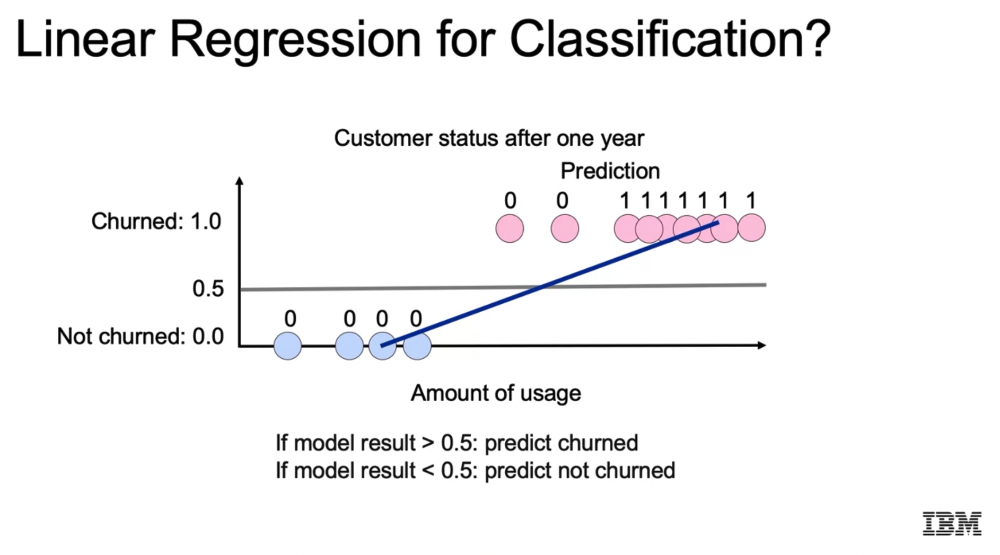

The problem with approach is that the line tilts towards the regions with high point density, moving the threshold with it.

A solution to that is using the **sigmoid function**, which shrinks the line to the extremes. The sigmoid takes the full range of real numbers and maps them all to `(0,1)`.

```
sigmoid(x) = 1 / (1 + exp(-x))
```

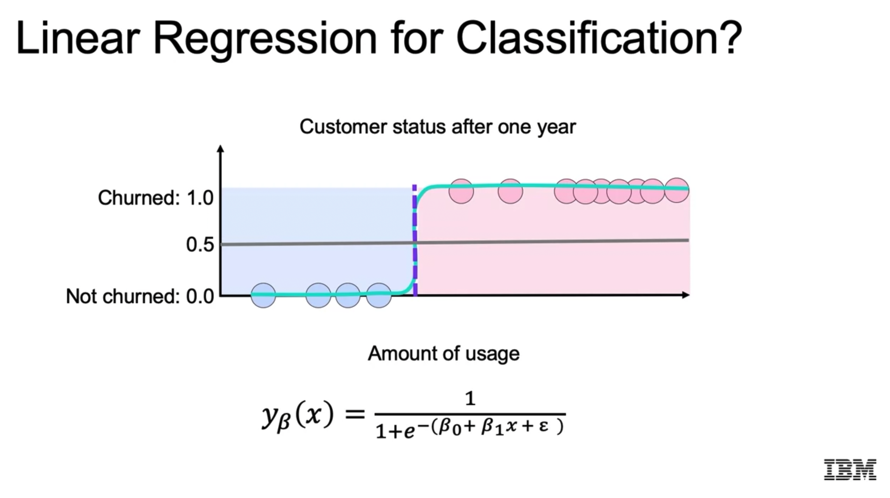

The resulting model is the **logistic regression** model, which predicts the probability of `x` belonging to a class.:

```
y = p(x) = sigmoid(beta_0 + beta_1 * x) = sigmoid(B * X)
```

Note that the **log odds ratio** can be computed as follows:

```
log(p(x) / (1 - p(x))) = beta_0 + beta_1 * x
```

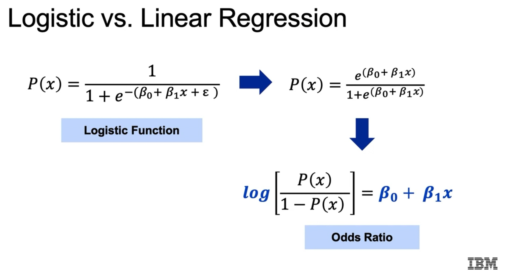

**That is an important insight: each model coefficient measures the effect of its associated feature on the log-odds ratio.** Linear regression has an equivalent interpretation, but with respect to the target value.

We can have higher dimensions for the `x` variable, such that the threshold becomes a linear boundary or a hyperplane.

### 1.3 Classification with Multiple Classes

Muti-class classification can be performed with the *one-vs-all* technique: a binary classification model is composed for each class versus the rest of the classes. This way, each point in feature space gets one probability for each of the classes, and we pick the largest one to create the regions and boundaries.

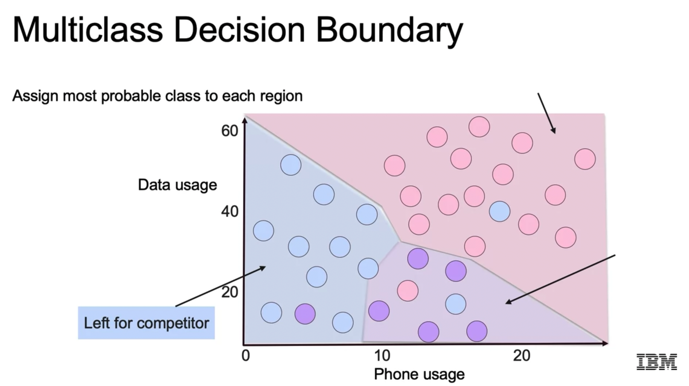

Another approach consists in using **multinomial models**. These models are generalized models which a probability distribution over all classes, based on the logits or exponentiated log-odds calculated for each class (usually more than two).

Note: Multinomial is not Multivariate:

- Multivariate distribution: the feature is a vector.
- Multinomial: the target is a vector, i.e., we have a generalized binomial distirbution.

### 1.4 Logistic Regression in Python with Scikit-Learn

[Scikit-Learn Logistic Regression](https://scikit-learn.org/stable/modules/generated/sklearn.linear_model.LogisticRegression.html).

```python
# Imports
from sklearn.linear_model import LogisticRegression

# Instantiate model
# We specify the regularization parameters:
# L2 regularization
# c = 1/lambda, inverse of the regularization strength,
# i.e., the bigger c, the lower the regularization.
LR = LogisticRegression(penalty='l2', c=10.0)

# Fit and predict
LR = LR.fit(X_train, y_train)
y_pred = LR.predict(X_test)

# Coefficients
# Also, consider using statsmodels
# because we get confidence intervals and significances
# for the coefficients
# Note that larger coefficients denote larger influence
# in the class outcome
LR.coef_

# Tune regularization parameters with the cross-validation model
LogisticRegressionCV
```

### 1.5 Classification Error Metrics: Confusion Matrix, Accuracy, Specificity, Precision, and Recall

Accuracy is a really bad metric for classification if we have imbalanced classes (which is often the case). Example: if we want to predict cancer and our dataset consists of 1% sick and 99% healthy; a simple model which always predicts "healthy" is wrong, but still accurate 99% of the time.

The basis for computing classification metrics is the **confusion matrix**, which is the matrix that counts the cases for `Real (Positive, Negative) x Predicted (Positive, Negative)`.

In that matrix:

- False positives are the **Type I** error.
- False negatives are the **Type II** error; in the case of sickness prediction, we want to significantly minimize this type of error.

From the matrix, we compute the most common error metrics:

- Accuracy: diagonal / all 4 cells = `(TP + TN) / (TP + FP + FN + TN)`
- Precision (of Predicted Positives) = `TP / (TP + FP)` 
- Recall or Sensitivity (wrt. Real Positives) = `TP / (TP + FN)`
- Specificity: Precision for Negatives = `TN / (FP + TN)`
- F1: harmonic mean between precision and recall; it is a nice trade-off between precision and recall, thus, a metric which is recommend by default: `F1 = 2 *(Precision*Recall)/(Precision+Recall)`

Interpretation:

- Precision: do we wan to assure that our predicted positives are correct?
- Recall: do we want to capture all the true positives?
- F1: a balance

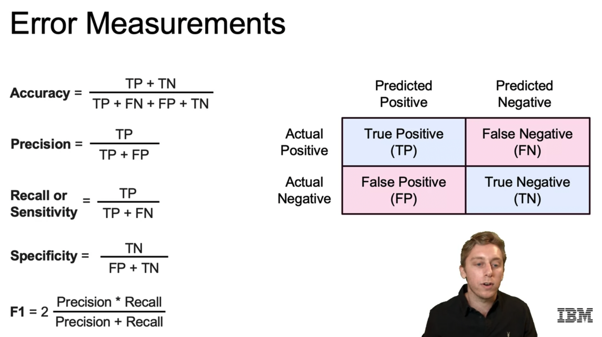

### 1.6 ROC and Precision-Recall Curves

**ROC = Receiver Operating Characteristic.**

If we take a model, vary the classification threshold and plot its true positive and false positive rates pairs, we get the ROC curve: [Receiver Operating Characteristic](https://en.wikipedia.org/wiki/Receiver_operating_characteristic).

Note that:

- True positive rate = Sensitivity = Recall
- False positive rate = 1 - Specificity

Now, we can compute the **Area Under the Curve (AUC)**; its value has the following interpretation:

- ROC-AUC = 0.5: the model performs like random guessing.
- The larger ROC-AUC the better performs the model.
- The curve will be convex in practice.

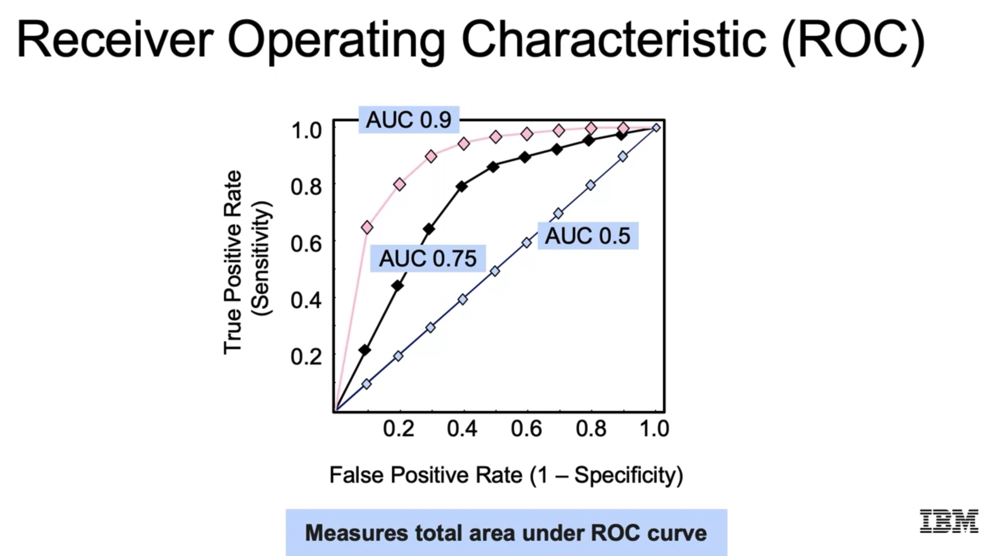

Similarly, we can compute another curve, which is better suited **for umbalanced classes: Precision-Recall Curve**

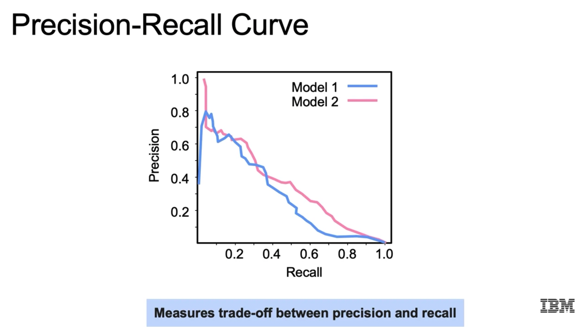

The Precision-Recall curve measures the Precision-Recall values for varied thresholds; it is usually a descending curve.

Ultimately, the application or use-case we're dealing with is essential to choosing the correct metric: F1, ROC-AUC, etc. We need to consider which cases we want to avoid because they have a too high cost.

### 1.7 Multi-Class Metrics

If we have a confusion matrix with several classes (i.e., larger than `2x2`), we can compute the accuracy with the values in the diagonal, but the other metrics are not really generalizable for the complete dataset.

However, we can compute each one of them for each class, i.e., taking the *one-vs-all* approach. Then, a weighted average can be computed, i.e., weighting with the ratio of each class.

### 1.8 Metrics in Python with Scikit-Learn

```python
# Accuracy
from sklearn.metrics import accuracy_score

# Compute the accuracy
accuracy_value = accuracy_score(y_test, y_pred)

# Other error metrics
from sklearn.metrics import (precision_score, recall_score,
          f1_score, roc_auc_score,
          confusion_matrix, roc_curve,
          precision_recall_curve)

```

### 1.9 Python Lab: Human Activity

In this notebook, 

`03a_LAB_Logistic_Regression_Error_Metrics.ipynb`,

the [Human Activity Recognition Using Smartphones Data Set ](https://archive.ics.uci.edu/ml/datasets/Human+Activity+Recognition+Using+Smartphones?utm_medium=Exinfluencer&utm_source=Exinfluencer&utm_content=000026UJ&utm_term=10006555&utm_id=NA-SkillsNetwork-Channel-SkillsNetworkCoursesIBMML241ENSkillsNetwork31576874-2022-01-01) is used: users carried out a smartphone with an inertial sensor and carried out Activities of Daily Living (ADL); these activities are annotated/labeled as

- `WALKING`,
- `WALKING UPSTAIRS`,
- `WALKING DOWNSTAIRS`,
- `SITTING`, 
- `STANDING`,
- and `LAYING`.

Dataset records contain:

- Triaxial acceleration from the accelerometer (total acceleration) and the estimated body acceleration.
- Triaxial Angular velocity from the gyroscope.
- Many time and frequency domain variables: moving average, kurtosis, etc.
- The `Activity` label with the 6 classes listed above.

Altogether we have a 561-feature vector with values already scaled to `[-1,1]`. No cleaning needs to be carried out and all variables are continuous; the only pre-processing consists in converting the class names into integers.

The notebook is interesting because it shows how to deal with different models and compute classifications metrics in a multi-class example (class ratios need to be maintained in splits).

Steps:

1. Load dataset, inspect and prepare it
2. Check correlations
3. Split dataset maintaining class ratios: StratifiedShuffleSplit
4. Define and fit logistic regression models with and without regularization
5. Compare the magnitude of the coefficients of each model in a multi-level dataframe
6. Predict the probabilities and the classes of the test split for each model
7. Compute the metrics for each model: precision, recall, f1, accuracy, roc-auc, confusion matrix

In the following, the code of the notebook:

```python
import seaborn as sns, pandas as pd, numpy as np

# Display all the columns of the dataframe in the notebook
pd.pandas.set_option('display.max_columns', None)

### -- 1. Load dataset, inspect and prepare it

#data = pd.read_csv("https://cf-courses-data.s3.us.cloud-object-storage.appdomain.cloud/IBM-ML241EN-SkillsNetwork/labs/datasets/Human_Activity_Recognition_Using_Smartphones_Data.csv", sep=',')
data = pd.read_csv("data/Human_Activity_Recognition_Using_Smartphones_Data.csv")

data.dtypes.value_counts()

# The min for every single feature column is -1
data.iloc[:, :-1].min().value_counts()
# The max for every single feature column is 1
data.iloc[:, :-1].max().value_counts()

# Target column: always do value_counts
# to see how balanced the classes are.
# They are quite balanced.
data.Activity.value_counts()

# Classification problems require passing label-encoded target values,
# one-hot encoded (sparse) values are not accepted.
from sklearn.preprocessing import LabelEncoder

le = LabelEncoder()
data['Activity'] = le.fit_transform(data.Activity)
data['Activity'].sample(5)

### -- 2. Check correlations

# Calculate the correlation values between the feature values
feature_cols = data.columns[:-1]
corr_values = data[feature_cols].corr()

# Calculate the correlation values between the feature values
feature_cols = data.columns[:-1]
corr_values = data[feature_cols].corr()

# Simplify by emptying all the data below the diagonal.
# tril_indices_from returns a tuple of 2 arrays:
# the arrays contain the indices of the diagonal + lower triangle of the matrix:
# ([0,1,...],[0,0,...])
tril_index = np.tril_indices_from(corr_values)

# Make the unused values NaNs
# NaN values are automatically dropped below with stack()
# zip creates a list of tuples from a tuple of arrays
for coord in zip(*tril_index):
    corr_values.iloc[coord[0], coord[1]] = np.NaN
    
# Stack the data and convert to a data frame
corr_values = (corr_values
               .stack() # multi-index stacking of a matrix: [m1:(m11, m12,...), m2:(m21, m22,...), ...]
               .to_frame() # convert in dataframe
               .reset_index() # new index
               .rename(columns={'level_0':'feature1', # new column names
                                'level_1':'feature2',
                                0:'correlation'}))

# Get the absolute values for sorting
corr_values['abs_correlation'] = corr_values.correlation.abs()

# We have many correlation values, because we have 550+ features!
corr_values.shape # (157080, 4)

import matplotlib.pyplot as plt
import seaborn as sns
%matplotlib inline

# Histogram of correlations
sns.set_context('talk')
sns.set_style('white')
ax = corr_values.abs_correlation.hist(bins=50, figsize=(12, 8))
ax.set(xlabel='Absolute Correlation', ylabel='Frequency');

# The most highly correlated values
corr_values.sort_values('correlation', ascending=False).query('abs_correlation>0.8')

### -- 3. Split dataset maintaining class ratios: StratifiedShuffleSplit

# Orginal class ratios
data.Activity.value_counts(normalize=True)

# StratifiedShuffleSplit allows to split the dataset
# into the desired numbers of train-test subsets
# while still maintaining the ratio of the predicted classes in the original/complete dataset
from sklearn.model_selection import StratifiedShuffleSplit

# Instantiate the StratifiedShuffleSplit object with its parameters
strat_shuf_split = StratifiedShuffleSplit(n_splits=1, # 1 split: 1 train-test
                                          test_size=0.3, 
                                          random_state=42)

# Get the split indexes
train_idx, test_idx = next(strat_shuf_split.split(X=data[feature_cols], y=data.Activity))

# Create the dataframes using the obtained split indices
X_train = data.loc[train_idx, feature_cols]
y_train = data.loc[train_idx, 'Activity']

X_test  = data.loc[test_idx, feature_cols]
y_test  = data.loc[test_idx, 'Activity']

# Always check that the ratios are OK
y_train.value_counts(normalize=True)
y_test.value_counts(normalize=True)

### -- 4. Define and fit logistic regression models with and without regularization

# Logistic regression is originally a binary classification tool
# but the sklearn implementation handles multiple classes.
# Depending on the solver, different approaches are taken.
# The liblinear solver uses the one-vs-rest approach; so the model is fit N times,
# being N the number of classses we have.
# liblinear works nice for smaller datasets, read the documentation for more.
# Note: we can add regularization to the LogisticRegression objects in the parameters:
# penalty: l1, l2
# C: 1/lambda -> the larger the less regularization strength
# Also, we can use the cross-validation version to detect the optimum C value
from sklearn.linear_model import LogisticRegression, LogisticRegressionCV

# Standard logistic regression
lr = LogisticRegression(solver='liblinear').fit(X_train, y_train)

# L1 regularized logistic regression: it takes a while
lr_l1 = LogisticRegressionCV(Cs=10, cv=4, penalty='l1', solver='liblinear').fit(X_train, y_train)

# L2 regularized logistic regression
lr_l2 = LogisticRegressionCV(Cs=10, cv=4, penalty='l2', solver='liblinear').fit(X_train, y_train)

### -- 5. Compare the magnitude of the coefficients of each model in a multi-level dataframe

# Since we have a multi-class classification model with 6 classes and 561 features
# we get 6 x 561 coefficients.
# Each class-feature coefficient is the strength of the effect that feature
# has on the log odds ratio of the class
lr.coef_.shape

# Combine all the coefficients into a dataframe
coefficients = list()

coeff_labels = ['lr', 'l1', 'l2']
coeff_models = [lr, lr_l1, lr_l2]

for lab,mod in zip(coeff_labels, coeff_models):
    coeffs = mod.coef_ # 6 x 561
    # Create multi-index columns:
    #          lr          l1          l2
    # 0 1 2 3 4 5 0 1 2 3 4 5 0 1 2 3 4 5 
    coeff_label = pd.MultiIndex(levels=[[lab], [0,1,2,3,4,5]], 
                                codes=[[0,0,0,0,0,0], [0,1,2,3,4,5]])
    coefficients.append(pd.DataFrame(coeffs.T, columns=coeff_label))

# Create dataframe from list of dataframes
coefficients = pd.concat(coefficients, axis=1)

# Show 10 random coefficient values
coefficients.sample(10)

# All coefficients of all the models:
# 561 features x (3 models * 6 classes)
coefficients.shape

# Prepare six separate plots for each of the multi-class coefficients.
# All feature coefficients for each class are plotted
# differentiating the 3 models.
fig, axList = plt.subplots(nrows=3, ncols=2)
axList = axList.flatten()
fig.set_size_inches(10,10)

for ax in enumerate(axList):
    loc = ax[0]
    ax = ax[1]
    
    data = coefficients.xs(loc, level=1, axis=1)
    data.plot(marker='o', ls='', ms=2.0, ax=ax, legend=False)
    
    if ax is axList[0]:
        ax.legend(loc=4)
        
    ax.set(title='Coefficient Set '+str(loc))

plt.tight_layout()

### -- 6. Predict the probabilities and the classes of the test split for each model

# Predict the class and the probability for each model
# using the test split.
# The class and the probability are important: predict() and predict_proba()
y_pred = list()
y_prob = list()

coeff_labels = ['lr', 'l1', 'l2']
coeff_models = [lr, lr_l1, lr_l2]

for lab,mod in zip(coeff_labels, coeff_models):
    y_pred.append(pd.Series(mod.predict(X_test), name=lab))
    y_prob.append(pd.Series(mod.predict_proba(X_test).max(axis=1), name=lab))
    
y_pred = pd.concat(y_pred, axis=1)
y_prob = pd.concat(y_prob, axis=1)

y_pred.head()
# lr  l1  l2
# 0 3 3 3
# 1 5 5 5
# ...
y_prob.head()
# lr  l1  l2
# 0 0.998939  0.998965  0.999757
# 1 0.988165  0.999485  0.999998
# ...

# Which are the data-points that obtained a different class
# prediction dpeending on the model?
y_pred[y_pred.lr != y_pred.l1]

### -- 7. Compute the metrics for each model: precision, recall, f1, accuracy, roc-auc, confusion matrix

# For each model, we compute the most important metrics
from sklearn.metrics import precision_recall_fscore_support as score
from sklearn.metrics import confusion_matrix, accuracy_score, roc_auc_score
from sklearn.preprocessing import label_binarize

metrics = list() # precision, recall, f1, accuracy, roc-auc
cm = dict() # confusion matrix

# We need to pass the results of each model separately
for lab in coeff_labels:

    # Precision, recall, f-score from the multi-class support function
    # Since we have multiple classes, there is one value for each class for
    # precision, recall, F1 and support.
    # The support is the number of occurrences of each class in ``y_true``.
    # However, we can compute the weighted average to get a global value with average='weighted'.
    # Then, support doesn't make sense.
    # Without the average parameter, we get arrays of six values for each metric,
    # one item in each array for each class.
    precision, recall, fscore, _ = score(y_test, y_pred[lab], average='weighted')
    
    # The usual way to calculate accuracy
    # Accuracy is for the complete dataset (ie., all classes).
    accuracy = accuracy_score(y_test, y_pred[lab])
    
    # ROC-AUC scores can be calculated by binarizing the data
    # label_binarize performs a one-hot encoding,
    # so from an integer class we get an array of one 1 and the rest 0s.
    # This is necessary for computing the ROC curve, since the target needs to be binary!
    # Again, to get a single ROC-AUC from the 6 classes, we pass average='weighted'
    auc = roc_auc_score(label_binarize(y_test, classes=[0,1,2,3,4,5]),
              label_binarize(y_pred[lab], classes=[0,1,2,3,4,5]), 
              average='weighted')
    
    # Last, the confusion matrix
    cm[lab] = confusion_matrix(y_test, y_pred[lab])
    
    metrics.append(pd.Series({'precision':precision, 'recall':recall, 
                              'fscore':fscore, 'accuracy':accuracy,
                              'auc':auc}, 
                             name=lab))

metrics = pd.concat(metrics, axis=1)

metrics
# lr  l1  l2
# precision 0.984144  0.983514  0.984148
# recall  0.984142  0.983495  0.984142
# fscore  0.984143  0.983492  0.984143
# accuracy  0.984142  0.983495  0.984142
# auc 0.990384  0.989949  0.990352

# Confusion matrix plots: one for each model
# Actual vs. Predicted
fig, axList = plt.subplots(nrows=2, ncols=2)
axList = axList.flatten()
fig.set_size_inches(12, 10)

axList[-1].axis('off') # we have 2x2 subplots, but want to show only the first 3 

for ax,lab in zip(axList[:-1], coeff_labels):
    sns.heatmap(cm[lab], ax=ax, annot=True, fmt='d');
    ax.set(title=lab);
    
plt.tight_layout()

# Always check the classes which are more often confused.
# Why are they similar? How could we differentiate them? Do we need more data?
# We see that the most confused classes are 1 & 2
# We can check their meaning with the label encoder
# 'SITTING', 'STANDING'
le.classes_

```

### 1.10 Python Example: Food Items

This notebook,

`lab_jupyter_logistic_regression.ipynb`,

shows a classification example in which 13260 food items with 17 nutrient values (features) are labelled (target) as to be consumed:

- in moderation,
- less often,
- more often.

The dataset consists of cleaned numerical values which only need to be scaled. There are few new things compared to the previous notebook. In the following, selected code parts are summarized, with the most important new concepts:

1. Stratified data splits can be performed directly with `train_test_split`
2. Definition of multinomial Logistic Regression with its solver
3. Practical classification metric computation for multinomial cases
4. Coefficient importance for multinomial classification

```python

### -- 1. Stratified data splits can be performed directly with `train_test_split`

# First, let's split the training and testing dataset
# Another way of mainatining the class ratios in the split is using stratify
X_train, X_test, y_train, y_test = train_test_split(X, y, test_size=0.2, stratify=y, random_state = rs)

### -- 2. Definition of multinomial Logistic Regression with its solver

# L1 penalty to shrink coefficients without removing any features from the model
penalty= 'l1'
# We choose our classification problem to define it multinomial in contrast to using
# the one-vs-rest method. In practice, nothing changes for the user, but we need to choose
# other solvers.
multi_class = 'multinomial'
# Use saga for L1 penalty and multinomial classes
solver = 'saga'
# Max iteration = 1000
max_iter = 1000

# L2 penalty to shrink coefficients without removing any features from the model
penalty= 'l2'
# Our classification problem is multinomial
multi_class = 'multinomial'
# Use lbfgs for L2 penalty and multinomial classes
solver = 'lbfgs'
# Max iteration = 1000
max_iter = 1000

# Define a logistic regression model with above arguments
l1_model = LogisticRegression(random_state=rs, penalty=penalty, multi_class=multi_class, solver=solver, max_iter = 1000)
# Define a logistic regression model with above arguments
l2_model = LogisticRegression(random_state=rs, penalty=penalty, multi_class=multi_class, solver=solver, max_iter=max_iter)

### -- 3. Practical classification metric computation for multinomial cases

def evaluate_metrics(yt, yp):
    results_pos = {}
    results_pos['accuracy'] = accuracy_score(yt, yp)
    precision, recall, f_beta, _ = precision_recall_fscore_support(yt, yp)
    results_pos['recall'] = recall
    results_pos['precision'] = precision
    results_pos['f1score'] = f_beta
    return results_pos
evaluate_metrics(y_test, l2_preds)
# {'accuracy': 0.774132730015083,
# 'recall': array([0.87218045, 0.73220641, 0.35353535]),
# 'precision': array([0.73001888, 0.8346856 , 0.90909091]),
# 'f1score': array([0.79479274, 0.78009479, 0.50909091])}

### -- 4. Coefficient importance for multinomial classification

# Even tough we have a multinomial distribution under the hood
# we still get a set of feature coefficients for each class
l1_model.coef_

# Extract and sort feature coefficients
# We have one feature coefficient set for each class
# We pass the class number label_index to extract the values of that class
# in a sorted way.
# We take only coefficient values that are larger than 0.01 in margnitude
def get_feature_coefs(regression_model, label_index, columns):
    coef_dict = {}
    for coef, feat in zip(regression_model.coef_[label_index, :], columns):
        if abs(coef) >= 0.01:
            coef_dict[feat] = coef
    # Sort coefficients and create dictionary of them
    # coefficient_name: coefficient_value
    coef_dict = {k: v for k, v in sorted(coef_dict.items(), key=lambda item: item[1])}
    return coef_dict

# Generate bar colors based on if value is negative or positive
def get_bar_colors(values):
    color_vals = []
    for val in values:
        if val <= 0:
            color_vals.append('r')
        else:
            color_vals.append('g')
    return color_vals

# Visualize coefficients
def visualize_coefs(coef_dict):
    features = list(coef_dict.keys())
    values = list(coef_dict.values())
    y_pos = np.arange(len(features))
    color_vals = get_bar_colors(values)
    plt.rcdefaults()
    fig, ax = plt.subplots()
    ax.barh(y_pos, values, align='center', color=color_vals)
    ax.set_yticks(y_pos)
    ax.set_yticklabels(features)
    # labels read top-to-bottom
    ax.invert_yaxis()  
    ax.set_xlabel('Feature Coefficients')
    ax.set_title('')
    plt.show()

# Get the coefficents for Class 1, Less Often
coef_dict = get_feature_coefs(l1_model, 1, feature_cols)
visualize_coefs(coef_dict)

```

## 2. K Nearest Neighbors

The gist behind the K Nearest Neighbors algorithm is that we look in the feature space the class of the K nearest data points to predict the class of a new point. K is a hyper-parameter which can be optimized.

Usually:

- Odd numbers of K are encouraged, because the voting results cannot be even.
- The vote value can be weighted (inversely) by the distance from the dataset point to the inference point.

We can have as many classes as we want; the algorithm barely changes. Usually, K is chosen as a multiple of the number of classes +1.

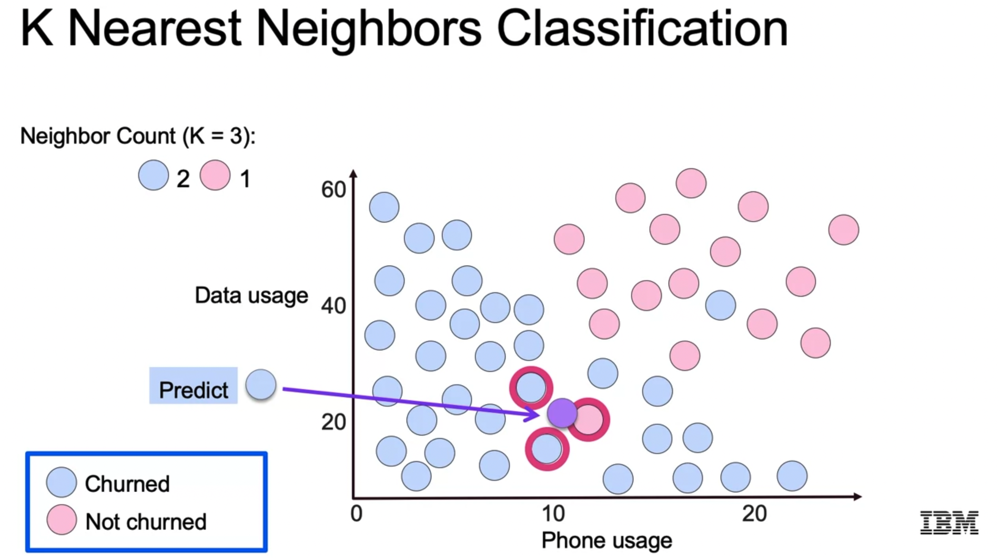

### 2.1 Decision Boundary

We can draw a decision boundary and class regions according to the class prediction associated to each point in the feature space.

Note that low values of K lead to overfitting, while very large values lead to underfitting; that's the bias-variance trade-off. And in the case of k-NN it is easy to understand intuitively why.

In order to find the optimum K, the **elbow method** can be used: similarly as in a grid search, we try different values of K and plot the error. We'll see an elbow-shaped arm, with the low/minimum value in the elbow -- we take the associated K.

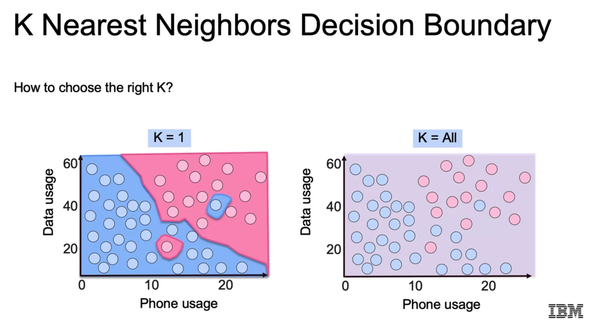

However, note that we need to choose our error metric, and that depends on the business we're in:

- Precision: do we wan to assure that our predicted positives are correct?
- Recall: do we want to capture all the true positives?
- F1: a balance

### 2.2 Distance Measure

We can define difference distance metrics between data points:

1. Euclidean distance: `sqrt(sum(x_i^2))`
2. Manhattan distance: `sqrt(sum(abs(x_i)))`

Since we are measuring distances, scaling the features is very important.

### 2.3 Regression

Regression can be performed very easily: instead of selecting a class, we compute the weighted average of the target value associated with the K closest data points.

If `K = 1` is chosen, we perform a linear interpolation between the dataset points. If larger values of K are chosen, the predicted target is smoothed; if we take `K = all`, we predict the mean target value.

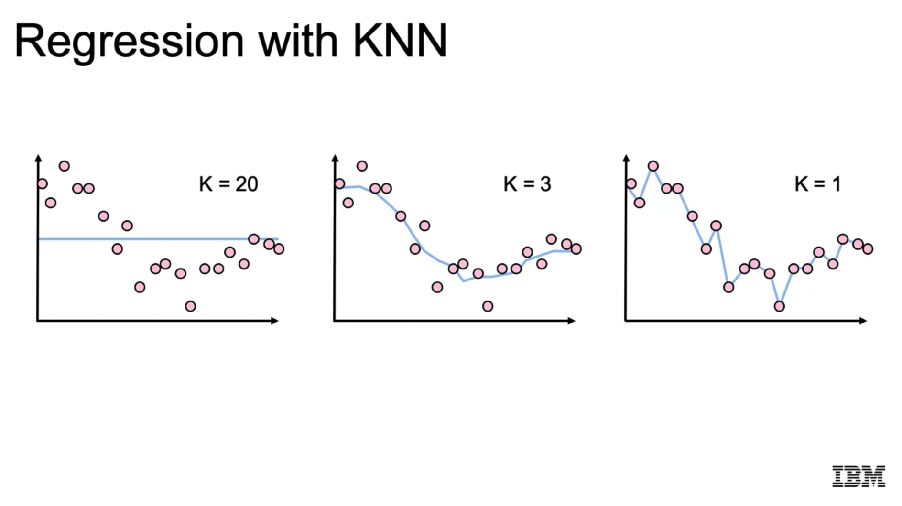

### 2.4 Pros and Cons

Pros:

- Simple to implement.
- Adapts well as new training data.
- Easy to interpret: finding the most similar data points is very powerful, since we can go beyond target prediction; imagine data points are customers.
- Fast training: simply data is stored. 

Cons:

- Slow inference because many distance calculations.
- There is no model: there is no insight into the data generating process.
- A lot of memory is required: the model needs to store all the data points for prediction!
- When there are many predictors/features, KNN accuracy can break down due to the curse of dimensionality. That is because the distances start to increase as we increase the dimensionality.

**In summary, if the feature space is not highly dimensional and we don't have that much data points, KNN is a good choice, moreover, it is highly interpretable.**

### 2.5 KNN in Python with Scikit-Learn

```python
# Here we have the classes fpr both Classification and Regression
# Both are used analogously
from sklearn.neighbors import KNeighborsClassifier, KNeighborsRegressor

# Instantiate the class and choose K
KNN = KNeighborsClassifier(n_neighbors=3)

# Fit to the dataset
# Both X and y need to be numerically encoded, as always
# X must be scaled
# y can be label encoded
KNN = KNN.fit(X_train, y_train)

# Predict
y_pred = KNN.predict(X_test)
```

### 2.6 Python Lab: Customer Churn Classification

In this notebook,

`03b_LAB_KNN.ipynb`,

the K Nearest Neighbors classifier is tested with a dataset that records the customer data of a fictional telecom; there are 7043 data-points and 23 variables. The target variable is whether the customers churned or not: `churn_value`.

The data has no missing values, but many categorical variables need to be encoded. After the encoding (rather straightforward), several KNN models are defined and fit; the optimum `K` value is deduced with the elbow method.

Steps:

1. Load dataset
2. Inspect Variable Types: Categorical, Ordinal, Numerical
3. Encode Variables
4. KNN Model Definition and Training
5. Elbow Method: Find the Optimum K


```python

def warn(*args, **kwargs):
    pass
import warnings
warnings.warn = warn

import pandas as pd, numpy as np, matplotlib.pyplot as plt, os, sys, seaborn as sns

### -- 1. Load dataset

#df = pd.read_csv("https://cf-courses-data.s3.us.cloud-object-storage.appdomain.cloud/IBM-ML241EN-SkillsNetwork/labs/datasets/churndata_processed.csv")
df = pd.read_csv("data/churndata_processed.csv")

df.shape
round(df.describe(),2)

### -- 2. Inspect Variable Types: Categorical, Ordinal, Numerical

# Create a dataframe which records the number of unique variables values
# for each variable
df_uniques = pd.DataFrame([[i, len(df[i].unique())] for i in df.columns], columns=['Variable', 'Unique Values']).set_index('Variable')

binary_variables = list(df_uniques[df_uniques['Unique Values'] == 2].index)
categorical_variables = list(df_uniques[(6 >= df_uniques['Unique Values']) & (df_uniques['Unique Values'] > 2)].index)

# Display categorical variable values
[[i, list(df[i].unique())] for i in categorical_variables]

ordinal_variables = ['contract', 'satisfaction', 'months']
numeric_variables = list(set(df.columns) - set(ordinal_variables) - set(categorical_variables) - set(binary_variables))

df[numeric_variables].hist(figsize=(12, 6))

# If we have very skewed distributions, 
# consider converting it into a categorical!
df['months'] = pd.cut(df['months'], bins=5)

### -- 3. Encode Variables

from sklearn.preprocessing import LabelBinarizer, LabelEncoder, OrdinalEncoder

lb, le = LabelBinarizer(), LabelEncoder()

# We can use label encoding for ordinal variables
# because they are already ordered; but that's not always the case
for column in ordinal_variables:
    df[column] = le.fit_transform(df[column])

# Note how we binarize the selected columns only
for column in binary_variables:
    df[column] = lb.fit_transform(df[column])

categorical_variables = list(set(categorical_variables) - set(ordinal_variables))

# Note how we create dummies of selected columns only
df = pd.get_dummies(df, columns = categorical_variables, drop_first=True)

from sklearn.preprocessing import MinMaxScaler
mm = MinMaxScaler()

for column in [ordinal_variables + numeric_variables]:
    df[column] = mm.fit_transform(df[column])

outputfile = 'data/churndata_processed_encoded.csv'
df.to_csv(outputfile, index=False)

### -- 4. KNN Model Definition and Training

from sklearn.model_selection import train_test_split
from sklearn.neighbors import KNeighborsClassifier
from sklearn.metrics import confusion_matrix, accuracy_score, classification_report, f1_score

# Set up X and y variables
y, X = df['churn_value'], df.drop(columns='churn_value')
# Split the data into training and test samples
X_train, X_test, y_train, y_test = train_test_split(X, y, test_size=0.4, random_state=42)

# Estimate KNN model and report outcomes
knn = KNeighborsClassifier(n_neighbors=3)
knn = knn.fit(X_train, y_train)
y_pred = knn.predict(X_test)
# Preciision, recall, f-score from the multi-class support function
print(classification_report(y_test, y_pred))
print('Accuracy score: ', round(accuracy_score(y_test, y_pred), 2))
print('F1 Score: ', round(f1_score(y_test, y_pred), 2))

# Plot confusion matrix
sns.set_palette(sns.color_palette())
_, ax = plt.subplots(figsize=(12,12))
ax = sns.heatmap(confusion_matrix(y_test, y_pred), annot=True, fmt='d', annot_kws={"size": 40, "weight": "bold"})  
labels = ['False', 'True']
ax.set_xticklabels(labels, fontsize=25);
ax.set_yticklabels(labels[::-1], fontsize=25);
ax.set_ylabel('Prediction', fontsize=30);
ax.set_xlabel('Ground Truth', fontsize=30)

### -- 5. Elbow Method: Find the Optimum K

# We compute model metrics for different K values
# and plot them; the best K value is the one with
# the best metric (high performance or low error)

max_k = 40
f1_scores = list()
error_rates = list() # 1-accuracy

for k in range(1, max_k):
    
    knn = KNeighborsClassifier(n_neighbors=k, weights='distance')
    knn = knn.fit(X_train, y_train)
    
    y_pred = knn.predict(X_test)
    f1 = f1_score(y_pred, y_test)
    f1_scores.append((k, round(f1_score(y_test, y_pred), 4)))
    error = 1-round(accuracy_score(y_test, y_pred), 4)
    error_rates.append((k, error))
    
f1_results = pd.DataFrame(f1_scores, columns=['K', 'F1 Score'])
error_results = pd.DataFrame(error_rates, columns=['K', 'Error Rate'])

# Plot F1 results
sns.set_context('talk')
sns.set_style('ticks')

plt.figure(dpi=300)
ax = f1_results.set_index('K').plot(figsize=(12, 12), linewidth=6)
ax.set(xlabel='K', ylabel='F1 Score')
ax.set_xticks(range(1, max_k, 2));
plt.title('KNN F1 Score')
plt.savefig('knn_f1.png')

```

### 2.7 Python Example: Tumor Classification

In this noetebook,

`lab_jupyter_knn.ipynb`,

a KNN model is trained to fit the classifier to a tumor description dataset.

Nothing really new is shown, compared to the previous notebook.

A nice evaluation dictionary is built for each KNN classifier; nothing special, but nice:

```python
def evaluate_metrics(yt, yp):
    results_pos = {}
    results_pos['accuracy'] = accuracy_score(yt, yp)
    # Precision, Recall and F1 are class-specific!
    # But we compute the type of average values we'd like
    precision, recall, f_beta, _ = precision_recall_fscore_support(yt, yp, average='binary')
    results_pos['recall'] = recall
    results_pos['precision'] = precision
    results_pos['f1score'] = f_beta
    return results_pos
```

## 3. Support Vector Machines

Support Vector Machines (SVM) are also called **Large Margin Classifiers** because they compute hyperplanes which are equidistant to the boundary data-points of the classes they separate. In other words, we maximize the region between different classes with a hyperplane and a margin value. Those boundary points are the *support vectors*.

It is intuitive to understand that the larger the margin, the more stable the model is.

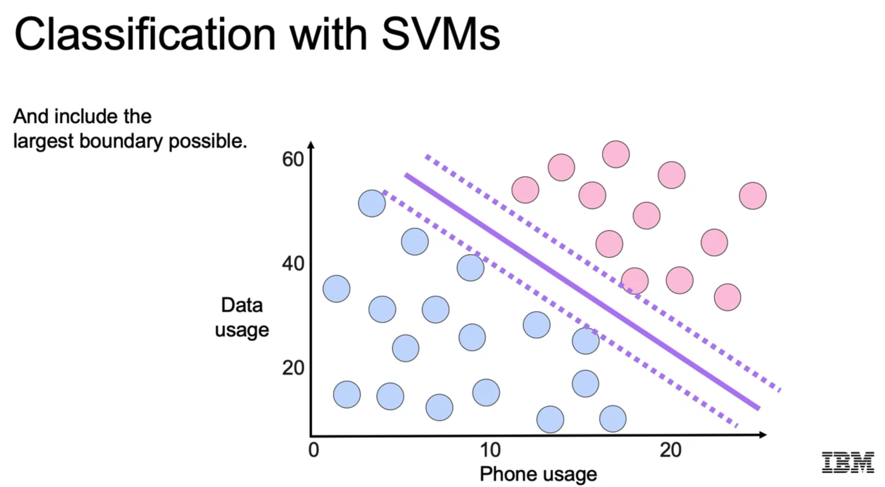

### 3.1 Cost Function: Hinge Loss

The model of the SVM is very similar to the linear regression; however, this time, we have another cost function. The cost function is similar to the one in the logistic regression, but instead of having a smooth decay, we have a non-linear **hinge cost function**. The cost starts to increase linearly when we trespass the margin hyperplane that touches one support or boundary point.

This is a fundamental difference: in SVMs, only wrongly classified data-points are penalized, while in logistic regression there is always a penalization (because we have a smooth cost function).

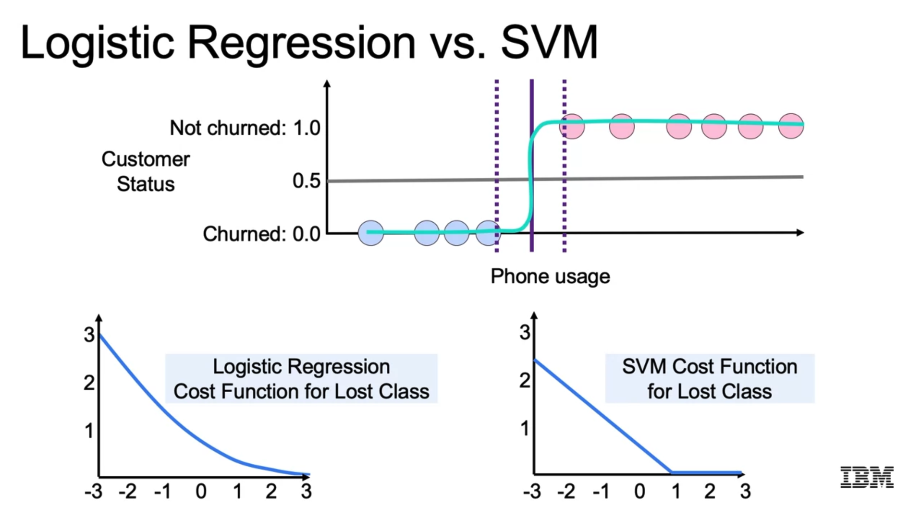

### 3.2 Model and Regularization

The SVM model uses regularization via the parameter `C`: it is the inverse of `alpha` or `lambda` regularization strength in linear/logistic regression; i.e., small values of `C` lead to less complex models that avoid overfitting.

The regularization is done as always: we add an aggregate of the parameters to the model mis-classification cost.

The model parameters `beta` represent the normal vector of the separating hyperplanes. Thus the dot product between the `beta` vector and any data-point is the *signed* distance from the point to the decision boundary. Thus, the distance yields the class.

The larger a parameter is, the larger its effect on the distance, i.e., on the final class.

Since we are using distances, again, scaling the features is essential!

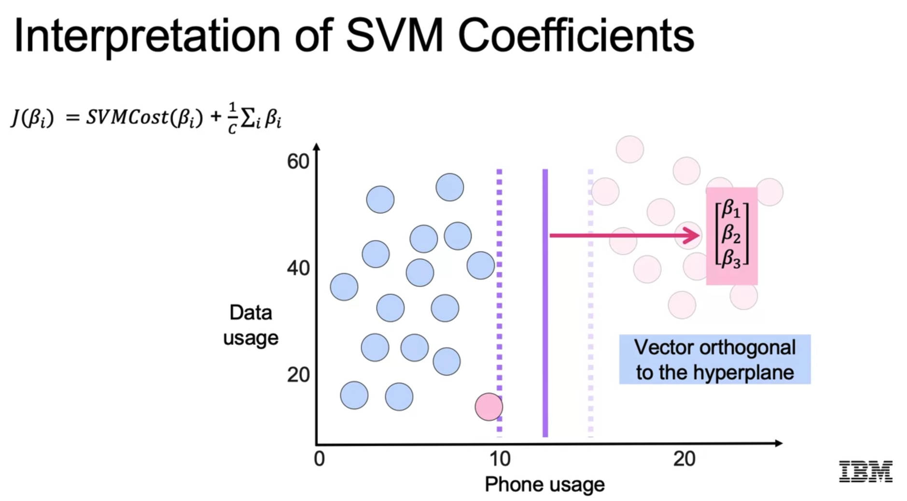

### 3.3 SVM Syntax in Scikit-Learn

We distinguish between:

- Linear SVMs, as explained so far.
- Kernel-based SVMs, explained below.

Here, the syntax for linear SVMs is shown; take also into account that we can create regression objects!

Note that in SVMs we don't predict probabilities, but class labels!

As usual, we can find the best hyperparameter values with `GridSearchCV`.

```python
# Imports
# LinearSVC: Classification
# LinearSVM: Regression
from sklearn.svm import LinearSVC, LinearSVR

# Instantiate
# Regularization: L2, C
LinSVC = LinearSVC(penalty='l2', C=10.0)

# Fit and Predict
LinSVC = LinSVC.fit(X_train, y_train)
# We predict class labels, not probabilities!
y_pred = LinSVC.predict(X_test)
```

### 3.4 SVMs with Kernels: Gaussian Kernels

SVMs as we've seen so far are linear, i.e., they use linear boundaries that consist in hyperplanes.

However, if we use the **kernel trick** we can represent non-linear boundaries. The idea is that we find a feature space of higher dimensions in which the boundary is still linear, but when projected onto the original feature space, it is highly non-linear.

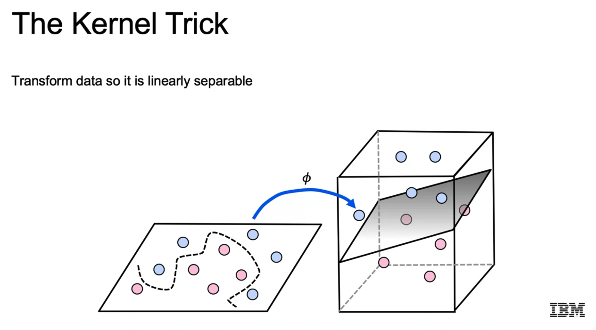

The basic idea behind is to use similarity functions: all points from a class become landmarks against which a similarity of new point `x` is computed; the similarity value can be the distance between `x` and any landmark. That similarity or distance value is used to evaluate a kernel:

- Radial Basis Function (RBF): a Gaussian; most common kernel
- Linear: no modification
- Polynomial: a polynomial using the similarity
- etc.

So, basically, Gaussian blobs are defined with the distances from any point `x` to all data-points in the dataset. Then, the separation boundaries are found in that high-dimensional space. Note that the new features are the output of the kernels that use the similarities. So we have so many features are data-points in the training set.

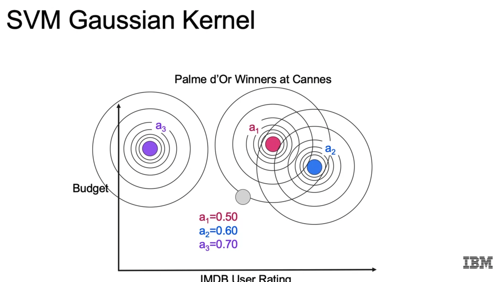

### 3.5 What to Use When?

Now, we have many options:

- Linear vs. Non-linear SVM vs. Logistic regression
- If non-linear SVM: Gaussian or Polynomial Kernel

Additionally, there is another option, which consists in using kernel approximations. The motivation behind is that SVMs with RBFs are very slow to train if there are lots of features or data. The kernel approximations overcome that issue, while dropping small amounts of efficiency. Any linear model can be converted into non-linear with the approximate kernel mappings.

Which approach should we choose when?

The answer is summarized in the following image/table; it depends on the amount of features and data-points we have.

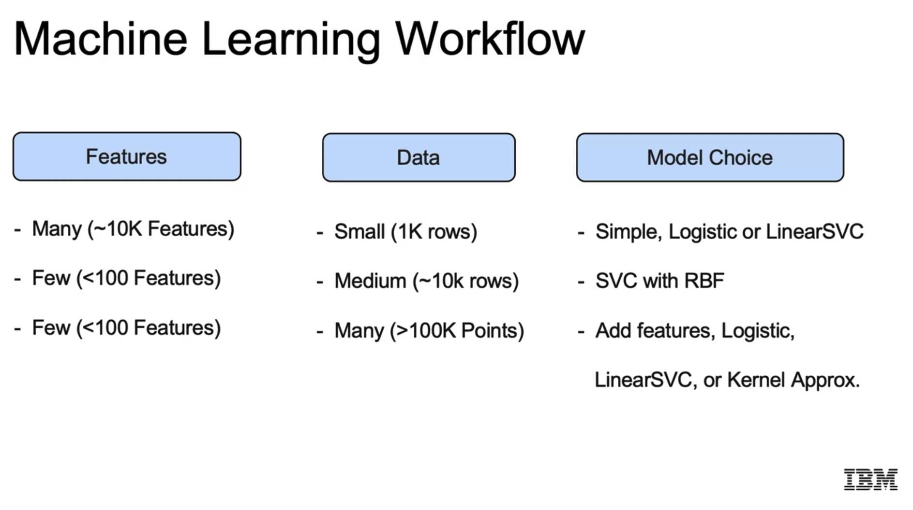

Kernel approximations do not compute the same amount of kernels as data-points; instead, we specify the number of kernels as `n_components`.

### 3.6 Non-Linear SVM Syntax in Scikit-Learn

Important note: we can use non-linear SVMs with a linear kernel, but that would be slower: if we want linear SVMs, we should use `LinearSVM`, else, `SVM` with a desired kernel.

As usual, we can find the best hyperparameter values with `GridSearchCV`: `C, gamma, n_components`.

```python
# Imports
# SVC: Classification
# SVR: Regression
from sklearn.svm import SVC, SVR, LinearSVC
# SGDClassifier: Linear classifiers (SVM, logistic regression, etc.) with SGD training;
# depending on the loss, a model is used - default loss: hinge -> SVM
from sklearn.linear_model import SGDClassifier

# Instantiate
# C: Regularization
# gamma: influence of a single example (like inverse of the variance in the Gaussian; see doc)
# Use GridSearchCV to find best values
rbfSVC = SVC(kernel='rbf', gamma=1.0, C=10.0)

# Fit and Predict
rbfSVC = rbfSVC.fit(X_train, y_train)
y_pred = rbfSVC.predict(X_test)

### -- Approximate Kernel Mappings

# Kernel mappings are used in a different manner
# We map the data with them to higher dimensions
# and then we apply a LinearSVC or any other classifier.

# Imports
from sklearn.kernel_approximation import Nystroem
from sklearn.kernel_approximation import RBFSampler

# Kernel approximation definition
# n_components: instead of applying the kernel to all samples, we define the number of landmarks for similarity computation
# we sample n_components and use them only to compute the kernel
# note that these are the new features
NystroemSVC = Nystroem(kernel="rbf", gamma=1.0, n_components=100)
rbfSampler = RBFSampler(gamma=1.0, n_components=100)

# We fit the kernel transfomer and transform the data
X_train = NystroemSVC.fit_transform(X_train)
X_test = NystroemSVC.transform(X_test)
X_train = rbfSampler.fit_transform(X_train)
X_test = rbfSampler.transform(X_test)
# We instantiate a LinearSVC with the transformed data, fit and predict
# Any linear model can be converted into non-linear with kernel mappings!
sgd = SGDClassifier()  # loss="hinge" by default, so a SVM is used
linSVC = LinearSVC()
linSVC.fit(X_train, y_train)
sgd.fit(X_train, y_train)
y_pred = linSVC.predict(X_test)
y_pred = sgd.predict(X_test)

```

### 3.7 Python Lab: Wine Classification

In this notebook,

`03c_DEMO_SVM.ipynb`,

the dataset `data/Wine_Quality_Data.csv` is used, in which we have 6497 wines registered with 13 variables each. All variables are real numerical values, except `quality`, which is an ordinal score/integer, and `color`, which can be `red` or `white`. In the notebook, the `color` class is predicted using the two independent variables that have the highest correlation magnitude with the color: `volatile_acidity` and `total_sulfur_dioxide`. Two variables are chosen to be able to plot the feature space.

The most interesting part is probably the plotting of the classification regions: colored regions with decision boundaries are plotted. Example:

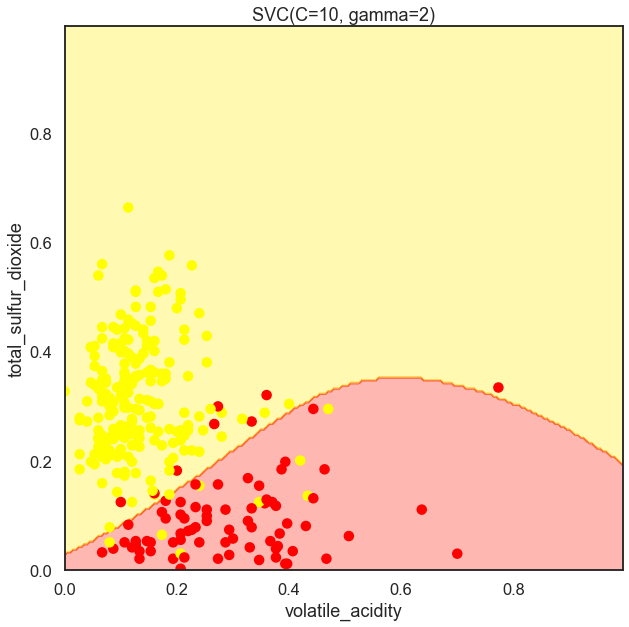

Steps:

1. Load dataset, inspect it, select variables
2. Function to plot the decision boundary
3. Plot Decision Boundaries with Varied Hyperparameters
4. Runtime Comparison: SVC witn RBF kernel, SGD with linear SVM using Nystroem sampling and kernel approximation

```python
def warn(*args, **kwargs):
    pass
import warnings
warnings.warn = warn

import numpy as np, pandas as pd, matplotlib.pyplot as plt, seaborn as sns

### -- 1. Load dataset, inspect it, select variables

#data = pd.read_csv("https://cf-courses-data.s3.us.cloud-object-storage.appdomain.cloud/IBM-ML241EN-SkillsNetwork/labs/datasets/Wine_Quality_Data.csv", sep=',')
data = pd.read_csv("data/Wine_Quality_Data.csv")
data.shape # (6497, 13)

# Encode target as integer/boolean
y = (data['color'] == 'red').astype(int) # Binary classification: target is 1 or 0
fields = list(data.columns[:-1]) # everything except "color"
# Compute correlations
correlations = data[fields].corrwith(y) # correlations with target array y
correlations.sort_values(inplace=True) #

# Scatterplots between all numerical variables: we see that red/white wines can be separated
sns.set_context('talk')
sns.set_style('white')
sns.pairplot(data, hue='color')

# Take the two most correlated variables and scale them
# These are going to be the predictor variables
# Only 2 in order to plot the decision boundaries
from sklearn.preprocessing import MinMaxScaler

fields = correlations.map(abs).sort_values().iloc[-2:].index
print(fields) # Index(['volatile_acidity', 'total_sulfur_dioxide'], dtype='object')
X = data[fields]
scaler = MinMaxScaler()
X = scaler.fit_transform(X)
X = pd.DataFrame(X, columns=['%s_scaled' % fld for fld in fields])
print(X.columns) # Index(['volatile_acidity_scaled', 'total_sulfur_dioxide_scaled'], dtype='object')

### -- 2. Function to plot the decision boundary

def plot_decision_boundary(estimator, X, y, label_0, label_1):
    estimator.fit(X, y)
    X_color = X.sample(300) # We take only 300 points, because otherwise we have too many points
    y_color = y.loc[X_color.index] # We take the associated y values of the sampled X points
    y_color = y_color.map(lambda r: 'red' if r == 1 else 'yellow')
    x_axis, y_axis = np.arange(0, 1, .005), np.arange(0, 1, .005) # very fine cells
    xx, yy = np.meshgrid(x_axis, y_axis) # cells created
    xx_ravel = xx.ravel()
    yy_ravel = yy.ravel()
    X_grid = pd.DataFrame([xx_ravel, yy_ravel]).T
    y_grid_predictions = estimator.predict(X_grid) # for each cell, predict values
    y_grid_predictions = y_grid_predictions.reshape(xx.shape)

    fig, ax = plt.subplots(figsize=(10, 10))
    ax.contourf(xx, yy, y_grid_predictions, cmap=plt.cm.autumn_r, alpha=.3) # plot regions and boundary
    ax.scatter(X_color.iloc[:, 0], X_color.iloc[:, 1], color=y_color, alpha=1) # 300 sampled data-points
    ax.set(
        xlabel=label_0,
        ylabel=label_1,
        title=str(estimator))

### -- 3. Plot Decision Bounadries with Varied Hyperparameters

# Here, different decision boundaries
# of an SVC with varied C and gamma values are plotted.
# An example figure is above, prior to the code.

from sklearn.svm import SVC

# Insights:
# - Higher values of gamma lead to LESS regularization, i.e., more curvy and complex models
# - Higher values of C lead to LESS regularization, i.e., more curvy and complex models 

gammas = [.5, 1, 2, 10]
for gamma in gammas:
    SVC_Gaussian = SVC(kernel='rbf', gamma=gamma)
    plot_decision_boundary(SVC_Gaussian, X, y, label_0=fields[0], label_1=fields[1])

Cs = [.1, 1, 10]
for C in Cs:
    SVC_Gaussian = SVC(kernel='rbf', gamma=2, C=C)
    plot_decision_boundary(SVC_Gaussian, X, y, label_0=fields[0], label_1=fields[1])

### -- 4. Runtime Comparison: SVC witn RBF kernel, SGD with linear SVM using Nystroem sampling and kernel approximation

# Conclusions:
# - Approximate kernels used on linear SVMs are 14-92x faster than using SVM with RBF
# - The difference in speed is larger as we increase the number of data-points; that is expected, since all data-points are used as landmarks in the non-linear SVM model.

from sklearn.kernel_approximation import Nystroem
from sklearn.svm import SVC
from sklearn.linear_model import SGDClassifier

y = data.color == 'red'
X = data[data.columns[:-1]]

kwargs = {'kernel': 'rbf'}
svc = SVC(**kwargs)
nystroem = Nystroem(**kwargs) # n_components=100 by default: landmarks for similarity computation = new features
# SGDClassifier: Linear classifiers (SVM, logistic regression, etc.) with SGD training.
sgd = SGDClassifier() # loss="hinge" by default, so a SVM is used

%%timeit
svc.fit(X, y) # 507 ms ± 3.95 ms per loop, 7 runs

%%timeit
X_transformed = nystroem.fit_transform(X)
sgd.fit(X_transformed, y) # 36.9 ms ± 4.22 ms per loop, 7 runs

X2 = pd.concat([X]*5)
y2 = pd.concat([y]*5)

print(X2.shape)
print(y2.shape)

%timeit svc.fit(X2, y2) # 12.3 s ± 156 ms per loop, 7 runs

%%timeit
X2_transformed = nystroem.fit_transform(X2)
sgd.fit(X2_transformed, y2) # 133 ms ± 13 ms per loop, 7 runs

```

### 3.8 Python Example: Food Item Classification

In this notebook,

`lab_jupyter_svm.ipynb`,

the dataset `data/ood_items_binary.csv` is used to apply the SVM classifier. No new things are really tried, except a grid search with which different kernels are tested. Additionally, the support vectors are grabbed with `model.support_vectors_` and displayed in the decision boundary plot.

```python
params_grid = {
    'C': [1, 10, 100],
    'kernel': ['poly', 'rbf', 'sigmoid']
}

model = SVC()

# Define a GridSearchCV to search the best parameters
grid_search = GridSearchCV(estimator = model, 
                           param_grid = params_grid, 
                           scoring='f1',
                           cv = 5, verbose = 1)
# Search the best parameters with training data
grid_search.fit(X_train, y_train.values.ravel())
best_params = grid_search.best_params_

best_params # {'C': 100, 'kernel': 'rbf'}
```

## 4. Decision Trees


