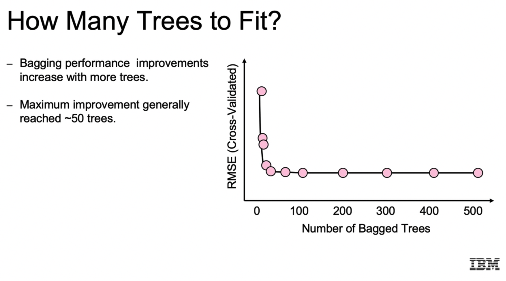
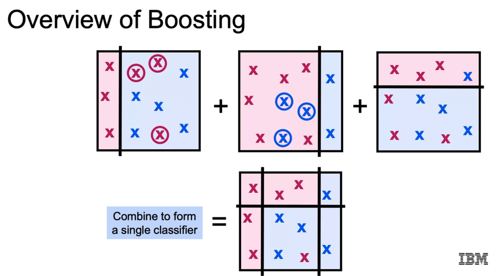

# Supervised Machine Learning: Classification

These are my notes and the code of the [IBM Machine Learning Professional Certificate](https://www.coursera.org/professional-certificates/ibm-machine-learning) offered by IBM & Coursera.

The Specialization is divided in 6 courses, and each of them has its own folder with its guide & notebooks:

1. [Exploratory Data Analysis for Machine Learning](https://www.coursera.org/learn/ibm-exploratory-data-analysis-for-machine-learning?specialization=ibm-machine-learning)
2. [Supervised Machine Learning: Regression](https://www.coursera.org/learn/supervised-machine-learning-regression?specialization=ibm-machine-learning)
3. [Supervised Machine Learning: Classification](https://www.coursera.org/learn/supervised-machine-learning-classification?specialization=ibm-machine-learning)
4. [Unsupervised Machine Learning](https://www.coursera.org/learn/ibm-unsupervised-machine-learning?specialization=ibm-machine-learning)
5. [Deep Learning and Reinforcement Learning](https://www.coursera.org/learn/deep-learning-reinforcement-learning?specialization=ibm-machine-learning)
6. [Machine Learning Capstone: Deployment of a Recommender System](https://www.coursera.org/learn/machine-learning-capstone?specialization=ibm-machine-learning)

This file focuses on the **third course: Supervised Machine Learning: Classification**.

Mikel Sagardia, 2022.  
No guarantees

## Overview of Contents

- [Supervised Machine Learning: Classification](#supervised-machine-learning-classification)
  - [Overview of Contents](#overview-of-contents)
  - [1. Logistic Regression](#1-logistic-regression)
    - [1.1 What is Classification?](#11-what-is-classification)
    - [1.2 Logistic Regression](#12-logistic-regression)
    - [1.3 Classification with Multiple Classes](#13-classification-with-multiple-classes)
    - [1.4 Logistic Regression in Python with Scikit-Learn](#14-logistic-regression-in-python-with-scikit-learn)
    - [1.5 Classification Error Metrics: Confusion Matrix, Accuracy, Specificity, Precision, and Recall](#15-classification-error-metrics-confusion-matrix-accuracy-specificity-precision-and-recall)
    - [1.6 ROC and Precision-Recall Curves](#16-roc-and-precision-recall-curves)
    - [1.7 Multi-Class Metrics](#17-multi-class-metrics)
    - [1.8 Metrics in Python with Scikit-Learn](#18-metrics-in-python-with-scikit-learn)
    - [1.9 Python Lab: Human Activity](#19-python-lab-human-activity)
    - [1.10 Python Example: Food Items](#110-python-example-food-items)
  - [2. K Nearest Neighbors](#2-k-nearest-neighbors)
    - [2.1 Decision Boundary](#21-decision-boundary)
    - [2.2 Distance Measure](#22-distance-measure)
    - [2.3 Regression](#23-regression)
    - [2.4 Pros and Cons](#24-pros-and-cons)
    - [2.5 KNN in Python with Scikit-Learn](#25-knn-in-python-with-scikit-learn)
    - [2.6 Python Lab: Customer Churn Classification](#26-python-lab-customer-churn-classification)
    - [2.7 Python Example: Tumor Classification](#27-python-example-tumor-classification)
  - [3. Support Vector Machines](#3-support-vector-machines)
    - [3.1 Cost Function: Hinge Loss](#31-cost-function-hinge-loss)
    - [3.2 Model and Regularization](#32-model-and-regularization)
    - [3.3 SVM Syntax in Scikit-Learn](#33-svm-syntax-in-scikit-learn)
    - [3.4 SVMs with Kernels: Gaussian Kernels](#34-svms-with-kernels-gaussian-kernels)
    - [3.5 What to Use When?](#35-what-to-use-when)
    - [3.6 Non-Linear SVM Syntax in Scikit-Learn](#36-non-linear-svm-syntax-in-scikit-learn)
    - [3.7 Python Lab: Wine Classification with SVMs](#37-python-lab-wine-classification-with-svms)
    - [3.8 Python Example: Food Item Classification with SVMs](#38-python-example-food-item-classification-with-svms)
  - [4. Decision Trees](#4-decision-trees)
    - [4.1 Introduction to Decision Trees](#41-introduction-to-decision-trees)
    - [4.2 Building a Decision Tree](#42-building-a-decision-tree)
    - [4.3 Entropy-based Splitting](#43-entropy-based-splitting)
    - [4.4 Choosing Splitting Criteria](#44-choosing-splitting-criteria)
    - [4.5 Pros and Cons of Decision Trees](#45-pros-and-cons-of-decision-trees)
    - [4.6 Decision Trees' Syntax in Scikit-Learn](#46-decision-trees-syntax-in-scikit-learn)
    - [4.7 Python Lab: Wine Classification with Decision Trees](#47-python-lab-wine-classification-with-decision-trees)
    - [4.8 Python Example: Tumor Classification with Decision Trees](#48-python-example-tumor-classification-with-decision-trees)
  - [5. Ensemble Models](#5-ensemble-models)
    - [5.1 Ensemble-Based Methods and Bagging](#51-ensemble-based-methods-and-bagging)
    - [5.2 Random Forests](#52-random-forests)
    - [5.3 Python Demo: Random Forests](#53-python-demo-random-forests)
    - [5.4 Python Lab: Bagging](#54-python-lab-bagging)
    - [5.5 Python Demo: Bagging](#55-python-demo-bagging)
    - [5.6 Boosting](#56-boosting)
      - [AdaBoost and Gradient Boosting](#adaboost-and-gradient-boosting)
      - [Comparing Bagging and Boosting](#comparing-bagging-and-boosting)
      - [Tuning Gradient Boosting](#tuning-gradient-boosting)
      - [AdaBoost and GradientBoosting Syntax](#adaboost-and-gradientboosting-syntax)
      - [XGBoost](#xgboost)
    - [5.7 Stacking](#57-stacking)
    - [5.8 Python Lab: Human Activity Classification with Boosting](#58-python-lab-human-activity-classification-with-boosting)
    - [5.9 Python Demos: AdaBoost and Stacking](#59-python-demos-adaboost-and-stacking)
    - [5.10 Ensemble Methods: Summary](#510-ensemble-methods-summary)
  - [6. Model Interpretability](#6-model-interpretability)
    - [6.1 Examples of Self-Interpretable and Non-Self-Interpretable Models](#61-examples-of-self-interpretable-and-non-self-interpretable-models)
    - [6.2 Model Agnostic Explanations](#62-model-agnostic-explanations)
    - [6.3 Surrogate Models](#63-surrogate-models)
    - [6.4 Python Lab: Model Interpretability](#64-python-lab-model-interpretability)
  - [7. Dealing with Unbalanced Datasets](#7-dealing-with-unbalanced-datasets)
    - [7.1 Down- and Upsampling](#71-down--and-upsampling)
    - [7.2 Weighting and Stratified Sampling](#72-weighting-and-stratified-sampling)
    - [7.3 Random and Synthetic Oversampling](#73-random-and-synthetic-oversampling)
    - [7.4 Undersampling: Nearing Neighbor Methods](#74-undersampling-nearing-neighbor-methods)
    - [7.5 Combining Under and Oversampling](#75-combining-under-and-oversampling)
    - [7.6 Blagging: Balanced Bagging](#76-blagging-balanced-bagging)
    - [7.7 Final Recommendations: How to Deal with Unbalanced Classes](#77-final-recommendations-how-to-deal-with-unbalanced-classes)
    - [7.8 Python Lab: Tackling Imbalanced Datasets](#78-python-lab-tackling-imbalanced-datasets)

## 1. Logistic Regression

### 1.1 What is Classification?

Supervised learning consists of Regression and Classification. Regression problems provide a continuous output. Classification problems provide a category output; some examples:

- Detecting fraudulent transactions
- Customer churn or not
- Event attendance
- Network load
- Loan default

There are may classification techniques:

- Logistic regression
- K-Nearest Neighbors
- Support Vector Machines
- Neural Networks
- Decision Trees
- Random Forests
- Boosting
- Ensemble Models

However, **each of these models can be really both for regression and classification!!**

### 1.2 Logistic Regression

We could treat a binary classification problem as a regression problem if we plot our continuous predictor in the `x` axis and the binary target in the `y` axis. Then, we fit the line in the data-points and set the classification threshold in the `x` value which yields `y = 0.5`. Example with customer churn:


The problem with approach is that the line tilts towards the regions with high point density, moving the threshold with it.

A solution to that is using the **sigmoid function**, which shrinks the line to the extremes. The sigmoid takes the full range of real numbers and maps them all to `(0,1)`.

```
sigmoid(x) = 1 / (1 + exp(-x))
```


The resulting model is the **logistic regression** model, which predicts the probability of `x` belonging to a class.:

```
y = p(x) = sigmoid(beta_0 + beta_1 * x) = sigmoid(B * X)
```

Note that the **log odds ratio** can be computed as follows:

```
log(p(x) / (1 - p(x))) = beta_0 + beta_1 * x
```


**That is an important insight: each model coefficient measures the effect of its associated feature on the log-odds ratio.** Linear regression has an equivalent interpretation, but with respect to the target value.

We can have higher dimensions for the `x` variable, such that the threshold becomes a linear boundary or a hyperplane.

### 1.3 Classification with Multiple Classes

Muti-class classification can be performed with the *one-vs-all* technique: a binary classification model is composed for each class versus the rest of the classes. This way, each point in feature space gets one probability for each of the classes, and we pick the largest one to create the regions and boundaries.


Another approach consists in using **multinomial models**. These models are generalized models which a probability distribution over all classes, based on the logits or exponentiated log-odds calculated for each class (usually more than two).

Note: Multinomial is not Multivariate:

- Multivariate distribution: the feature is a vector.
- Multinomial: the target is a vector, i.e., we have a generalized binomial distirbution.

### 1.4 Logistic Regression in Python with Scikit-Learn

[Scikit-Learn Logistic Regression](https://scikit-learn.org/stable/modules/generated/sklearn.linear_model.LogisticRegression.html).

```python
# Imports
from sklearn.linear_model import LogisticRegression

# Instantiate model
# We specify the regularization parameters:
# L2 regularization
# c = 1/lambda, inverse of the regularization strength,
# i.e., the bigger c, the lower the regularization.
LR = LogisticRegression(penalty='l2', c=10.0)

# Fit and predict
LR = LR.fit(X_train, y_train)
y_pred = LR.predict(X_test)

# Coefficients
# Also, consider using statsmodels
# because we get confidence intervals and significances
# for the coefficients
# Note that larger coefficients denote larger influence
# in the class outcome
LR.coef_

# Tune regularization parameters with the cross-validation model
LogisticRegressionCV
```

### 1.5 Classification Error Metrics: Confusion Matrix, Accuracy, Specificity, Precision, and Recall

Accuracy is a really bad metric for classification if we have imbalanced classes (which is often the case). Example: if we want to predict cancer and our dataset consists of 1% sick and 99% healthy; a simple model which always predicts "healthy" is wrong, but still accurate 99% of the time.

The basis for computing classification metrics is the **confusion matrix**, which is the matrix that counts the cases for `Real (Positive, Negative) x Predicted (Positive, Negative)`.

In that matrix:

- False positives are the **Type I** error.
- False negatives are the **Type II** error; in the case of sickness prediction, we want to significantly minimize this type of error.

From the matrix, we compute the most common error metrics:

- Accuracy: diagonal / all 4 cells = `(TP + TN) / (TP + FP + FN + TN)`
- Precision (of Predicted Positives) = `TP / (TP + FP)` 
- Recall or Sensitivity (wrt. Real Positives) = `TP / (TP + FN)`
- Specificity: Precision for Negatives = `TN / (FP + TN)`
- F1: harmonic mean between precision and recall; it is a nice trade-off between precision and recall, thus, a metric which is recommend by default: `F1 = 2 *(Precision*Recall)/(Precision+Recall)`

Interpretation:

- Precision: do we wan to assure that our predicted positives are correct? **How good are we at minimizing Type I error?**
- Recall: do we want to capture all the true positives? **How good are we at minimizing Type II error?**
- F1: a balance


### 1.6 ROC and Precision-Recall Curves

**ROC = Receiver Operating Characteristic.**

If we take a model, vary the classification threshold and plot its true positive and false positive rates pairs, we get the ROC curve: [Receiver Operating Characteristic](https://en.wikipedia.org/wiki/Receiver_operating_characteristic).

Note that:

- True positive rate = Sensitivity = Recall
- False positive rate = 1 - Specificity

Now, we can compute the **Area Under the Curve (AUC)**; its value has the following interpretation:

- ROC-AUC = 0.5: the model performs like random guessing.
- The larger ROC-AUC the better performs the model.
- The curve will be convex in practice.


Similarly, we can compute another curve, which is better suited **for umbalanced classes: Precision-Recall Curve**


The Precision-Recall curve measures the Precision-Recall values for varied thresholds; it is usually a descending curve.

Ultimately, the application or use-case we're dealing with is essential to choosing the correct metric: F1, ROC-AUC, etc. We need to consider which cases we want to avoid because they have a too high cost.

### 1.7 Multi-Class Metrics

If we have a confusion matrix with several classes (i.e., larger than `2x2`), we can compute the accuracy with the values in the diagonal, but the other metrics are not really generalizable for the complete dataset.

However, we can compute each one of them for each class, i.e., taking the *one-vs-all* approach. Then, a weighted average can be computed, i.e., weighting with the ratio of each class.

### 1.8 Metrics in Python with Scikit-Learn

```python
# Accuracy
from sklearn.metrics import accuracy_score

# Compute the accuracy
accuracy_value = accuracy_score(y_test, y_pred)

# Other error metrics
from sklearn.metrics import (precision_score, recall_score,
          f1_score, roc_auc_score,
          confusion_matrix, roc_curve,
          precision_recall_curve)

```

### 1.9 Python Lab: Human Activity

In this notebook, 

`03a_LAB_Logistic_Regression_Error_Metrics.ipynb`,

the [Human Activity Recognition Using Smartphones Data Set ](https://archive.ics.uci.edu/ml/datasets/Human+Activity+Recognition+Using+Smartphones?utm_medium=Exinfluencer&utm_source=Exinfluencer&utm_content=000026UJ&utm_term=10006555&utm_id=NA-SkillsNetwork-Channel-SkillsNetworkCoursesIBMML241ENSkillsNetwork31576874-2022-01-01) is used: users carried out a smartphone with an inertial sensor and carried out Activities of Daily Living (ADL); these activities are annotated/labeled as

- `WALKING`,
- `WALKING UPSTAIRS`,
- `WALKING DOWNSTAIRS`,
- `SITTING`, 
- `STANDING`,
- and `LAYING`.

Dataset records contain:

- Triaxial acceleration from the accelerometer (total acceleration) and the estimated body acceleration.
- Triaxial Angular velocity from the gyroscope.
- Many time and frequency domain variables: moving average, kurtosis, etc.
- The `Activity` label with the 6 classes listed above.

Altogether we have a 561-feature vector with values already scaled to `[-1,1]`. No cleaning needs to be carried out and all variables are continuous; the only pre-processing consists in converting the class names into integers.

The notebook is interesting because it shows how to deal with different models and compute classifications metrics in a multi-class example (class ratios need to be maintained in splits).

Steps:

1. Load dataset, inspect and prepare it
2. Check correlations
3. Split dataset maintaining class ratios: StratifiedShuffleSplit
4. Define and fit logistic regression models with and without regularization
5. Compare the magnitude of the coefficients of each model in a multi-level dataframe
6. Predict the probabilities and the classes of the test split for each model
7. Compute the metrics for each model: precision, recall, f1, accuracy, roc-auc, confusion matrix

In the following, the code of the notebook:

```python
import seaborn as sns, pandas as pd, numpy as np

# Display all the columns of the dataframe in the notebook
pd.pandas.set_option('display.max_columns', None)

### -- 1. Load dataset, inspect and prepare it

#data = pd.read_csv("https://cf-courses-data.s3.us.cloud-object-storage.appdomain.cloud/IBM-ML241EN-SkillsNetwork/labs/datasets/Human_Activity_Recognition_Using_Smartphones_Data.csv", sep=',')
data = pd.read_csv("data/Human_Activity_Recognition_Using_Smartphones_Data.csv")

data.dtypes.value_counts()

# The min for every single feature column is -1
data.iloc[:, :-1].min().value_counts()
# The max for every single feature column is 1
data.iloc[:, :-1].max().value_counts()

# Target column: always do value_counts
# to see how balanced the classes are.
# They are quite balanced.
data.Activity.value_counts()

# Classification problems require passing label-encoded target values,
# one-hot encoded (sparse) values are not accepted.
from sklearn.preprocessing import LabelEncoder

le = LabelEncoder()
data['Activity'] = le.fit_transform(data.Activity)
data['Activity'].sample(5)

### -- 2. Check correlations

# Calculate the correlation values between the feature values
feature_cols = data.columns[:-1]
corr_values = data[feature_cols].corr()

# Calculate the correlation values between the feature values
feature_cols = data.columns[:-1]
corr_values = data[feature_cols].corr()

# Simplify by emptying all the data below the diagonal.
# tril_indices_from returns a tuple of 2 arrays:
# the arrays contain the indices of the diagonal + lower triangle of the matrix:
# ([0,1,...],[0,0,...])
tril_index = np.tril_indices_from(corr_values)

# Make the unused values NaNs
# NaN values are automatically dropped below with stack()
# zip creates a list of tuples from a tuple of arrays
for coord in zip(*tril_index):
    corr_values.iloc[coord[0], coord[1]] = np.NaN
    
# Stack the data and convert to a data frame
corr_values = (corr_values
               .stack() # multi-index stacking of a matrix: [m1:(m11, m12,...), m2:(m21, m22,...), ...]
               .to_frame() # convert in dataframe
               .reset_index() # new index
               .rename(columns={'level_0':'feature1', # new column names
                                'level_1':'feature2',
                                0:'correlation'}))

# Get the absolute values for sorting
corr_values['abs_correlation'] = corr_values.correlation.abs()

# We have many correlation values, because we have 550+ features!
corr_values.shape # (157080, 4)

import matplotlib.pyplot as plt
import seaborn as sns
%matplotlib inline

# Histogram of correlations
sns.set_context('talk')
sns.set_style('white')
ax = corr_values.abs_correlation.hist(bins=50, figsize=(12, 8))
ax.set(xlabel='Absolute Correlation', ylabel='Frequency');

# The most highly correlated values
corr_values.sort_values('correlation', ascending=False).query('abs_correlation>0.8')

### -- 3. Split dataset maintaining class ratios: StratifiedShuffleSplit

# Orginal class ratios
data.Activity.value_counts(normalize=True)

# StratifiedShuffleSplit allows to split the dataset
# into the desired numbers of train-test subsets
# while still maintaining the ratio of the predicted classes in the original/complete dataset
from sklearn.model_selection import StratifiedShuffleSplit

# Instantiate the StratifiedShuffleSplit object with its parameters
strat_shuf_split = StratifiedShuffleSplit(n_splits=1, # 1 split: 1 train-test
                                          test_size=0.3, 
                                          random_state=42)

# Get the split indexes
train_idx, test_idx = next(strat_shuf_split.split(X=data[feature_cols], y=data.Activity))

# Create the dataframes using the obtained split indices
X_train = data.loc[train_idx, feature_cols]
y_train = data.loc[train_idx, 'Activity']

X_test  = data.loc[test_idx, feature_cols]
y_test  = data.loc[test_idx, 'Activity']

# Always check that the ratios are OK
y_train.value_counts(normalize=True)
y_test.value_counts(normalize=True)

### -- 4. Define and fit logistic regression models with and without regularization

# Logistic regression is originally a binary classification tool
# but the sklearn implementation handles multiple classes.
# Depending on the solver, different approaches are taken.
# The liblinear solver uses the one-vs-rest approach; so the model is fit N times,
# being N the number of classses we have.
# liblinear works nice for smaller datasets, read the documentation for more.
# Note: we can add regularization to the LogisticRegression objects in the parameters:
# penalty: l1, l2
# C: 1/lambda -> the larger the less regularization strength
# Also, we can use the cross-validation version to detect the optimum C value
from sklearn.linear_model import LogisticRegression, LogisticRegressionCV

# Standard logistic regression
lr = LogisticRegression(solver='liblinear').fit(X_train, y_train)

# L1 regularized logistic regression: it takes a while
lr_l1 = LogisticRegressionCV(Cs=10, cv=4, penalty='l1', solver='liblinear').fit(X_train, y_train)

# L2 regularized logistic regression
lr_l2 = LogisticRegressionCV(Cs=10, cv=4, penalty='l2', solver='liblinear').fit(X_train, y_train)

### -- 5. Compare the magnitude of the coefficients of each model in a multi-level dataframe

# Since we have a multi-class classification model with 6 classes and 561 features
# we get 6 x 561 coefficients.
# Each class-feature coefficient is the strength of the effect that feature
# has on the log odds ratio of the class
lr.coef_.shape

# Combine all the coefficients into a dataframe
coefficients = list()

coeff_labels = ['lr', 'l1', 'l2']
coeff_models = [lr, lr_l1, lr_l2]

for lab,mod in zip(coeff_labels, coeff_models):
    coeffs = mod.coef_ # 6 x 561
    # Create multi-index columns:
    #          lr          l1          l2
    # 0 1 2 3 4 5 0 1 2 3 4 5 0 1 2 3 4 5 
    coeff_label = pd.MultiIndex(levels=[[lab], [0,1,2,3,4,5]], 
                                codes=[[0,0,0,0,0,0], [0,1,2,3,4,5]])
    coefficients.append(pd.DataFrame(coeffs.T, columns=coeff_label))

# Create dataframe from list of dataframes
coefficients = pd.concat(coefficients, axis=1)

# Show 10 random coefficient values
coefficients.sample(10)

# All coefficients of all the models:
# 561 features x (3 models * 6 classes)
coefficients.shape

# Prepare six separate plots for each of the multi-class coefficients.
# All feature coefficients for each class are plotted
# differentiating the 3 models.
fig, axList = plt.subplots(nrows=3, ncols=2)
axList = axList.flatten()
fig.set_size_inches(10,10)

for ax in enumerate(axList):
    loc = ax[0]
    ax = ax[1]
    
    data = coefficients.xs(loc, level=1, axis=1)
    data.plot(marker='o', ls='', ms=2.0, ax=ax, legend=False)
    
    if ax is axList[0]:
        ax.legend(loc=4)
        
    ax.set(title='Coefficient Set '+str(loc))

plt.tight_layout()

### -- 6. Predict the probabilities and the classes of the test split for each model

# Predict the class and the probability for each model
# using the test split.
# The class and the probability are important: predict() and predict_proba()
y_pred = list()
y_prob = list()

coeff_labels = ['lr', 'l1', 'l2']
coeff_models = [lr, lr_l1, lr_l2]

for lab,mod in zip(coeff_labels, coeff_models):
    y_pred.append(pd.Series(mod.predict(X_test), name=lab))
    y_prob.append(pd.Series(mod.predict_proba(X_test).max(axis=1), name=lab))
    
y_pred = pd.concat(y_pred, axis=1)
y_prob = pd.concat(y_prob, axis=1)

y_pred.head()
# lr  l1  l2
# 0 3 3 3
# 1 5 5 5
# ...
y_prob.head()
# lr  l1  l2
# 0 0.998939  0.998965  0.999757
# 1 0.988165  0.999485  0.999998
# ...

# Which are the data-points that obtained a different class
# prediction dpeending on the model?
y_pred[y_pred.lr != y_pred.l1]

### -- 7. Compute the metrics for each model: precision, recall, f1, accuracy, roc-auc, confusion matrix

# For each model, we compute the most important metrics
from sklearn.metrics import precision_recall_fscore_support as score
from sklearn.metrics import confusion_matrix, accuracy_score, roc_auc_score
from sklearn.preprocessing import label_binarize

metrics = list() # precision, recall, f1, accuracy, roc-auc
cm = dict() # confusion matrix

# We need to pass the results of each model separately
for lab in coeff_labels:

    # Precision, recall, f-score from the multi-class support function
    # Since we have multiple classes, there is one value for each class for
    # precision, recall, F1 and support.
    # The support is the number of occurrences of each class in ``y_true``.
    # However, we can compute the weighted average to get a global value with average='weighted'.
    # Then, support doesn't make sense.
    # Without the average parameter, we get arrays of six values for each metric,
    # one item in each array for each class.
    precision, recall, fscore, _ = score(y_test, y_pred[lab], average='weighted')
    
    # The usual way to calculate accuracy
    # Accuracy is for the complete dataset (ie., all classes).
    accuracy = accuracy_score(y_test, y_pred[lab])
    
    # ROC-AUC scores can be calculated by binarizing the data
    # label_binarize performs a one-hot encoding,
    # so from an integer class we get an array of one 1 and the rest 0s.
    # This is necessary for computing the ROC curve, since the target needs to be binary!
    # Again, to get a single ROC-AUC from the 6 classes, we pass average='weighted'
    auc = roc_auc_score(label_binarize(y_test, classes=[0,1,2,3,4,5]),
              label_binarize(y_pred[lab], classes=[0,1,2,3,4,5]), 
              average='weighted')
    
    # Last, the confusion matrix
    cm[lab] = confusion_matrix(y_test, y_pred[lab])
    
    metrics.append(pd.Series({'precision':precision, 'recall':recall, 
                              'fscore':fscore, 'accuracy':accuracy,
                              'auc':auc}, 
                             name=lab))

metrics = pd.concat(metrics, axis=1)

metrics
# lr  l1  l2
# precision 0.984144  0.983514  0.984148
# recall  0.984142  0.983495  0.984142
# fscore  0.984143  0.983492  0.984143
# accuracy  0.984142  0.983495  0.984142
# auc 0.990384  0.989949  0.990352

# Confusion matrix plots: one for each model
# Actual vs. Predicted
fig, axList = plt.subplots(nrows=2, ncols=2)
axList = axList.flatten()
fig.set_size_inches(12, 10)

axList[-1].axis('off') # we have 2x2 subplots, but want to show only the first 3 

for ax,lab in zip(axList[:-1], coeff_labels):
    sns.heatmap(cm[lab], ax=ax, annot=True, fmt='d');
    ax.set(title=lab);
    
plt.tight_layout()

# Always check the classes which are more often confused.
# Why are they similar? How could we differentiate them? Do we need more data?
# We see that the most confused classes are 1 & 2
# We can check their meaning with the label encoder
# 'SITTING', 'STANDING'
le.classes_

```

### 1.10 Python Example: Food Items

This notebook,

`lab_jupyter_logistic_regression.ipynb`,

shows a classification example in which 13260 food items with 17 nutrient values (features) are labelled (target) as to be consumed:

- in moderation,
- less often,
- more often.

The dataset consists of cleaned numerical values which only need to be scaled. There are few new things compared to the previous notebook. In the following, selected code parts are summarized, with the most important new concepts:

1. Stratified data splits can be performed directly with `train_test_split`
2. Definition of multinomial Logistic Regression with its solver
3. Practical classification metric computation for multinomial cases
4. Coefficient importance for multinomial classification

```python

### -- 1. Stratified data splits can be performed directly with `train_test_split`

# First, let's split the training and testing dataset
# Another way of mainatining the class ratios in the split is using stratify
X_train, X_test, y_train, y_test = train_test_split(X, y, test_size=0.2, stratify=y, random_state = rs)

### -- 2. Definition of multinomial Logistic Regression with its solver

# L1 penalty to shrink coefficients without removing any features from the model
penalty= 'l1'
# We choose our classification problem to define it multinomial in contrast to using
# the one-vs-rest method. In practice, nothing changes for the user, but we need to choose
# other solvers.
multi_class = 'multinomial'
# Use saga for L1 penalty and multinomial classes
solver = 'saga'
# Max iteration = 1000
max_iter = 1000

# L2 penalty to shrink coefficients without removing any features from the model
penalty= 'l2'
# Our classification problem is multinomial
multi_class = 'multinomial'
# Use lbfgs for L2 penalty and multinomial classes
solver = 'lbfgs'
# Max iteration = 1000
max_iter = 1000

# Define a logistic regression model with above arguments
l1_model = LogisticRegression(random_state=rs, penalty=penalty, multi_class=multi_class, solver=solver, max_iter = 1000)
# Define a logistic regression model with above arguments
l2_model = LogisticRegression(random_state=rs, penalty=penalty, multi_class=multi_class, solver=solver, max_iter=max_iter)

### -- 3. Practical classification metric computation for multinomial cases

def evaluate_metrics(yt, yp):
    results_pos = {}
    results_pos['accuracy'] = accuracy_score(yt, yp)
    precision, recall, f_beta, _ = precision_recall_fscore_support(yt, yp)
    results_pos['recall'] = recall
    results_pos['precision'] = precision
    results_pos['f1score'] = f_beta
    return results_pos
evaluate_metrics(y_test, l2_preds)
# {'accuracy': 0.774132730015083,
# 'recall': array([0.87218045, 0.73220641, 0.35353535]),
# 'precision': array([0.73001888, 0.8346856 , 0.90909091]),
# 'f1score': array([0.79479274, 0.78009479, 0.50909091])}

### -- 4. Coefficient importance for multinomial classification

# Even tough we have a multinomial distribution under the hood
# we still get a set of feature coefficients for each class
l1_model.coef_

# Extract and sort feature coefficients
# We have one feature coefficient set for each class
# We pass the class number label_index to extract the values of that class
# in a sorted way.
# We take only coefficient values that are larger than 0.01 in margnitude
def get_feature_coefs(regression_model, label_index, columns):
    coef_dict = {}
    for coef, feat in zip(regression_model.coef_[label_index, :], columns):
        if abs(coef) >= 0.01:
            coef_dict[feat] = coef
    # Sort coefficients and create dictionary of them
    # coefficient_name: coefficient_value
    coef_dict = {k: v for k, v in sorted(coef_dict.items(), key=lambda item: item[1])}
    return coef_dict

# Generate bar colors based on if value is negative or positive
def get_bar_colors(values):
    color_vals = []
    for val in values:
        if val <= 0:
            color_vals.append('r')
        else:
            color_vals.append('g')
    return color_vals

# Visualize coefficients
def visualize_coefs(coef_dict):
    features = list(coef_dict.keys())
    values = list(coef_dict.values())
    y_pos = np.arange(len(features))
    color_vals = get_bar_colors(values)
    plt.rcdefaults()
    fig, ax = plt.subplots()
    ax.barh(y_pos, values, align='center', color=color_vals)
    ax.set_yticks(y_pos)
    ax.set_yticklabels(features)
    # labels read top-to-bottom
    ax.invert_yaxis()  
    ax.set_xlabel('Feature Coefficients')
    ax.set_title('')
    plt.show()

# Get the coefficents for Class 1, Less Often
coef_dict = get_feature_coefs(l1_model, 1, feature_cols)
visualize_coefs(coef_dict)

```

## 2. K Nearest Neighbors

The gist behind the K Nearest Neighbors algorithm is that we look in the feature space the class of the K nearest data points to predict the class of a new point. K is a hyper-parameter which can be optimized.

Usually:

- Odd numbers of K are encouraged, because the voting results cannot be even.
- The vote value can be weighted (inversely) by the distance from the dataset point to the inference point.

We can have as many classes as we want; the algorithm barely changes. Usually, K is chosen as a multiple of the number of classes +1.


### 2.1 Decision Boundary

We can draw a decision boundary and class regions according to the class prediction associated to each point in the feature space.

Note that low values of K lead to overfitting, while very large values lead to underfitting; that's the bias-variance trade-off. And in the case of k-NN it is easy to understand intuitively why.

In order to find the optimum K, the **elbow method** can be used: similarly as in a grid search, we try different values of K and plot the error. We'll see an elbow-shaped arm, with the low/minimum value in the elbow -- we take the associated K.


However, note that we need to choose our error metric, and that depends on the business we're in:

- Precision: do we wan to assure that our predicted positives are correct?
- Recall: do we want to capture all the true positives?
- F1: a balance

### 2.2 Distance Measure

We can define difference distance metrics between data points:

1. Euclidean distance: `sqrt(sum(x_i^2))`
2. Manhattan distance: `sqrt(sum(abs(x_i)))`

Since we are measuring distances, scaling the features is very important.

### 2.3 Regression

Regression can be performed very easily: instead of selecting a class, we compute the weighted average of the target value associated with the K closest data points.

If `K = 1` is chosen, we perform a linear interpolation between the dataset points. If larger values of K are chosen, the predicted target is smoothed; if we take `K = all`, we predict the mean target value.


### 2.4 Pros and Cons

Pros:

- Simple to implement.
- Adapts well as new training data.
- Easy to interpret: finding the most similar data points is very powerful, since we can go beyond target prediction; imagine data points are customers.
- Fast training: simply data is stored. 

Cons:

- Slow inference because many distance calculations.
- There is no model: there is no insight into the data generating process.
- A lot of memory is required: the model needs to store all the data points for prediction!
- When there are many predictors/features, KNN accuracy can break down due to the curse of dimensionality. That is because the distances start to increase as we increase the dimensionality.

**In summary, if the feature space is not highly dimensional and we don't have that much data points, KNN is a good choice, moreover, it is highly interpretable.**

### 2.5 KNN in Python with Scikit-Learn

```python
# Here we have the classes fpr both Classification and Regression
# Both are used analogously
from sklearn.neighbors import KNeighborsClassifier, KNeighborsRegressor

# Instantiate the class and choose K
KNN = KNeighborsClassifier(n_neighbors=3)

# Fit to the dataset
# Both X and y need to be numerically encoded, as always
# X must be scaled
# y can be label encoded
KNN = KNN.fit(X_train, y_train)

# Predict
y_pred = KNN.predict(X_test)
```

### 2.6 Python Lab: Customer Churn Classification

In this notebook,

`03b_LAB_KNN.ipynb`,

the K Nearest Neighbors classifier is tested with a dataset that records the customer data of a fictional telecom; there are 7043 data-points and 23 variables. The target variable is whether the customers churned or not: `churn_value`.

The data has no missing values, but many categorical variables need to be encoded. After the encoding (rather straightforward), several KNN models are defined and fit; the optimum `K` value is deduced with the elbow method.

Steps:

1. Load dataset
2. Inspect Variable Types: Categorical, Ordinal, Numerical
3. Encode Variables
4. KNN Model Definition and Training
5. Elbow Method: Find the Optimum K


```python

def warn(*args, **kwargs):
    pass
import warnings
warnings.warn = warn

import pandas as pd, numpy as np, matplotlib.pyplot as plt, os, sys, seaborn as sns

### -- 1. Load dataset

#df = pd.read_csv("https://cf-courses-data.s3.us.cloud-object-storage.appdomain.cloud/IBM-ML241EN-SkillsNetwork/labs/datasets/churndata_processed.csv")
df = pd.read_csv("data/churndata_processed.csv")

df.shape
round(df.describe(),2)

### -- 2. Inspect Variable Types: Categorical, Ordinal, Numerical

# Create a dataframe which records the number of unique variables values
# for each variable
df_uniques = pd.DataFrame([[i, len(df[i].unique())] for i in df.columns], columns=['Variable', 'Unique Values']).set_index('Variable')

binary_variables = list(df_uniques[df_uniques['Unique Values'] == 2].index)
categorical_variables = list(df_uniques[(6 >= df_uniques['Unique Values']) & (df_uniques['Unique Values'] > 2)].index)

# Display categorical variable values
[[i, list(df[i].unique())] for i in categorical_variables]

ordinal_variables = ['contract', 'satisfaction', 'months']
numeric_variables = list(set(df.columns) - set(ordinal_variables) - set(categorical_variables) - set(binary_variables))

df[numeric_variables].hist(figsize=(12, 6))

# If we have very skewed distributions, 
# consider converting it into a categorical!
df['months'] = pd.cut(df['months'], bins=5)

### -- 3. Encode Variables

from sklearn.preprocessing import LabelBinarizer, LabelEncoder, OrdinalEncoder

lb, le = LabelBinarizer(), LabelEncoder()

# We can use label encoding for ordinal variables
# because they are already ordered; but that's not always the case
for column in ordinal_variables:
    df[column] = le.fit_transform(df[column])

# Note how we binarize the selected columns only
for column in binary_variables:
    df[column] = lb.fit_transform(df[column])

categorical_variables = list(set(categorical_variables) - set(ordinal_variables))

# Note how we create dummies of selected columns only
df = pd.get_dummies(df, columns = categorical_variables, drop_first=True)

from sklearn.preprocessing import MinMaxScaler
mm = MinMaxScaler()

for column in [ordinal_variables + numeric_variables]:
    df[column] = mm.fit_transform(df[column])

outputfile = 'data/churndata_processed_encoded.csv'
df.to_csv(outputfile, index=False)

### -- 4. KNN Model Definition and Training

from sklearn.model_selection import train_test_split
from sklearn.neighbors import KNeighborsClassifier
from sklearn.metrics import confusion_matrix, accuracy_score, classification_report, f1_score

# Set up X and y variables
y, X = df['churn_value'], df.drop(columns='churn_value')
# Split the data into training and test samples
X_train, X_test, y_train, y_test = train_test_split(X, y, test_size=0.4, random_state=42)

# Estimate KNN model and report outcomes
knn = KNeighborsClassifier(n_neighbors=3)
knn = knn.fit(X_train, y_train)
y_pred = knn.predict(X_test)
# Preciision, recall, f-score from the multi-class support function
print(classification_report(y_test, y_pred))
print('Accuracy score: ', round(accuracy_score(y_test, y_pred), 2))
print('F1 Score: ', round(f1_score(y_test, y_pred), 2))

# Plot confusion matrix
sns.set_palette(sns.color_palette())
_, ax = plt.subplots(figsize=(12,12))
ax = sns.heatmap(confusion_matrix(y_test, y_pred), annot=True, fmt='d', annot_kws={"size": 40, "weight": "bold"})  
labels = ['False', 'True']
ax.set_xticklabels(labels, fontsize=25);
ax.set_yticklabels(labels[::-1], fontsize=25);
ax.set_ylabel('Prediction', fontsize=30);
ax.set_xlabel('Ground Truth', fontsize=30)

### -- 5. Elbow Method: Find the Optimum K

# We compute model metrics for different K values
# and plot them; the best K value is the one with
# the best metric (high performance or low error)

max_k = 40
f1_scores = list()
error_rates = list() # 1-accuracy

for k in range(1, max_k):
    
    knn = KNeighborsClassifier(n_neighbors=k, weights='distance')
    knn = knn.fit(X_train, y_train)
    
    y_pred = knn.predict(X_test)
    f1 = f1_score(y_pred, y_test)
    f1_scores.append((k, round(f1_score(y_test, y_pred), 4)))
    error = 1-round(accuracy_score(y_test, y_pred), 4)
    error_rates.append((k, error))
    
f1_results = pd.DataFrame(f1_scores, columns=['K', 'F1 Score'])
error_results = pd.DataFrame(error_rates, columns=['K', 'Error Rate'])

# Plot F1 results
sns.set_context('talk')
sns.set_style('ticks')

plt.figure(dpi=300)
ax = f1_results.set_index('K').plot(figsize=(12, 12), linewidth=6)
ax.set(xlabel='K', ylabel='F1 Score')
ax.set_xticks(range(1, max_k, 2));
plt.title('KNN F1 Score')
plt.savefig('knn_f1.png')

```

### 2.7 Python Example: Tumor Classification

In this noetebook,

`lab_jupyter_knn.ipynb`,

a KNN model is trained to fit the classifier to a tumor description dataset.

Nothing really new is shown, compared to the previous notebook.

A nice evaluation dictionary is built for each KNN classifier; nothing special, but nice:

```python
def evaluate_metrics(yt, yp):
    results_pos = {}
    results_pos['accuracy'] = accuracy_score(yt, yp)
    # Precision, Recall and F1 are class-specific!
    # But we compute the type of average values we'd like
    precision, recall, f_beta, _ = precision_recall_fscore_support(yt, yp, average='binary')
    results_pos['recall'] = recall
    results_pos['precision'] = precision
    results_pos['f1score'] = f_beta
    return results_pos
```

## 3. Support Vector Machines

Support Vector Machines (SVM) are also called **Large Margin Classifiers** because they compute hyperplanes which are equidistant to the boundary data-points of the classes they separate. In other words, we maximize the region between different classes with a hyperplane and a margin value. Those boundary points are the *support vectors*.

It is intuitive to understand that the larger the margin, the more stable the model is.


### 3.1 Cost Function: Hinge Loss

The model of the SVM is very similar to the linear regression; however, this time, we have another cost function. The cost function is similar to the one in the logistic regression, but instead of having a smooth decay, we have a non-linear **hinge cost function**. The cost starts to increase linearly when we trespass the margin hyperplane that touches one support or boundary point.

This is a fundamental difference: in SVMs, only wrongly classified data-points are penalized, while in logistic regression there is always a penalization (because we have a smooth cost function).


### 3.2 Model and Regularization

The SVM model uses regularization via the parameter `C`: it is the inverse of `alpha` or `lambda` regularization strength in linear/logistic regression; i.e., small values of `C` lead to less complex models that avoid overfitting.

The regularization is done as always: we add an aggregate of the parameters to the model mis-classification cost.

The model parameters `beta` represent the normal vector of the separating hyperplanes. Thus the dot product between the `beta` vector and any data-point is the *signed* distance from the point to the decision boundary. Thus, the distance yields the class.

The larger a parameter is, the larger its effect on the distance, i.e., on the final class.

Since we are using distances, again, scaling the features is essential!


### 3.3 SVM Syntax in Scikit-Learn

We distinguish between:

- Linear SVMs, as explained so far.
- Kernel-based SVMs, explained below.

Here, the syntax for linear SVMs is shown; take also into account that we can create regression objects!

Note that in SVMs we don't predict probabilities, but class labels!

As usual, we can find the best hyperparameter values with `GridSearchCV`.

```python
# Imports
# LinearSVC: Classification
# LinearSVM: Regression
from sklearn.svm import LinearSVC, LinearSVR

# Instantiate
# Regularization: L2, C
LinSVC = LinearSVC(penalty='l2', C=10.0)

# Fit and Predict
LinSVC = LinSVC.fit(X_train, y_train)
# We predict class labels, not probabilities!
y_pred = LinSVC.predict(X_test)
```

### 3.4 SVMs with Kernels: Gaussian Kernels

SVMs as we've seen so far are linear, i.e., they use linear boundaries that consist in hyperplanes.

However, if we use the **kernel trick** we can represent non-linear boundaries. The idea is that we find a feature space of higher dimensions in which the boundary is still linear, but when projected onto the original feature space, it is highly non-linear.


The basic idea behind is to use similarity functions: all points from a class become landmarks against which a similarity of new point `x` is computed; the similarity value can be the distance between `x` and any landmark. That similarity or distance value is used to evaluate a kernel:

- Radial Basis Function (RBF): a Gaussian; most common kernel
- Linear: no modification
- Polynomial: a polynomial using the similarity
- etc.

So, basically, Gaussian blobs are defined with the distances from any point `x` to all data-points in the dataset. Then, the separation boundaries are found in that high-dimensional space. Note that the new features are the output of the kernels that use the similarities. So we have so many features are data-points in the training set.


### 3.5 What to Use When?

Now, we have many options:

- Linear vs. Non-linear SVM vs. Logistic regression
- If non-linear SVM: Gaussian or Polynomial Kernel

Additionally, there is another option, which consists in using kernel approximations. The motivation behind is that SVMs with RBFs are very slow to train if there are lots of features or data. The kernel approximations overcome that issue, while dropping small amounts of efficiency. Any linear model can be converted into non-linear with the approximate kernel mappings.

Which approach should we choose when?

The answer is summarized in the following image/table; it depends on the amount of features and data-points we have.


Kernel approximations do not compute the same amount of kernels as data-points; instead, we specify the number of kernels as `n_components`.

### 3.6 Non-Linear SVM Syntax in Scikit-Learn

Important note: we can use non-linear SVMs with a linear kernel, but that would be slower: if we want linear SVMs, we should use `LinearSVM`, else, `SVM` with a desired kernel.

As usual, we can find the best hyperparameter values with `GridSearchCV`: `C, gamma, n_components`.

```python
# Imports
# SVC: Classification
# SVR: Regression
from sklearn.svm import SVC, SVR, LinearSVC
# SGDClassifier: Linear classifiers (SVM, logistic regression, etc.) with SGD training;
# depending on the loss, a model is used - default loss: hinge -> SVM
from sklearn.linear_model import SGDClassifier

# Instantiate
# C: Regularization
# gamma: influence of a single example (like inverse of the variance in the Gaussian; see doc)
# Use GridSearchCV to find best values
rbfSVC = SVC(kernel='rbf', gamma=1.0, C=10.0)

# Fit and Predict
rbfSVC = rbfSVC.fit(X_train, y_train)
y_pred = rbfSVC.predict(X_test)

### -- Approximate Kernel Mappings

# Kernel mappings are used in a different manner
# We map the data with them to higher dimensions
# and then we apply a LinearSVC or any other classifier.

# Imports
from sklearn.kernel_approximation import Nystroem
from sklearn.kernel_approximation import RBFSampler

# Kernel approximation definition
# n_components: instead of applying the kernel to all samples, we define the number of landmarks for similarity computation
# we sample n_components and use them only to compute the kernel
# note that these are the new features
NystroemSVC = Nystroem(kernel="rbf", gamma=1.0, n_components=100)
rbfSampler = RBFSampler(gamma=1.0, n_components=100)

# We fit the kernel transfomer and transform the data
X_train = NystroemSVC.fit_transform(X_train)
X_test = NystroemSVC.transform(X_test)
X_train = rbfSampler.fit_transform(X_train)
X_test = rbfSampler.transform(X_test)
# We instantiate a LinearSVC with the transformed data, fit and predict
# Any linear model can be converted into non-linear with kernel mappings!
sgd = SGDClassifier()  # loss="hinge" by default, so a SVM is used
linSVC = LinearSVC()
linSVC.fit(X_train, y_train)
sgd.fit(X_train, y_train)
y_pred = linSVC.predict(X_test)
y_pred = sgd.predict(X_test)

```

### 3.7 Python Lab: Wine Classification with SVMs

In this notebook,

`03c_DEMO_SVM.ipynb`,

the dataset `data/Wine_Quality_Data.csv` is used, in which we have 6497 wines registered with 13 variables each. All variables are real numerical values, except `quality`, which is an ordinal score/integer, and `color`, which can be `red` or `white`. In the notebook, the `color` class is predicted using the two independent variables that have the highest correlation magnitude with the color: `volatile_acidity` and `total_sulfur_dioxide`. Two variables are chosen to be able to plot the feature space.

The most interesting part is probably the plotting of the classification regions: colored regions with decision boundaries are plotted. Example:


Steps:

1. Load dataset, inspect it, select variables
2. Function to plot the decision boundary
3. Plot Decision Boundaries with Varied Hyperparameters
4. Runtime Comparison: SVC witn RBF kernel, SGD with linear SVM using Nystroem sampling and kernel approximation

```python
def warn(*args, **kwargs):
    pass
import warnings
warnings.warn = warn

import numpy as np, pandas as pd, matplotlib.pyplot as plt, seaborn as sns

### -- 1. Load dataset, inspect it, select variables

#data = pd.read_csv("https://cf-courses-data.s3.us.cloud-object-storage.appdomain.cloud/IBM-ML241EN-SkillsNetwork/labs/datasets/Wine_Quality_Data.csv", sep=',')
data = pd.read_csv("data/Wine_Quality_Data.csv")
data.shape # (6497, 13)

# Encode target as integer/boolean
y = (data['color'] == 'red').astype(int) # Binary classification: target is 1 or 0
fields = list(data.columns[:-1]) # everything except "color"
# Compute correlations
correlations = data[fields].corrwith(y) # correlations with target array y
correlations.sort_values(inplace=True) #

# Scatterplots between all numerical variables: we see that red/white wines can be separated
sns.set_context('talk')
sns.set_style('white')
sns.pairplot(data, hue='color')

# Take the two most correlated variables and scale them
# These are going to be the predictor variables
# Only 2 in order to plot the decision boundaries
from sklearn.preprocessing import MinMaxScaler

fields = correlations.map(abs).sort_values().iloc[-2:].index
print(fields) # Index(['volatile_acidity', 'total_sulfur_dioxide'], dtype='object')
X = data[fields]
scaler = MinMaxScaler()
X = scaler.fit_transform(X)
X = pd.DataFrame(X, columns=['%s_scaled' % fld for fld in fields])
print(X.columns) # Index(['volatile_acidity_scaled', 'total_sulfur_dioxide_scaled'], dtype='object')

### -- 2. Function to plot the decision boundary

def plot_decision_boundary(estimator, X, y, label_0, label_1):
    estimator.fit(X, y)
    X_color = X.sample(300) # We take only 300 points, because otherwise we have too many points
    y_color = y.loc[X_color.index] # We take the associated y values of the sampled X points
    y_color = y_color.map(lambda r: 'red' if r == 1 else 'yellow')
    x_axis, y_axis = np.arange(0, 1, .005), np.arange(0, 1, .005) # very fine cells
    xx, yy = np.meshgrid(x_axis, y_axis) # cells created
    xx_ravel = xx.ravel()
    yy_ravel = yy.ravel()
    X_grid = pd.DataFrame([xx_ravel, yy_ravel]).T
    y_grid_predictions = estimator.predict(X_grid) # for each cell, predict values
    y_grid_predictions = y_grid_predictions.reshape(xx.shape)

    fig, ax = plt.subplots(figsize=(10, 10))
    ax.contourf(xx, yy, y_grid_predictions, cmap=plt.cm.autumn_r, alpha=.3) # plot regions and boundary
    ax.scatter(X_color.iloc[:, 0], X_color.iloc[:, 1], color=y_color, alpha=1) # 300 sampled data-points
    ax.set(
        xlabel=label_0,
        ylabel=label_1,
        title=str(estimator))

### -- 3. Plot Decision Bounadries with Varied Hyperparameters

# Here, different decision boundaries
# of an SVC with varied C and gamma values are plotted.
# An example figure is above, prior to the code.

from sklearn.svm import SVC

# Insights:
# - Higher values of gamma lead to LESS regularization, i.e., more curvy and complex models
# - Higher values of C lead to LESS regularization, i.e., more curvy and complex models 

gammas = [.5, 1, 2, 10]
for gamma in gammas:
    SVC_Gaussian = SVC(kernel='rbf', gamma=gamma)
    plot_decision_boundary(SVC_Gaussian, X, y, label_0=fields[0], label_1=fields[1])

Cs = [.1, 1, 10]
for C in Cs:
    SVC_Gaussian = SVC(kernel='rbf', gamma=2, C=C)
    plot_decision_boundary(SVC_Gaussian, X, y, label_0=fields[0], label_1=fields[1])

### -- 4. Runtime Comparison: SVC witn RBF kernel, SGD with linear SVM using Nystroem sampling and kernel approximation

# Conclusions:
# - Approximate kernels used on linear SVMs are 14-92x faster than using SVM with RBF
# - The difference in speed is larger as we increase the number of data-points; that is expected, since all data-points are used as landmarks in the non-linear SVM model.

from sklearn.kernel_approximation import Nystroem
from sklearn.svm import SVC
from sklearn.linear_model import SGDClassifier

y = data.color == 'red'
X = data[data.columns[:-1]]

kwargs = {'kernel': 'rbf'}
svc = SVC(**kwargs)
nystroem = Nystroem(**kwargs) # n_components=100 by default: landmarks for similarity computation = new features
# SGDClassifier: Linear classifiers (SVM, logistic regression, etc.) with SGD training.
sgd = SGDClassifier() # loss="hinge" by default, so a SVM is used

%%timeit
svc.fit(X, y) # 507 ms  3.95 ms per loop, 7 runs

%%timeit
X_transformed = nystroem.fit_transform(X)
sgd.fit(X_transformed, y) # 36.9 ms  4.22 ms per loop, 7 runs

X2 = pd.concat([X]*5)
y2 = pd.concat([y]*5)

print(X2.shape)
print(y2.shape)

%timeit svc.fit(X2, y2) # 12.3 s  156 ms per loop, 7 runs

%%timeit
X2_transformed = nystroem.fit_transform(X2)
sgd.fit(X2_transformed, y2) # 133 ms  13 ms per loop, 7 runs

```

### 3.8 Python Example: Food Item Classification with SVMs

In this notebook,

`lab_jupyter_svm.ipynb`,

the dataset `data/ood_items_binary.csv` is used to apply the SVM classifier. No new things are really tried, except a grid search with which different kernels are tested. Additionally, the support vectors are grabbed with `model.support_vectors_` and displayed in the decision boundary plot.

```python
params_grid = {
    'C': [1, 10, 100],
    'kernel': ['poly', 'rbf', 'sigmoid']
}

model = SVC()

# Define a GridSearchCV to search the best parameters
grid_search = GridSearchCV(estimator = model, 
                           param_grid = params_grid, 
                           scoring='f1',
                           cv = 5, verbose = 1)
# Search the best parameters with training data
grid_search.fit(X_train, y_train.values.ravel())
best_params = grid_search.best_params_

best_params # {'C': 100, 'kernel': 'rbf'}
```

## 4. Decision Trees

### 4.1 Introduction to Decision Trees

Decision trees are binary trees that split the dataset in every node in two. In each node, a threshold for a variable is defined: `x_1 > t ?`. We can perform classification or regression:

- In classification, the leaves of the tree contain the most probable class for the sequence of splits carried out to reach the leave.
- In regression, the leaves contain the average target value of the subset of the dataset that is conform to the sequence of node thresholds applied to reach the leaves. Thus, often the prediction can have the form of a staircase.


The `max_depth` of the decision tree is an important hyperparameter that influences the outcome significantly, since it controls how finely the dataset is split. Note that low depth values lead to underfitting, while large depth values lead to overfitting -- thus a trade-off must be found.


### 4.2 Building a Decision Tree

We split the tree adding nodes until we reach a condition. That condition can be of 3 types:

- Until all leaves contain pure data-points, i.e., all are of the same class; that tends to overfit the model. Therefore, the next two are more common, because they can prevent overfitting.
- Until a `max_depth` is achieved; then, we take the class of the majority in each leave.
- Until a performance metric achieved, e.g., classification has a certain accuracy.

Splits are done so that information gain is maximized. Information gain is related to the error. A **greedy approach** is taken with which many possible questions are tried in each new node and the best question is selected; that optimum quality is given by the information gain or minimized error.

In other words: information gain happens when the children nodes reduce the error associated to their parent. If a new split does not decrease that error, it's not a valid split and we don't continue. In order to compute the error of the children, we calculate the weighted sum of their errors; if that's larger or equal to the error of the parent node, there is no information gain.


### 4.3 Entropy-based Splitting

The most appropriate error metric is not classification error, but **entropy**.

- The classification error/accuracy is: `1 - max(p(class_count/total)) = 1 - max(i:1:n; p(i|t))`.
- The entropy is `-sum(i=1:n; p(i|t)*log2(p(i|t)))`.

So, basically, we multiply the classification error/acccuracy by its `log2`.

In the example above, we do have an information gain when entropy is used as a metric:


Note that the node class is the one that represents majority of class instances. As such, we have a singularity or peak when class instances are 50/50.

### 4.4 Choosing Splitting Criteria

The classification-based error/accuracy metric is basically a triangle: purity vs. error has a peak when purity is 0.5 (maximum ambiguity) and error increases/decreases linearly before and after the peak.


We can derive the following insights:

- Any split will be a point on the curve.
- The weighted average is also a line; since we are connecting with a line two points on the error curve, the weighted averaging line will coincide with the error curve. Thus, the classification error of the parent node will be identical to the weighted average! Thus, the classification error does not work!

In contrast, **the entropy metric is a bulgy curve above the line**! Thus, the weighted average line will be always *below* the bulgy curve, i.e., the parent error will be larger. Therefore, the entropy works: children's weighted error is lower that parent's and we can further split the nodes.


However, note that usually the **Gini index** is used instead of the entropy, which is computed with the squared classification accuracy:

`g = 1 - sum(i:1:m; p(i|t)^2)`

The Gini index curve is also bulgy but the is no logarithm in it, so it's easier to compute!


### 4.5 Pros and Cons of Decision Trees

Decision trees are very prone to overfit the dataset: they learn noise. The solution to that is to prune the trees, which can be achieved with the methods mentioned in Section 4.2:

- We force a `max_depth`.
- We prune nodes that don't provide an information gain above a threshold. We can also use a simple classification error to that end.

Decision trees have the following advantages:

- They are easy to interpret following the if/then/else logic. That's a huge advantage in the business context.
- The handle any data categories.
- No scaling is required.

### 4.6 Decision Trees' Syntax in Scikit-Learn

In order to visualize the trees, we need to install PyDotPlus:

```bash
conda install -c conda-forge pydotplus
```

Then, the basics of usage are:

```python
# Imports
# We can use the classifier or the regressor
from sklearn.tree import DecisionTreeClassifier, DecisionTreeRegressor

# Instantiate
# We need to consider the following regularizing parameters:
# - criterion: we can select different information curves to decide whether to further split: 'gini', 'entropy'
# - max_features: maximum number of features to look at when we split
# - max_depth: maximum allowed depth
# - min_samples_leaf: minimum samples necessary to be a leaf (default: 1)
DTC = DecisionTreeClassifier(criterion='gini', 
                             max_features=10, 
                             max_depth=5)

# Fit
DTC = DTC.fit(X_train, y_train)
# Predict
y_pred = DTC.predict(X_test)

# Counts
dt.tree_.node_count
dt.tree_.max_depth

## Visualize trees

# Imports
from io import StringIO
from IPython.display import Image
from sklearn.tree import export_graphviz
import pydotplus

# Create the graph
dot_data = StringIO()
export_graphviz(DTC, out_file=dot_data, filled=True)
graph = pydotplus.graph_from_dot_data(dot_data.getvalue())

# View the tree image and save it to a file
# The nodes are color coded: each color belongs to a class,
# the darker the color the more pure the contained data-points.
filename = 'wine_tree.png'
graph.write_png(filename)
Image(filename=filename) 
```

### 4.7 Python Lab: Wine Classification with Decision Trees

In this notebook,

`03d_LAB_Decision_Trees.ipynb`,

the dataset `data/Wine_Quality_Data.csv` is used, in which we have 6497 wines registered with 13 variables each. All variables are real numerical values, except `quality`, which is an ordinal score/integer, and `color`, which can be `red` or `white`.

In the notebook, 

- first, the `color` class is predicted using the rest of the variables;
- then, the `residual_sugar` value is predicted using a regression;
- finally, the trees are visualized using the package `pydotplus`.

Notes:

- Since the dataset is imbalanced, we use `StratifiedShuffleSplit` for creating the train/test splits.
- First the trees without limits are compute; they overfit the dataset, but we can extract the maximum values for the parameters: depth and features. Then, we perform a grid search with a hyperparameter range defined with those values.

Steps:

1. Load dataset and create the train/test split
2. Instantiate a Decision Tree: Train it to overfit
3. Decision Tree with Hyperparameter Tuning Using Grid Search
4. Regression with Decision Trees
5. Plotting of Decision Trees


```python
def warn(*args, **kwargs):
    pass
import warnings
warnings.warn = warn

import pandas as pd, numpy as np, matplotlib.pyplot as plt, seaborn as sns

### -- 1. Load dataset and create the train/test split

data = pd.read_csv("data/Wine_Quality_Data.csv", sep=',')

data.head()
data.dtypes

# Encode target objects are integers
data['color'] = data.color.replace('white',0).replace('red',1).astype(np.int)

# All data columns except for color
feature_cols = [x for x in data.columns if x not in 'color']

# Since the dataset is imbalanced, we use `StratifiedShuffleSplit` for creating the train/test splits.
from sklearn.model_selection import StratifiedShuffleSplit

# Split the data into two parts with 1000 points in the test data
# This creates a generator
strat_shuff_split = StratifiedShuffleSplit(n_splits=1, test_size=1000, random_state=42)

# Get the index values from the generator
train_idx, test_idx = next(strat_shuff_split.split(data[feature_cols], data['color']))

# Create the data sets
X_train = data.loc[train_idx, feature_cols]
y_train = data.loc[train_idx, 'color']

X_test = data.loc[test_idx, feature_cols]
y_test = data.loc[test_idx, 'color']

# Check we have proportions in train/test splits
y_train.value_counts(normalize=True).sort_index()
y_test.value_counts(normalize=True).sort_index()

### -- 2. Instantiate a Decision Tree: Train it to overfit

from sklearn.tree import DecisionTreeClassifier

# Note that we don't set any depth or feature limits
# In that case, our decision tree will overfit the training dataset
# We can use this overfit model to identify the maximum depth and feature numbers
# for a grid search later on
# Regularizing parameters:
# - criterion: we can select different information curves to decide whether to further split: 'gini', 'entropy'
# - max_features: maximum number of features to look at when we split
# - max_depth: maximum allowed depth
# - min_samples_leaf: minimum samples necessary to be a leaf (default: 1)
dt = DecisionTreeClassifier(random_state=42)
dt = dt.fit(X_train, y_train)

# Counts
dt.tree_.node_count, dt.tree_.max_depth
# (171, 22)

# We create a function which returns error metrics
from sklearn.metrics import accuracy_score, precision_score, recall_score, f1_score

def measure_error(y_true, y_pred, label):
    return pd.Series({'accuracy':accuracy_score(y_true, y_pred),
                      'precision': precision_score(y_true, y_pred),
                      'recall': recall_score(y_true, y_pred),
                      'f1': f1_score(y_true, y_pred)},
                      name=label)

# The error on the training and test data sets
y_train_pred = dt.predict(X_train)
y_test_pred = dt.predict(X_test)

train_test_full_error = pd.concat([measure_error(y_train, y_train_pred, 'train'),
                              measure_error(y_test, y_test_pred, 'test')],
                              axis=1)

# Note that the train split has almost no error: overfitting
train_test_full_error
#           train     test
# accuracy  0.999818  0.984000
# precision 0.999261  0.963710
# recall    1.000000  0.971545
# f1        0.999631  0.967611

### -- 3. Decision Tree with Hyperparameter Tuning Using Grid Search

from sklearn.model_selection import GridSearchCV

# We define the search array maximum values to be the values of the overfit tree
param_grid = {'max_depth':range(1, dt.tree_.max_depth+1, 2),
              'max_features': range(1, len(dt.feature_importances_)+1)}

# Grid search with cross validation to determine the optimum hyperparameters
GR = GridSearchCV(DecisionTreeClassifier(random_state=42),
                  param_grid=param_grid,
                  scoring='accuracy',
                  n_jobs=-1)

GR = GR.fit(X_train, y_train)

# Get best estimator: the tree and its parameters
GR.best_estimator_.tree_.node_count, GR.best_estimator_.tree_.max_depth
# (99, 7)

# Compute the error metrics of the best estimator
y_train_pred_gr = GR.predict(X_train)
y_test_pred_gr = GR.predict(X_test)

train_test_gr_error = pd.concat([measure_error(y_train, y_train_pred_gr, 'train'),
                                 measure_error(y_test, y_test_pred_gr, 'test')],
                                axis=1)

train_test_gr_error
#           train     test
# accuracy  0.995816  0.989000
# precision 0.998501  0.983539
# recall    0.984479  0.971545
# f1        0.991440  0.977505

### -- 4. Regression with Decision Trees

# Now, we define our target to be the numerical value residual_sugar
feature_cols = [x for x in data.columns if x != 'residual_sugar']

# Create the data sets
X_train = data.loc[train_idx, feature_cols]
y_train = data.loc[train_idx, 'residual_sugar']

X_test = data.loc[test_idx, feature_cols]
y_test = data.loc[test_idx, 'residual_sugar']

# The DecisionTreeRegressor works as the DecisionTreeClassifier
from sklearn.tree import DecisionTreeRegressor

dr = DecisionTreeRegressor().fit(X_train, y_train)

param_grid = {'max_depth':range(1, dr.tree_.max_depth+1, 2),
              'max_features': range(1, len(dr.feature_importances_)+1)}

GR_sugar = GridSearchCV(DecisionTreeRegressor(random_state=42),
                     param_grid=param_grid,
                     scoring='neg_mean_squared_error',
                      n_jobs=-1)

GR_sugar = GR_sugar.fit(X_train, y_train)

GR_sugar.best_estimator_.tree_.node_count, GR_sugar.best_estimator_.tree_.max_depth
# (7953, 25)

# Since we are doinf regression, we need another error metric, e.g., the MSE
from sklearn.metrics import mean_squared_error

y_train_pred_gr_sugar = GR_sugar.predict(X_train)
y_test_pred_gr_sugar  = GR_sugar.predict(X_test)

train_test_gr_sugar_error = pd.Series({'train': mean_squared_error(y_train, y_train_pred_gr_sugar),
                                         'test':  mean_squared_error(y_test, y_test_pred_gr_sugar)},
                                          name='MSE').to_frame().T

# When we do regression, the test error is usually larger
# because our model yields the mean of a subset.
train_test_gr_sugar_error
#     train   test
# MSE 0.00055 2.659874

# We plot predictions vs. actual values
sns.set_context('notebook')
sns.set_style('white')
fig = plt.figure(figsize=(6,6))
ax = plt.axes()

ph_test_predict = pd.DataFrame({'test':y_test.values,
                                'predict': y_test_pred_gr_sugar}).set_index('test').sort_index()

ph_test_predict.plot(marker='o', ls='', ax=ax)
ax.set(xlabel='Test', ylabel='Predict', xlim=(0,35), ylim=(0,35));

### -- 5. Plotting of Decision Trees

from io import StringIO
from IPython.display import Image
from sklearn.tree import export_graphviz
import pydotplus

# Create an output destination for the file
dot_data = StringIO()

export_graphviz(dt, out_file=dot_data, filled=True)
graph = pydotplus.graph_from_dot_data(dot_data.getvalue())

# View the tree image
# The nodes are color coded: each color belongs to a class,
# the darker the color the more pure the contained data-points.
filename = 'wine_tree.png'
graph.write_png(filename)
Image(filename=filename) 

```

### 4.8 Python Example: Tumor Classification with Decision Trees

Nothing really new is shown.

The notebook: `./lab/lab_jupyter_decisiontree.ipynb`

## 5. Ensemble Models

The idea behind ensemble-based methods is to generate several models and to combine them.

### 5.1 Ensemble-Based Methods and Bagging

Bagging methods consist of several trees which are combined to overcome issues related to overfitting.

The term **bagging** refers to **bootstrap aggregating**: we have several models and each one predicts a class using a subset of the data-points for training; the final class is the class that the majority decides. In particular, trees are used in bagging.

The bigger the number of trees, the smaller is the error until a point of diminishing return: often times the RMSE doesn't decrease more with more than about 50 trees.



Bagging trees have all the pros of the decision trees, and additionally:

- They reduce variability.
- Trees are independent from each other, so they can grow in parallel.

Python Syntax:

```python
# Imports: We can perform classification or regression
from sklearn.ensemble import BaggingClassifier, BaggingRegressor

# Instantiate. Specify the number of trees/estimators.
BC = BaggingClassifier(n_estimators=50)

# Fit and predict
BC = BC.fit(X_train, y_train)
y_pred = BC.predict(X_test)

```

### 5.2 Random Forests

In bagging, for `n` independent trees with a variance `s^2`, the bagged variance is `s^2/n`.

However, we perform bootstrapping: large numbers of smaller samples of the same size are repeatedly drawn, **with replacement**, from a single original sample.

Sampling with replacement occurs when we draw an item from a population and we return it. Thus, different samples share the data-points.

Therefore, since we are sampling with replacement, the trees are likely to be correlated, i.e., they are not independent. Thus, the total variance is:

`r*s^2 + (1-r)*s^2/n`

where `r` is the correlation. The larger the correlation, the larger the total variance.

How can we decrease the correlation? By introducing randomness, which de-correlates the trees. That is achieved by using random subsets of features for each tree:

  - Classification: `sqrt(m)`
  - Regression: `m/3`

In summary, **random forests** is a type of bagging, but with a random subset of features allowed to each tree, in addition to sampled data-points usual in bagging. The effect is that each individual tree has a weaker accuracy but overall we achieve a better score.

Usually we need more trees than with bagging to plateau the decrease of the RMSE.


Python Syntax:

```python
# Imports: we can perform Classification and Regression
from sklearn.ensemble import RandomForestClassifier, RandomForestRegressor

# Instantiate
RF = RandomForestClassifier(n_estimators=50)

# Fit and train
RC = RC.fit(X_train, y_train)
y_pred = RC.predict(X_test)

```

What if we want more randomness? Instead of choosing node feature splits greedily, we can choose them randomly. That approach is called **extra random trees**. Even though the single trees are weaker, the overall vote is good. Python syntax:

```python
# Imports: we can perform Classification and Regression
from sklearn.ensemble import ExtraTreesClassifier, ExtraTreesRegressor

# Instantiate
# Look always at the default parameter values
# For instance, the ExtraTreesClassifier has bootstrap=False by default
# so the model is fit on the entire dataset. That is so, because the key
# is to perform random splits rather than random samplings.
ET = ExtraTreesClassifier(n_estimators=50)

# Fit and train
ET = ET.fit(X_train, y_train)
y_pred = ET.predict(X_test)

```

### 5.3 Python Demo: Random Forests

The demo notebook `lab/Random_forest.ipynb` demonstrates empirically some theoretical concepts related to bagging and random forests:

- The correlations between the `y_pred` arrays of each tree in a `BaggingClassifier` and a `RandomForestClassifier` are computed. Basically, the correlations between the internal model tree estimators are displayed in a heatmap. As expected, random forests have lower correlation values.
- Exemplary resampling data-points (rows) and variables (feature columns) is shown.

The practical part of the notebook performs a cancer cell classification with `GridSearchCV` using `RandomForestClassifier`:

```python
import pandas as pd
import pylab as plt
import numpy as np
from sklearn import preprocessing
from sklearn import metrics

df = pd.read_csv("data/cell_samples.csv")

# Remove non-numeric rows
df= df[pd.to_numeric(df['BareNuc'], errors='coerce').notnull()]

# Features
X =  df[['Clump', 'UnifSize', 'UnifShape', 'MargAdh', 'SingEpiSize', 'BareNuc', 'BlandChrom', 'NormNucl', 'Mit']]

# Target labels
y=df['Class']
y.value_counts() # 2: 444, 4: 239

# Train/Test split
# IMPORTANT NOTE: We should use StratifiedShuffleSplit
X_train, X_test, y_train, y_test = train_test_split( X, y, test_size=0.2, random_state=4)
print ('Train set:', X_train.shape,  y_train.shape)
print ('Test set:', X_test.shape,  y_test.shape)

# Grid Search with Random Forests
from sklearn.model_selection import GridSearchCV
from sklearn.ensemble import RandomForestClassifier

model = RandomForestClassifier(random_state=42,
                               n_jobs=-1) #  use all CPUs
model.get_params().keys() # get all possible parameters of a RandomForestClassifier

param_grid = {'n_estimators': [2*n+1 for n in range(20)],
             'max_depth' : [2*n+1 for n in range(10) ],
             'max_features':["auto", "sqrt", "log2"]}

search = GridSearchCV(estimator=model, param_grid=param_grid,scoring='accuracy')
search.fit(X_train, y_train)
# GridSearchCV(estimator=RandomForestClassifier(),
#              param_grid={'max_depth': [1, 3, 5, 7, 9, 11, 13, 15, 17, 19],
#                          'max_features': ['auto', 'sqrt', 'log2'],
#                          'n_estimators': [1, 3, 5, 7, 9, 11, 13, 15, 17, 19, 21,
#                                           23, 25, 27, 29, 31, 33, 35, 37, 39]},
#              scoring='accuracy')

search.best_score_
search.best_params_
```

The code snippet to compute the correlations of the trees/estimators within an ensemble model:

```python
# This function takes one Bagging or Random Forest model
# and checks all the trees inside: these are the estimators.
# Then, y_pred=estimator(X_test) is predicted with each tree/estimator.
# So, we have for each tree a y_pred.
# We compute the correlations of that matrix so that the correlations between estimators
# are calculated.
def get_correlation(X_test, y_test, models):
    # This function calculates the average correlation between predictors  
    n_estimators=len(models.estimators_)
    prediction=np.zeros((y_test.shape[0],n_estimators))
    predictions=pd.DataFrame({'estimator '+str(n+1):[] for n in range(n_estimators)})
    
    # Predictions are done for each estimator
    # Each column is an estimator
    for key,model in zip(predictions.keys(),models.estimators_):
        predictions[key]=model.predict(X_test.to_numpy())
    
    corr=predictions.corr()
    print("Average correlation between predictors: ", corr.mean().mean()-1/n_estimators)
    return corr

```

### 5.4 Python Lab: Bagging

Nothing really new is shown here. Probably the most interesting part is the one below:

A `RandomForestClassifier` is trained with different numbers of estimators; that parameter is set in a loop for the same RF. Then, the *out-of-bag* error is computed (I understand it's the error out of sample) and all errors are plotted against the number of estimators chosen.

Then, for the same model, we set as parameter the optimum number of estimators and the model **feature importances** are extracted.


```python
from sklearn.ensemble import RandomForestClassifier

# Initialize the random forest estimator
# Note that the number of trees is not setup here
RF = RandomForestClassifier(oob_score=True, # compute Out-of-bag score: score out of sample?
                            random_state=42, 
                            warm_start=True, # Re-use the previous result to fit new tree
                            n_jobs=-1) # use all CPUs

oob_list = list()

# Iterate through all of the possibilities for 
# number of trees
for n_trees in [15, 20, 30, 40, 50, 100, 150, 200, 300, 400]:
    
    # Use this to set the number of trees
    # We have instantiated the class, but we can change its params!
    RF.set_params(n_estimators=n_trees)

    # Fit the model
    RF.fit(X_train, y_train)

    # Get the oob error
    oob_error = 1 - RF.oob_score_
    
    # Store it
    oob_list.append(pd.Series({'n_trees': n_trees, 'oob': oob_error}))

# Inspect how the out-of-bag error changes with the number of trees
rf_oob_df = pd.concat(oob_list, axis=1).T.set_index('n_trees')
rf_oob_df.plot(legend=False, marker='o', figsize=(14, 7), linewidth=5)

# Set the optimum number of trees and extract feature importances.
# Apparently, we don't need to train the model again.
# I understand that's because the last trained model had 400 estimators;
# so I guess we take 100 from those 400?
model = RF.set_params(n_estimators=100)
feature_imp = pd.Series(model.feature_importances_, index=feature_cols).sort_values(ascending=False)
feature_imp.plot(kind='bar', figsize=(16, 6))
```

### 5.5 Python Demo: Bagging

The demo notebook on bagging `lab/Bagging.ipynb` does not introduce new concepts or coding examples.

Basically, several trees and bagging models are computed with varied parameters; then, their accuracy is plotted against the varied parameters.

Several datasets are used also:

- `data/ChurnData.csv`
- `data/cell_samples.csv`
- `data/drug200.csv`

### 5.6 Boosting

Bagging = bootstrapped aggregating; bootstrapping consists in sub-sampling the dataset for each tree with replacement, i.e., we might take one row in different sub-samples.

Then, a tree is built for each sub-sample; in particular, random forests constrain the amount of features to be used in each tree.

Boosting, on the other hand, have the following differences against bagging:

- The entire dataset is taken, not a sub-sample.
- Each estimator is a simple estimator that separates the dataset in 2 nodes or splits. Those separations are called **decision stumps** and estimators are called **weak learners**.
- Estimators are not independent: successive estimators build upon the previous: the data-points that are incorrectly classified in a decision stump are more heavily weighted for the computation of the next split; that way, we reward the correction of errors or residuals. 
- Each estimator gets a weighting factor. Better classifiers get more weight.
- There is also a learning rate which affects the error correction weight at each step. The lower the learning rate, the less correction we apply. If it's to high (> 1), we can easily overfit.
- All estimators are summed with their weighting factor to create more complex classification structures.



#### AdaBoost and Gradient Boosting

Boosting uses different loss functions, the most popular are:

- AdaBoost or adaptive boosting (the first one which was introduced)
- Gradient boosting

The loss function is computed as follows:

- A decision stump is done: a threshold is chosen for a feature; points on one side belong to a class, the rest to the other class.
- For each point a **margin** is computed; we can understand that margin has the magnitude of the distance to the threshold and
  - it is positive if the point is correctly classified
  - negative otherwise.
- That margin is the variable with which we compute the loss function.

A theoretical loss function would be to count `1` for miss-classified points (negative margin) and `0` for the correct ones; that's the *0-1 loss*, but it's not used in practice, because it's not differentiable.

In practice, differentiable loss functions are used:

- **AdaBoost** or adaptive boosting: `exp(-margin)`
- **Gradient Boosting**: `log(1+exp(-margin))`

The **Gradient Boosting** loss is not as steep as **AdaBoost**, and it often performs better, it's less sensitive to outliers.


#### Comparing Bagging and Boosting


#### Tuning Gradient Boosting

Key takeaway: With random forests, we increase the number of estimators until the test error plateaus; there's no risk of overfitting. However, with boosting, since we are continuously correcting the previous residuals, we do risk overfitting.

Therefore:

- We need to use cross-validation to detect the number of estimators in boosting.
- We need to detect the correct learning rate that affects the correction of the residuals, too.

In order to decrease the test error continuously with boosting and avoid overfitting, there are some approaches:

- Set the learning rate to be below 1.0, e.g., 0.1; aka. *shrinkage*.
- Stochastic gradient boosting: sub-sample the dataset for the base learners.
- Set `max_features` to narrow the choice in each split.


#### AdaBoost and GradientBoosting Syntax

```python

### -- Gradient Boosting

# Imports: Classification or Regression
from sklearn.ensemble import GradientBoostingClassifier, GradientBoostingRegressor

# Instantiate with hyper-parameters
# max_features=3: we choose among 3 features in each split
GBC = GradientBoostingClassifier(learning_rate=0.1,
                                 max_features=1,
                                 subsample=0.5,
                                 n_estimators=200)

# Fit and predict
GBC = GBC.fit(X_train, y_train)
y_pred = GBC.predict(X_test)

### -- AdaBoost

# Imports
# Classification or Regression
# Note that the base learner can be set manually for AdaBoost
from sklearn.ensemble import AdaBoostClassifier, AdaBoostRegressor
from sklearn.tree import DecisionTreeClassifier

# Since we pass the base learner manually,
# we can set its max depth when we pass it
ABC = AdaBoostClassifier(base_estimator=DecisionTreeClassifier(),
                         learning_rate=0.1,
                         n_estimators=200)

# Fit and predict
ABC = ABC.fit(X_train, y_train)
y_pred = ABC.predict(X_test)

```

#### XGBoost

XGBoost = Extreme Gradient Boosting.

XGBoost is basically gradient boosting, but it's implemented in a parallelized way and it has its own library, i.e., it's not in `sklearn`.

Note that `GradientBoostingClassifier` is not parallelized, so it can take quite a long time to train.

Therefore, we are encouraged to use XGBoost, which has a similar interface as `sklearn`, same results and it's faster.

```bash
conda install -c conda-forge py-xgboost
```

### 5.7 Stacking

Stacking consist in using several base learners that learn some meta-features; then, those meta features are used on a meta-learner to output the final prediction.

The meta-learner can be a voting mechanism or something more complex, like a classifier based on the meta-features. Take into account that this meta-learner needs a test set, too.

Additionally, the base learners can be any types of models, not only trees.

Note that those models can become quite complex very quickly; usually, the more complex a model is, the higher the risk of overfitting. Thus, we need to check that we don't fall in that trap, and that our model generalizes well.

Before creating a Voting/Stacking model we should try the independent models first and check their optimum efficiency (e.g., with grid search hyper parameter tuning). If the single models perform quite well, maybe it's better to continue with them. The ensemble stacking model must bring a significant improvement over the single models!


```python
# Imports: Classification or Regression
from sklearn.ensemble import VotingClassifier, VotingRegressor
from sklearn.ensemble import StackingClassifier, StackingRegressor

# Instantiate
# - estimators: list of models to fit
# - voting: 'hard' if we want majority class, 'soft' if probabilities are averaged
estimator_list = [('LR_L2', LogisticRegression(penalty='l2',
                                               max_iter=500,
                                               solver='saga')),
                  ('GBC', GradientBoostingClassifier(random_state=42,
                                                     warm_start=True))]
VC = VotingClassifier(estimators=estimator_list, voting='soft')
# StackingClasssifier is like the VotingClasssifier
# but we pass the final estimator instead of voting
SC = StackingClassifier(estimators=estimator_list,
                        final_estimator=LogisticRegression())

# Fit and predict
VC = VC.fit(X_train, y_train)
y_pred = VC.predict(X_test)
SC = SC.fit(X_train, y_train)
y_pred = SC.predict(X_test)

```

### 5.8 Python Lab: Human Activity Classification with Boosting

The notebook

`03f_LAB_Boosting_and_Stacking.ipynb`

uses the

`Human_Activity_Recognition_Using_Smartphones_Data.csv`

dataset, which was introduced in [Section 1.9](#1.9-Python-Lab:-Human-Activity). In it, we have 561-feature vectors with values already scaled to `[-1,1]` and activity target values related to

- `WALKING`,
- `WALKING UPSTAIRS`,
- `WALKING DOWNSTAIRS`,
- `SITTING`, 
- `STANDING`,
- and `LAYING`.

No cleaning needs to be carried out and all variables are continuous; the only pre-processing consists in converting the class names into integers.

Several models are tried in the notebook:

1. Gradient Boost Classifier for Different Numbers or Trees 
2. Grid Search: Gradient Boost
3. Grid Search: AdaBoost, Adaptive Boost
4. Voting / Stacking


```python

### -- 1. Gradient Boost Classifier for Different Numbers or Trees

from sklearn.ensemble import GradientBoostingClassifier
from sklearn.metrics import accuracy_score

error_list = list()

# Iterate through various possibilities for number of trees
# This loop takes around 20 minutes on my Mac M1
tree_list = [15, 25, 50, 100, 200, 400]
for n_trees in tree_list:
    
    # Initialize the gradient boost classifier
    # There is no out-of-bag error in boosted models,
    # because we use the complete dataset
    # The option warm_flag=True has apparently a bug;
    # with it we'd reuse the solution of the previous call
    # to fit and add more estimators to the ensemble
    GBC = GradientBoostingClassifier(n_estimators=n_trees, random_state=42)

    # Fit the model
    print(f'Fitting model with {n_trees} trees')
    GBC.fit(X_train.values, y_train.values)
    y_pred = GBC.predict(X_test)

    # Get the error
    error = 1.0 - accuracy_score(y_test, y_pred)
    
    # Store it
    error_list.append(pd.Series({'n_trees': n_trees, 'error': error}))

error_df = pd.concat(error_list, axis=1).T.set_index('n_trees')

# Create the plot
ax = error_df.plot(marker='o', figsize=(12, 8), linewidth=5)
# Set parameters
ax.set(xlabel='Number of Trees', ylabel='Error')
ax.set_xlim(0, max(error_df.index)*1.1);

### -- 2. Grid Search: Gradient Boost

from sklearn.model_selection import GridSearchCV

# The parameters to be fit
param_grid = {'n_estimators': [400], #tree_list,
              'learning_rate': [0.1, 0.01, 0.001, 0.0001],
              'subsample': [1.0, 0.5],
              'max_features': [1, 2, 3, 4]}

# The grid search object
GV_GBC = GridSearchCV(GradientBoostingClassifier(random_state=42,
                                                 warm_start=True), 
                      param_grid=param_grid, 
                      scoring='accuracy',
                      n_jobs=-1)

# Do the grid search
GV_GBC = GV_GBC.fit(X_train, y_train)

# The best model
GV_GBC.best_estimator_

# We can save the model with pickle
# We serialize the python object
import pickle
pickle.dump(GV_GBC, open('GV_GBC.pickle','wb')) # wb: write bytes
# To load pickle
GV_GBC = pickle.load(open('GV_GBC.pickle','rb')) # rb: read bytes

# Evaluate
from sklearn.metrics import classification_report, confusion_matrix

y_pred = GV_GBC.predict(X_test)
print(classification_report(y_pred, y_test))
cm = confusion_matrix(y_test, y_pred)
sns.heatmap(cm, annot=True, fmt='d')

### -- 3. Grid Search: AdaBoost, Adaptive Boost

from sklearn.ensemble import AdaBoostClassifier
from sklearn.tree import DecisionTreeClassifier

ABC = AdaBoostClassifier(DecisionTreeClassifier(max_depth=1))

param_grid = {'n_estimators': [100, 150, 200],
              'learning_rate': [0.01, 0.001]}

GV_ABC = GridSearchCV(ABC,
                      param_grid=param_grid, 
                      scoring='accuracy',
                      n_jobs=-1)

GV_ABC = GV_ABC.fit(X_train, y_train)

# The best model
GV_ABC.best_estimator_

y_pred = GV_ABC.predict(X_test)
print(classification_report(y_pred, y_test))
cm = confusion_matrix(y_test, y_pred)
ax = sns.heatmap(cm, annot=True, fmt='d')

### -- 4. Voting / Stacking

# Before creating a Voting/Stacking model
# we should try the independent models first and check their
# optimum efficiency (e.g., with grid search hyper parameter tuning).
# If the single models perform quite well, maybe it's better
# to continue with them.
# The ensemble stacking model must bring a significant improvement
# over the single models!

from sklearn.linear_model import LogisticRegression

# L2 regularized logistic regression
LR_L2 = LogisticRegression(penalty='l2', max_iter=500, solver='saga').fit(X_train, y_train)

y_pred = LR_L2.predict(X_test)
print(classification_report(y_pred, y_test))

sns.set_context('talk')
cm = confusion_matrix(y_test, y_pred)
ax = sns.heatmap(cm, annot=True, fmt='d')

from sklearn.ensemble import VotingClassifier

# The combined model -- logistic regression and gradient boosted trees
estimators = [('LR_L2', LR_L2), ('GBC', GV_GBC)]

# Though it wasn't done here, it is often desirable to train 
# this model using an additional hold-out data set and/or with cross validation
VC = VotingClassifier(estimators, voting='soft')
VC = VC.fit(X_train, y_train)

y_pred = VC.predict(X_test)
print(classification_report(y_test, y_pred))

sns.set_context('talk')
cm = confusion_matrix(y_test, y_pred)
ax = sns.heatmap(cm, annot=True, fmt='d')

```

### 5.9 Python Demos: AdaBoost and Stacking

The following notebooks are provided:

- `lab/Ada_Boost.ipynb`
- `lab/Stacking_for_Classification_with_Python.ipynb`

In them, several datasets are re-used. The focus lies on checking fitting models with different hyperparameters, either through grid search or simply using loops and registering the difference in accuracy due to overfitting.

Nothing really new is shown.

However, the most relevant code snippets are shown here:

```python

### Grid Search for Stacking Classifiers

estimators = [('SVM',SVC(random_state=42)),
              ('knn',KNeighborsClassifier()),
              ('dt',DecisionTreeClassifier())]

clf = StackingClassifier( estimators=estimators, final_estimator= LogisticRegression())
# StackingClassifier(estimators=[('SVM', SVC(random_state=42)),
#                                ('knn', KNeighborsClassifier()),
#                                ('dt', DecisionTreeClassifier())],
#                    final_estimator=LogisticRegression())

# Recall to use double _ for models within model
param_grid = {'dt__max_depth': [n for n in range(10)],
              'dt__random_state':[0],
              'SVM__C':[0.01,0.1,1],
              'SVM__kernel':['linear', 'poly', 'rbf'],
              'knn__n_neighbors':[1,4,8,9]}

search = GridSearchCV(estimator=clf, param_grid=param_grid,scoring='accuracy')
search.fit(X_train, y_train)

search.best_score_ # 1, be aware of the overfitting!

search.best_params_

print({"Test Accuracy":metrics.accuracy_score(y_test, model.predict(X_test)),
       "Train Accuracy": metrics.accuracy_score(y_train, model.predict(X_train))})
#{'Test Accuracy': 0.9666666666666667, 'Train Accuracy': 1.0}

```

### 5.10 Ensemble Methods: Summary

- Ensemble models beat usually any other method with tabular data.
- Most common ensemble methods:
  - Bagging = bootstrapped aggregating: several independent trees are fitted using samples with replacement; since independent, parallelized.
    - `BaggingClassifier`: overfitting can occur because trees are correlated (due to sampling with replacement).
    - `RandomForestClassifier`: max number of features selected randomly, which decreases correlation; thus, no overfitting.
  - Boosting: complete dataset used in successive weak or simple base learners which improve by penalizing residuals (miss-classified points). Since we're improving the previous models, we risk overfitting, thus we need to do grid search.
    - `AdaBoostClassifier`: we can select our weak learner model; the loss is exponential.
    - `GradientBoostingClassifier`: weak learners are trees; the loss is not as steep and it performs better with outliers.
  - Voting / Stacking: we combine several models and the final classification is a hard or soft average (i.e., majority of classes or average probability). Use them only if they are significantly better than the single models, because they introduce complexity, i.e., they are more difficult to handle and they overfit. So, if we use them, apply grid search!
    - `VotingClassifier`: voting is done.
    - `StackingClassifier`: a classifier is appended to give the final result.
- `AdaBoostClassifier` can take different base learners, not only trees.
- `RandomForestClassifier` forests do not overfit with more learners/trees, the performance plateaus; they are fast, because the trees are independently trained.
- `GradientBoostingClassifier` is better than `AdaBoostClassifier`, but it takes longer to train it; try the `xgboost` library instead of `sklearn`.
- Boosting overfits, thus, perform always a grid search! 
- **Advice: stick to `RandomForestClassifier` or `GradientBoostingClassifier`with grid search; also, try `xgboost`.**

## 6. Model Interpretability

Black-box machine learning models are difficult to be trusted. Models that can be interpreted are much more valuable, because:

- We can explain how the model takes its decisions; that is essential in high-risk or sensitive areas or applications, such as medicine or finance.
- We can understand those decision, thus, trust the model.
- We can more easily debug model drifts or errors.

We can classify models as:

- Self-interpretable: more simple models; preferred in high-risk or high sensitivity applications.
- Non-self-interpretable (black-box): more complex structures; they achieve state-of-the-art performances in cutting edge applications, e.g., natural language translation, image recognition, etc.

### 6.1 Examples of Self-Interpretable and Non-Self-Interpretable Models

Self-interpretable models (often used in finance and industry):

- Linear models: linear regression, logistic regression; however, even a linear model becomes difficult to interpret if we have many features. Thus, use feature selection, which also reduces the risk of overfitting.
- Tree models: easy to interpret because they mimic human if-else case segregation step by step.
- K Nearest Neighbors: since data-points are vectors, we can narrow down to close vectors to estimate target values; additionally, we detect similar points in the dataset, which might lead to interesting insights. However, we use the entire dataset to infer a value, which is expensive; solution: sample data-points.

Non-self-interpretable models:

- Non-linear support vector machines.
- Neural networks.
- Ensemble models, e.g., random forests: we have many models, each one predicting something; then, a voting is done. It is difficult in such a scenario to interpret what's going on.

Model intepretation techniques can be:

- Intrinsic: used for models with high interpretability; they basically simplify models (e.g., with regularization) to increase interpretability.
- Post-hoc: used for models with low interpretability.

### 6.2 Model Agnostic Explanations

Model agnostic explanation methods are able to provide interpretations even when models are not that interpretable. The most important methods are:

- Permutation feature importance (the most common)
- Impurity-based feature importance
- Shapley Additive explanation, SHAP values

The **Permutation feature importance** method is the most common model agnostic explanation method; it consists in taking each feature one by one and shuffling its column values. When we shuffle a column, we make the predictions again and check how the error has changed. More important features will lead to larger error increments. Thus, the feature importance is computed by calculating the error difference before and after the permutation.

It is possible to display the errors associated to each feature 

- as bar charts
- or as distributions by taking the error introduced by each data-point. 

Then, we rank them.

However, the permutation feature importance doesn't give us information on the magnitude and direction of change for the target when a variable is changed. To that end, **Partial Dependency Plots (PDP)** can be used: we take one feature and vary the values of the complete column from the minimum value to the maximum; by each imposed value we take the average target outcome (over all rows) and plot it. Note that all rows get the same value, which is increased successively.


### 6.3 Surrogate Models

Surrogate models are linear or highly interpretable models which are built to simulate models with low interpretability. Then, if they are close enough, we interpret the surrogate models.

Two types of surrogate models are possible:

- Global: a new linear/tree model is built with the entire dataset and the predictions of the black box model.
- Local: one/few instance/s or row/s of the dataset is/are taken (a row we'd like to analyze); then, it is slightly altered sampling from the distributions of the features, so we obtain a new dataset. Then, we train a model with the new dataset.

**Global surrogate models** are straightforward to build and help explain how the model works. We basically take `X_train` and `y_pred_1 = model_1(X_train)` and build a new linear/tree model, which yields `y_pred_2 = model_2(X_train)`. Then, the difference `y_pred_1 - y_pred_2` is evaluated with an appropriate metric: MSE, cross-entropy loss, etc. If the difference is small, the surrogate model is assumed to be good enough to interpret what's going on in the black box.


**Local surrogate models** are more complex to build and explain why one row or data-point yields an output; i.e., they don't explain how the model works, but why one instance leads to an outcome. They are called **Local Interpretable Model-Agnostic Explanations (LIME)** and follow these steps:

- One row (or few rows) we want to analyze is selected.
- Feature permutations are applied: we build the distribution of each feature column and randomly sample from them, generating a synthetic dataset: `X_synthetic`.
- The synthetic dataset it fed to the black box model, which yields: `y_pred_1 = model_1(X_synthetic)`.
- Weighting factors for the rows in `X_synthetic` are computed based on the similarity/distance from each row to the selected data-point we want to analyze.
- We train the local surrogate model with the weighted `X_synthetic` and the black box prediction `y_pred_1`.

Then, we have the local surrogate model which we can use to analyze why the selected instance yields its outcome.


Example: we want to predict whether employees will quit; we pick one and the model says he/she has a high chance of going away. Why? The local surrogate models provide with a graph that highlights the most important values which contribute to that outcome.

The following slide depicts the example, which can be read as a story.


### 6.4 Python Lab: Model Interpretability

The notebook

`lab_jupyter_model-explanations.ipynb`

is very interesting, since it shows how to apply the techniques explained in the current section.

For the last part, we need to install [LIME](https://github.com/marcotcr/lime); barely the surface of this package is touched. We can actually use LIME with images! Have a look at the repository page.

```bash
pip install lime==0.2.0.1
```

The dataset `lab/data/hr_new_job_processed.csv` is used, which records 11 features of 11504 individuals and a target value of whether they ended up changing jobs or not. Thus, the goal is to predict whether a worker will change his/her job.

Summary of steps:

1. Load and Split Dataset
2. Create Black Box Model: Random Forests
3. Permutation Feature Importance: Feature importances obtained by shuffling the values in each column and comparing the  prediction error
4. Partial Dependency Plot (PDP): Effect of increasing one variable on the target; a kind of a linear model coefficient
5. Global Surrogate Model: A linear or explainable model is fitted and its coefficients are used to explain the black box model

```python

import pandas as pd
import numpy as np 
import matplotlib.pyplot as plt
import lime.lime_tabular

from sklearn import metrics
from sklearn.ensemble import RandomForestClassifier
from sklearn.preprocessing import MinMaxScaler, StandardScaler
from sklearn.model_selection import train_test_split
from sklearn.linear_model import LogisticRegression
from sklearn.tree import DecisionTreeClassifier, export_text, export_graphviz, plot_tree
from sklearn.inspection import permutation_importance, plot_partial_dependence

### -- 1. Load and Split Dataset

job_df.to_csv('data/hr_new_job_processed.csv',sep=',', header=True, index=False)
job_df = pd.read_csv('data/hr_new_job_processed.csv')

X = job_df.loc[:, job_df.columns != 'target']
y = job_df[['target']]

X_train, X_test, y_train, y_test = train_test_split(X, y, test_size=0.2, stratify=y, random_state = 12)

### -- 2. Create Black Box Model: Random Forests

# Define a black-box random forest model
black_box_model = RandomForestClassifier(random_state = 123, max_depth=25, 
                             max_features=10, n_estimators=100, 
                             bootstrap=True)
# Train the model
black_box_model.fit(X_train, y_train.values.ravel())

# Predicting test set
y_blackbox = black_box_model.predict(X_test)

# Score
metrics.roc_auc_score(y_test, y_blackbox) # 0.81

### -- 3. Permutation Feature Importance: Feature importances obtained by shuffling the values in each column and comparing the  prediction error

# Use permutation_importance to calculate permutation feature importances.
# Note we have these parameters, too:
# - n_repeats: how many times each feature is permuted
# - sample_weight: weight assigned to each sample/data-point
# The output is of the size: n_features x n_repeats
feature_importances = permutation_importance(estimator=black_box_model,
                                             X = X_train,
                                             y = y_train,
                                             n_repeats=5,
                                             random_state=123,
                                             n_jobs=2)
feature_importances.importances # (11, 5) array

def visualize_feature_importance(importance_array):
    # Sort the array based on mean value
    sorted_idx = importance_array.importances_mean.argsort()
    # Visualize the feature importances using boxplot
    fig, ax = plt.subplots()
    fig.set_figwidth(16)
    fig.set_figheight(10)
    fig.tight_layout()
    ax.boxplot(importance_array.importances[sorted_idx].T,
               vert=False, labels=X_train.columns[sorted_idx])
    ax.set_title("Permutation Importances (train set)")
    plt.show()

# A ranked box plot is shown, with a box for each feature
# Note that we used n_repeats=5;
# we can increase that number to have more realistic box plots
visualize_feature_importance(feature_importances)

### -- 4. Partial Dependency Plot (PDP): Effect of increasing one variable on the target; a kind of a linear model coefficient

# Important features: we select them manually, bacause it is expensive to compute PDP.
# We can compute the feature importances by permutation and select the most important ones.
important_features = ['city_development_index', 'experience']
# Arguments: 
# - estimator: the black box model
# - X is the training data X
# - features are the important features we are interested
plot_partial_dependence(estimator=black_box_model, 
                        X=X_train, 
                        features=important_features,
                        random_state=123)
# One plot for each of the selected features is shown:
# The value of the average y displayed as all rows of the selected columns
# are increased from their minimum to their maximum value
# Note: deprecation warning appears; we should rather use:
# from sklearn.inspection import partial_dependence, PartialDependenceDisplay

### -- 5. Global Surrogate Model: A linear or explainable model is fitted and its coefficients are used to explain the black box model

# Normalize/scale X_test
min_max_scaler = StandardScaler()
X_test_minmax = min_max_scaler.fit_transform(X_test)

# Create linear model
lm_surrogate = LogisticRegression(max_iter=1000, 
                                  random_state=123, penalty='l1', solver='liblinear')
lm_surrogate.fit(X_test_minmax, y_blackbox)

# Accuracy of linear model
y_surrogate = lm_surrogate.predict(X_test_minmax)
metrics.accuracy_score(y_blackbox, y_surrogate) # 0.74
# Since the accuracy is not so bad, we use the logistic regression model
# as a surrogate model

# Extract and sort feature coefficients
def get_feature_coefs(regression_model):
    coef_dict = {}
    # Filter coefficients less than 0.01
    for coef, feat in zip(regression_model.coef_[0, :], X_test.columns):
        if abs(coef) >= 0.01:
            coef_dict[feat] = coef
    # Sort coefficients
    coef_dict = {k: v for k, v in sorted(coef_dict.items(), key=lambda item: item[1])}
    return coef_dict

coef_dict = get_feature_coefs(lm_surrogate)
coef_dict
# {'city_development_index': -1.1037003758316446,
#  'experience': -0.31534600537812624,
#  'company_size': -0.31026674911903024,
#  'company_type_Funded Startup': -0.2016408367029962,
#  'training_hours': -0.15908670450511542,
#  'company_type_Early Stage Startup': -0.13134779175452327,
#  'company_type_NGO': -0.052803892359036785,
#  'company_type_Other': 0.07697385537422011,
#  'education_level': 0.15260503732062142,
#  'company_type_Pvt Ltd': 0.4424638344649266}

# Generate bar colors based on if value is negative or positive
def get_bar_colors(values):
    color_vals = []
    for val in values:
        if val <= 0:
            color_vals.append('r')
        else:
            color_vals.append('g')
    return color_vals

# Visualize coefficients
def visualize_coefs(coef_dict):
    features = list(coef_dict.keys())
    values = list(coef_dict.values())
    y_pos = np.arange(len(features))
    color_vals = get_bar_colors(values)
    plt.rcdefaults()
    fig, ax = plt.subplots()
    ax.barh(y_pos, values, align='center', color=color_vals)
    ax.set_yticks(y_pos)
    ax.set_yticklabels(features)
    # labels read top-to-bottom
    ax.invert_yaxis()  
    ax.set_xlabel('Feature Coefficients')
    ax.set_title('')
    plt.show()

# Bar chart: the coefficients of the logistic regression are plotted
visualize_coefs(coef_dict)

### -- 6. Local interpretable model-agnostic explanations (LIME): 

explainer = lime.lime_tabular.LimeTabularExplainer(
    # Set the training dataset to be X_test.values (2-D Numpy array)
    training_data=X_test.values,
    # Set the mode to be classification
    mode='classification',
    # Set class names to be `Not Changing` and `Changing`
    class_names = ['Not Changing', 'Changing'],
    # Set feature names
    feature_names=list(X_train.columns),
    random_state=123,
    verbose=True)

instance_index = 19
selected_instance = X_test.iloc[[instance_index]]
lime_test_instance = selected_instance.values.reshape(-1)
selected_instance
# His/her city is well-developed with a city development index > 0.9
# His/her training hour is 74 hours
# His/her company is a very big company, 7 means more than 10,000 employees
# His/her experience is more than 16 years
# His/her company is a Pvt Ltd (Private) company
# His/her has Master's degree(s)
# Black box target output (probability of changing jobs): 0.03

exp = explainer.explain_instance(
                                 # Instance to explain
                                 lime_test_instance, 
                                 # The prediction from black-box model
                                 black_box_model.predict_proba,
                                 # Use max 10 features
                                 num_features=10)

# A similar plot as the one of the linear model coefficients
# but this time the values are associated with the selected data-point only
# and they say why the predicted probability is 0.03
exp.as_pyplot_figure();

# Interpretation:
# - His/her company is a very big company
# - His/her city is well-developed with city development
# - His/her highest degree is Master or above
# - His/her experience is more than 15 years
# - His/her company is not NGO or Startup

```

## 7. Dealing with Unbalanced Datasets

A dataset is unbalanced when its classes have significantly different shares. That can lead to incorrect models that are not able to learn but seem to be working well; example: imagine we have a dataset in which one class has 99% of the instances.

### 7.1 Down- and Upsampling

If the unbalanced nature of the dataset is important, typical ways of dealing with it are:

- Downsampling: we remove from the class with too many instances until the numbers/counts are equaled.
- Upsampling: we copy instances of the minority class until the numbers/counts are equaled.
- Resampling: we do a mix of downsampling and resampling.

In any case, we need to follow this steps:

- First perform a stratified train-test split
- Then up- or downsample the train split
- Finally, build models

We need to take into account the following pros and cons:

**Downsampling**:

- Adds tremendous importance to the minority class.
- It shoots recall and brings down precision; e.g., 0.8 recall and 0.15 precision.

**Upsampling**: 

- Mitigates excessive weight on the minor class.
- Recall is still typically larger than precision, but the gap is lesser; e.g., 0.7 recall and 0.4 precision.
- Downside: we are overfitting to the repated rows.

So, what should we do? We can decide it with an experimental approach: we perform several up-/downsamplings and compute the ROC-AUC for each model and dataset using the test split. Then, we pick the best and select the threshold value that yields the best precision-recall pair, depending on the business objectives. We can also compute the precision and recall metrics and decide based on them.


Note that there is a [Imbalanced-Learn](https://imbalanced-learn.org/stable/index.html) library which is an add-on to `sklearn`. **Most of the techniques described below come from the documentation of that package.**

### 7.2 Weighting and Stratified Sampling

Down- and upsampling not always works, due to several reasons:

- If we downsample, we are loosing valuable data-points.
- If we upsample, say with SMOTE, we might be decreasing our Precision very much.

In those cases, instead of down-/upsampling, we can weight our data; most estimators can take  weight vectors in the `fit()` method or in the estimator instantiation. We usually weight data-points inversely to their frequency in the dataset.

The weights can be applied in the loss computation: the weight value is multiplied to each single error, penalizing more the data-points with higher weights, i.e., the ones with 

Also, it is important to split the dataset maintaining the class ratios:

- We can use the `stratify=y` parameter in `train_test_split()`.
- `StratifiedShuffleSplit()`.
- `StratifiedKFold`, `RepeatedStratifiedKFold`.

### 7.3 Random and Synthetic Oversampling

Random oversampling works as follows:

- Resample with replacement (i.e., data-points can be chosen again) from minority class.
- No concerns about geometry of feature space.
- Good for categorical data.

Synthetic oversampling works as follows:

- We take one data-point from the minority class and find its K nearest neighbors.
- We choose one of the K nearest neighbors.
- We draw a line between the point and its neighbor and sample a point on this line.


Two main approaches are possible within the synthetic oversampling method:

1. SMOTE: Synthetic Minority Oversampling Technique. It can be broken down to
  - Regular SMOTE: connect minority class points to any nearest neighbor (even other classes) and set the point randomly on the line.
  - Borderline SMOTE: we first classify the nearest points to be outliers (all neighbors from a different class), safe (all neighbors from the same class) or in-danger (at least half of points from same class). Then, minority in-danger points are connected to (1) minority points or (2) whatever is nearby.
  - SVM SMOTE: use minority support vectors to generate new points.
2. ADASYN: Adaptive synthetic sampling
  - For each minority point, look at classes in the neighborhood and generate samples proportional to competing classes. Thus, areas with low minority class density are filled, preventing miss-classification.


### 7.4 Undersampling: Nearing Neighbor Methods

Undersampling: Majority class is reduced to be similar in size to the minority class.

Approaches are used to decide which points to keep in the majority class:

- NearMiss-1: Majority points closest to nearby minority points are kept. It is sensible to outliers.
- NearMiss-2: Majority points closest to distant minority points are kept.
- NearMiss-3: Those closest to majority neighbors of minority points.
- Tomek links: A Tomek link exists if two nearest samples are from different classes. Then, we can either remove the majority class from the Tomek pair or remove both class points.
- Edited Nearest Neighbors: We run KNN with `K=1`; if we miss-classify a point in a majority class, that point is removed.


### 7.5 Combining Under and Oversampling

Often, over- and under-sampling are applied in combination to the minority and majority classes, e.g.:

- SMOTE (upsample) + Tomek's Link (downsample)
- SMOTE (upsample) + Edited Nearest Neighbors (downsample)

### 7.6 Blagging: Balanced Bagging

Blagging = Balanced Bagging.

Blagging consists in taking bootstrapped samples from the original population which are downsampled continuously and used to fit trees. Then, we take the majority vote. The innovation or key difference to bagging is in the fact that each bootstrapped sample is downsampled.


### 7.7 Final Recommendations: How to Deal with Unbalanced Classes

- First of all, make the `train_test_split`.
- Use sensible metrics:
  - AUC
  - F1
  - Cohen's Kappa
  - Do not use accuracy!

### 7.8 Python Lab: Tackling Imbalanced Datasets

The notebook

`lab_jupyter_imbalanced_data.ipynb`

shows examples of how to deal with imbalanced datasets, following the previous sub-sections from Section 7.

We need to install the package [imbalanced-learn](https://imbalanced-learn.org/stable/).

```bash
pip install imbalanced-learn==0.8.0
```

Several unbalanced datasets are tried:

- Credit Card Fraud Detection
- Predicting Customer Churn
- Tumor Type Estimation
- Predicting Job Change

General notes and conclusions:

- Accuracy is often not a good metric; in particular, accuracy is a bad metric for unbalanced datasets.
- Precision measures how bad the Type I error is.
- Recall measures how bad the Type II error is.
- In each business case (e.g., illness detection, fraud detection), we need to choose the cost of each type of error: Type I or II; then, we select the right metric.
- Techniques to deal with unbalanced datasets; first, measure the class distribution (`value_counts()`) and the metric to improve, e.g. recall. Then, apply:
  - Weights: use weights which are inverse to the ratio of the class; however, we can try several weight values. Weights are used in the loss computation.
    - Weights can be passed in model instantiation or
    - in the `fit` method
  - Resampling:
    - Oversampling minority class; e.g. SMOTE: create points in between a minority point and its nearest neighbors
    - Undersampling majority class; e.g., randomly remove majority points.
- **Important note: there is no single best approach for all cases!** We need to:
  - Choose metric to improve.
  - Compute metric with original dataset.
  - Try different techniques (resampling, weights) and check metric.
  - Select the best technique.

In the following, a summary of the code in the notebook is provided:

```python

import pandas as pd
import numpy as np 
import imblearn
from sklearn.model_selection import train_test_split
from sklearn.metrics import classification_report, accuracy_score, precision_recall_fscore_support, confusion_matrix, plot_confusion_matrix, precision_score, recall_score, roc_auc_score
from sklearn.ensemble import RandomForestClassifier, GradientBoostingClassifier
from imblearn.under_sampling import RandomUnderSampler
from sklearn.model_selection import GridSearchCV

### -- 1. Load and split dataset

X = df.drop('target', axis=1)
y = df['target']

# Stratified split
X_train, X_test, y_train, y_test = train_test_split(X, y, test_size=0.2, stratify=y, random_state = rs)

# Visualize the count for each class
df['target'].value_counts().plot.bar(color=['green', 'red'])
# We see that the ratio is 10:1; then, weights could be 0.9 and 0.1

### -- 2. Weights as hyperparameter to tune

# Class weights can be passed in a dictionary
# choosing values which are inverse to the frequency of the class.
# For instance, if class 0 : class 1 has a ratio of 10:1, we could define:
class_weight = {}
class_weight[0] = 0.1 # 10:1
class_weight[1] = 0.9 # 1:10
model = RandomForestClassifier(random_state=rs, class_weight=class_weight)

# However, we can also treat class weights as hyperparameter to be tuned
params_grid = {
  'max_depth': [5, 10, 15, 20],
  'n_estimators': [25, 50, 100],
  'min_samples_split': [2, 5],
  'class_weight': [{0:0.1, 1:0.9}, {0:0.2, 1:0.8}, {0:0.3, 1:0.7}]
}
model = RandomForestClassifier(random_state=rs)
grid_search = GridSearchCV(estimator = model, 
                       param_grid = params_grid, 
                       scoring='f1',
                       cv = 5, verbose = 1)
grid_search.fit(X_train, y_train)
best_params = grid_search.best_params_

### -- 3. Compute metrics

# Calculate the precision, recall, f5 given the y_test and predictions
# Note that we use beta=5 which means we think the cost of positive class is 5 times of negative class
# You could try other beta values yourself
accuracy = accuracy_score(y_test, preds)
precision, recall, fbeta, support = precision_recall_fscore_support(y_test, preds, beta=5, pos_label=1, average='binary')
auc = roc_auc_score(y_test, preds)
print(f"Accuracy is: {accuracy:.2f}")
print(f"Precision is: {precision:.2f}")
print(f"Recall is: {recall:.2f}")
print(f"Fscore is: {fbeta:.2f}")
print(f"AUC is: {auc:.2f}")

### -- 4. Resampling function: Oversampling and Undersampling

from imblearn.over_sampling import RandomOverSampler, SMOTE
from imblearn.under_sampling import RandomUnderSampler

# Resampling: under- and oversampling
def resample(X_train, y_train):
    # Oversampling: minority class(es) synthetically multiplied
    # SMOTE oversampler: new data-points between a minority point and its nearest neighbors
    smote_sampler = SMOTE(random_state = 123)
    # Undersampling: number of points of majority class decreased
    # Random undersampler: removed points randomly selected
    under_sampler = RandomUnderSampler(random_state=123)
    # Resampled datasets
    X_smo, y_smo = smote_sampler.fit_resample(X_train, y_train)
    X_under, y_under = under_sampler.fit_resample(X_train, y_train)
    return X_smo, y_smo, X_under, y_under

X_smo, y_smo, X_under, y_under = resample(X_train, y_train)
# Now, fit new model and compute its metrics

```

