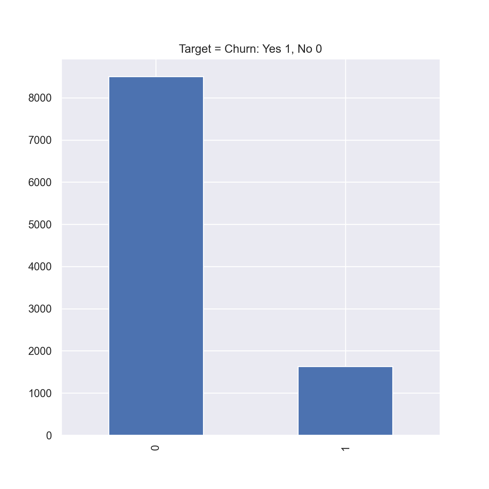
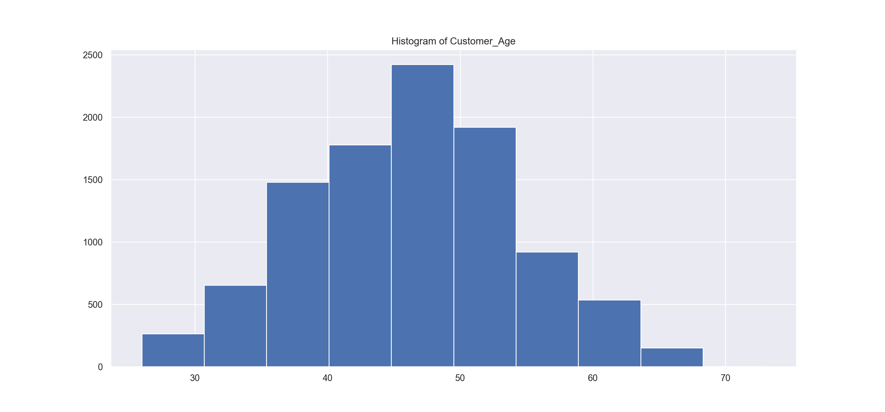
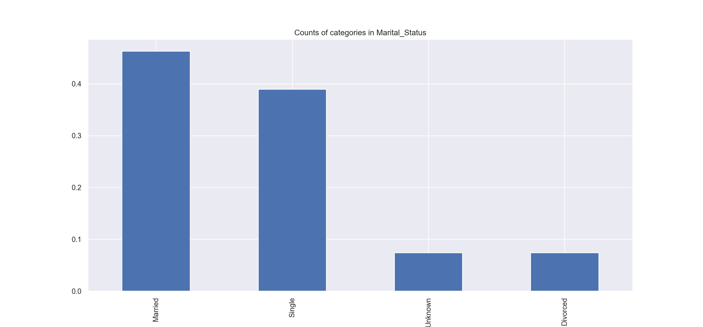
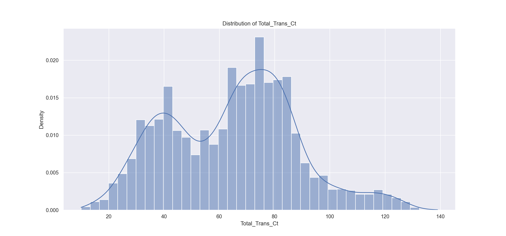
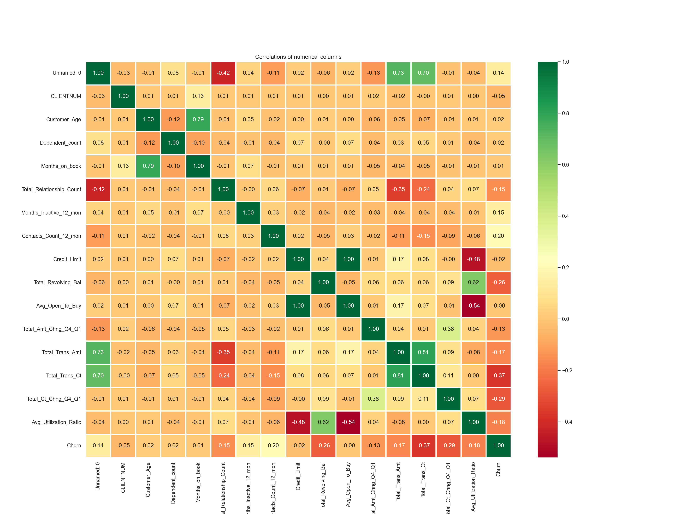
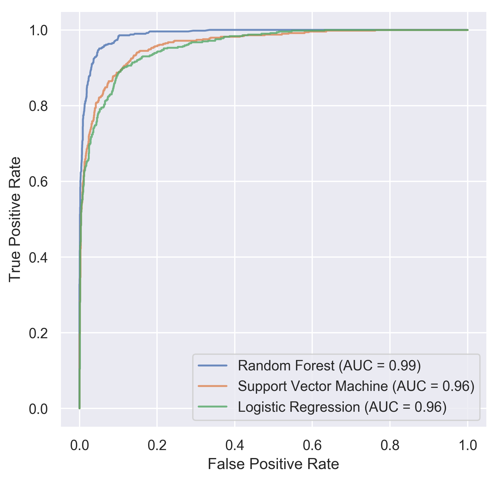
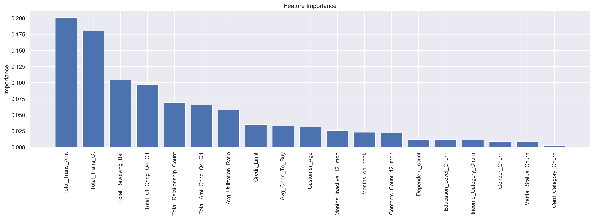

# Predicting Customer Churn

This mini-project analyzes and predicts **Customer Churn** using the [Credit Card Customers](https://www.kaggle.com/datasets/sakshigoyal7/credit-card-customers/code) dataset from [Kaggle](https://www.kaggle.com/). 

The code is in the repository [customer_churn_production](https://github.com/mxagar/customer_churn_production), specifically in the notebook [churn_notebook.ipynb](https://github.com/mxagar/customer_churn_production/blob/main/churn_notebook.ipynb).

The **main goal has been to find a model which best predicts customer churn**; model interpretation has been considered as a secondary objective.

In order to achieve that, the typical steps from the data science process have been followed:

- Dataset loading 
- Exploratory Data Analysis (EDA) and Data Cleaning
- Feature Engineering (FE)
- Model Training
- Generation of classification report plots (evaluation) as well as feature importance plots (interpretation).

## Dataset

The dataset consists in a data frame with 10127 rows (data points) and 22 columns (features for each data point).

The feature columns are the following:

- **Target** (renamed to `Churn = {0,1}`)
  - `Attrition_Flag`: `Existing Customer`, `Attrited Customer` (churn).
- **Dropped** (irrelevant information)
  - `Unnamed: 0`: copy of index (not present in the current Kaggle dataset).
  - `CLIENTNUM`: client ID.
- **Categorical** (encoded as churn ratios per category level)
  - `Gender`: `F`, `M`.
  - `Education_Level`: `High School`, `Graduate`, etc.
  - `Marital_Status`: `Married`, `Single`, `Divorced`, `Unknown`
  - `Income_Category`: annual income range: `< $40K`, `$40K - 60K`, `$60K - $80K`, `$80K-$120K`, `> 120k`
  - `Card_Category`: type of card/product: `Blue`, `Silver`, `Gold`, `Platinum`
- **Numerical** (transformed if the absolute skew is larger than 0.75)
  - `Customer_Age`: customer's age in years (quite normal).
  - `Dependent_count`: number of dependents (quite normal).
  - `Months_on_book`: period of relationship with bank (normal with peak).
  - `Total_Relationship_Count`: total number of products held by the customer (quite uniform).
  - `Months_Inactive_12_mon`: number of months inactive in the last 12 months (quite normal).
  - `Contacts_Count_12_mon`: number of Contacts in the last 12 months (quite normal).
  - `Credit_Limit`: credit limit on the credit card (exponential decaying).
  - `Total_Revolving_Bal`: total revolving balance on the credit card, i.e., amount that goes unpaid at the end of the billing cycle (non-normal; peaks at both tails).
  - `Avg_Open_To_Buy`: open to buy credit line (average of last 12 months) (exponential).
  - `Total_Amt_Chng_Q4_Q1`: change in transaction amount (Q4 over Q1) (quite normal, maybe large central peak).
  - `Total_Trans_Amt`: total transaction amount (last 12 months) (tri-modal).
  - `Total_Trans_Ct`: total transaction count (last 12 months) (bi-modal).
  - `Total_Ct_Chng_Q4_Q1`: change in transaction count (Q4 over Q1)  (quite normal, maybe large central peak).
  - `Avg_Utilization_Ratio`: average card utilization ratio (exponential decaying).

## Data Processing

First, some initial data inspection and **data cleaning** have been carried out:

- Duplicates have been checked (no duplicates found).
- Missing data have been checked (no missing data).
- Unnecessary columns have been identified and dropped.
- Target variable has been mapped to integer labels.

After that, the categorical and numerical columns have been automatically detected and the most interesting ones plotted to build an **Exploratory Data Analysis**:

- Distributions for numerical values
- Correlation heatmap for numerical values
- Bar plot for categorical values

In the following, some plots are provided:











Finally, **feature engineering** has been performed:

- All numerical features have been checked for their skewness; if the absolute value was larger than 0.75, they have been transformed with a Yeo-Johnson transformation (parameters learned and preserved).
- All categorical values have been encoded as churn ratios: for each category level in a categorical feature, the churn ratio oof the associated level has been computed and the category label replaced with that ratio. Another option would have been to introduce one-hot encoded variables.

Before feeding the data to the models, polynomial features and scaling have been added; however, that has been done inside a pipeline optimized with a grid search, in order to obtain the best polynomial degree for the goal: best predictive model.

## Data Modeling

After the data exploration, a train/test split has been performed with stratification (related to the target value) and three classifiers have been trained using a grid search with cross validation for finding the best set of hyperparameters:

- Logistic regression as a baseline. 24 variations have been optimized, modifying the regularization strength, the regularization penalty type and the polynomial degree.
- A Support Vector Machine model. 32 variations have been optimized, modifying the regularization strength, the kernel, the kernel factor gamma and the polynomial degree.
- A Random Forest model. 24 variations have been optimized, modifying the information gain criterion, the maximal depth of each tree, the maximal features of each tree and the number of estimators/trees.

The best model parameters have been chosen so that we get the best ROC AUC score on the training split with 5-fold cross validation; the final results are the following:

```
Logistic Regression:
- Best params: {'model__C': 10.0, 'model__penalty': 'l1', 'polynomial_features__degree': 2}
- Best ROC AUC (train split with CV): 0.9667898323843417

Support Vector Machine:
- Best params: {'model__C': 10.0, 'model__gamma': 'auto', 'model__kernel': 'rbf', 'polynomial_features__degree': 1}
- Best ROC AUC (train split with CV): 0.9679994822827043

Random Forest:
- Best params: {'model__criterion': 'entropy', 'model__max_depth': 100, 'model__max_features': 'auto', 'model__n_estimators': 500}
- Best ROC AUC (train split with CV): 0.9895865534929138
```

## Key Findings

The random forest model outperforms the other two models in both the train and test splits when the ROC AUC score is observed; in the following, the ROC curve of all models is shown:



The classification reports from Scikit-Learn reveal also better precision and recall metrics for the random forest model:

```
            --- logistic regression results ---

                        TEST results

              precision    recall  f1-score   support

           0       0.95      0.97      0.96      2551
           1       0.82      0.72      0.76       488

    accuracy                           0.93      3039
   macro avg       0.88      0.84      0.86      3039
weighted avg       0.93      0.93      0.93      3039

                        TRAIN results

              precision    recall  f1-score   support

           0       0.96      0.98      0.97      5949
           1       0.86      0.79      0.83      1139

    accuracy                           0.95      7088
   macro avg       0.91      0.88      0.90      7088
weighted avg       0.95      0.95      0.95      7088

              --- random forest results ---

                        TEST results

              precision    recall  f1-score   support

           0       0.96      0.99      0.97      2551
           1       0.92      0.81      0.86       488

    accuracy                           0.96      3039
   macro avg       0.94      0.90      0.92      3039
weighted avg       0.96      0.96      0.96      3039

                        TRAIN results

              precision    recall  f1-score   support

           0       1.00      1.00      1.00      5949
           1       1.00      1.00      1.00      1139

    accuracy                           1.00      7088
   macro avg       1.00      1.00      1.00      7088
weighted avg       1.00      1.00      1.00      7088

          --- support vector machines results ---

                        TEST results

              precision    recall  f1-score   support

           0       0.95      0.97      0.96      2551
           1       0.82      0.74      0.78       488

    accuracy                           0.93      3039
   macro avg       0.89      0.86      0.87      3039
weighted avg       0.93      0.93      0.93      3039

                        TRAIN results

              precision    recall  f1-score   support

           0       0.99      0.99      0.99      5949
           1       0.97      0.94      0.95      1139

    accuracy                           0.99      7088
   macro avg       0.98      0.97      0.97      7088
weighted avg       0.99      0.99      0.99      7088

```

The following diagram shows the distribution of importance values associated with each feature that determine whether a customer is going to churn:



## Conclusions and Outlook

In this mini-project, I researched the [Credit Card Customers](https://www.kaggle.com/datasets/sakshigoyal7/credit-card-customers/code) dataset from [Kaggle](https://www.kaggle.com/) with the goal of building a model able to predict **Customer Churn**.

The following steps have been carried out:

- Dataset loading
- Exploratory Data Analysis (EDA) and Data Cleaning
- Feature Engineering (FE)
- Model Training: Logistic Regression, Support Vector Machines, Random Forests.
- Generation of classification report plots (evaluation) as well as feature importance plots (interpretation).

The final best model is a random forest, and it achieves with the test split:

- Precision: 0.94
- Recall: 0.90
- ROC-AUC: 0.99

The classifier seems good enough to be deployed. However, future work involves exploring the following action items to find out whether they bring improvements:

- Add more features