# Supervised Machine Learning: Regression

These are my notes and the code of the [IBM Machine Learning Professional Certificate](https://www.coursera.org/professional-certificates/ibm-machine-learning) offered by IBM & Coursera.

The Specialization is divided in 6 courses, and each of them has its own folder with its guide & notebooks:

1. [Exploratory Data Analysis for Machine Learning](https://www.coursera.org/learn/ibm-exploratory-data-analysis-for-machine-learning?specialization=ibm-machine-learning)
2. [Supervised Machine Learning: Regression](https://www.coursera.org/learn/supervised-machine-learning-regression?specialization=ibm-machine-learning)
3. [Supervised Machine Learning: Classification](https://www.coursera.org/learn/supervised-machine-learning-classification?specialization=ibm-machine-learning)
4. [Unsupervised Machine Learning](https://www.coursera.org/learn/ibm-unsupervised-machine-learning?specialization=ibm-machine-learning)
5. [Deep Learning and Reinforcement Learning](https://www.coursera.org/learn/deep-learning-reinforcement-learning?specialization=ibm-machine-learning)
6. [Specialized Models: Time Series and Survival Analysis](https://www.coursera.org/learn/time-series-survival-analysis?specialization=ibm-machine-learning)

This file focuses on the **fourth course: Unsupervised Machine Learning**

Mikel Sagardia, 2022.  
No guarantees

## Overview of Contents

- [Supervised Machine Learning: Regression](#supervised-machine-learning-regression)
  - [Overview of Contents](#overview-of-contents)
  - [1. Introduction to Unsupervised Learning](#1-introduction-to-unsupervised-learning)
    - [1.1 Curse of Dimensionality](#11-curse-of-dimensionality)
    - [1.2 Examples](#12-examples)
    - [1.3 Common Use Cases](#13-common-use-cases)
  - [2. K-Means Clustering](#2-k-means-clustering)
    - [2.1 Smart Initialization](#21-smart-initialization)
    - [2.2 Metrics for Choosing the Right Number of Clusters `K` and the Correct Clustering](#22-metrics-for-choosing-the-right-number-of-clusters-k-and-the-correct-clustering)
    - [2.3 Python Implementation](#23-python-implementation)
    - [2.4 Python Lab: K-Means](#24-python-lab-k-means)
  - [3. Computational Difficulties of Clustering Algorithms: Distance Measures](#3-computational-difficulties-of-clustering-algorithms-distance-measures)
    - [3.1 Cosine and Jaccard Distance](#31-cosine-and-jaccard-distance)
    - [3.2 Python Demo: Curse of Dimensionality](#32-python-demo-curse-of-dimensionality)
    - [3.3 Python Notebook: Distance Metrics](#33-python-notebook-distance-metrics)
  - [4. Common Clustering Algorithms](#4-common-clustering-algorithms)
    - [4.1 Hierarchical Agglomerative Clustering](#41-hierarchical-agglomerative-clustering)
    - [4.2 Hierarchical Linkage Types](#42-hierarchical-linkage-types)
    - [4.3 Python Syntax for Hierarchical Agglomerative Clustering](#43-python-syntax-for-hierarchical-agglomerative-clustering)
    - [4.4 DBSCAN: Density-Based Spatial Clustering of Applications with Noise](#44-dbscan-density-based-spatial-clustering-of-applications-with-noise)
      - [Algorithm](#algorithm)

## 1. Introduction to Unsupervised Learning

In supervised learning data points have a known outcome: the label. In contrast, in **unsupervised learning**, we have no known outcome and we try to learn about the structure of the dataset. There two major applications:

1. Clustering: identify unknown structure. Examples:
   - K-means
   - Hierarchical Agglomerative Clustering
   - DBSCAN
   - Mean Shift
2. Dimensionality reduction: use structural characteristics to simplify the dataset. Examples:
   - Principal Component Analysis (PCA)
   - Non-negative Matrix Factorization

### 1.1 Curse of Dimensionality

Why would we want to decrease the dimensionality?

In practice, high dimensions have many drawbacks and we talk about the *curse of dimensionality*:

- With more features, the risk of having correlations between them increases, and that correlation might be only in the training set.
- More features might introduce noise we need to learn to filter, otherwise we overfit
- Imagine KNN or any other distance based algorithm: with more dimensions, the number of data-points we need to cover the complete feature space increases exponentially; for a data point to get its proper nearest neighbors, we need many training points.
- We need more computational power to train on datasets with high dimensionality.
- Higher incidence of outliers.

In the image, a variable of 1D has 10 categories; if we add more variables like that, the number of data-points to cover the feature spaces increases exponentially.

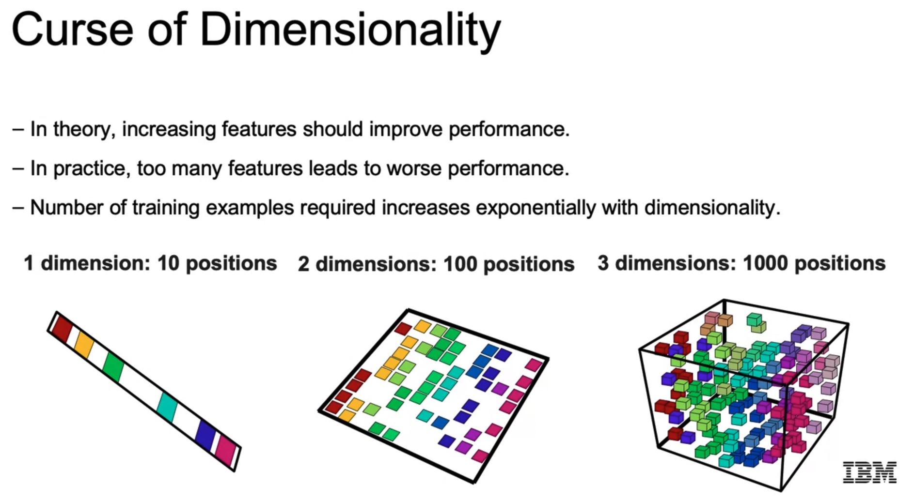

We can decrease the dimensionality with:

- Feature selection.
- Dimensionality reduction, e.g., with PCA.

### 1.2 Examples

Example 1: Customer Churn, which has originally 54 features:

- We can cluster similar customers.
- We can apply dimensionality reduction.

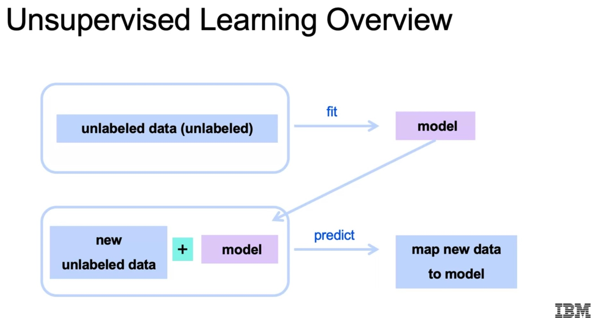

Example 2: News articles grouping by topics.

### 1.3 Common Use Cases

Clustering:

- Classification: spam filter
- Anomaly detection: fraudulent transactions
- Customer segmentation
- **Improvement of supervised models: find clusters and apply supervised models for each cluster! That doesn't work always, but it's often worth trying.**

Dimension Reduction:

- Compress high resolution images; with compressed images the performance of object detection algorithms is accelerated
- etc.

## 2. K-Means Clustering

In K-Means, we set the number of `K` clusters we'd like to segment our dataset. Then the algorithm works as follows:

1. Create `K` random centroids in feature space.
2. For each data point, compute the distance to each cluster centroid `C` and assign the closest one; we have (re-)clustered all the data points.
3. Recompute the cluster centroids as the mean of all the data points in each cluster.
4. Repeat 2-3 until convergence (cluster centroids don't move anymore) or maximum number of iterations.

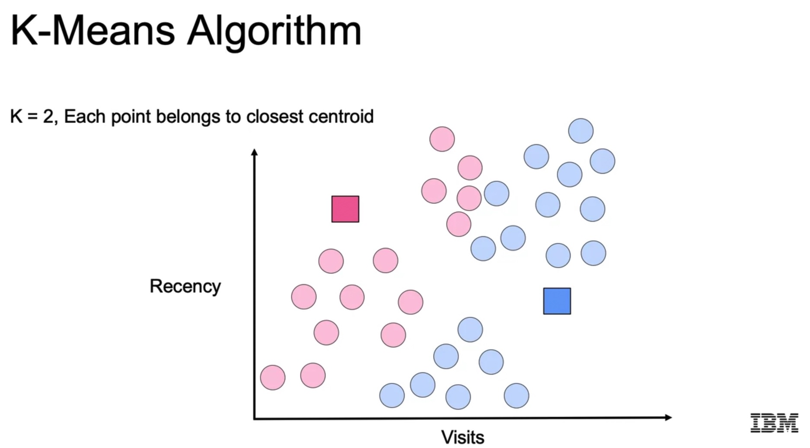

With K-means there can be multiple clustering solutions that converge successfully.

### 2.1 Smart Initialization

The selection of the initial random centroids `C` is key to prevent local optima and improve the convergence speed:

- Naive: We can take random data points.
- Better: **K-Means ++** (default in `sklearn`): We take random points far away from each other, as follows:
  - We set the first random centroid. 
  - Then, compute weights for all points such that `w = d^2 / sum(d^2)`, i.e., the larger the distance from point to centroid the larger the weight.
  - Then, we sum the weighted data points and we get the second centroid. 
  - If we have more centroids, we take the minimum distance to any centroid as `d`.

### 2.2 Metrics for Choosing the Right Number of Clusters `K` and the Correct Clustering

Sometimes the number of clusters `K` is given by the business problem.

But in other cases, we want to discover it! We can evaluate the clustering performance with the **inertia** metric. The inertia of cluster `k` with `k = 1 ... K`:

`inertia_k = sum(i = 1:n; (x_i - C_k)^2)`

with 

- centroids `C_k`
- `n` data points `x_i` in the cluster

Smaller values of the inertia correspond to tighter clusters, but the metric is sensitive to the number of points in the clusters, `n`.

Another metric is the **distortion**, the average of the **inertia**:

`distortion_k = (1/n) * inertia_k = (1/n) sum(i = 1:n; (x_i - C_k)^2)`

The distortion doesn't increase with the number of points.

Which one should we take?

- If we are concerned with the similarity of the points only, take **inertia**.
- If we want clusters with similar numbers of points, take **distortion**.

The general approach would be:

1. Initialize the random centroids with a given `K`
2. Fit the model and compute the selected metric: inertia / distortion.
3. Repeat 1-2 several times.
4. Change `K` and repeat 1-3.

At the end, we take the `K`-clustering combination with the lowest selected metric However, the reality is that as `K` increases, the metrics will decrease; we follow the *elbow method* to choose the smallest `K` possible that yields a low metric:

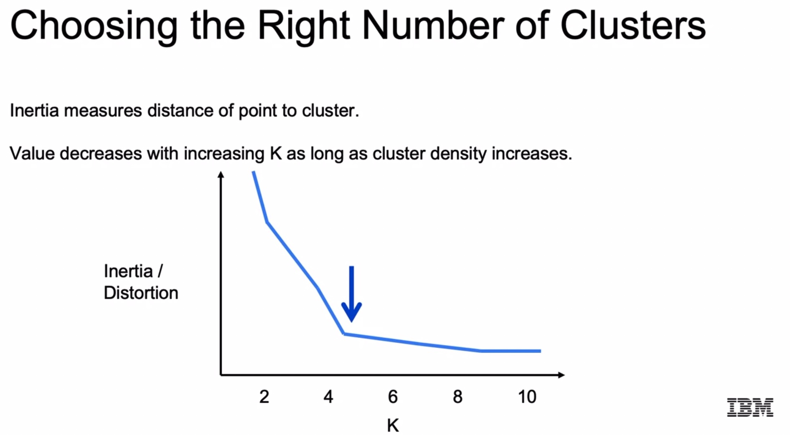

Before the *elbow* or inflection point the inertia/distortion decrease dramatically, but after it they plateau.

Visual inspection of the labeled data points is always not possible, because of high dimensions; thus, we use the elbow method.

In the case the inertia/distortion curve is not clear for the elbow method, we can use the [Silhouette Score](https://scikit-learn.org/stable/modules/generated/sklearn.metrics.silhouette_score.html#sklearn.metrics.silhouette_score).

### 2.3 Python Implementation

```python
# Alternative with mini-batches: MiniBatchKMeans
from sklearn.cluster import KMeans

kmeans = KMeans(n_clusters=3,
                init='k-means++')

kmeans.fit(X1)
y_pred = kmeans.predict(X2)

# Inertia
kmeans.inertia_

# Cluster centers
km.cluster_centers_
# Labels
km.labels_

# Elbow method
inertia = []
for k in range(10):
    kmeans = KMeans(n_clusters=k,
                    init='k-means++')
    kmeans.fit(X1)
    inertia.append(kmeans.inertia_)
```

### 2.4 Python Lab: K-Means

In this notebook,

`./lab/04a_LAB_KMeansClustering.ipynb`,

three applications are shown:

1. Clustering of a synthetic dataset with K-means.
2. Optimum clustering of a synthetic dataset with the elbow method using K-means.
3. Compression of an image with K-means.

The most important lines are summarized in the following:

```python

# Setup and imports
import numpy as np
import pandas as pd
import seaborn as sns
import matplotlib.pyplot as plt
from sklearn.preprocessing import scale
from sklearn.cluster import KMeans
from sklearn.datasets import make_blobs
from sklearn.utils import shuffle

### -- 1. Clustering of a synthetic dataset with K-means

# Helper function that allows us to display data
# in 2 dimensions an highlights the clusters
def display_cluster(X,km=[],num_clusters=0):
    color = 'brgcmyk'
    alpha = 0.5
    s = 20
    if num_clusters == 0:
        plt.scatter(X[:,0],X[:,1], c=color[0], alpha=alpha, s=s)
    else:
        for i in range(num_clusters):
            plt.scatter(X[km.labels_==i,0], X[km.labels_==i,1], c=color[i], alpha=alpha, s=s)
            plt.scatter(km.cluster_centers_[i][0], km.cluster_centers_[i][1], c=color[i], marker = 'x', s = 100)

# We define our dataset as a ring of points
# Infinite clusterings are possible due to rotation symmetry
angle = np.linspace(0,2*np.pi,20, endpoint = False)
X = np.append([np.cos(angle)],[np.sin(angle)],0).transpose()
# No model yet
display_cluster(X)

num_clusters = 2
# random_state controls the randomness of the initial state
# we can also modify init; look at the docu
km = KMeans(n_clusters=num_clusters,random_state=10,n_init=1) # n_init, number of times the K-mean algorithm will run
km.fit(X)
# Now we have a model
display_cluster(X,km,num_clusters)

# We change the random state
km = KMeans(n_clusters=num_clusters,random_state=20,n_init=1)
km.fit(X)
display_cluster(X,km,num_clusters)

### -- 2. Optimum clustering of a synthetic dataset with the elbow method using K-means

n_samples = 1000
n_bins = 4 
centers = [(-3, -3), (0, 0), (3, 3), (6, 6)]
# make_blobs takes centers and std and creates random points
X, y = make_blobs(n_samples=n_samples, n_features=2, cluster_std=1.0,
                  centers=centers, shuffle=False, random_state=42)
# We display without model: all points in a color.
display_cluster(X)

# We run it with the original number of clusters
num_clusters = 4
km = KMeans(n_clusters=num_clusters)
km.fit(X)
display_cluster(X,km,num_clusters)

# Get optimum number of clusters with the elbow method
# Note that in our case the optimum would be 4
# but the inertia ALWAYS decreases with K!
# Sometimes it is not clear where the elbow is,
# we should take it where the inertia considerably flattens.
inertia = []
list_num_clusters = list(range(1,11))
for num_clusters in list_num_clusters:
    km = KMeans(n_clusters=num_clusters)
    km.fit(X)
    inertia.append(km.inertia_)
    
plt.plot(list_num_clusters,inertia)
plt.scatter(list_num_clusters,inertia)
plt.xlabel('Number of Clusters')
plt.ylabel('Inertia');

### -- 3. Compression of an image with K-means.

img = plt.imread('peppers.jpg', format='jpeg')
plt.imshow(img)
plt.axis('off')

# Each pixel with its [R,G,B] values becomes a row
# -1 = img.shape[0]*img.shape[1], because we leave the 3 channels
# as the second dimension
img_flat = img.reshape(-1, 3)

img.shape # (480, 640, 3)
img_flat.shape # (307200, 3)

# Note that in reality we have 256^3 possible colors = 16,777,216
# but not all of them are used.
# All the unique/used colors
len(np.unique(img_flat,axis=0)) # 98452

# K=8 clusters: we allow 8 colors
kmeans = KMeans(n_clusters=8, random_state=0).fit(img_flat)

# Loop for each cluster center
# Assign to all pixels with the cluster label
# the color of the cluster == the cluster centroid
img_flat2 = img_flat.copy()
for i in np.unique(kmeans.labels_):
    img_flat2[kmeans.labels_==i,:] = kmeans.cluster_centers_[i]

img2 = img_flat2.reshape(img.shape)
plt.imshow(img2)
plt.axis('off');

# Function which compresses an image to k colors
def image_cluster(img, k):
    img_flat = img.reshape(img.shape[0]*img.shape[1],3)
    kmeans = KMeans(n_clusters=k, random_state=0).fit(img_flat)
    img_flat2 = img_flat.copy()

    # loops for each cluster center
    for i in np.unique(kmeans.labels_):
        img_flat2[kmeans.labels_==i,:] = kmeans.cluster_centers_[i]
        
    img2 = img_flat2.reshape(img.shape)
    return img2, kmeans.inertia_

# Call the function for k between 2 and 20,
# and draw an inertia curve
k_vals = list(range(2,21,2))
img_list = []
inertia = []
for k in k_vals:
    img2, ine = image_cluster(img,k)
    img_list.append(img2)
    inertia.append(ine)

# Plot to find optimal number of clusters
plt.plot(k_vals,inertia)
plt.scatter(k_vals,inertia)
plt.xlabel('k')
plt.ylabel('Inertia');
```

## 3. Computational Difficulties of Clustering Algorithms: Distance Measures

Clustering methods rely very heavily on distance measures. There are several distance metrics and each one has pros & cons.

The typical distance measure is the **Euclidean Distance** or **L2**:

`d(x,y) = srqt(sum((x-y)^2))`

Another distance measure: **Manhattan, L1**: `d(x,y) = sum(abs(x-y))`

- It will be larger than L2.
- It is often used in cases with very high dimensionality, because distance values between point pairs become more unique than L2.

### 3.1 Cosine and Jaccard Distance

**Cosine Distance** takes to data point vectors and computes the angle between both in the feature space:

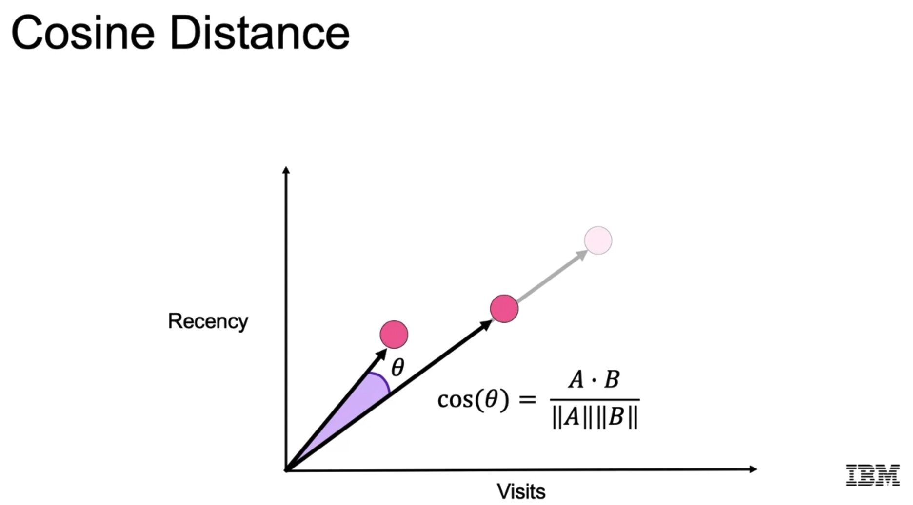

The output is `phi = arccos(cos(phi))`, with these properties:

- `cos = 0`: 90 degrees between the vectors
- `cos = 1`: 0 degrees between the vectors, i.e., the are aligned
- `cos = -1`: opposite direction
- The scaling from the origin is not relevant anymore: the end points can be very far away from each other but have the same cosine close to 1.
- We are more interested between the **relationships between the features** than the distance between the data points in feature space! **How different are the relationships of features between two data points?** `cos = 1` very similar, `cos = 0` orthogonal, `cos = -1` opposite.

However, we should **always check the formula/definition of the cosine distance in the used library**; for instance, in `scipy` the cosine distance is defined as

`d = 1 - cos`, thus it belongs to the range `[0,2]`, with

- $0$: "in the same direction"
- $1$: "perpendicular"
- $2$: "in the opposite direction."

We often distinguish between **cosine similarity** and **cosine distance**; for instance, `sklearn` (and in other frameworks, too):

`cosine_distance = 1 - cosine_similarity`

When should we use the cosine distance?

- Euclidean distance is useful for coordinate-based measurements, when the location of the end-point is important.
- Cosine is better for data that can contain many similar vectors, e.g., text: one text can be the summary of another so the vector end-points are relatively far from each other, but they are aligned! In other words, the location/occurrence/coordinate of the end-point is not important.
- Euclidean distance is more sensitive to the curse of dimensionality.

**Jaccard Distance** is another distance measure used also with text or, in general, with sets of sequences: it measures the intersection over union of unique words/items (i.e., sets) that appear in two texts/sequences:

)

Thus, it measures the similarity of two texts/sequences based on their words/items:

- $1$ means the two sets have nothing in common.
- $0$ means the two sets are identical.

Note: `sklearn.metrics.jaccard_score` calculates the **Jaccard similarity score**, which is **1 - Jaccard distance**.

### 3.2 Python Demo: Curse of Dimensionality

In this notebook,

`./lab/04b_DEMO_Distance_Dimensionality.ipynb`,

the instructor shows why in higher dimensions the data points start being more far ways.

The analogy with a sphere is used:

- If we circumscribe a circumference of radius R into a square os side R, 21% of the points are outside the circle. Let's call those outside points *distant* points.
- If we have a sphere and a cube, the distant points are 48%. Thus, the probability of having points that are far away from each other increases.
- Then, a simulation is done and we see that the percentage dramatically increases with higher dimensions. In fact, with 14 dimensions, less than `2.9e-03 %` of the points are inside the hypersphere. The decrease seems exponential (is it exponential?).

Some other experiments are done with synthetic datasets created with `make_classification`, but the notebook code is not that interesting in terms of practical usage.

### 3.3 Python Notebook: Distance Metrics

In this notebook,

`./lab/DistanceMetrics.ipynb`,

different distance measures are analyzed.

First two auxiliary functions are defined:

1. Average distance: given 2 X & Y datasets with rows of feature vectors, the distances between each x in X to each y in Y are computed, and then, the average.

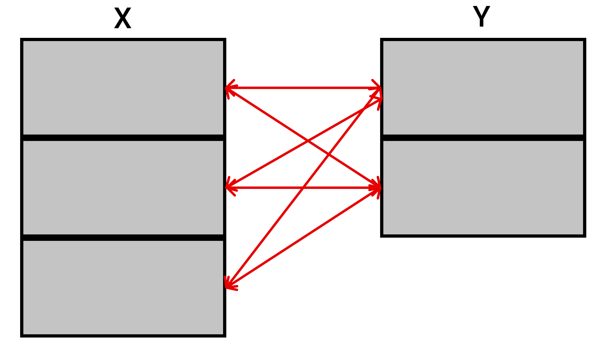

2. Pairwise distance: given 2 X & Y datasets with rows of feature vectors, the distance between paired rows is computed, and then, the average.

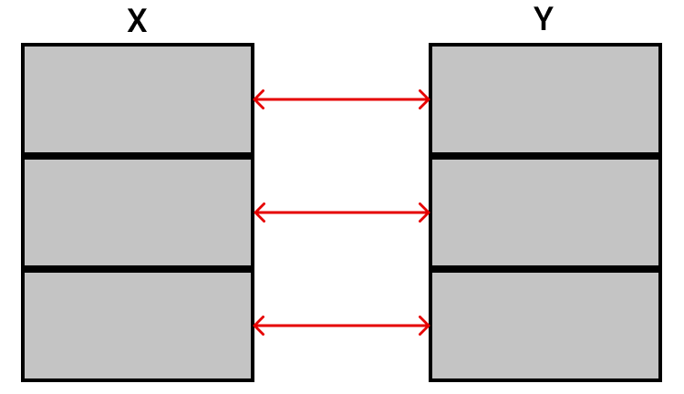

Then, functions and datasets are passed to those functions to see the effect of using one or another distance measure.

The notebook is not that interesting; the most relevant section to me is an example in which two groups or strata with categorical features are compared using the Jaccard distance: In deed, if we one-hot encode categorical columns, we can compute distances between datasets/samples.

```python
# Scipy API of distance functions
# cityblock = Manhattan
from scipy.spatial.distance import euclidean, cityblock, cosine

# Scikit-Learn API of distance functions
from sklearn.metrics import jaccard_score
from sklearn.metrics.pairwise import cosine_distances, paired_euclidean_distances, paired_manhattan_distances, cosine_similarity

# This function will allow us to find the average distance between two sets of data
def avg_distance(X1, X2, distance_func):
    from sklearn.metrics import jaccard_score
    #print(distance_func)
    res = 0
    for x1 in X1:
        for x2 in X2:
            if distance_func == jaccard_score: # the jaccard_score function only returns jaccard_similarity
                res += 1 - distance_func(x1, x2)
            else:
                res += distance_func(x1, x2)
    return res / (len(X1) * len(X2))

# This function will allow us to find the average pairwise distance
def avg_pairwise_distance(X1, X2, distance_func):
    return sum(map(distance_func, X1, X2)) / min(len(X1), len(X2))

# The function avg_pairwise_distance(X1, X2, distance_func)
# is equivalent to
paired_euclidean_distances(X1, X2).mean()

####

# Jaccard distance for categorical datasets
df = pd.read_csv('breast-cancer.csv')
df.head()
df.columns # All categorical, even age
# 'Class', 'age', 'menopause', 'tumor-size', 'inv-nodes',
# 'node-caps', 'deg-malig', 'breast', 'breast-quad', 'irradiat'

print(sorted(df['age'].unique()))
# ['20-29', '30-39', '40-49', '50-59', '60-69', '70-79']

# One-hot encode all columns except age
from sklearn.preprocessing import OneHotEncoder
OH = OneHotEncoder()
X = OH.fit_transform(df.loc[:, df.columns != 'age']).toarray()

# Take two strata: two age groups
X30to39 = X[df[df.age == '30-39'].index]
X60to69 = X[df[df.age == '60-69'].index]
X30to39.shape, X60to69.shape
# ((36, 39), (57, 39))

avg_distance(X30to39, X30to39, jaccard_score)
# 0.6435631883548536

avg_distance(X60to69, X60to69, jaccard_score)
# 0.6182114564956281

avg_distance(X30to39, X60to69, jaccard_score)
# 0.7324778699972173
```

## 4. Common Clustering Algorithms

### 4.1 Hierarchical Agglomerative Clustering

In hierarchical agglomerative clustering we iteratively find the two closest items in our dataset and cluster them together; an item can be

- a data point
- or a cluster.

In order for that to work, we need to define:

1. A good distance metric.
2. A type of linkage for computing distances between point-cluster or cluster-cluster; e.g.:
   - distance from point to average point in cluster,
   - distance between closest points between clusters,
   - etc.

With those defined, the algorithm simply finds the next two closest items in the dataset and it clusters them together. In the beginning, we'll have 2 points clustered together:

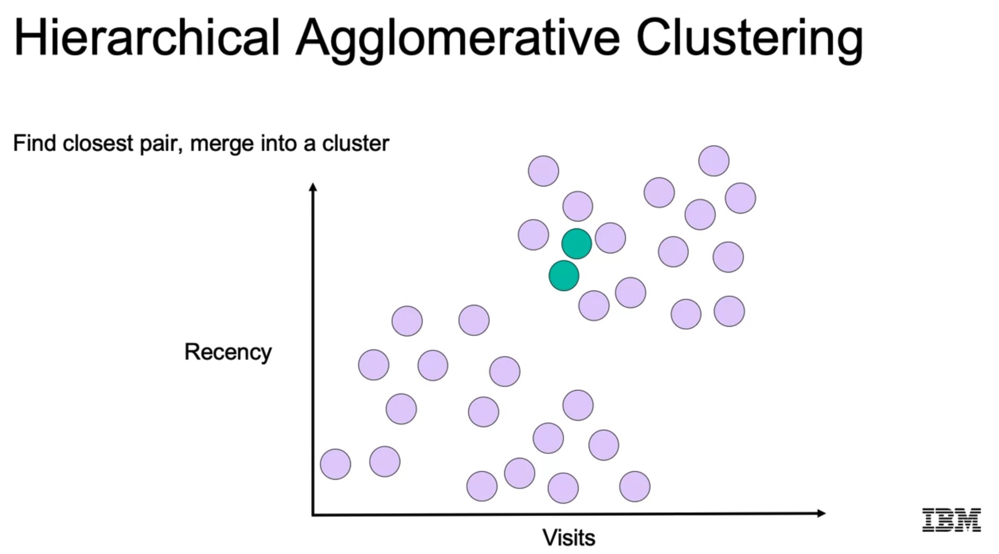

As we continue, new 2-point clusters will emerge, but at some point, clusters will start merging, since there will be no point pair closer than the actually merged point-cluster or cluster-cluster pair:

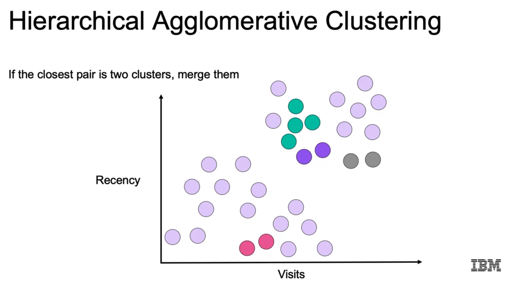

At some point, we have only clusters and they start merging. Thus, We need a stop criterium, otherwise the algorithm makes a big unique cluster! That criterium is a distance threshold: when all clusters are further than that threshold from each other, we stop.

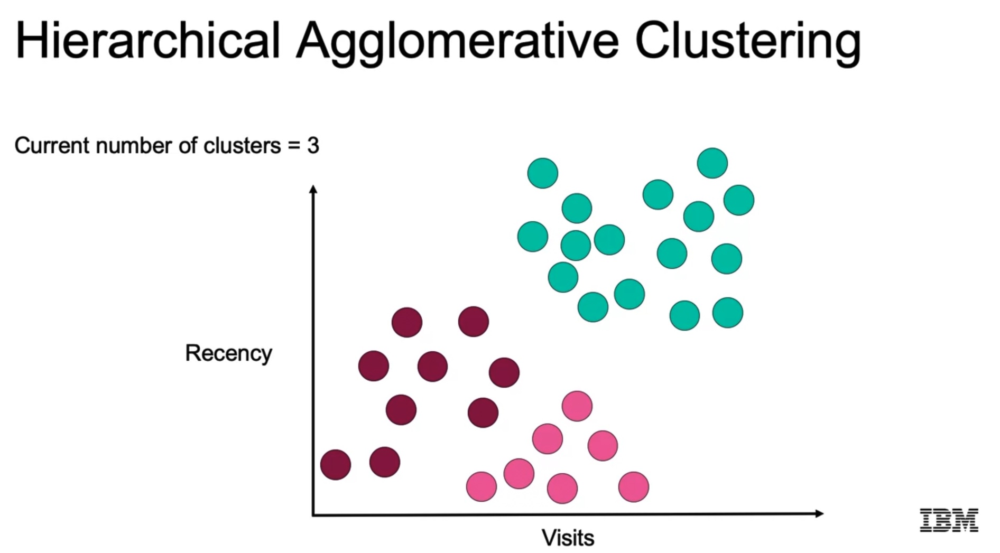

### 4.2 Hierarchical Linkage Types

We can use at least 4 linkage types:

- Single: minimum pairwise distance between clusters, i.e., distance between closest points in different clusters.
  - Pro: we can achieve clear boundaries.
  - Con: susceptible to noise.
- Complete: maximum pairwise distance between clusters, i.e., compute the furthest point pairs in different clusters and select the minimum pair.
  - Pro: less susceptible to noise.
  - Con: clusters are taken apart.
- Average: distances between cluster centroids are used.
  - Pros & Cons: a mixture of the single & complete approach.
- Ward: the inertia of each cluster is computed and we merged based on best inertia, i.e., the pair which minimizes the inertia is merged; this is similar to K-means.
  - Pros & Cons: a mixture of the single & complete approach.

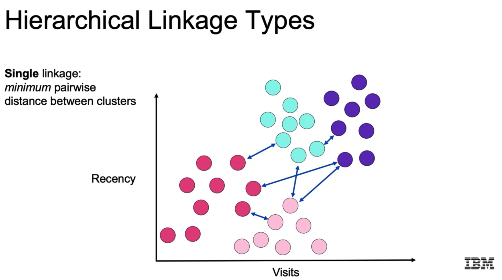

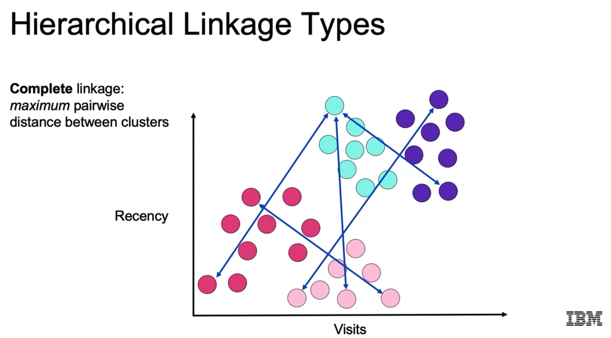

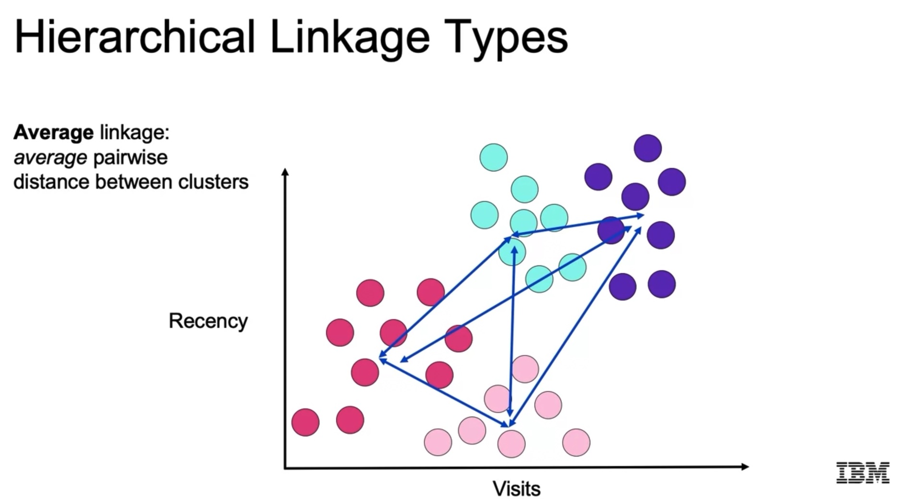

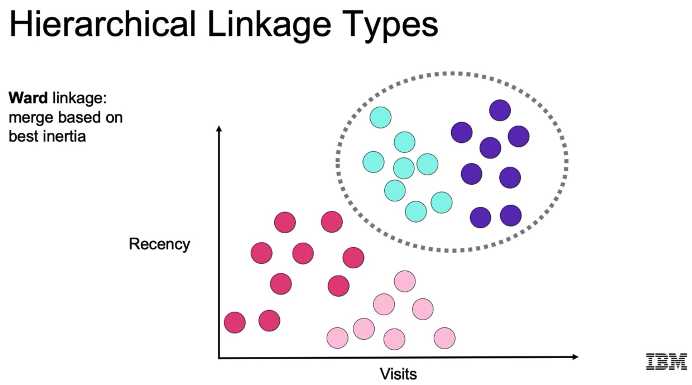

### 4.3 Python Syntax for Hierarchical Agglomerative Clustering

```python
from sklearn.cluster import AgglomerativeClustering

# We can decide the number of clusters or a distance threshold as criterium:
# distance_threshold, n_clusters
agg = AgglomerativeClustering(  n_clusters=3, 
                                affinity='euclidean', # distance metric
                                linkage='ward')

agg.fit(X1)
y_pred = agg.predict(X2)
```

### 4.4 DBSCAN: Density-Based Spatial Clustering of Applications with Noise

A key feature of this algorithm is that it truly finds clusters of data, i.e., we do not partition the data:

- We can have points that don't belong to any cluster.
- It finds core points in high density regions and expands clusters from them, adding points that are at least at a given distance.
- The algorithm ends when all points have been classified in a cluster or as noise.

Inputs for DBSCAN:

- Distance metric.
- `epsilon`: radius of local neighborhood
- `n_clu`: density threshold (for a fixed `epsilon`); core points are those which have more than `n_clu` neighbors in their local `epsilon`-neighborhood.

There are 3 possible labels for any point in DBSCAN:

- Core: those which have more than `n_clu` neighbors in their local `epsilon`-neighborhood.
- Density-reachable: an `epsilon`-neighbor of a core point that has fewer than `n_clu` neighbors itself. It's still part of the cluster, because it's in the `epsilon`-neighborhood.
- Noise: point that is not part of any cluster, because it has no core points in its `epsilon`-neighborhood.

Thus, clusters are connected core and density-reachable points.

#### Algorithm

1. We take a random point that has not been labelled and insert it to a queue (e.g., FIFO)
2. We pop a/the point from the queues and draw a circle or radius `epsilon` around it.
3. If there are at least `n_clu` points inside, it's a core point, else a density-reachable.
4. We insert all the points inside into the queue.
5. We repeat 2-4 until the queues is empty. Then, we go to step 1, and repeat. The algorithm ends when all points have been labelled.

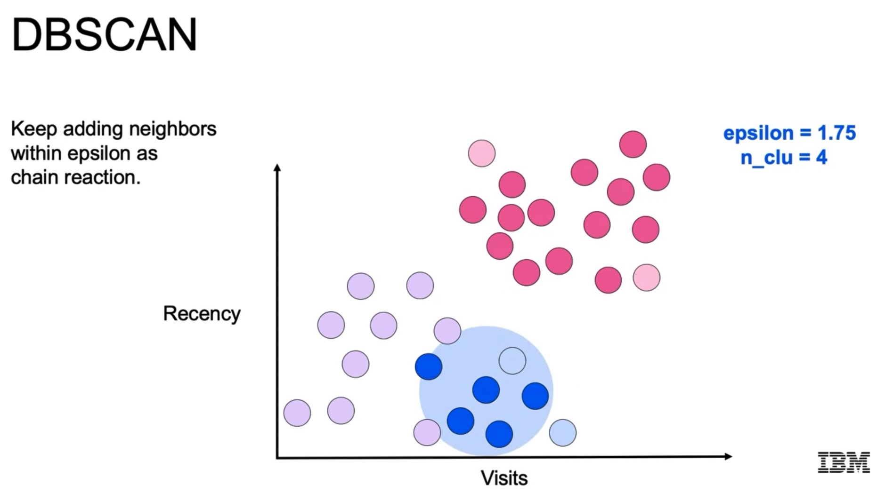

