# Supervised Machine Learning: Regression

These are my notes and the code of the [IBM Machine Learning Professional Certificate](https://www.coursera.org/professional-certificates/ibm-machine-learning) offered by IBM & Coursera.

The Specialization is divided in 6 courses, and each of them has its own folder with its guide & notebooks:

1. [Exploratory Data Analysis for Machine Learning](https://www.coursera.org/learn/ibm-exploratory-data-analysis-for-machine-learning?specialization=ibm-machine-learning)
2. [Supervised Machine Learning: Regression](https://www.coursera.org/learn/supervised-machine-learning-regression?specialization=ibm-machine-learning)
3. [Supervised Machine Learning: Classification](https://www.coursera.org/learn/supervised-machine-learning-classification?specialization=ibm-machine-learning)
4. [Unsupervised Machine Learning](https://www.coursera.org/learn/ibm-unsupervised-machine-learning?specialization=ibm-machine-learning)
5. [Deep Learning and Reinforcement Learning](https://www.coursera.org/learn/deep-learning-reinforcement-learning?specialization=ibm-machine-learning)
6. [Machine Learning Capstone: Deployment of a Recommender System](https://www.coursera.org/learn/machine-learning-capstone?specialization=ibm-machine-learning)

This file focuses on the **fourth course: Unsupervised Machine Learning**.

Mikel Sagardia, 2022.  
No guarantees

## Overview of Contents

- [Supervised Machine Learning: Regression](#supervised-machine-learning-regression)
  - [Overview of Contents](#overview-of-contents)
  - [1. Introduction to Unsupervised Learning](#1-introduction-to-unsupervised-learning)
    - [1.1 Curse of Dimensionality](#11-curse-of-dimensionality)
    - [1.2 Examples](#12-examples)
    - [1.3 Common Use Cases](#13-common-use-cases)
  - [2. K-Means Clustering](#2-k-means-clustering)
    - [2.1 Smart Initialization](#21-smart-initialization)
    - [2.2 Metrics for Choosing the Right Number of Clusters `K` and the Correct Clustering](#22-metrics-for-choosing-the-right-number-of-clusters-k-and-the-correct-clustering)
    - [2.3 Python Implementation](#23-python-implementation)
    - [2.4 Python Lab: K-Means](#24-python-lab-k-means)
    - [2.5 Python Notebook: K-Means](#25-python-notebook-k-means)
    - [2.6 Gaussian Mixture Models (GMM)](#26-gaussian-mixture-models-gmm)
      - [Applications of the Gaussian Mixture Models](#applications-of-the-gaussian-mixture-models)
      - [Python Syntax](#python-syntax)
    - [2.7 Python Lab: Gaussian Mixture Models](#27-python-lab-gaussian-mixture-models)
  - [3. Computational Difficulties of Clustering Algorithms: Distance Measures](#3-computational-difficulties-of-clustering-algorithms-distance-measures)
    - [3.1 Cosine and Jaccard Distance](#31-cosine-and-jaccard-distance)
    - [3.2 Python Demo: Curse of Dimensionality](#32-python-demo-curse-of-dimensionality)
    - [3.3 Python Notebook: Distance Metrics](#33-python-notebook-distance-metrics)
  - [4. Common Clustering Algorithms](#4-common-clustering-algorithms)
    - [4.1 Hierarchical Agglomerative Clustering](#41-hierarchical-agglomerative-clustering)
    - [4.2 Hierarchical Linkage Types](#42-hierarchical-linkage-types)
    - [4.3 Python Syntax for Hierarchical Agglomerative Clustering](#43-python-syntax-for-hierarchical-agglomerative-clustering)
    - [4.4 DBSCAN: Density-Based Spatial Clustering of Applications with Noise](#44-dbscan-density-based-spatial-clustering-of-applications-with-noise)
      - [Algorithm](#algorithm)
      - [Discussion](#discussion)
      - [Python Syntax](#python-syntax-1)
    - [4.5 Python Lab: DBSCAN](#45-python-lab-dbscan)
    - [4.5 Mean Shift](#45-mean-shift)
      - [Discussion](#discussion-1)
      - [Python Syntax](#python-syntax-2)
    - [4.6 Python Lab: Mean Shift](#46-python-lab-mean-shift)
  - [5. Comparing Clustering Algorithms](#5-comparing-clustering-algorithms)
    - [5.1 Comparison Summary](#51-comparison-summary)
    - [5.2 Python Lab: Clustering Algorithms](#52-python-lab-clustering-algorithms)
  - [6. Dimensionality Reduction](#6-dimensionality-reduction)
    - [6.1 Principal Component Analysis (PCA)](#61-principal-component-analysis-pca)
      - [Python Syntax](#python-syntax-3)
    - [6.2 Python Lab: Matrix Review](#62-python-lab-matrix-review)
    - [6.3 Python Lab: Dimensionality Reduction with PCA](#63-python-lab-dimensionality-reduction-with-pca)
    - [6.4 Python Lab: PCA Examples](#64-python-lab-pca-examples)
    - [6.5 Python Lab: SVD for Background Detection](#65-python-lab-svd-for-background-detection)
    - [6.6 Dimensionality Reduction for Image Compression](#66-dimensionality-reduction-for-image-compression)
  - [7. Kernel Principal Component Analysis and Multidimensional Scaling](#7-kernel-principal-component-analysis-and-multidimensional-scaling)
    - [Kernel PCA](#kernel-pca)
    - [Multidimensional Scaling](#multidimensional-scaling)
    - [Python Syntax](#python-syntax-4)
    - [7.1 Python Lab: Kernel PCA](#71-python-lab-kernel-pca)
    - [7.2 Python Lab: Kernel PCA](#72-python-lab-kernel-pca)
    - [7.3 Python Lab: Multi-Dimensional Scaling](#73-python-lab-multi-dimensional-scaling)
  - [8. Non-Negative Matrix Factorization](#8-non-negative-matrix-factorization)
    - [8.1 Python Syntax](#81-python-syntax)
    - [8.2 Summary of Dimensionality Reduction Approaches](#82-summary-of-dimensionality-reduction-approaches)
    - [8.3 NLP Feature Extraction](#83-nlp-feature-extraction)
      - [Example](#example)
    - [8.4 Python Lab: NNMF for Text Topic Discovery](#84-python-lab-nnmf-for-text-topic-discovery)
    - [8.5 Python Lab: NLP Feature Extraction](#85-python-lab-nlp-feature-extraction)
    - [8.6 Python Lab: NMF for Image Decomposition](#86-python-lab-nmf-for-image-decomposition)
  - [9. Project](#9-project)
    - [Requirements](#requirements)
    - [Repository](#repository)

## 1. Introduction to Unsupervised Learning

In supervised learning data points have a known outcome: the label. In contrast, in **unsupervised learning**, we have no known outcome and we try to learn about the structure of the dataset. There two major applications:

1. Clustering: identify unknown structure. Examples:
   - K-means
   - Hierarchical Agglomerative Clustering
   - DBSCAN
   - Mean Shift
2. Dimensionality reduction: use structural characteristics to simplify the dataset. Examples:
   - Principal Component Analysis (PCA)
   - Non-negative Matrix Factorization

### 1.1 Curse of Dimensionality

Why would we want to decrease the dimensionality?

In practice, high dimensions have many drawbacks and we talk about the *curse of dimensionality*:

- With more features, the risk of having correlations between them increases, and that correlation might be only in the training set.
- More features might introduce noise we need to learn to filter, otherwise we overfit.
- Imagine KNN or any other distance based algorithm: with more dimensions, the number of data-points we need to cover the complete feature space increases exponentially; for a data point to get its proper nearest neighbors, we need many training points.
- We need more computational power to train on datasets with high dimensionality.
- Higher incidence of outliers.

In the image, a variable of 1D has 10 categories; if we add more variables like that, the number of data-points to cover the feature spaces increases exponentially.


We can decrease the dimensionality with:

- Feature selection.
- Dimensionality reduction, e.g., with PCA.

### 1.2 Examples

Example 1: Customer Churn, which has originally 54 features:

- We can cluster similar customers.
- We can apply dimensionality reduction.


Example 2: News articles grouping by topics.

### 1.3 Common Use Cases

Clustering:

- Classification: spam filter
- Anomaly detection: fraudulent transactions
- Customer segmentation
- **Improvement of supervised models: find clusters and apply supervised models for each cluster! That doesn't work always, but it's often worth trying.**

Dimension Reduction:

- Compress high resolution images; with compressed images the performance of object detection algorithms is accelerated
- etc.

## 2. K-Means Clustering

In K-Means, we set the number of `K` clusters we'd like to segment our dataset. Then the algorithm works as follows:

1. Create `K` random centroids in feature space.
2. For each data point, compute the distance to each cluster centroid `C` and assign the closest one; we have (re-)clustered all the data points.
3. Recompute the cluster centroids as the mean of all the data points in each cluster.
4. Repeat 2-3 until convergence (cluster centroids don't move anymore) or maximum number of iterations.


With K-means there can be multiple clustering solutions that converge successfully.

### 2.1 Smart Initialization

The selection of the initial random centroids `C` is key to prevent local optima and improve the convergence speed:

- Naive: We can take random data points.
- Better: **K-Means ++** (default in `sklearn`): We take random points far away from each other, as follows:
  - We set the first random centroid. 
  - Then, compute weights for all points such that `w = d^2 / sum(d^2)`, i.e., the larger the distance from point to centroid the larger the weight.
  - Then, we sum the weighted data points and we get the second centroid. 
  - If we have more centroids, we take the minimum distance to any centroid as `d`.

### 2.2 Metrics for Choosing the Right Number of Clusters `K` and the Correct Clustering

Sometimes the number of clusters `K` is given by the business problem.

But in other cases, we want to discover it! We can evaluate the clustering performance with the **inertia** metric. The inertia of cluster `k` with `k = 1 ... K`:

`inertia_k = sum(i = 1:n; (x_i - C_k)^2)`

with 

- centroids `C_k`
- `n` data points `x_i` in the cluster

Smaller values of the inertia correspond to tighter clusters, but the metric is sensitive to the number of points in the clusters, `n`.

Another metric is the **distortion**, the average of the **inertia**:

`distortion_k = (1/n) * inertia_k = (1/n) sum(i = 1:n; (x_i - C_k)^2)`

The distortion doesn't increase with the number of points.

Which one should we take?

- If we are concerned with the similarity of the points only, take **inertia**.
- If we want clusters with similar numbers of points, take **distortion**.

The general approach would be:

1. Initialize the random centroids with a given `K`
2. Fit the model and compute the selected metric: inertia / distortion.
3. Repeat 1-2 several times.
4. Change `K` and repeat 1-3.

At the end, we take the `K`-clustering combination with the lowest selected metric However, the reality is that as `K` increases, the metrics will decrease; we follow the *elbow method* to choose the smallest `K` possible that yields a low metric:


Before the *elbow* or inflection point the inertia/distortion decrease dramatically, but after it they plateau.

Visual inspection of the labeled data points is always not possible, because of high dimensions; thus, we use the elbow method.

In the case the inertia/distortion curve is not clear for the elbow method, we can use the [Silhouette Score](https://scikit-learn.org/stable/modules/generated/sklearn.metrics.silhouette_score.html#sklearn.metrics.silhouette_score).

### 2.3 Python Implementation

```python
# Alternative with mini-batches: MiniBatchKMeans
from sklearn.cluster import KMeans

kmeans = KMeans(n_clusters=3,
                init='k-means++')

kmeans.fit(X1)
y_pred = kmeans.predict(X2)

# Inertia
kmeans.inertia_

# Cluster centers
km.cluster_centers_
# Labels
km.labels_

# Elbow method
inertia = []
for k in range(10):
    kmeans = KMeans(n_clusters=k,
                    init='k-means++')
    kmeans.fit(X1)
    inertia.append(kmeans.inertia_)
```

### 2.4 Python Lab: K-Means

In this notebook,

`./lab/04a_LAB_KMeansClustering.ipynb`,

three applications are shown:

1. Clustering of a synthetic dataset with K-means.
2. Optimum clustering of a synthetic dataset with the elbow method using K-means.
3. Compression of an image with K-means.

The most important lines are summarized in the following:

```python

# Setup and imports
import numpy as np
import pandas as pd
import seaborn as sns
import matplotlib.pyplot as plt
from sklearn.preprocessing import scale
from sklearn.cluster import KMeans
from sklearn.datasets import make_blobs
from sklearn.utils import shuffle

### -- 1. Clustering of a synthetic dataset with K-means

# Helper function that allows us to display data
# in 2 dimensions an highlights the clusters
def display_cluster(X,km=[],num_clusters=0):
    color = 'brgcmyk'
    alpha = 0.5
    s = 20
    if num_clusters == 0:
        plt.scatter(X[:,0],X[:,1], c=color[0], alpha=alpha, s=s)
    else:
        for i in range(num_clusters):
            plt.scatter(X[km.labels_==i,0], X[km.labels_==i,1], c=color[i], alpha=alpha, s=s)
            plt.scatter(km.cluster_centers_[i][0], km.cluster_centers_[i][1], c=color[i], marker = 'x', s = 100)

# We define our dataset as a ring of points
# Infinite clusterings are possible due to rotation symmetry
angle = np.linspace(0,2*np.pi,20, endpoint = False)
X = np.append([np.cos(angle)],[np.sin(angle)],0).transpose()
# No model yet
display_cluster(X)

num_clusters = 2
# random_state controls the randomness of the initial state
# we can also modify init; look at the docu
km = KMeans(n_clusters=num_clusters,random_state=10,n_init=1) # n_init, number of times the K-mean algorithm will run
km.fit(X)
# Now we have a model
display_cluster(X,km,num_clusters)

# We change the random state
km = KMeans(n_clusters=num_clusters,random_state=20,n_init=1)
km.fit(X)
display_cluster(X,km,num_clusters)

### -- 2. Optimum clustering of a synthetic dataset with the elbow method using K-means

n_samples = 1000
n_bins = 4 
centers = [(-3, -3), (0, 0), (3, 3), (6, 6)]
# make_blobs takes centers and std and creates random points
X, y = make_blobs(n_samples=n_samples, n_features=2, cluster_std=1.0,
                  centers=centers, shuffle=False, random_state=42)
# We display without model: all points in a color.
display_cluster(X)

# We run it with the original number of clusters
num_clusters = 4
km = KMeans(n_clusters=num_clusters)
km.fit(X)
display_cluster(X,km,num_clusters)

# Get optimum number of clusters with the elbow method
# Note that in our case the optimum would be 4
# but the inertia ALWAYS decreases with K!
# Sometimes it is not clear where the elbow is,
# we should take it where the inertia considerably flattens.
inertia = []
list_num_clusters = list(range(1,11))
for num_clusters in list_num_clusters:
    km = KMeans(n_clusters=num_clusters)
    km.fit(X)
    inertia.append(km.inertia_)
    
plt.plot(list_num_clusters,inertia)
plt.scatter(list_num_clusters,inertia)
plt.xlabel('Number of Clusters')
plt.ylabel('Inertia');

### -- 3. Compression of an image with K-means.

img = plt.imread('peppers.jpg', format='jpeg')
plt.imshow(img)
plt.axis('off')

# Each pixel with its [R,G,B] values becomes a row
# -1 = img.shape[0]*img.shape[1], because we leave the 3 channels
# as the second dimension
img_flat = img.reshape(-1, 3)

img.shape # (480, 640, 3)
img_flat.shape # (307200, 3)

# Note that in reality we have 256^3 possible colors = 16,777,216
# but not all of them are used.
# All the unique/used colors
len(np.unique(img_flat,axis=0)) # 98452

# K=8 clusters: we allow 8 colors
kmeans = KMeans(n_clusters=8, random_state=0).fit(img_flat)

# Loop for each cluster center
# Assign to all pixels with the cluster label
# the color of the cluster == the cluster centroid
img_flat2 = img_flat.copy()
for i in np.unique(kmeans.labels_):
    img_flat2[kmeans.labels_==i,:] = kmeans.cluster_centers_[i]

img2 = img_flat2.reshape(img.shape)
plt.imshow(img2)
plt.axis('off');

# Function which compresses an image to k colors
def image_cluster(img, k):
    img_flat = img.reshape(img.shape[0]*img.shape[1],3)
    kmeans = KMeans(n_clusters=k, random_state=0).fit(img_flat)
    img_flat2 = img_flat.copy()

    # loops for each cluster center
    for i in np.unique(kmeans.labels_):
        img_flat2[kmeans.labels_==i,:] = kmeans.cluster_centers_[i]
        
    img2 = img_flat2.reshape(img.shape)
    return img2, kmeans.inertia_

# Call the function for k between 2 and 20,
# and draw an inertia curve
k_vals = list(range(2,21,2))
img_list = []
inertia = []
for k in k_vals:
    img2, ine = image_cluster(img,k)
    img_list.append(img2)
    inertia.append(ine)

# Plot to find optimal number of clusters
plt.plot(k_vals,inertia)
plt.scatter(k_vals,inertia)
plt.xlabel('k')
plt.ylabel('Inertia');
```

### 2.5 Python Notebook: K-Means

In this notebook,

`./lab/KMeansClustering.ipynb`,

two applications are shown:

1. Customer segmentation, based on 4 features; a scatterplot of two features shows 5 clear clusters.
2. Image compression.

However, the notebook doesn't introduce anything new compared to the previous one.

### 2.6 Gaussian Mixture Models (GMM)

This section has no videos, just a reading. I summarize it here.

[Gaussian Mixture Models (GMM)](https://towardsdatascience.com/gaussian-mixture-models-explained-6986aaf5a95) consists of `K` Gaussian blobs computed in clusters; we have one blob `i` for each detected cluster with three parameters:

- the centroid (mean vectors: `mu_i`),
- the density (covariance matrix: `sigma_i`),
- and the mixing coefficient (`pi_i`), which is the weight of each blob (all weights add up to 1).

Each blob tells us the probability of a point in the feature space of belonging to the blob-cluster. The model has a complete distribution, which is the *sum* of all blobs.


When all parameters are computed, the PDF of the mixture model is formulated as:


That formula can be used for **anomaly detection**.

While `p(x)` predicts the probability of a point belonging to any cluster, we can also obtain the probability of a point `x_n` of belonging to the cluster `i`: `p(i|x_n)`.


The blobs are obtained with the [**Expectation Maximization**](https://en.wikipedia.org/wiki/Expectation–maximization_algorithm) algorithm, which iteratively finds the optimum parameters. Usually, an initial guess of the clusters is provided (e.g., provided via K-means), and then those blobs are optimized. The optimization works with the derivatives of the equations.

#### Applications of the Gaussian Mixture Models

- Recommender systems: by similar user clustering.
- Anomaly detection: identification of data that are out of the general normal distribution.
- Clustering.

The main difference with K-means: 

- K-means is a *hard* clustering algorithm: it says whether a point belongs to a cluster or not.
- GMM is a *soft* clustering algorithm: it tells the probability of a point of belonging to different clusters.
- It is more informative to have a probability, since we can decide to take different clusters for a point depending on the business case.

#### Python Syntax

We need to define

- the number of blobs we'd like to detect: `n_components`,
- and the type of covariance matrix: `covariance_type`:
  - `full`: each component has its own general covariance matrix.
  - `tied`: all components share the same general covariance matrix.
  - `diag`: each component has its own diagonal covariance matrix.
  - `spherical`: each component has its own single variance.

Additionally, we can set `init_params`, which defines the initial clustering method; by default it's `kmeans`.

```python
from sklearn.mixture import GaussianMixture as GMM

# covariance_type
# full: each component has its own general covariance matrix.
# tied: all components share the same general covariance matrix.
# diag: each component has its own diagonal covariance matrix.
# spherical: each component has its own single variance.
gmm = GMM(n_components=3, covariance_type='tied', init_params='kmeans')
gmm.fit(X)

labels = gmm.predict(X)
probs = GMM.predict_proba(X)
```

### 2.7 Python Lab: Gaussian Mixture Models

In this notebook,

`./lab/GMM_v2.ipynb`,

these examples are shown:

1. Conceptual case with a univariate (1D) dataset; the case used in the reading.
2. Conceptual case with a bivariate (2D) dataset; the case used in the reading. This is a nice example to see the difference between the different `covariance_type` classes. An interesting plotting function is defined.
3. Image compression.
4. Market segmentation.

Nothing very new is learned, because the syntax is very similar to other clustering algorithms, e.g., K-means.

Below, I add the 1D and 2D plotting functions and the code related to the market segmentation example, which are the most interesting parts.

```python

###
### -- Plotting Functions
###

# This function will allow us to easily plot data taking in x values, y values, and a title
def plot_univariate_mixture(means, stds, weights, N = 10000, seed=10):
    
    """
    returns the simulated 1d dataset X, a figure, and the figure's ax
    
    """
    np.random.seed(seed)
    if not len(means)==len(stds)==len(weights):
        raise Exception("Length of mean, std, and weights don't match.") 
    K = len(means)
    
    mixture_idx = np.random.choice(K, size=N, replace=True, p=weights)
    # generate N possible values of the mixture
    X = np.fromiter((ss.norm.rvs(loc=means[i], scale=stds[i]) for i in mixture_idx), dtype=np.float64)
      
    # generate values on the x axis of the plot
    xs = np.linspace(X.min(), X.max(), 300)
    ps = np.zeros_like(xs)
    
    for mu, s, w in zip(means, stds, weights):
        ps += ss.norm.pdf(xs, loc=mu, scale=s) * w
    
    fig, ax = plt.subplots()
    ax.plot(xs, ps, label='pdf of the Gaussian mixture')
    ax.set_xlabel("X", fontsize=15)
    ax.set_ylabel("P", fontsize=15)
    ax.set_title("Univariate Gaussian mixture", fontsize=15)
    #plt.show()
    
    return X.reshape(-1,1), fig, ax
    
    
def plot_bivariate_mixture(means, covs, weights, N = 10000, seed=10):
    
    """
    returns the simulated 2d dataset X and a scatter plot is shown
    
    """
    np.random.seed(seed)
    if not len(mean)==len(covs)==len(weights):
        raise Exception("Length of mean, std, and weights don't match.") 
    K = len(means)
    M = len(means[0])
    
    mixture_idx = np.random.choice(K, size=N, replace=True, p=weights)
    
    # generate N possible values of the mixture
    X = np.fromiter(chain.from_iterable(multivariate_normal.rvs(mean=means[i], cov=covs[i]) for i in mixture_idx), 
                dtype=float)
    X.shape = N, M
    
    xs1 = X[:,0] 
    xs2 = X[:,1]
    
    plt.scatter(xs1, xs2, label="data")
    
    L = len(means)
    for l, pair in enumerate(means):
        plt.scatter(pair[0], pair[1], color='red')
        if l == L-1:
            break
    plt.scatter(pair[0], pair[1], color='red', label="mean")
    
    plt.xlabel("$x_1$")
    plt.ylabel("$x_2$")
    plt.title("Scatter plot of the bivariate Gaussian mixture")
    plt.legend()
    plt.show()
    
    return X


def draw_ellipse(position, covariance, ax=None, **kwargs):
    
    """
    Draw an ellipse with a given position and covariance
    
    """
    ax = ax or plt.gca()
    
    # Convert covariance to principal axes
    if covariance.shape == (2, 2):
        U, s, Vt = np.linalg.svd(covariance)
        angle = np.degrees(np.arctan2(U[1, 0], U[0, 0]))
        width, height = 2 * np.sqrt(s)
    else:
        angle = 0
        width, height = 2 * np.sqrt(covariance)
    
    # Draw the Ellipse
    for nsig in range(1, 4):
        ax.add_patch(Ellipse(position, nsig * width, nsig * height, angle, **kwargs))
        
        
def plot_gmm(gmm, X, label=True, ax=None):
    ax = ax or plt.gca()
    labels = gmm.fit(X).predict(X)
    if label:
        ax.scatter(X[:, 0], X[:, 1], c=labels, s=40, cmap='viridis', zorder=2)
    else:
        ax.scatter(X[:, 0], X[:, 1], s=40, zorder=2)
    ax.axis('equal')
    
    w_factor = 0.2 / gmm.weights_.max()
    for pos, covar, w in zip(gmm.means_, gmm.covariances_, gmm.weights_):
        draw_ellipse(pos, covar, alpha=w * w_factor)

###
### -- Market Segmentation
###

import pandas as pd
from sklearn.preprocessing import StandardScaler
from sklearn.decomposition import PCA
from sklearn.mixture import GaussianMixture
import matplotlib.pyplot as plt
%matplotlib inline
import seaborn as sns

data = pd.read_csv("customers.csv")
data.head()
data.shape # (2216, 19)

# Scale
SS = StandardScaler()
X = SS.fit(data).transform(data)

# PCA: Reduce to 2D to plot
pca2 = PCA(n_components=2)
reduced_2_PCA = pca2.fit(X).transform(X)

model = GaussianMixture(n_components=4, random_state=0)
model.fit(reduced_2_PCA)
PCA_2_pred = model.predict(reduced_2_PCA)

# Plot
x = reduced_2_PCA[:,0]
y = reduced_2_PCA[:,1]
plt.scatter(x, y, c=PCA_2_pred)
plt.title("2d visualization of the clusters")
plt.xlabel("PCA 1")
plt.ylabel("PCA 2")

# PCA with n=3 and clustering
pca3 = PCA(n_components=3)
reduced_3_PCA = pca3.fit(X).transform(X)
mod = GaussianMixture(n_components=4, random_state=0)
PCA_3_pred = mod.fit(reduced_3_PCA).predict(reduced_3_PCA)

# 3D Plotting
reduced_3_PCA = pd.DataFrame(reduced_3_PCA, columns=(['PCA 1', 'PCA 2', 'PCA 3']))
fig = plt.figure(figsize=(10,8))
ax = fig.add_subplot(111, projection="3d")
ax.scatter(reduced_3_PCA['PCA 1'],reduced_3_PCA['PCA 2'],reduced_3_PCA['PCA 3'], c=PCA_3_pred)
ax.set_title("3D projection of the clusters")
```

## 3. Computational Difficulties of Clustering Algorithms: Distance Measures

Clustering methods rely very heavily on distance measures. There are several distance metrics and each one has pros & cons.

The typical distance measure is the **Euclidean Distance** or **L2**:

`d(x,y) = srqt(sum((x-y)^2))`

Another distance measure: **Manhattan, L1**: `d(x,y) = sum(abs(x-y))`

- It will be larger than L2.
- It is often used in cases with very high dimensionality, because distance values between point pairs become more unique than L2.

### 3.1 Cosine and Jaccard Distance

**Cosine Distance** takes to data point vectors and computes the angle between both in the feature space:


The output is `phi = arccos(cos(phi))`, with these properties:

- `cos = 0`: 90 degrees between the vectors
- `cos = 1`: 0 degrees between the vectors, i.e., the are aligned
- `cos = -1`: opposite direction
- The scaling from the origin is not relevant anymore: the end points can be very far away from each other but have the same cosine close to 1.
- We are more interested between the **relationships between the features** than the distance between the data points in feature space! **How different are the relationships of features between two data points?** `cos = 1` very similar, `cos = 0` orthogonal, `cos = -1` opposite.

However, we should **always check the formula/definition of the cosine distance in the used library**; for instance, in `scipy` the cosine distance is defined as

`d = 1 - cos`, thus it belongs to the range `[0,2]`, with

- $0$: "in the same direction"
- $1$: "perpendicular"
- $2$: "in the opposite direction."

We often distinguish between **cosine similarity** and **cosine distance**; for instance, `sklearn` (and in other frameworks, too):

`cosine_distance = 1 - cosine_similarity`

When should we use the cosine distance?

- Euclidean distance is useful for coordinate-based measurements, when the location of the end-point is important.
- Cosine is better for data that can contain many similar vectors, e.g., text: one text can be the summary of another so the vector end-points are relatively far from each other, but they are aligned! In other words, the location/occurrence/coordinate of the end-point is not important.
- Euclidean distance is more sensitive to the curse of dimensionality.

**Jaccard Distance** is another distance measure used also with text or, in general, with sets of sequences: it measures the intersection over union of unique words/items (i.e., sets) that appear in two texts/sequences:

)

Thus, it measures the similarity of two texts/sequences based on their words/items:

- $1$ means the two sets have nothing in common.
- $0$ means the two sets are identical.

Note: `sklearn.metrics.jaccard_score` calculates the **Jaccard similarity score**, which is **1 - Jaccard distance**.

### 3.2 Python Demo: Curse of Dimensionality

In this notebook,

`./lab/04b_DEMO_Distance_Dimensionality.ipynb`,

the instructor shows why in higher dimensions the data points start being more far ways.

The analogy with a sphere is used:

- If we circumscribe a circumference of radius R into a square os side R, 21% of the points are outside the circle. Let's call those outside points *distant* points.
- If we have a sphere and a cube, the distant points are 48%. Thus, the probability of having points that are far away from each other increases.
- Then, a simulation is done and we see that the percentage dramatically increases with higher dimensions. In fact, with 14 dimensions, less than `2.9e-03 %` of the points are inside the hypersphere. The decrease seems exponential (is it exponential?).

Some other experiments are done with synthetic datasets created with `make_classification`, but the notebook code is not that interesting in terms of practical usage.

### 3.3 Python Notebook: Distance Metrics

In this notebook,

`./lab/DistanceMetrics.ipynb`,

different distance measures are analyzed.

First two auxiliary functions are defined:

1. Average distance: given 2 X & Y datasets with rows of feature vectors, the distances between each x in X to each y in Y are computed, and then, the average.


2. Pairwise distance: given 2 X & Y datasets with rows of feature vectors, the distance between paired rows is computed, and then, the average.


Then, functions and datasets are passed to those functions to see the effect of using one or another distance measure.

The notebook is not that interesting; the most relevant section to me is an example in which two groups or strata with categorical features are compared using the Jaccard distance: In deed, if we one-hot encode categorical columns, we can compute distances between datasets/samples.

```python
# Scipy API of distance functions
# cityblock = Manhattan
from scipy.spatial.distance import euclidean, cityblock, cosine

# Scikit-Learn API of distance functions
from sklearn.metrics import jaccard_score
from sklearn.metrics.pairwise import cosine_distances, paired_euclidean_distances, paired_manhattan_distances, cosine_similarity

# This function will allow us to find the average distance between two sets of data
def avg_distance(X1, X2, distance_func):
    from sklearn.metrics import jaccard_score
    #print(distance_func)
    res = 0
    for x1 in X1:
        for x2 in X2:
            if distance_func == jaccard_score: # the jaccard_score function only returns jaccard_similarity
                res += 1 - distance_func(x1, x2)
            else:
                res += distance_func(x1, x2)
    return res / (len(X1) * len(X2))

# This function will allow us to find the average pairwise distance
def avg_pairwise_distance(X1, X2, distance_func):
    return sum(map(distance_func, X1, X2)) / min(len(X1), len(X2))

# The function avg_pairwise_distance(X1, X2, distance_func)
# is equivalent to
paired_euclidean_distances(X1, X2).mean()

####

# Jaccard distance for categorical datasets
df = pd.read_csv('breast-cancer.csv')
df.head()
df.columns # All categorical, even age
# 'Class', 'age', 'menopause', 'tumor-size', 'inv-nodes',
# 'node-caps', 'deg-malig', 'breast', 'breast-quad', 'irradiat'

print(sorted(df['age'].unique()))
# ['20-29', '30-39', '40-49', '50-59', '60-69', '70-79']

# One-hot encode all columns except age
from sklearn.preprocessing import OneHotEncoder
OH = OneHotEncoder()
X = OH.fit_transform(df.loc[:, df.columns != 'age']).toarray()

# Take two strata: two age groups
X30to39 = X[df[df.age == '30-39'].index]
X60to69 = X[df[df.age == '60-69'].index]
X30to39.shape, X60to69.shape
# ((36, 39), (57, 39))

avg_distance(X30to39, X30to39, jaccard_score)
# 0.6435631883548536

avg_distance(X60to69, X60to69, jaccard_score)
# 0.6182114564956281

avg_distance(X30to39, X60to69, jaccard_score)
# 0.7324778699972173
```

## 4. Common Clustering Algorithms

### 4.1 Hierarchical Agglomerative Clustering

In hierarchical agglomerative clustering we iteratively find the two closest items in our dataset and cluster them together; an item can be

- a data point
- or a cluster.

In order for that to work, we need to define:

1. A good distance metric.
2. A type of linkage for computing distances between point-cluster or cluster-cluster; e.g.:
   - distance from point to average point in cluster,
   - distance between closest points between clusters,
   - etc.

With those defined, the algorithm simply finds the next two closest items in the dataset and it clusters them together. In the beginning, we'll have 2 points clustered together:


As we continue, new 2-point clusters will emerge, but at some point, clusters will start merging, since there will be no point pair closer than the actually merged point-cluster or cluster-cluster pair:


At some point, we have only clusters and they start merging. Thus, We need a stop criterium, otherwise the algorithm makes a big unique cluster! That criterium is a distance threshold: when all clusters are further than that threshold from each other, we stop.


### 4.2 Hierarchical Linkage Types

We can use at least 4 linkage types:

- Single: minimum pairwise distance between clusters, i.e., distance between closest points in different clusters.
  - Pro: we can achieve clear boundaries.
  - Con: susceptible to noise.
- Complete: maximum pairwise distance between clusters, i.e., compute the furthest point pairs in different clusters and select the minimum pair.
  - Pro: less susceptible to noise.
  - Con: clusters are taken apart.
- Average: distances between cluster centroids are used.
  - Pros & Cons: a mixture of the single & complete approach.
- Ward: the inertia of each cluster is computed and we merged based on best inertia, i.e., the pair which minimizes the inertia is merged; this is similar to K-means.
  - Pros & Cons: a mixture of the single & complete approach.


### 4.3 Python Syntax for Hierarchical Agglomerative Clustering

```python
from sklearn.cluster import AgglomerativeClustering

# We can decide the number of clusters or a distance threshold as criterium:
# distance_threshold, n_clusters
agg = AgglomerativeClustering(  n_clusters=3, 
                                affinity='euclidean', # distance metric
                                linkage='ward')

agg.fit(X1)
y_pred = agg.predict(X2)
```

### 4.4 DBSCAN: Density-Based Spatial Clustering of Applications with Noise

A key feature of this algorithm is that it truly finds clusters of data, i.e., we do not partition the data:

- We can have points that don't belong to any cluster.
- It finds core points in high density regions and expands clusters from them, adding points that are at least at a given distance.
- The algorithm ends when all points have been classified in a cluster or as noise.

Inputs for DBSCAN:

- Distance metric.
- `epsilon`: radius of local neighborhood
- `n_clu`: density threshold (for a fixed `epsilon`); core points are those which have more than `n_clu` neighbors in their local `epsilon`-neighborhood.

There are 3 possible labels for any point in DBSCAN:

- Core: those which have more than `n_clu` neighbors in their local `epsilon`-neighborhood.
- Density-reachable: an `epsilon`-neighbor of a core point that has fewer than `n_clu` neighbors itself. It's still part of the cluster, because it's in the `epsilon`-neighborhood.
- Noise: point that is not part of any cluster, because it has no core points in its `epsilon`-neighborhood.

Thus, clusters are connected core and density-reachable points.

#### Algorithm

1. We take a random point that has not been labelled and insert it to a queue (e.g., FIFO)
2. We pop a/the point from the queues and draw a circle or radius `epsilon` around it.
3. If there are at least `n_clu` core points inside, it's a core point, else a density-reachable.
4. We insert all the points inside into the queue.
5. We repeat 2-4 until the queues is empty. Then, we go to step 1, and repeat. The algorithm ends when all points have been labelled.


#### Discussion

Strengths:

- No need to set number of clusters.
- Allows for noise.
- Can handle arbitrary-shaped clusters.

Weaknesses:

- Requires two parameters, and finding appropriate values for them can be difficult.
- Doesn't do well with clusters of different densities.

#### Python Syntax

```python
from sklearn.cluster import DBSCAN

db = DBSCAN(eps=3,
            min_samples=3)

db.fit(X)
# You cannot call predict,
# instead, you get the clusters for the current dataset 
# labels: -1, 0, 1, 2, ...
clusters = db.labels_
```

### 4.5 Python Lab: DBSCAN

In this notebook,

`./lab/DBSCAN.ipynb`,

two examples are shown:

1. Proving Someone Has Bad Handwriting.
2. Clustering of a Noisy Dataset.

The first uses the `8x8` MNIST dataset from `sklearn`, which is reduced to 2D with T-SNE. Then, DBSCAN is applied to identify clusters and noise/rare data points. The last 3 data points are digits of a "friend" to whom "we'd like to proof that he's got a bad handwriting"; indeed, the digits are either miss-classified or classified as noise.

The second exercise is similar to the first one, but with a synthetic dataset of shape `(1000, 2)`, i.e., no T-SNE needs to be applied.


The code of the second example is the following:

```python
df = pd.read_csv('DBSCAN_exercises.csv')
df.head()
df.shape # (1000, 2)

plt.scatter(df['x'], df['y'])
plt.show()

cluster = DBSCAN(eps=4, min_samples=4)
cluster.fit(df)
print(len(set(cluster.labels_) - {1})) # 6

print(f'{100 * (cluster.labels_ == -1).sum() / len(cluster.labels_)}%') # 0%

plt.rcParams['figure.figsize'] = (20,15)
unique_labels = set(cluster.labels_)
n_labels = len(unique_labels)
cmap = plt.cm.get_cmap('brg', n_labels)
for l in unique_labels:
    plt.scatter(
        df['x'][cluster.labels_ == l],
        df['y'][cluster.labels_ == l],
        c=[cmap(l)],
        marker='ov'[l%2],
        alpha=0.75,
        s=100,
        label=f'Cluster {l}' if l >= 0 else 'Noise')
plt.legend(bbox_to_anchor=[1, 1])
plt.show()
plt.rcParams['figure.figsize'] = plt.rcParamsDefault['figure.figsize']

```

### 4.5 Mean Shift

The **Mean Shift** clustering algorithm is very similar to the K-Means algorithm, but the cluster centroid is not shifted to the center of mass, but to the point with highest local density. The algorithm ends when all points are assigned to a cluster.

In order to measure the point with highest local density, a **window** is defined centered in each point, implemented as the **standard deviation**; then, the weighted mean of the points within that window is measured to compute the new window center. Weighting occurs according to a kernel function which computes a weight based on the distance between the point in the window and the previous center. For point, the window wanders until a convergence point, called the **mode**. the process is repeated for every point in the dataset; at the end, all the points have a mode assigned - points with the same mode belong to the same cluster.


In practice, for each point, the window moves in the direction of the density gradient until a **mode** is reached, i.e., the window doesn't move anymore. Note that the final centroids or modes don't need to be dataset points; they are the coordinates in which the local density is highest.


One common kernel for the weight computation is the RBF: Radial Basis Function, or Gaussian; the closest points to the previous centroid have more weight.


Note: the window is depicted as a square in the slides; I understand the shape depends on the underlying data structure used to access the neighboring points. For instance, it could be rather a circle/sphere/hypersphre.

#### Discussion

Strengths:

- Model-free: no assumption on number or shape of clusters.
- Only one parameter: **window size or bandwidth; it is modeled as the standard deviation.**
- Robust to outliers: outliers have their own clusters.

Weaknesses:

- Result depends on windows size; it's not easy to get the correct value.
- Slow: complexity is `m*n^2`, with `m` iterations and `n` points.

#### Python Syntax

```python
from sklearn.cluster import MeanShift

ms = MeanShift(bandwidth=2)
ms.fit(X1)
y_pred = ms.predict(X2)
```

### 4.6 Python Lab: Mean Shift

In this notebook,

`./lab/Mean_Shift_Clustering_v2.ipynb`,

three examples are shown:

1. Image segmentation with color clustering.
2. People clustering in the Titanic dataset.
3. Notes and examples on how the Mean Shift algorithm works.

In particular, the first examples seems very well suited for mean shift, even though nothing really new is shown here. Perhaps, it is interesting that `sklearn` has a bandwidth estimation algorithm, which comes handy.

```python
import numpy as np
import cv2 as cv
from sklearn.cluster import MeanShift, estimate_bandwidth
from mpl_toolkits import mplot3d
import pandas as pd
import matplotlib.pyplot as plt
import seaborn as sns
import math

##
## --- 1. Image segmentation with color clustering
##

# Load the image
img = cv.imread('peppers.jpeg')
plt.imshow(cv.cvtColor(img, cv.COLOR_BGR2RGB))

# Smooth the image to make the segmentation easier
img = cv.medianBlur(img, 7)
plt.imshow(cv.cvtColor(img, cv.COLOR_BGR2RGB))

# Show the 3D coordinates or the RGB pixels
ax = plt.axes(projection ="3d")
ax.scatter3D(img[:,:,0],img[:,:,1],img[:,:,2])
ax.set_title('Pixel Values ')
plt.show()

# Reshape and convert to float: (194, 259, 3) -> (50246, 3)
X = img.reshape((-1,3))
X = np.float32(X)

# Estimate the bandwidth, parameters:
# - X: (n_samples, n_features)
# - quantile: float, default=0.3 Should be between [0, 1]; 0.5 = median of all pairwise distances used.
# - n_samples: int, number of samples to be used; if not given, all samples used.
bandwidth = estimate_bandwidth(X, quantile=.06, n_samples=3000)

# Mean Shift, parameters:
# - max_itert: (default=300) maximum number of iterations per seed point, if not converged.
# - bin_seeding :if True, initial kernel locations are not locations of all points, but rather the location of the discretized version of points.
ms = MeanShift(bandwidth=bandwidth,bin_seeding=True)
ms.fit(X)

# Get labels for each data point
labeled = ms.labels_
# Predict clusters
clusters = ms.predict(X)
# In this case, clusters and labeled are the same
sum(clusters-labeled) # 0

# Get all unique clusters
np.unique(labeled) # array([ 0,  1,  2,  3,  4,  5,  6,  7,  8,  9, 10, 11])

# Get cluster centers
ms.cluster_centers_ # (12, 3) array
# Convert to int
cluster_int8=np.uint8(ms.cluster_centers_)

# Plot cluster centers in 3D
ax = plt.axes(projection ="3d")
ax.set_title('Pixel Cluster Values  ')
ax.scatter3D(cluster_int8[:,0],cluster_int8[:,1],cluster_int8[:,2],color='red')
plt.show()

# Draw the segmented image
result=np.zeros(X.shape,dtype=np.uint8)
for label in np.unique(labeled):
    result[labeled==label,:]=cluster_int8[label,:]    
result=result.reshape(img.shape)
plt.imshow(cv.cvtColor(result, cv.COLOR_BGR2RGB))
plt.show()


##
## --- 2. People clustering in the Titanic dataset
##

df = pd.read_csv("titanic.csv") # (891, 12)

# Take features, replace values, impute, scale
df = df.drop(columns=['Name','Ticket','Cabin','PassengerId','Embarked'])
df.loc[df['Sex']!='male','Sex']=0
df.loc[df['Sex']=='male','Sex']=1
df['Age'].fillna(df['Age'].mean(),inplace=True)
X = df.apply(lambda x: (x-x.mean())/(x.std()+0.0000001), axis=0)
# Final dataset: all numerical, scaled, 
X.shape # (891, 7)

# Estimate bandwidth and apply Mean Shift
bandwidth = estimate_bandwidth(X)
ms = MeanShift(bandwidth=bandwidth , bin_seeding=True)
ms.fit(X)

# Append cluster prediction
X['cluster']=ms.labels_
df['cluster']=ms.labels_

# Group by clusters and interpret
# ...
df.groupby('cluster').mean().sort_values(by=['Survived'], ascending=False)

```

## 5. Comparing Clustering Algorithms

### 5.1 Comparison Summary

Scikit-Learn has very nice articles in which different clustering algorithms are compared:

- [Scikit-Learn Clustering](https://scikit-learn.org/stable/modules/clustering).
- [Comparing different clustering algorithms on toy datasets](https://scikit-learn.org/stable/auto_examples/cluster/plot_cluster_comparison.html#sphx-glr-auto-examples-cluster-plot-cluster-comparison-py).

As a summary, the following figure illustrates how each approach works on toy datasets, each with a particular challenging property:

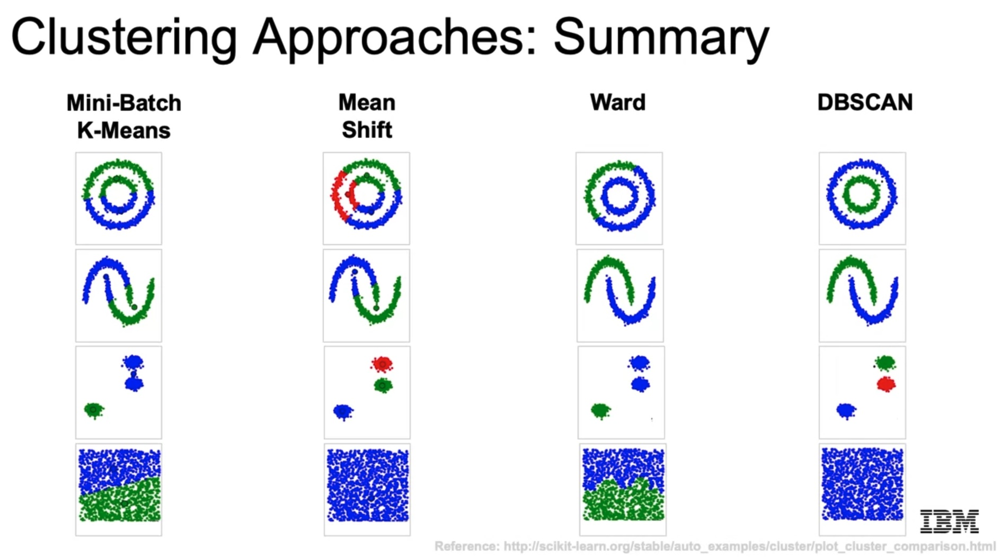

Additionally, the following table summarizes the use-cases of each algorithm, as well as their parameters & Co.: 

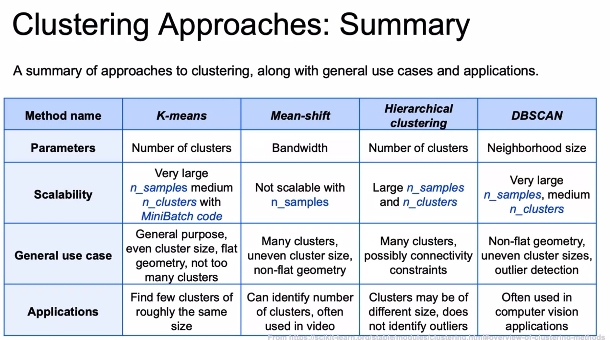

Notes on each algorithm:

- K-Means
  - MiniBatch version is fast and works with big datasets.
  - We need to know the number of clusters; if we don't know, we need to use the elbow method.
  - It tends to work better with even-sized clusters.
  - Does't work well with spherical shapes.
- Mean Shift
  - Slower.
  - Many clusters are not a problem.
  - Doesn't handle weird spherical shapes.
  - Euclidean distance.
- Hierarchical Agglomerative Clustering with Ward
  - It makes sense to use it when we'd like to build a hierarchy in which clusters are within other clusters.
  - Slow as dataset increases.
- DBSCAN
  - It seems it is the option to go, because it works very well in many situations, e.g., with weird dataset shapes.
  - However, we need to find the correct values for `epsilon` and `n_clu`, which is not always easy.
  - If the clusters have different densities, the algorithm doesn't work that well.

### 5.2 Python Lab: Clustering Algorithms

In this notebook,

`./lab/04c_LAB_Clustering_Methods.ipynb`,

the `Wine_Quality_Data.csv` dataset is used to perform clustering.

It is a **very interesting notebook**, which could be used as a template for clustering problems. Additionally, 

- clustering is explored as a method for **feature engineering**,
- and interesting compact pandas calls are performed creating frames with outputs.

All in all the following steps are carried out:

1. Load and inspect dataset
2. Basic Feature Engineering
3. Fitting K-Means with two clusters
4. Elbow method for K-Means
5. Hierarchical Agglomerative Clustering
6. Clustering as Feature Engineering

```python
import seaborn as sns
import pandas as pd
import numpy as np
import matplotlib.pyplot as plt

data = pd.read_csv('Wine_Quality_Data.csv')

##
## --- 1. Load and inspect dataset
##

data.head(4).T
data.shape # (6497, 13)
data.info()
data.color.value_counts()
data.quality.value_counts().sort_index()

## Wine (hue: red/white) quality histogram

# seaborn styles
sns.set_context('notebook')
sns.set_style('white')
# custom colors
red = sns.color_palette()[2]
white = sns.color_palette()[4]
# set bins for histogram
bin_range = np.array([3, 4, 5, 6, 7, 8, 9])
# plot histogram of quality counts for red and white wines
ax = plt.axes()
for color, plot_color in zip(['red', 'white'], [red, white]):
    q_data = data.loc[data.color==color, 'quality']
    q_data.hist(bins=bin_range, 
                alpha=0.5, ax=ax, 
                color=plot_color, label=color)
ax.legend()
ax.set(xlabel='Quality', ylabel='Occurrence')
# force tick labels to be in middle of region
ax.set_xlim(3,10)
ax.set_xticks(bin_range+0.5)
ax.set_xticklabels(bin_range);
ax.grid('off')

float_columns = [x for x in data.columns if x not in ['color', 'quality']]

## The correlation matrix

corr_mat = data[float_columns].corr()
# Strip out the diagonal values for the next step;
# we want the highest correlation,
# so the diagonal needs to be removed.
for x in range(len(float_columns)):
    corr_mat.iloc[x,x] = 0.0

# Pairwise maximal correlations
# For each variable, we get the most correlated variable
# We could also get the maximum correlation with .max()
# Recall that correlated variables affect the modeling
# and high dimensionality favours high correlations.
corr_mat.abs().idxmax()
corr_mat.abs().max()

##
## --- 2. Basic Feature Engineering
##

## Correct skewness

skew_columns = (data[float_columns]
                .skew()
                .sort_values(ascending=False))
skew_columns = skew_columns.loc[skew_columns > 0.75]
# Perform log transform on skewed columns
for col in skew_columns.index.tolist():
    data[col] = np.log1p(data[col])

## Scale

from sklearn.preprocessing import StandardScaler
sc = StandardScaler()
data[float_columns] = sc.fit_transform(data[float_columns])

## Paiplot: check if two clasters are visible

sns.set_context('notebook')
sns.pairplot(data[float_columns + ['color']], 
             hue='color', 
             hue_order=['white', 'red'],
             palette={'red':'red', 'white':'gray'});

##
## --- 3. Fitting K-Means with two clusters
##

from sklearn.cluster import KMeans
# We apply K-Means with a known number of clusters: 2
km = KMeans(n_clusters=2, random_state=42)
km = km.fit(data[float_columns])

# We create a new column with the prediction
data['kmeans'] = km.predict(data[float_columns])

(data[['color','kmeans']]
 .groupby(['kmeans','color'])
 .size()
 .to_frame()
 .rename(columns={0:'number'}))
# We can see that it did a quite nice job
# in predicting the class!

##
## --- 4. Elbow method for K-Mean
##

# We apply K-Means without a known number of clusters,
# i.e., we use the elbow method
# Create and fit a range of models
km_list = list()

for clust in range(1,21):
    km = KMeans(n_clusters=clust, random_state=42)
    km = km.fit(data[float_columns])
    
    km_list.append(pd.Series({'clusters': clust, 
                              'inertia': km.inertia_,
                              'model': km}))

plot_data = (pd.concat(km_list, axis=1)
             .T
             [['clusters','inertia']]
             .set_index('clusters'))

ax = plot_data.plot(marker='o',ls='-')
ax.set_xticks(range(0,21,2))
ax.set_xlim(0,21)
ax.set(xlabel='Cluster', ylabel='Inertia');
# We can see that the elbow would be around 4,
# but it's not that clear...

##
## --- 5. Hierarchical Agglomerative Clustering
##

from sklearn.cluster import AgglomerativeClustering
ag = AgglomerativeClustering(n_clusters=2, linkage='ward', compute_full_tree=True)
ag = ag.fit(data[float_columns])
data['agglom'] = ag.fit_predict(data[float_columns])

# First, for Agglomerative Clustering:
(data[['color','agglom','kmeans']]
 .groupby(['color','agglom'])
 .size()
 .to_frame()
 .rename(columns={0:'number'}))

# Comparing with KMeans results:
(data[['color','agglom','kmeans']]
 .groupby(['color','kmeans'])
 .size()
 .to_frame()
 .rename(columns={0:'number'}))

 # First, we import the cluster hierarchy module from SciPy
# (described above) to obtain the linkage and dendrogram functions.
from scipy.cluster import hierarchy

Z = hierarchy.linkage(ag.children_, method='ward')
fig, ax = plt.subplots(figsize=(15,5))
den = hierarchy.dendrogram(Z,
                           orientation='top', 
                           p=30, # how many levels down do you want to go?
                           truncate_mode='lastp',
                           show_leaf_counts=True,
                           ax=ax)

##
## --- 6. Clustering as Feature Engineering
##

# - Create a **binary** target variable `y`, denoting if the quality is greater than 7 or not.
# - Create a variable called `X_with_kmeans` from `data`, by dropping the columns "quality", "color" and "agglom" from the dataset. Create `X_without_kmeans` from that by dropping "kmeans".
# - For both datasets, using **StratifiedShuffleSplit** with 10 splits, fit 10 Random Forest Classifiers and find the mean of the ROC-AUC scores from these 10 classifiers.
# - Compare the average roc-auc scores for both models, the one using the KMeans cluster as a feature and the one that doesn't use it.

from sklearn.ensemble import RandomForestClassifier
from sklearn.metrics import classification_report, roc_auc_score
from sklearn.model_selection import StratifiedShuffleSplit

y = (data['quality'] > 7).astype(int)
X_with_kmeans = data.drop(['agglom', 'color', 'quality'], axis=1)
X_without_kmeans = X_with_kmeans.drop('kmeans', axis=1)
sss = StratifiedShuffleSplit(n_splits=10, random_state=6532)

def get_avg_roc_10splits(estimator, X, y):
    roc_auc_list = []
    for train_index, test_index in sss.split(X, y):
        X_train, X_test = X.iloc[train_index], X.iloc[test_index]
        y_train, y_test = y.iloc[train_index], y.iloc[test_index]
        estimator.fit(X_train, y_train)
        y_predicted = estimator.predict(X_test)
        y_scored = estimator.predict_proba(X_test)[:, 1]
        roc_auc_list.append(roc_auc_score(y_test, y_scored))
    return np.mean(roc_auc_list)
# return classification_report(y_test, y_predicted)

estimator = RandomForestClassifier()
roc_with_kmeans = get_avg_roc_10splits(estimator, X_with_kmeans, y)
roc_without_kmeans = get_avg_roc_10splits(estimator, X_without_kmeans, y)
print("Without kmeans cluster as input to Random Forest, roc-auc is \"{0}\"".format(roc_without_kmeans))
print("Using kmeans cluster as input to Random Forest, roc-auc is \"{0}\"".format(roc_with_kmeans))

# Does it the number of clusters have an effect?
# - Create the basis training set from `data` by restricting to float_columns.
# - For $n = 1, \ldots, 20$, fit a KMeans algorithim with $n$ clusters. **[One-hot encode]()** it and add it to the **basis** training set. Don't add it to the previous iteration.
# - Fit 10 **Logistic Regression** models and compute the average roc-auc-score.
# - Plot the average roc-auc scores.

from sklearn.linear_model import LogisticRegression

X_basis = data[float_columns]
sss = StratifiedShuffleSplit(n_splits=10, random_state=6532)

def create_kmeans_columns(n):
    km = KMeans(n_clusters=n)
    km.fit(X_basis)
    km_col = pd.Series(km.predict(X_basis))
    km_cols = pd.get_dummies(km_col, prefix='kmeans_cluster')
    return pd.concat([X_basis, km_cols], axis=1)

estimator = LogisticRegression()
ns = range(1, 21)
roc_auc_list = [get_avg_roc_10splits(estimator, create_kmeans_columns(n), y)
                for n in ns]

ax = plt.axes()
ax.plot(ns, roc_auc_list)
ax.set(
    xticklabels= ns,
    xlabel='Number of clusters as features',
    ylabel='Average ROC-AUC over 10 iterations',
    title='KMeans + LogisticRegression'
)
ax.grid(True)

```

## 6. Dimensionality Reduction

Recall the **curse of dimensionality**:

- In higher dimensions, the space is filled more sparsely; or in other words, we need much more data to fill the entire feature space and learn the structure meaningfully.
- In practice, more features lead to worse performance.
- In higher dimensions the number of outliers increases.
- In higher dimensions the distance measures perform worse.

One solution to tackle the curse of dimensionality is to decrease it, by

- selecting a subset of features
- or applying linear and non-linear transformations that produce equivalent features in lower dimensional spaces. **Indeed, if we apply the model on datasets that have been reduced with PCA, we can get better accuracies!**

Example: phone usage and data usage.

In the example, we see that the two features can be transformed to a linear combination of both that represents fairly well in 1D the dataset, i.e., maintaining as much variance as possible; that's the basic idea behind Principal Component Analysis (PCA).

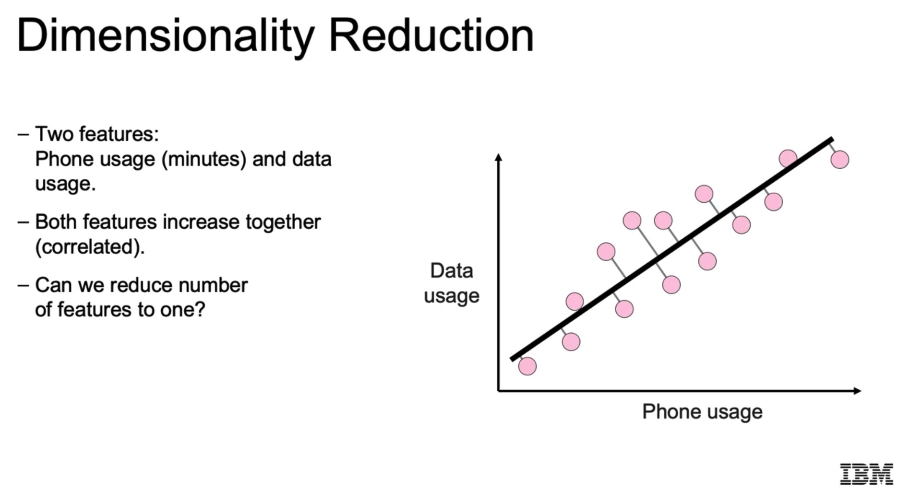

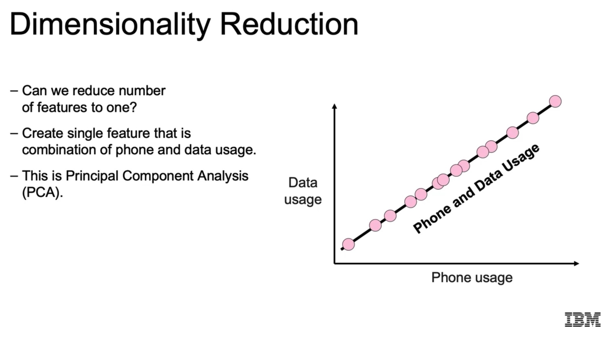

Note that applying PCA and truncating some of the components is like reducing the correlation between variables.

### 6.1 Principal Component Analysis (PCA)

When we apply Principal Component Analysis (PCA), **the axes/directions which account to the maximum variance in the feature space are discovered**. With them, we form a new base in which the data points can be expressed; since it is a base, all directions are perpendicular to each other. The number of directions is the same as the number of features. Also, note that **the features that form the directions of maximum variance are the ones with less correlation.**

With each direction/axis, we get a length or magnitude scalar, which accounts for the amount of variance in that direction. The idea is to take only the directions with the highest lengths, ignoring the rest, i.e., we **truncate the decomposition**; that is effectively as 

- projecting the data points of the axes of highest variance
- or basically dropping the components of the low variances axes.

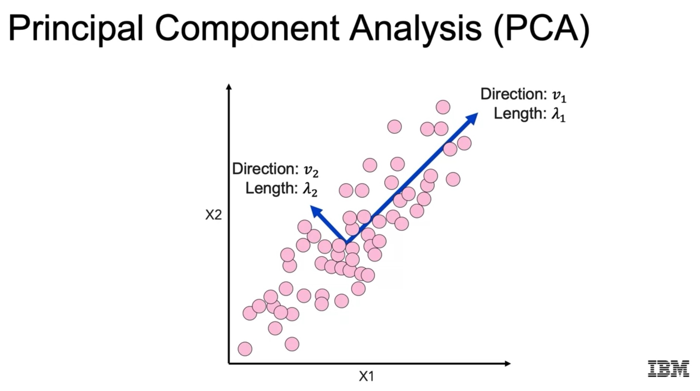

That base could be found with the **eigen values**: the directions are the eigenvectors and the variance values or lengths are the eigenvalues; however, the datset needs to be square to compute them. Instead, the **Singular Value Decomposition (SVD)** is used, which is a generalization of the former. With it, the dataset doesn't need to be square!

We find a decomposition such as:

`A_(mxn) = U_(mxm) * S_(mxn) * V^T_(nxn)`

with:

- `A` the original dataset consisting of `m` data points with `n` features each.
- `U` a rotation matrix in `m-D` space; it contains the *left* singular vectors or components in its columns.
- `S`: a diagonal matrix which contains the **singular or principal values**, the lengths or variance values of the axes.
- `V`: a rotation matrix in `n-D` space which contains the **principal axes** in its columns, aka. **components** or **right singular vectors**; note that the transpose is used in the formula, i.e., the axes are in the rows.

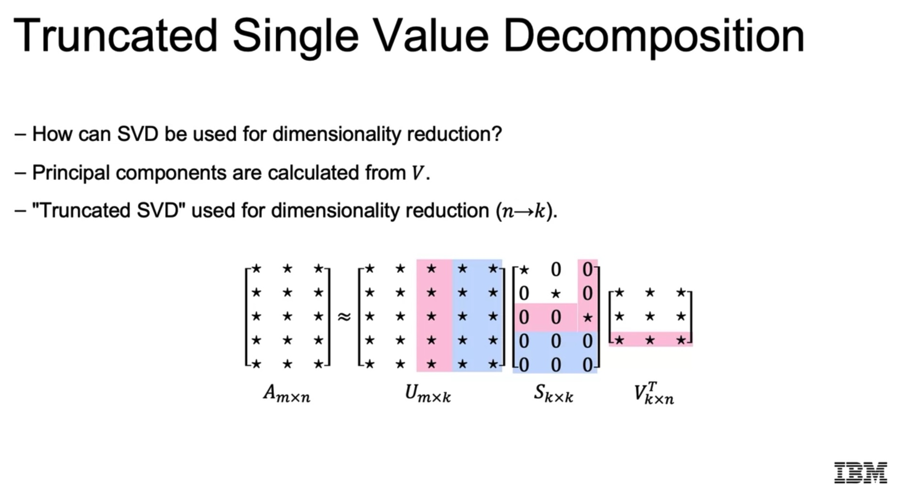

Note that when we truncate the directions with the least variance we reduce the axes and the features in the transformed space, but the dataset dimensions are maintained in the original feature base.

Example: we go from `n -> k < n`:

`A_(mxn) approx. U_(mxk) * S_(kxk) * V^T_(kxn)`

**Important observations:** 

- Even though we reduce the features to `k`, the elements of the `k` principal components will be *always* `n`, i.e., the number of features in the original dataset.
- I have always considered that `n < m`, i.e., there are more samples than the original number of features. However, that's not always true, e.g., in the case of high resolution eigenfaces (see section 6.4). In the general case, the maximum value of `k` or `n_components` is `min(n_features=n, n_samples=m)`.
- `S` is always diagonal; if it's not square, the rectangular part is full of zeros.
- Similarly, if `S` is rectangular and its bottom part is full with zeros, `U`'s last columns will be also full of zeros; i.e., only the first `k` columns will have non-zero relevant values.
- The singular values in `S` and their associated components are ordered from larger to smaller; the singular value is related to the variance explained along that principal axis.
- When we take `k` components, we only take the first `k` columns/rows of `U`, `S` and `V`. If we multiply those matrices, we get an approximated value of `A`. In that approximation, the smallest variance components are removed, i.e., we get the information that gives shape/context to the data. That idea can be used to obtain the background image from a video sequence! See section 6.5.


Finally, note that **scaling is fundamental before applying PCA**; never apply PCA without scaling, specially if the features have ranges of different orders of magnitude! The main reasons behind:

- A feature with large values seems to have a higher variance than a feature with small values; instead, they all should be scaled to the same region to really check what's going on.
- Large and small values are poorly handled together: the information of the small value is lost in the presence of the large, when summed.

Note that `PCA()` has a parameter with which we can scale automatically: `whiten=True`.

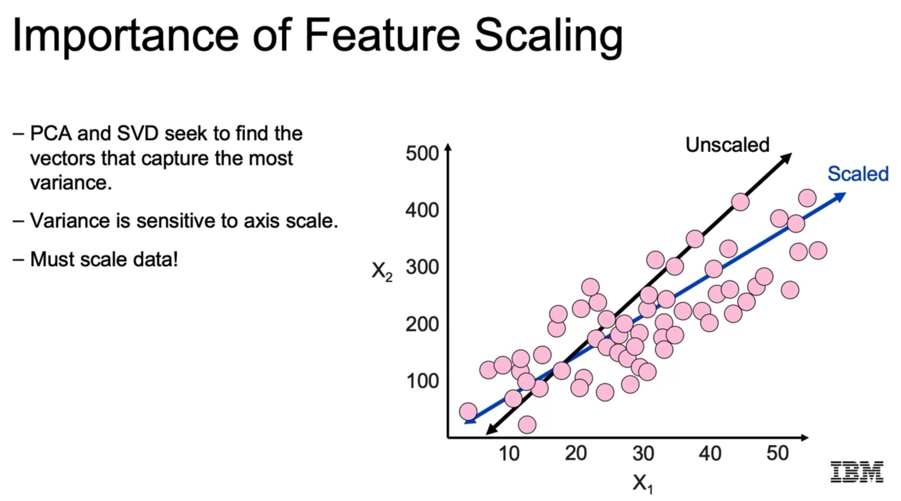

#### Python Syntax

```python
from sklearn.decomposition import PCA

# Imagine our dataset has n=20 features and m>n samples
# and we want to reduce it to k=3 features; we apply PCA/SVD:
# X_(mxn) = U_(mxm) * S_(mxn) * V^T_(nxn)
# X_hat_(mxn) = U_(mxk) * S_(kxk) * V^T_(kxn)
pca = PCA(n_components=3) # final number of components we want
X_hat = pca.fit_transform(X)

# We can get many information from pca
# Principal axes in feature space: V^T, (n_components, features=X.shape[1])
pca.components_
# Variance ratio of each component
pca.explained_variance_ratio_
pca.explained_variance_ratio_.sum() # must be 1
# Variance of each component
pca.explained_variance_

```

### 6.2 Python Lab: Matrix Review

Matrix operations review notebook: `./lab/Matrix_Review.ipynb`.

Not interesting for me, very basic concepts reviewed.

### 6.3 Python Lab: Dimensionality Reduction with PCA

In this notebook,

`./lab/04d_DEMO_Dimensionality_Reduction.ipynb`

two datasets are used to test PCA:

- The [Wholesale customers Dataset](https://archive.ics.uci.edu/ml/datasets/Wholesale+customers) 
- and the [Human Activity Recognition with Smartphones Dataset](https://www.kaggle.com/datasets/uciml/human-activity-recognition-with-smartphones).

**This is an interesting notebook, since it summarizes many things we can do with PCA**.

The [Wholesale customers Dataset](https://archive.ics.uci.edu/ml/datasets/Wholesale+customers) refers to clients of a wholesale distributor. It includes the annual spending in monetary units (m.u.) on diverse product categories:

- Fresh: annual spending (m.u.) on fresh products
- Milk: annual spending (m.u.) on milk products
- Grocery: annual spending (m.u.) on grocery products
- Frozen: annual spending (m.u.) on frozen products
- Detergents_Paper: annual spending (m.u.) on detergents and paper products
- Delicatessen: annual spending (m.u.) on delicatessen products
- Channel: customer channel (1: hotel/restaurant/cafe or 2: retail)
- Region: customer region (1: Lisbon, 2: Porto, 3: Other)

The [Human Activity Recognition with Smartphones Dataset](https://www.kaggle.com/datasets/uciml/human-activity-recognition-with-smartphones) collects 561+ time and frequency variables of healthy individuals which are mapped to the daily activity they were carrying out:

- WALKING 
- WALKING UPSTAIRS
- WALKING DOWNSTAIRS
- SITTING
- STANDING
- LAYING

All in all, the following steps are carried out:

1. Data Exploration and Processing
    - Types are casted
    - Unused columns dropped
    - Skewed variables transformed
2. PCA is Performed
3. Feature Contributions Are Analyzed
4. Grid Search is Explored with Non-Linear Dimensionality Reduction via Kernels
5. Model Accuracy Change Depending on PCA

```python
import os

def warn(*args, **kwargs):
    pass
import warnings
warnings.warn = warn

import seaborn as sns
import pandas as pd
import numpy as np
import matplotlib.pyplot as plt

##
## -- 1. Data Exploration and Processing
## 

data = pd.read_csv('Wholesale_Customers_Data.csv')
data.shape # (440, 8)

# We won't use Channel & Region
data = data.drop(['Channel', 'Region'], axis=1)

# The data is in monetary units, which are integers;
# we convert the data to floats
data.dtypes
for col in data.columns:
    data[col] = data[col].astype(np.float)

# Preserve the original data
data_orig = data.copy()

# Correlation is important
# if two variables are very correlated, probably removing
# one doesn't reduce the total variance
corr_mat = data.corr()

# Strip the diagonal for future examination
# because it has always the maximum value
for x in range(corr_mat.shape[0]):
    corr_mat.iloc[x,x] = 0.0
    
corr_mat.abs().idxmax()
corr_mat.abs().max()

# We need to transform the variables with large skew,
# large starting at 0.75
log_columns = data.skew().sort_values(ascending=False)
log_columns = log_columns.loc[log_columns > 0.75]

# The log transformations
for col in log_columns.index:
    data[col] = np.log1p(data[col])

# Scale to [0,1]
from sklearn.preprocessing import MinMaxScaler

mms = MinMaxScaler()

for col in data.columns:
    data[col] = mms.fit_transform(data[[col]]).squeeze()

# After all the transformations we've carried out
# we should see normally distributed and clean data
sns.set_context('notebook')
sns.set_style('white')
sns.pairplot(data)


# A better way is using a Pipeline!
from sklearn.preprocessing import FunctionTransformer
from sklearn.pipeline import Pipeline

# To create a pipeline, we need to pass objects to it
# with the functions `fit()` and `transform()`;
# if a function we have used doesn't have that,
# we can convert it to a transformer with
# FunctionTransformer. We do that with
# the custom NumPy log transformer
log_transformer = FunctionTransformer(np.log1p)

# The pipeline
estimators = [('log1p', log_transformer), ('minmaxscale', MinMaxScaler())]
pipeline = Pipeline(estimators)

# Convert the original data
data_pipe = pipeline.fit_transform(data_orig)

##
## -- 2. PCA is Performed
## 

from sklearn.decomposition import PCA

pca_list = list()
feature_weight_list = list()

# Fit a range of PCA models

for n in range(1, 7):
    
    # Create and fit the model
    PCAmod = PCA(n_components=n)
    PCAmod.fit(data)
    
    # Store the model and variance
    pca_list.append(pd.Series({'n':n,
                               'model':PCAmod,
                               'var': PCAmod.explained_variance_ratio_.sum()}))
    
    # Calculate and store feature importances
    # There is no such thing as feature importance
    # but we can extract the components (the principal vectors)
    # and compute the ratio brought by each feature into
    # the vector direction.
    # Recall: components_ is V^T, of size (n_components, features=6=X.shape[1])
    # abs_feature_values: sum across rows, i.e., sum of all vectors
    # Thus, the normalized abs_feature_values
    # should contain the weight of each feature.
    abs_feature_values = np.abs(PCAmod.components_).sum(axis=0)
    feature_weight_list.append(pd.DataFrame({'n':n, 
                                             'features':data.columns,
                                             'values':abs_feature_values/abs_feature_values.sum()}))
    
pca_df = pd.concat(pca_list, axis=1).T.set_index('n')
pca_df


##
## -- 3. Feature Contributions Are Analyzed
## 

features_df = (pd.concat(feature_weight_list)
               .pivot(index='n', columns='features', values='values'))
sns.heatmap(features_df, annot=True, cmap='Reds')

sns.set_context('talk')
ax = pca_df['var'].plot(kind='bar')
ax.set(xlabel='Number of dimensions',
       ylabel='Percent explained variance',
       title='Explained Variance vs Dimensions');

ax = features_df.plot(kind='bar', figsize=(13,8))
ax.legend(loc='upper right')
ax.set(xlabel='Number of dimensions',
       ylabel='Relative importance',
       title='Feature importance vs Dimensions')

##
## -- 4. Grid Search with Non-Linear Dimensionality Reduction via Kernels
## 

# In this example we use KernelPCA,
# which is a non-linear dimensionality reduction
# through the use of kernels.
# The goal is to show how we can perform grid search to find the best
# parameters.
from sklearn.decomposition import KernelPCA
from sklearn.model_selection import GridSearchCV
from sklearn.metrics import mean_squared_error

# Custom scorer--use negative rmse of inverse transform
# We want to find the best parameters for kernel PCA
# We can use GridSearchCV,
# but a custom scoring function needs to be defined.
# The score is the oposite of the error,
# so we compute the error between the original and the
# inverse transformed dataset
# and use its negative value
def scorer(pcamodel, X, y=None):

    try:
        X_val = X.values
    except:
        X_val = X
        
    # Calculate and inverse transform the data
    data_inv = pcamodel.fit(X_val).transform(X_val)
    data_inv = pcamodel.inverse_transform(data_inv)
    
    # The error calculation
    mse = mean_squared_error(data_inv.ravel(), X_val.ravel())
    
    # Larger values are better for scorers, so take negative value
    return -1.0 * mse

# The grid search parameters
param_grid = {'gamma':[0.001, 0.01, 0.05, 0.1, 0.5, 1.0],
              'n_components': [2, 3, 4]}

# The grid search
kernelPCA = GridSearchCV(KernelPCA(kernel='rbf', fit_inverse_transform=True),
                         param_grid=param_grid,
                         scoring=scorer,
                         n_jobs=-1)


kernelPCA = kernelPCA.fit(data)

kernelPCA.best_estimator_

##
## -- 5. Model Accuracy Change Depending on PCA
## 

data = pd.read_csv('Human_Activity_Recognition_Using_Smartphones_Data.csv')

# We have 562 columns:
# y: 'Activity'
# X: 561 time and frequency-related variables
data.shape # (10299, 562)

data.Activity.unique() # 'STANDING', 'SITTING', 'LAYING', 'WALKING', 'WALKING_DOWNSTAIRS', 'WALKING_UPSTAIRS'

# Our goal is to build logistic regression models
# with the (X,y) variables after having performed a PCA reduction.
# Then, we see hoow the accuracy of the model varies
# in function of the number of components used.
# It makes sense to apply PCA here, because we have 
# a lot of variables!
from sklearn.pipeline import Pipeline
from sklearn.preprocessing import StandardScaler
from sklearn.model_selection import StratifiedShuffleSplit
from sklearn.linear_model import LogisticRegression
from sklearn.metrics import accuracy_score

X = data.drop('Activity', axis=1)
y = data.Activity
sss = StratifiedShuffleSplit(n_splits=5, random_state=42)

def get_avg_score(n):
    pipe = [
        ('scaler', StandardScaler()),
        ('pca', PCA(n_components=n)),
        ('estimator', LogisticRegression(solver='liblinear'))
    ]
    pipe = Pipeline(pipe)
    scores = []
    for train_index, test_index in sss.split(X, y):
        X_train, X_test = X.loc[train_index], X.loc[test_index]
        y_train, y_test = y.loc[train_index], y.loc[test_index]
        pipe.fit(X_train, y_train)
        scores.append(accuracy_score(y_test, pipe.predict(X_test)))
    return np.mean(scores)


ns = [10, 20, 50, 100, 150, 200, 300, 400]
score_list = [get_avg_score(n) for n in ns]

# We can see that with 100 variables (from 561)
# we reach already +96% accuracy
pd.DataFrame(score_list,index=ns)

# We can see that with 100 variables (from 561)
# we reach already +96% accuracy,
# and the curve saturates
sns.set_context('talk')
ax = plt.axes()
ax.plot(ns, score_list)
ax.set(xlabel='Number of Dimensions',
       ylabel='Average Accuracy',
       title='LogisticRegression Accuracy vs Number of dimensions on the Human Activity Dataset')
ax.grid(True)

```

### 6.4 Python Lab: PCA Examples

In this notebook,

`./lab/PCA.ipynb`

several examples are analyzed:

1. A synthetic dataset.
2. Eigenfaces.
3. Exercises with energy data.

The second is interesting, the others don't provide new insights.

The **Eigenfaces** example loads a dataset which contains 1288 face images of 50x37 pixels of 7 famous peole: 'Ariel Sharon', 'Colin Powell', 'Donald Rumsfeld', 'George W Bush', 'Gerhard Schroeder', 'Hugo Chavez', 'Tony Blair'.

The goal is to be able to classify each image with its target name.

Initially, SVC is used, but the results are really bad. However, after applying PCA to the dataset and keeping the first components that explain 95% of the variance, the results improve significantly. In other words: images are compressed and the classification becomes much better.

The application of PCA works as follows:

- Each image is vectorized to be a vector of `h*w` values; thus, we have `h*w` features or dimensions.
- All vectors form the dataset: `X`: `(n_images, h*w)`.
- We apply PCA to X.
- We find the minimum number of components which yields an explained variance of 95%.
- X is transformed with that number of components and SVC used on it.


```python
##
## --- EIGENFACES
##

from tqdm import tqdm
import numpy as np
import pandas as pd
from itertools import accumulate

import matplotlib.pyplot as plt
import seaborn as sns
%matplotlib inline

from sklearn.preprocessing import StandardScaler
from sklearn.decomposition import PCA
from sklearn.model_selection import train_test_split
from sklearn.model_selection import RandomizedSearchCV
from sklearn.datasets import fetch_lfw_people
from sklearn.metrics import classification_report
from sklearn.metrics import confusion_matrix
from sklearn.svm import SVC
from scipy.stats import loguniform

def plot_explained_variance(pca):
    # This function graphs the accumulated explained variance ratio for a fitted PCA object.
    # Note:
    # from itertools import accumulate
    # accumulate([1,2,3,4,5]) --> 1 3 6 10 15
    # i.e., p0, p0+p1, p0+p1+p2, ...
    acc = [*accumulate(pca.explained_variance_ratio_)]
    fig, ax = plt.subplots(1, figsize=(50, 20))
    ax.stackplot(range(pca.n_components_), acc)
    ax.scatter(range(pca.n_components_), acc, color='black')
    ax.set_ylim(0, 1)
    ax.set_xlim(0, pca.n_components_-1)
    ax.tick_params(axis='both', labelsize=36)
    ax.set_xlabel('N Components', fontsize=48)
    ax.set_ylabel('Accumulated explained variance', fontsize=48)
    plt.tight_layout()
    plt.show()


# Load dataset
lfw_people = fetch_lfw_people(min_faces_per_person=70, resize=0.4)

# Get the images arrays to find the shapes (for plotting)
# lfw_people has
# .images
# .target
# .target_names
# .data: images in vector form: h*w
# ...
N, h, w = lfw_people.images.shape
target_names = lfw_people.target_names

print(N, h, w) # 1288 50 37

y = lfw_people.target # target name for each image
X = lfw_people.data # images in vector form
n_features = X.shape[1] # number of vectorized pixels: h*w

X.shape # (1288, 1850)

# Each image has 50*37 pixels
# which yield 1850 features or columns
h*w # 1850

# Plot the last image of each unique target
for person in np.unique(lfw_people.target):
    idx = np.argmax(lfw_people.target == person)
    plt.imshow(lfw_people.images[idx], cmap='gray')
    plt.title(lfw_people.target_names[person])
    plt.show()

# Train/Test split
X_train, X_test, y_train, y_test = train_test_split(
    X, y, test_size=0.25, random_state=42
)
X_train.shape # (966, 1850)
X_train.shape # (322, 1850)

###
### First Try: SVC with original features

param_grid = {
    "C": loguniform(1e3, 1e5),
    "gamma": loguniform(1e-4, 1e-1)
}
clf = RandomizedSearchCV(
    SVC(kernel="rbf", class_weight="balanced"), param_grid, n_iter=10
)
clf = clf.fit(X_train, y_train)

y_pred = clf.predict(X_test)

# We see all the images are being classified as George Bush.
# Clearly it's having trouble differentiating between the faces.
hmap = sns.heatmap(
    confusion_matrix(y_test, y_pred),
    annot=True,
    xticklabels=lfw_people.target_names,
    yticklabels=lfw_people.target_names,
    fmt='g'
)
hmap.set_xlabel('Predicted Value')
hmap.set_ylabel('Truth Value')

###
### Second Try: SVC with PCA components

# If we don't pass n_components
# either min(n_features, n_samples) is taken
# or depending on the algorithm, another value is deduced.
# Note that usually n_features < n_samples,
# but not in this case, because we have more pixels per image
# than images.
# X_train is of shape (966, 1850)
pca = PCA(svd_solver='full',  whiten=True).fit(X_train)
pca.n_components_ # 966 = min(n_features=1850, n_samples=966)

# Transform and inverse transform an image
person_index=1
Xhat=pca.transform(X[person_index,:].reshape(1, -1))
# Both images should be very similar;
# if n_components = n_features,
# both images would be almost identical
plt.imshow(pca.inverse_transform(Xhat).reshape(h, w), cmap='gray')
plt.title("Image after PCA and inverse transform"  ) 
plt.show()
plt.imshow(lfw_people.images[person_index],cmap='gray')
plt.title("Image")
plt.show()

# Plot explained variance in function of the number of components
# It looks like 150 components explain over 95% of the variance,
# usually 80% will do, let’s try and visualize some components.
plot_explained_variance(pca)
plt.show()

# threshold: minimum variance we want to explain
# which is the minimum number of components necessary?
threshold = 0.60
# cumsum sums for each element al the elements beforehand
# components is of size
components = np.cumsum(pca.explained_variance_ratio_) < threshold
components.sum() # 7
# Components has True until the accumulated explained variance is reached
# then, False.
# Its size is the number of original features
components.shape # 966

# Plot the pricipal components, i.e., the eigen-faces.
# Important observation: even though we reduce the features to k=7,
# the elements of the k principal components will be *always* n_features,
# i.e., the number of features in the original dataset.
# Thus, we can plot the eigen-faces or basic face patterns;
# All the 1288 faces in the dataset are represented as a linear combination
# of the eigen-faces after the PCA transformation.
for component in pca.components_[components,:]:
    plt.imshow(component.reshape(h, w),cmap='gray')
    plt.show()

# Perform PCA with n_components = 150
# which explains more than 995%. of the variance
pca = PCA(n_components=150, svd_solver="randomized", whiten=True).fit(X_train)

X_train_pca = pca.transform(X_train)
X_test_pca = pca.transform(X_test)

# Plot transformed image again
# This time, both are similar, but ifferences are visible
person_index = 1

plt.figure(figsize=(8, 4))
plt.subplot(1,2,1)
plt.imshow(lfw_people.images[person_index,:,:],cmap='gray')
plt.title("Original image")

plt.subplot(1,2,2)
plt.imshow(pca.inverse_transform(pca.transform(X[person_index ,:].reshape(1, -1))).reshape(h, w),cmap='gray')
plt.title("PCA transformed and inverse-transformed image ") 

plt.tight_layout()
plt.show()

# Perform classification with transformed dataset
# Take into account now we have a dataset with 150 features instead of 1850!
# So images have been compressed.
# Additionally, we have the 150 principal components
# which are of size 1850 each.
param_grid = {
    "C": loguniform(1e3, 1e5),
    "gamma": loguniform(1e-4, 1e-1),
}
clf = RandomizedSearchCV(
    SVC(kernel="rbf", class_weight="balanced"), param_grid, n_iter=10
)

clf = clf.fit(X_train_pca, y_train)

y_pred = clf.predict(X_test_pca)

# The results now are much better,
# with average precision=0.82 and recall=78
print(classification_report(y_test,y_pred))

hmap = sns.heatmap(
    confusion_matrix(y_test, y_pred),
    annot=True,
    xticklabels=lfw_people.target_names,
    yticklabels=lfw_people.target_names,
    fmt='g'
)
hmap.set_xlabel('Predicted Value')
hmap.set_ylabel('Truth Value')

```

### 6.5 Python Lab: SVD for Background Detection

In this notebook,

`./lab/SVD.ipynb`

the [Background Subtraction Dataset](http://www.svcl.ucsd.edu/projects/bgsub/) from the Statistical Visual Computing Laboratory (SVCL) at UCSD is analyzed.

**This is a very interesting notebook because it shows how to use SVD for image background modeling**.

The code is very simple and self-explanatory:

- 170 images of size 152x232 are loaded and flattened to form X of shape (170, 32654).
- The images contain the same background and some objects/people appear in different locations in them; e.g., pedestrians.
- The singular value decomposition of X is computed and the matrices are truncated to take only `k = 1` component.
- The approximative `X` is computed with the truncated `k` components.
- The first image of the approximate dataset is visualized: there are no pedestrians, just background!

Note that the background is shown if we visualize any image from the approximate dataset. The explanation is that the first component or principal axis contains the background.

I understand this could be applied to anything in which background noise needs to be removed; for instance, in audio!


```python

from os import listdir, getcwd
from os.path import isfile, join
from random import randint
from PIL import Image

import numpy as np 
import pandas as pd
import seaborn as sns 
import matplotlib.pylab as plt
%matplotlib inline

from numpy.linalg import svd


def get_data_matrix (mypath="peds"):
    # Get all image filenames in mypath
    cwd = getcwd()
    mypath=join(cwd,mypath)
    files = [ join(mypath,f) for f in listdir(mypath) if isfile(join(mypath, f)) and f.startswith(".")==False]
    
    # Read image
    img = Image.open(files[0])
    I=np.array(img)
    
    # Output sizes
    Height,Width = I.shape
   
    # Output images
    X=np.zeros((len(files),Height*Width))
    for i,file in enumerate(files):
        img = Image.open(file)
        I=np.array(img)
        # Flatten image: 2D array converted into 1D row vector
        X[i,:]=I.reshape(1,-1)
    return X,Height,Width

# Get all images from any folder: peds, traffic, boats
X, Height, Width = get_data_matrix(mypath="peds")

# 170 flattened images: 152*232 = 35264
X.shape, Height, Width # (170, 35264), 152, 232

# Plot 5 random images from the set of 170
for i in range(5):
    frame=randint(0, X.shape[0]-1)
    plt.imshow(X[randint(0, X.shape[0]-1),:].reshape(Height,Width),cmap="gray")
    plt.title("frame: "+str(frame))
    plt.show()

# We decompose the dataset X in its singular value components
# The flag full_matrices=False
# removes the columns/rows from U & S which have zeros
# The number of components will be min(n_features=35264, n_samples=170)
U, s, VT = svd(X, full_matrices=False)

U.shape # (170, 170)
s.shape # (170,)
VT.shape # (170, 35264)

S = np.diag(s) # because s is an array

# We take ONLY the first component, of all 170
# @: matrix (dot) product
k = 1
Xhat = U[:,:k]@S[0:k,0:k]@VT[:k,:]

# All images have been approximated
Xhat.shape # (170, 35264)

# We now plot the first image
# from the approximated dataset
# Only the background is shown!!
plt.imshow(Xhat[0,:].reshape(Height,Width),cmap="gray")
plt.title('Truncated SVD k=1')
plt.show()
```

### 6.6 Dimensionality Reduction for Image Compression

In this section an application of dimensionality reduction with PCA for image compression is shown.

First, the image is divided in square regions of 12x12 pixels; then, each region is flattened to form a row in the image representation X, with shape `(n_squares, n_features=144)`.

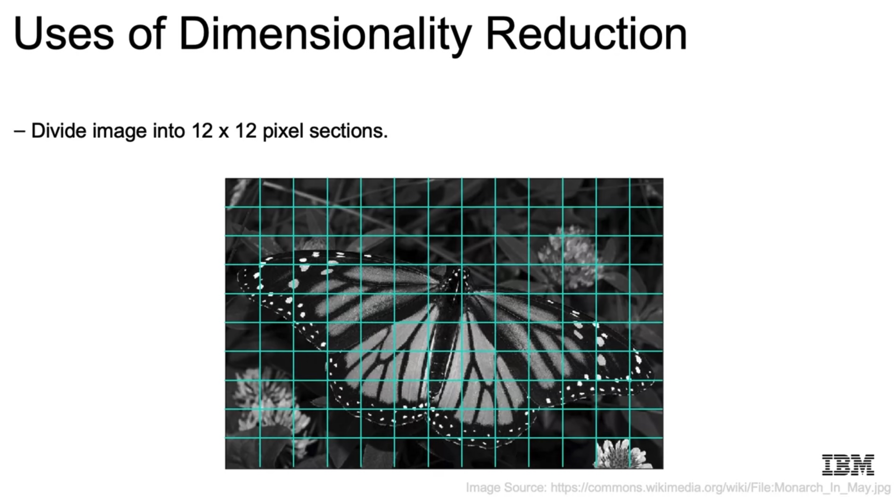

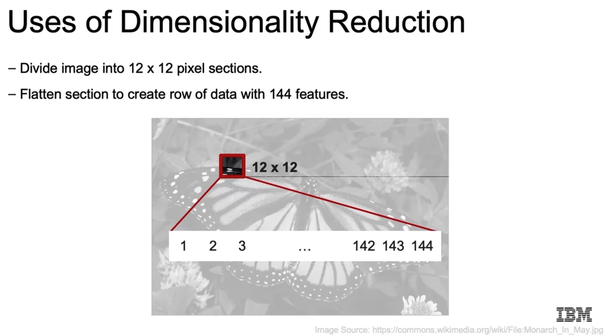

Then, we apply PCA and we obtain the principal components ordered by the amount of variance they can explain. If we reshape the first principal components, we obtain the basis 12x12 patches; the image would be a linear combination of those patches!

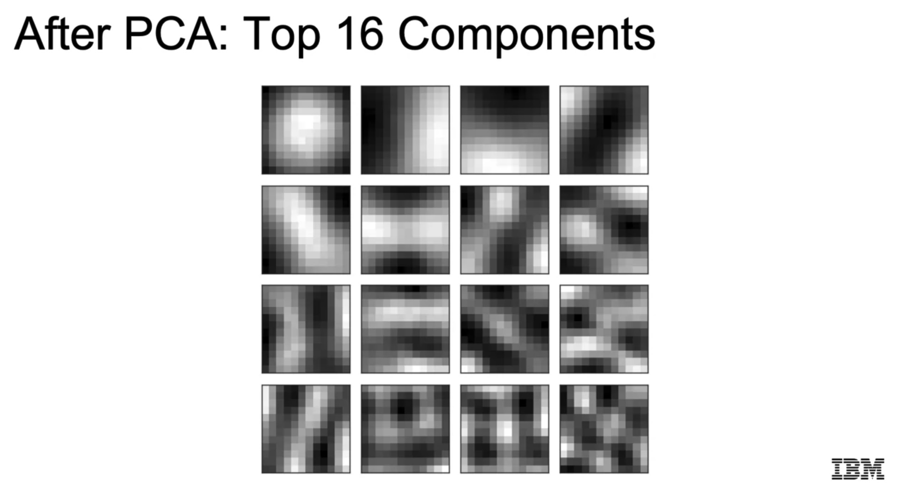

By using only the first `k` components (instead of the original 144), we can compress the image. Using `k=4` components implies taking

- 4 vectors of length 144 (principal components)
- and for each square/patch in the image, the weight of each of the 4 components.


Of course, the representation error due to the compression decreases considerably if we increase the number of components `k`.

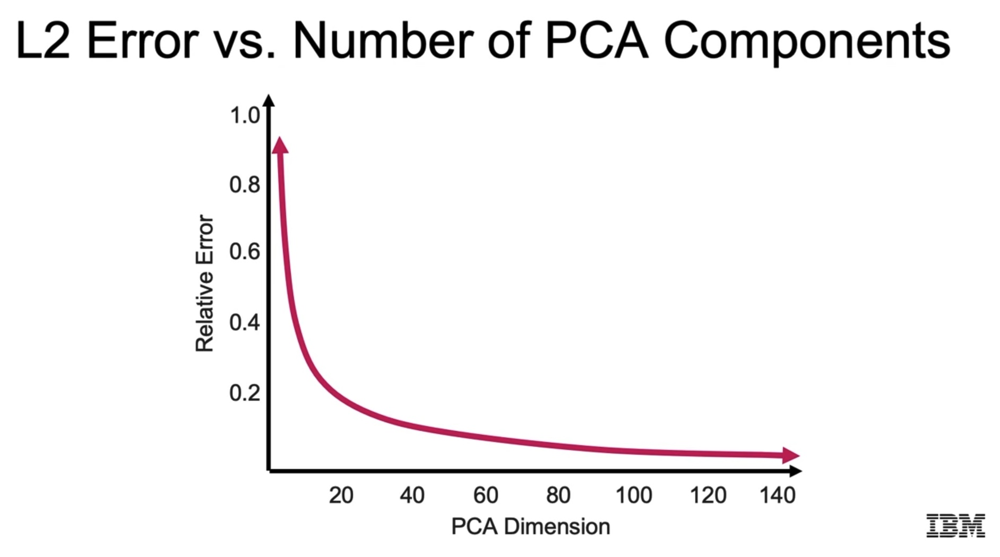


## 7. Kernel Principal Component Analysis and Multidimensional Scaling

PCA reduces the dimensionality of the dataset applying a linear transformation. However, we can also apply non-linear transformations. Examples:

- Kernel PCA
- Manifold learning or Multi-Dimensional Scaling: Isomap and T-SNE.

### Kernel PCA

**Kernel PCA** consists in using kernels for the data points, as done in kernel-based SVM. It is very useful when the dataset has non-linear features. With those kernels we map our dataset to higher dimensional spaces, and then apply linear PCA. That way, but we can uncover non-linear structures that seem linear in those higher dimensional spaces.

In the example below, the dataset has two rings; the linear PCA would not detect meaningful structures to reduce the dimensions, although it is obvious there is a structure -- which is non-linear!

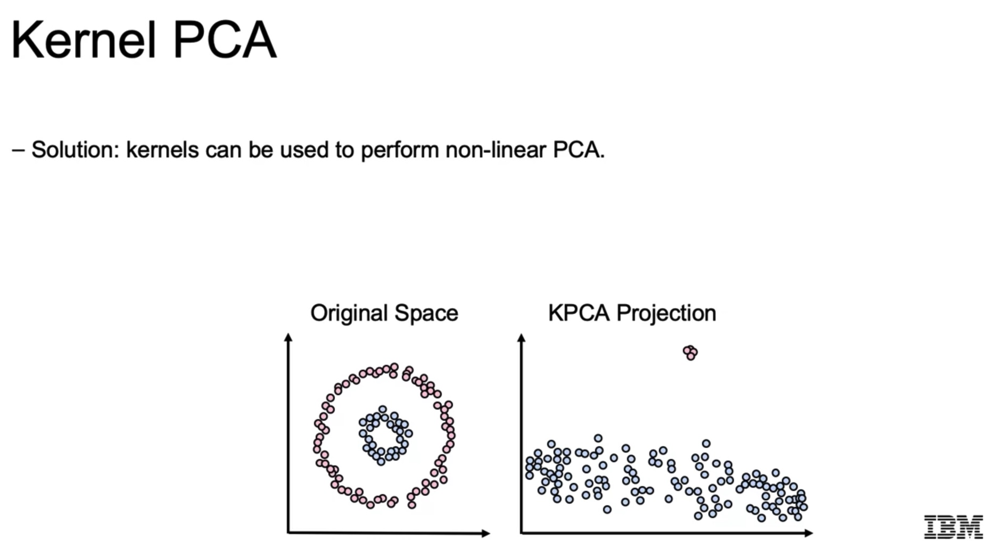

Kernels are very useful when the mapping to higher dimensional spaces is difficult. As a result, no mapping needs to be calculated, we have the kernels.

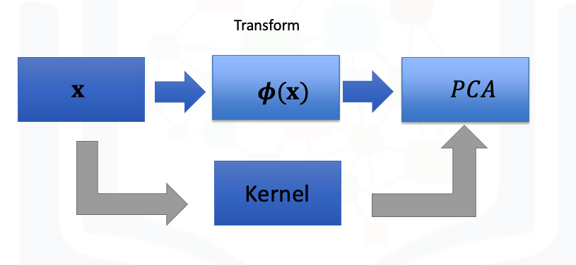

A transformation would be of the form:

`phi: x = (x_1,x_2) -> x' = (x_1, x_2, x_1^2+x_2^2)`

The polynomial Kernel computation would be:

`k(xi,xj) = phi(xi)*phi(xj) = (xi*xj + c)^2`

being `xi` and `xj` two samples from the dataset. We compute all pairwise kernels and build up the Gramm matrix; its eigenvalue factorization yields the principal components.

Note that

- a regular transformation has complexity `O(D^2)`, `D`: dimension (2 in this case)
- a Kernel transformation has complexity `O(D)`

In practice, we have several Kernels we can use; a common one is the Radial Basis Function (RBF) or Gaussian:

`k(xi,xj) = exp(-abs(xi-xj)^2/2*sigma^2)`

### Multidimensional Scaling

**Manifold learning** techniques reduce the dimensionality of the dataset, but not by detecting the axes to preserve the maximum variance possible; instead, they try to maintain the distances between the datapoint pairs in the lower dimensional space. For instance, the following image is a dataset in which the points are in a sphere and it is simplified to a disk in which the points keep their relative distances.

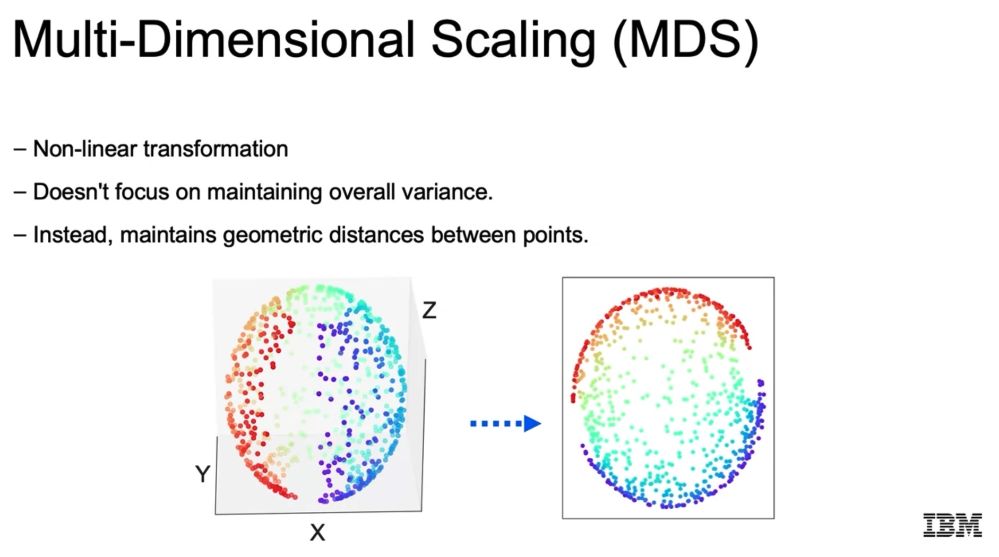

There are several methods for manifold learning. One of them is the **metric multi-dimensional scaling (MDS)**, which maps the `x` points to an embedding space `Z` (of lower dimension) in which the points are represented with the vectors `z`. Given a distance function `d()`, which can be any (that's the **advantage wrt. to PCA**), the distances between all pairs of points are computed in the following matrix:

$$
\begin{pmatrix}
d\_{1,1} & d\_{1,2} & \cdots & d\_{1,N} \\\\\\
d\_{2,1} & d\_{2,2} & \cdots & d\_{2,N} \\\\\\
\vdots & \vdots & & \vdots \\\\\\
d\_{N,1} & d\_{N,2} & \cdots & d\_{N,N}
\end{pmatrix}.
$$

The mapping `x -> z` is achieved so that we minimize the *stress* function, which is the sum of all squared differences in distance values in each space:

`min sum((d(x_i,x_j) - d(z_i,z_j))^2)`

**Important note**: we can pass to `MDS` either

- the dataset of points and the pairwise Euclidean distances are computed
- or the matrix of distances between points (`dissimilarity='precomputed'`); we can use our choice of distance metric.

Another popular manifold learning technique is [T-SNE](https://en.wikipedia.org/wiki/T-distributed_stochastic_neighbor_embedding); it is similar to PCA and it is often used for visualizing datasets in lower dimensional spaces. Data points that are close in higher dimensional spaces remain close in lower dimensional spaces.

### Python Syntax

```python
from sklearn.decomposition import KernelPCA

# we have several kernels with their parameters
# rbf: Gaussian
# gamma: parameter for the Guassian (sigma), how complex/curvy the boundary should be
kpca = KernelPCA(n_components=3, kernel='rbf', gamma=1.0)
X_kpca = kpca.fit_transform(X)

### ---

from sklearn.decomposition import MDS
# We can pass the data points X
# or also a distance matrix between all point pairs
# Se examples below
mds = MDS(n_components=2)
X_mds = mds.fit_transform(X)


### ---

from sklearn.manifold import TSNE

tsne = TSNE(n_components=2)
X_tsne = tsne.fit_transform(X)

```

### 7.1 Python Lab: Kernel PCA

This lab is in the notebook

`./lab/04d_DEMO_Dimensionality_Reduction.ipynb`

which is listed above, in Section 6.3.

In that notebook, there is a very interesting section in which a Kernel PCA is applied with `GridSearchCV` to find the optimum parameters; since we have no target, the MSE between the transformed and the untransformed datasets is used as score.


### 7.2 Python Lab: Kernel PCA

In this notebook,

`./lab/KernelPCA.ipynb`

several examples and comparisons between PCA and Kernel PCA are shown:

1. A synthetic dataset consisting of two rings of points of different classes.
2. A billionaires dataset.
3. Image de-noising with PCA/Kernel-PCA of human digits.

The insights are the following:

- When non-linearities are clear in the dataset, Kernel-PCA performs much better: we can transform the dataset to perform classification and get better accuracy, simply because the data is represented in a more separable way.
- PCA can be used to de-noise images: we compute the PCA transformation (with a desired number of components) and reconstruct the transformed images.

Apart from that, few new things are shown.

```python
### USPS digits dataset: De-noising
X_train_noisy = pd.read_csv('X_train_noisy.csv').to_numpy()
X_test_noisy = pd.read_csv('X_test_noisy.csv').to_numpy()
X_train_noisy.shape # (1000, 256)

# Helper function for plotting the digit images
def plot_digits(X, title):
    """Small helper function to plot 100 digits."""
    fig, axs = plt.subplots(nrows=10, ncols=10, figsize=(8, 8))
    for img, ax in zip(X, axs.ravel()):
        ax.imshow(img.reshape((16, 16)), cmap="Greys")
        ax.axis("off")
    fig.suptitle(title, fontsize=24)
    
plot_digits(X_test_noisy, "Noisy test images")

# Comparing PCA and Kernel PCA
# Note that we have 256 dimensions and 1000 samples
# The automatic value for n_components is min(n_samples, n_features)
# for the regular PCA; in this case that's n_features.
# I understand that for the Kernel PCA default n_components is n_samples, because of the Kernel definitions and the Gramm matrix?
# Note that n_components is different for both PCA and KernelPCA
pca = PCA(n_components=35)
pca.fit(X_train_noisy)
kernel_pca = KernelPCA(n_components=400, kernel="rbf", gamma=0.01, fit_inverse_transform=True, alpha=0.1)
kernel_pca.fit(X_train_noisy)

# Reconstruct: PCA & KernelPCA were trained with the train split
# but now the test split is transformed and reconstructed.
X_hat_pca = pca.inverse_transform(pca.transform(X_test_noisy))
X_hat_kpca = kernel_pca.inverse_transform(kernel_pca.transform(X_test_noisy))

plot_digits(X_hat_pca, "Reconstructed Test Set (PCA)")

plot_digits(X_hat_kpca, "Reconstructed Test Set (Kernel PCA)")

```

### 7.3 Python Lab: Multi-Dimensional Scaling

In this notebook,

`./lab/Multi-Dimensional_Scaling.ipynb`

several examples are shown:

1. Given a matrix with distances between cities in longitud-latitude space, `MDS` is applied to obtain approximate `long` and `lat` coordinates for the cities. The example doesn't work that well, but it's interesting to see that the distances in the 2D map are conserved. It is remarkable that we input the `d(x_i, x_j)` values and obtain the `z_i, z_j` coordinates.
2. Dimensionality reduction is applied with `MDS` using different distance metrics on the digits dataset; then, we visualize the embedding. As before, it is remarkable that we input the `d(x_i, x_j)` values and obtain the `z_i, z_j` coordinates. An example is shown with `TSNE`, too.

In the following, the second example is summarized:

```python
import warnings
warnings.filterwarnings("ignore", category=DeprecationWarning) 

import pandas as pd
import numpy as np
from scipy.spatial.distance import euclidean, cityblock, cosine
import sklearn.metrics.pairwise
import seaborn as sns
# Import matplotlib for 3d plotting:
import matplotlib.pyplot as plt
from sklearn.preprocessing import  MinMaxScaler
from matplotlib import offsetbox
# Make matplotlib work in jupyter notebook
%matplotlib inline

# Auxiliary function to plot the embedding
def plot_embedding(X, title, ax):
    X = MinMaxScaler().fit_transform(X)
    for digit in digits.target_names:
        ax.scatter(
            *X[y == digit].T,
            marker=f"${digit}$",
            s=60,
            color=plt.cm.Dark2(digit),
            alpha=0.425,
            zorder=2,
        )
    shown_images = np.array([[1.0, 1.0]])  # just something big
    for i in range(X.shape[0]):
        # plot every digit on the embedding
        # show an annotation box for a group of digits
        dist = np.sum((X[i] - shown_images) ** 2, 1)
        if np.min(dist) < 4e-3:
            # don't show points that are too close
            continue
        shown_images = np.concatenate([shown_images, [X[i]]], axis=0)
        imagebox = offsetbox.AnnotationBbox(
            offsetbox.OffsetImage(digits.images[i], cmap=plt.cm.gray_r), X[i]
        )
        imagebox.set(zorder=1)
        ax.add_artist(imagebox)

    ax.set_title(title)
    ax.axis("off")

## Load dataset
from sklearn.datasets import load_digits

digits = load_digits(n_class=6)
X, y = digits.data, digits.target
n_samples, n_features = X.shape

print("samples:", n_samples, "features", n_features)
# samples: 1083 features 64

# Plot some digits
fig, axs = plt.subplots(nrows=10, ncols=10, figsize=(6, 6))
for idx, ax in enumerate(axs.ravel()):
    ax.imshow(X[idx].reshape((8, 8)), cmap=plt.cm.binary)
    ax.axis("off")
_ = fig.suptitle("A selection from the 64-dimensional digits dataset", fontsize=16)

# Create an MDS embedding
# n_componenets: dimension of reduced embedding
# dissimilarity: 'euclidean' (default) or 'precomputed'
#   this is a very important argument
#   if 'euclidean' (default), we pass a dataset of points
#   and pairwise Euclidean distances between them are computed
#   if 'precomputed', MSD expects a matrix of precomputed distances
#   not data points; we can use any metric to compute those distances!
embedding=MDS(n_components=2, n_init=1, max_iter=120, n_jobs=2)

# Transform the digits to the embedding
X_transformed=embedding.fit_transform(X)

# Plot the embedding
fig, ax = plt.subplots()
plot_embedding(X_transformed, "Metric MDS ", ax)
plt.show()

# Now we pass the dissimilarity matrix instead of the initial dataset
# and we use our distance metric of choice
# Different embeddings are created.
# As in the case of the cities, it is remarkable that we don't pass the initial dataset, but the matrix of distances,
# and it works!
from scipy.spatial.distance import squareform, pdist

dist=['cosine','cityblock','hamming','jaccard','chebyshev','canberra','braycurtis']
scaler = MinMaxScaler()
X_norm=scaler.fit_transform(X)

for d in dist:

    # distance is a n_sample x n_sample matrix with distances between samples
    distance=squareform(pdist(X_norm,metric=d))
    print( d)

    embedding =  MDS(dissimilarity='precomputed', random_state=0,n_components=2)
    X_transformed = embedding.fit_transform(distance)
    fig, ax = plt.subplots()
    plot_embedding(X_transformed, "Metric MDS ", ax)
    plt.show()


# TSNE
from sklearn.manifold import TSNE
X_embedded = TSNE(n_components=2, init='random').fit_transform(X)
fig, ax = plt.subplots()
plot_embedding(X_embedded , "test", ax)
plt.show()
```

## 8. Non-Negative Matrix Factorization

See my hand-written notes from the [Machine Learning Course by Andrew Ng](https://github.com/mxagar/machine_learning_coursera), summarized in the following PDF: [`Matrix_Factorization.pdf`](Matrix_Factorization.pdf).

With the **non-negative matrix factorization (NNMF)** we decompose our original dataset matrix as a multiplication of other two lower rank matrices. Important characteristic: all matrices need to have only positive values.

`V (m x u) = W (m x n) x H (n x u)`

The original matrix `V` is decomposed into `W` and `H`, which approximate `V` with `V_hat`. Both `W` and `H` have a dimension `n` which refers to latent or basis features that are discovered and which match the elements in dimensions `m` and `u`. The matrix `H` contains the basis vectors or components in its rows.

Examples:

    Recommender System:
        V (m x u): movies x users, estimated rating of movie by user
        W (m x n): movies x detected **features**, feature weights of each movie
        H (n x u): detected **features** x users, weight given by each user to each feature

    Document Topic Identification:
        V (m x u): documents x terms, frequency of term in document as TF-IDF
        W (m x n): documents x detected **topics**, topic weights of each document
        H (n x u): detected **topics** x terms, importance of each term in each topic

Note that NNMF is similar to PCA/SVD in the sense that we approximate the original dataset with a matrix multiplication. However, there some important differences:

- PCA/SVD works very well for dimensionality reduction, i.e., for compression.
- PCA/SVD is suited for datasets that have negative values.
- NNMF works only with positive values, therefore the discovered latent features or basis components cannot be cancelled, i.e., they must be really important. In consequence, the obtained latent components represent positive and often more human interpretable elements in the dataset; e.g., if we apply NNMF to face images, each component represents the shades of eyes, nose, ears, etc.
- If we truncate NNMF components, we lose more information, because the components are more informative.
- NNMF doesn't provide with orthogonal latent vectors, as PCA/SVD does.


### 8.1 Python Syntax

```python
from sklearn.decomposition import NMF

# n_components: latent components to be identified, e.g., topics
nmf = NMF(n_components=3, init='random')
# The transformed data points: they are represented in the new basis,
# for each data point, we get the positive weight of each basis component
W = nmf.fit_transform(X) # (X.shape[0]=n_samples, n_components)
# The new basis with n_components intepretable vectors
H = nmf.components_ # (n_components, X.shape[1]=n_features)
# X approx. V = W@H
```

### 8.2 Summary of Dimensionality Reduction Approaches

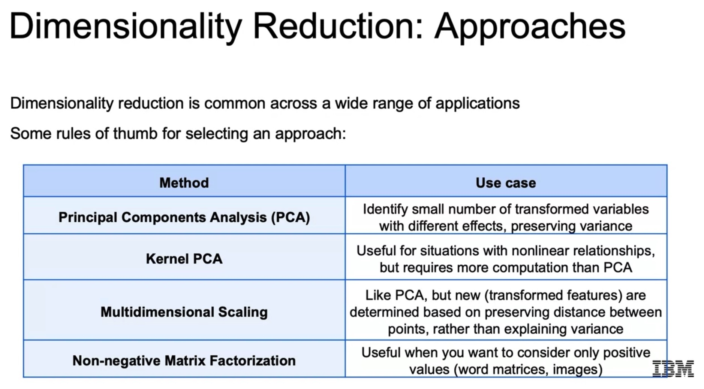

- PCA: compress
- Kernel PCA: compress for non-linear datasets
- MDS: transform to lower dimensions preserving distance; visualization
- NNMF: positive values, discover latent interpretable components

### 8.3 NLP Feature Extraction

This section is not present in the course videos, but references to it are done in the notebooks.

I very briefly add how features can be extracted from texts.

One common way of representing texts is using **bags of words**. Let's say we have a corpus of many documents of a similar type (e.g., articles, reviews, etc.); each document is a text. Then, we do the following:

- We tokenize (and maybe stem/lemmatize) all the words in the corpus.
- We create a vocabulary with all the unique words.
- We create a **document-term matrix (DTM)**, with
    - rows: documents
    - columns: tokens from vocabulary
    - cell content: presence/count/frequency of word in document

That DTM is our `X` and it can be used to perform supervised (e.g., classification, if we have document labels) or unsupervised learning (e.g., topic discovery).

The cell contents can be 
    
1. word presence: whether a word appears (1) or not (0) in the document
2. word count: how many times a word appears in the document
3. word frequency: **term frequency inverse document frequency (TF-IDF)** values

The first two options are realized with the [`CountVectorizer`](https://scikit-learn.org/stable/modules/generated/sklearn.feature_extraction.text.CountVectorizer.html). The last one is the most interesting one and it is realized with the [`TfidfVectorizer`](https://scikit-learn.org/stable/modules/generated/sklearn.feature_extraction.text.TfidfVectorizer.html#sklearn.feature_extraction.text.TfidfVectorizer). **Note that both have very important parameters, have a look at the documentation!**

The **term frequency inverse document frequency (TF-IDF)** consists in multiplying the count of that term in the document by the how rare that term is throughout all the documents we are looking at. That way, common but meaningless words (e.g., 'the', 'of', etc.) have a lower value.

#### Example

Two documents:

- *"We like dogs and cats"*
- *"We like cars and planes"*

`CountVectorizer()` yields:

| doc | We | like | and | dogs | cats | cars | planes |
| --- | -- | ---- | --- | ---- | ---- | ---- | ------ |
| 0   | 1  | 1    | 1   | 1    | 1    | 0    | 0      |
| 1   | 1  | 1    | 1   | 0    | 0    | 1    | 1      |

`TfidfVectorizer()` would yield:

| doc | We | like | and | dogs   | cats   | cars   | planes |
| --- | -- | ---- | --- | ------ | ------ | ------ | ------ |
| 0   | 1  | 1    | 1   | 1.6931 | 1.6931 | 0      | 0      |
| 1   | 1  | 1    | 1   | 0      | 0      | 1.6931 | 1.6931 |

The TF-IDF matrix would contain the following values for each document `d` and term `t` cell:

`idf(d,t) = ln((N/|d in D in which t in d|) + 1)`
`tfidf(d,t) = C(d,t) * idf(d,t)`

With:

- `N`: total number of documents in the corpus, `|D|`
- `|d in D in which t in d|`: number of documents in which the term `t` appears
- `C(d,t)`: how many times the term `t` appears in document `d`

However, note that `TfidfVectorizer()` additionally normalizes each row to have length 1.

### 8.4 Python Lab: NNMF for Text Topic Discovery

In this notebook,

`./lab/04e_DEMO_nmf.ipynb`

The BBC dataset is analyzed with NNMF.

The original files can be obtained [here](http://mlg.ucd.ie/files/datasets/bbc.zip), and they consist in:

- `bbc/bbc.mtx`: sparse matrix with (wordID, articleID, number of times wordId appeared articleId)
- `bbc/bbc.terms`: list of words/tokens in articles
- `bbc/bbc.docs`: list of articles encoded as topic+id

In the notebook, the sparse matrix in `bbc.mtx` is loaded and factorized into 5 topics; those 5 topics are then compared to the labels in `bbc.docs`.

**It is a very interesting notebook**.

Important links relate to the sparse matrices:

- [https://docs.scipy.org/doc/scipy/reference/sparse.html](https://docs.scipy.org/doc/scipy/reference/sparse.html)
- [https://docs.scipy.org/doc/scipy/reference/generated/scipy.sparse.coo_matrix.html](https://docs.scipy.org/doc/scipy/reference/generated/scipy.sparse.coo_matrix.html)


```python
import os
import urllib
import pandas as pd

### --- Load dataset

# bbc/bbc.terms: list of words
# bbc/bbc.docs: list of articles encoded as topic+id
# bbc/bbc.mtx: sparse matrix with (wordID, articleID, number of times wordId appeared articleId)
with open('bbc/bbc.mtx') as r:
    content = r.readlines()[2:]

# All words/terms; position is index-1
# Words are tokens that have some stemming
with open('bbc/bbc.terms') as r:
    words = r.readlines()
len(words) # 9635
# Remove final '\n' character
words = [w.split()[0] for w in words]
words[:5] # ['ad', 'sale', 'boost', 'time', 'warner']

# All document topics; position is index-1
with open('bbc/bbc.docs') as r:
    docs = r.readlines()
len(docs) # 2225
# Remove final '\n' character
# final index value is preserved, since it makes
# document name unique
docs = [d.split()[0] for d in docs]
docs[:4] # ['business.001', 'business.002', 'business.003', 'business.004']

# All topics, to be detected
# we remove the index value and get just the topic,
# with which we form a set
set([d.split('.')[0] for d in docs]) # {'business', 'entertainment', 'politics', 'sport', 'tech'}

### --- Process and prepare text features

# We convert the sparse matrix list into a list of tuples
# Important links:
# https://docs.scipy.org/doc/scipy/reference/sparse.html
# https://docs.scipy.org/doc/scipy/reference/generated/scipy.sparse.coo_matrix.html
sparsemat = [tuple(map(int,map(float,c.split()))) for c in content]
# Let's examine the first few elements
sparsemat[:8]
# [(1, 1, 1),
# (1, 7, 2),
# (1, 11, 1),
# (1, 14, 1),
# (1, 15, 2),
# (1, 19, 2),
# (1, 21, 1),
# (1, 29, 1)]

import numpy as np
from scipy.sparse import coo_matrix
# Since words and docs indices start with 1
# we need to substract 1!
rows = [x[1]-1 for x in sparsemat] # article
cols = [x[0]-1 for x in sparsemat] # words
values = [x[2] for x in sparsemat] # word count in article
# The sparse matrix is turned into an array
# or better said, a sparse matrix in COOrdinate format.
# Then, that object can be used by NMF or it can be transformed also into an array
# https://docs.scipy.org/doc/scipy/reference/generated/scipy.sparse.coo_matrix.html
coo = coo_matrix((values, (rows, cols)))

# Sparse representantion: (word, article, word count)
len(sparsemat) # 286774

# Sparse representation, but ready to be used
# as sparse or to transform into array
# Shape is the one of the array / expanded matrix: (articles, words)
# and it contains the counts
coo.shape # (2225, 9635)

# With .toarray() we can convert the sparse matrix
# into an expanded matrix.
# We can assemble everything now
# Now we can see why we want a sparse matrix:
# the data frame is full of zeros!
pd.DataFrame(data=coo.toarray(), columns=words, index=docs)

### --- Factorization

from sklearn.decomposition import NMF
# We had 5 unique topics, so we set the components to that value
model = NMF(n_components=5, init='random', random_state=818)
# We pass the sparse matrix, not the expanded
doc_topic = model.fit_transform(coo)

# The output doc_topic is the fist decomposition matrix
# we should have 2225 observations (articles) and five latent features
doc_topic.shape # (2225, 5)

# Find feature with highest topic-value per doc
np.argmax(doc_topic, axis=1)

# We can get the second decomposition matrix as follows
# For each topic, the importance of each word
# or vice versa: for each word, their important in each topic
model.components_.shape # (5, 9635)

### --- Analysis

topic_word = pd.DataFrame(data=model.components_.round(3),
                         columns=words,
                         index=['topic_1','topic_2','topic_3','topic_4','topic_5'])
topic_doc = pd.DataFrame(data=doc_topic.round(3),
                         index=[d.split('.')[0] for d in docs],
                         columns=['topic_1','topic_2','topic_3','topic_4','topic_5'])

# The mapping from topic_x to the topic label
topic_doc.reset_index().groupby('index').mean().idxmax()
# topic_1         politics
# topic_2         business
# topic_3            sport
# topic_4             tech
# topic_5    entertainment

# The most important 20 words for topic x
topic_word.T.sort_values(by='topic_5', ascending=False).head(20)

```

### 8.5 Python Lab: NLP Feature Extraction

In this notebook,

`./lab/tfidf-lab.jupyterlite.ipynb`

Document-Term matrices or frequency matrices are built from texts using [`CountVectorizer`](https://scikit-learn.org/stable/modules/generated/sklearn.feature_extraction.text.CountVectorizer.html) and [`TfidfVectorizer`](https://scikit-learn.org/stable/modules/generated/sklearn.feature_extraction.text.TfidfVectorizer.html#sklearn.feature_extraction.text.TfidfVectorizer).

It is a nice notebook which shows how to extract features from a corpus of documents.

```python
import re
import pandas as pd
import numpy as np
import sklearn
from sklearn.feature_extraction.text import CountVectorizer, TfidfTransformer

# We take only the text column, but there are some other columns, too:
# id, topic
df = pd.read_csv('tfidf.csv').iloc[:,1]
df.head(5)
# 0    Personally I have no idea what my IQ is. I’ve ...
# 1    I'm skeptical. A heavier lid would be needed t...
# ...

# Custom text processing function
def preprocess_text(text):
    text = text.lower()
    # Remove all digits 
    text = re.sub(r'\d+', '', text)
    return text

# Create the DTM or frequency matrix with count values
# max_features: top features taken, according to their frequency in corpus
# preprocessor: we can pass any custom function we'd like
cv = CountVectorizer(max_features = 500, preprocessor = preprocess_text)
tf_mat = cv.fit_transform(df)
# CountVectorizer.get_feature_names_out(): terms/tokens
tf = pd.DataFrame(tf_mat.toarray(), columns = cv.get_feature_names_out())
# 1586 rows × 500 columns

# TF-IDF: we pass the matrix of the CountVectorizer
tfidf_trans = TfidfTransformer()
tfidf_mat = tfidf_trans.fit_transform(tf)
# Convert to a dataframe
# TfidfTransformer normalizes each row to length 1
tfidf = pd.DataFrame(tfidf_mat.toarray(), columns = cv.get_feature_names_out())
# 1586 rows × 500 columns

# TfidfTransformer normalizes each row to length 1
# We can manually get the original
# or non-normalized TF-IDF as follows
pd.DataFrame(tfidf_trans.idf_ * tf.to_numpy(), columns = tfidf_trans.get_feature_names_out())

# Transform a sparse DTM into a stacked object
dense_tfidf = tfidf.stack()
# Visualize the non-zero values of the stacked object
# This is a denser representation
dense_tfidf[dense_tfidf != 0]

dense_tfidf.shape # (793000,)
# Number stacked entries = number DTM cells
tfidf.shape[0]*tfidf.shape[1] # 793000

# Undo the stacking
dense_tfidf.unstack()
```

### 8.6 Python Lab: NMF for Image Decomposition

In this notebook,

`./lab/Non-Negative_Matrix_Factorization.ipynb`

the [Anime Face Dataset](https://www.kaggle.com/datasets/splcher/animefacedataset) is analyzed.

The motivation is to find the most similar face pairs; additionally, the algorithm needs to be interpretable. NNMF is good at that: faces are decomposed into interpretable components that are summed.

I think this is a very interesting application, since similar faces are found (although they're not that similar). However, few new things are shown really.

In the following, I summarize the most interesting parts of the code.

```python
import os 
from os import listdir,getcwd
from os.path import isfile, join
from PIL import Image, ImageOps

import numpy as np
import pandas as pd
from numpy.random import RandomState
import matplotlib.pyplot as plt

from sklearn.decomposition import NMF

### --- Auxiliary Functions

# Load dataset
def get_data_matrix(test=False, Length=100, Width=100, mypath="images/"):
    # All filenames
    files = [join(mypath,f) for f in listdir(mypath) if isfile(join(mypath, f)) and f[0] != '.']
    if mypath + '/.DS_Store' in files:
        files.remove(mypath + '/.DS_Store')
  
    if test:
        print("test data")
        files=files[9000:10000]
        
    else:
        print("training data")
        files=files[0:9000]
        
    print(len(files))
    X=np.zeros((len(files), Length*Width))
    for i, file in enumerate(files):
        # Open image and resize
        img = Image.open(file).resize((Width, Length))
        # Convert to grayscale
        img =  ImageOps.grayscale(img)
        # Reshape to be one row of shape (1,Length*Width=10000)
        I=np.array(img)
        X[i,:]=I.reshape(1,-1)
    return X

# Reshape and plot
def reshape_row(x) :
    plt.imshow(x.reshape(Length,Width),cmap="gray")

# Output index if min_ < similar_distance < max_
def threshold(similar_distance, max_=0.1, min_=0):
    dataset_index = np.where(np.logical_and(similar_distance>min_, similar_distance<max_))[0]
    query_index=similar_index[np.logical_and(similar_distance>min_, similar_distance<max_)]
    return dataset_index, query_index

# Plot dataset images and query images, 
# X and X_q are global variables
def plot_data_query(dataset_index, query_index, N):
    for data_sample, query_sample in zip(dataset_index[0:N],query_index[0:N]):

        plt.figure(figsize=(10,4))
        plt.subplot(1,2,1)
        reshape_row(X[data_sample])
        plt.title("dataset sample {}".format(data_sample))
        plt.subplot(1,2,2)
        reshape_row(X_q[query_sample])
        plt.title("query sample match {}".format(query_sample))
        plt.show()

        print("-----------------------------------------------------")

### --- Load Dataset

Length, Width = 100, 100
X = get_data_matrix(test=False, Length=Length, Width=Width, mypath="images")
X.shape # (9000, 10000)

### --- Non-Negative Matrix Factorization

# Number of components in the basis
n_components = 10
nmf_estimator = NMF(n_components=n_components, tol=5e-3, max_iter=2000)
nmf_estimator.fit(X)  # original non- negative dataset

# Components / Basis
H = nmf_estimator.components_
# Transform all the images to the new basis
# For each image, we get the weight of each component
W = nmf_estimator.transform(X)
W.shape # (9000, 10)

# Plot components
plt.figure(figsize=(25, 8))
for i,h in enumerate(H):   
    plt.subplot(2, 5, i+1)
    reshape_row(h)
    plt.title("basis images {}".format(str(i+1)), fontsize=20) 
    
plt.tight_layout()

# Get the component weights of an image i
i = 0
w = W[i,:]
# The encoding tells you the projection of each image in X on a particular basis
# component 2 has a large weight, whereas component 9 has weight 0.0
plt.bar([n+1 for n in range(len(w))],w)
plt.title("encodings for image {} ".format (i+1))

# Inverse transform: approximated images
Xhat = nmf_estimator.inverse_transform(W)

plt.figure(figsize=(20,8))
# Plot original image and approximated image
for i in range(1,5):
    plt.subplot(2,4,i)
    reshape_row(X[i])
    plt.title(f"Original image {i}")
    
    plt.subplot(2,4,i+4)
    reshape_row(Xhat[i])
    plt.title(f"Approximated image {i}")

### --- Image Retrieval

X_q = get_data_matrix(test=True,Length=100,Width=100,mypath="images")
X_q.shape # (1000, 10000)

W_q = nmf_estimator.transform(X_q)
W_q.shape # (1000, 10)

from sklearn.metrics import pairwise_distances

# calculates the pairwise distance between the NNMF encoded version of 
# the original dataset W and the encoded version of the query dataset W_q
D = pairwise_distances(W,W_q,metric='cosine')

D.shape # (9000, 1000)

similar_index = np.argmin(D, axis=1)
similar_index.shape # (9000,)

similar_distance = np.min(D, axis=1)
similar_distance.shape # (9000,)

plt.hist(similar_distance, bins=100)
plt.title("Distance values")

# get images that are close within a tolerance
dataset_index, query_index = threshold(similar_distance, max_=0.00001, min_=0)

dataset_index.shape, query_index.shape
# ((49,), (49,))

dataset_index[:10]
# array([ 102,  165,  332,  498,  936, 1141, 1183, 1322, 1673, 1714])
query_index[:10]
# array([410, 584, 196, 948, 143,  57, 762, 432, 527, 434])

# Plot similar images: train (dataset) vs test (query)
dataset_index,query_index=threshold(similar_distance,max_=0.005,min_=0.00001)
plot_data_query(dataset_index,query_index,5)

```

## 9. Project

### Requirements

Print PDF with text, code not compulsory.

- Section describing the dataset
- Paragraph with objective of the analysis: clustering / dimensionality reduction; benefits for stakeholders?
- Brief description of data processing: EDA, FE, etc.
- Unsupervised learning model: why good? at least 3 variations (e.g., 3 clustering algorithms, 3 different hyperparameter sets)?
- Key findings
- Action plans to fix flaws, next steps

### Repository

- [music_genre_classification](https://github.com/mxagar/music_genre_classification) `/ data_analysis / UnsupervisedLearning.ipynb`
- [nips_topic_identification](https://github.com/mxagar/nips_topic_identification)


