# Deep Learning and Reinforcement Learning

These are my notes and the code of the [IBM Machine Learning Professional Certificate](https://www.coursera.org/professional-certificates/ibm-machine-learning) offered by IBM & Coursera.

The Specialization is divided in 6 courses, and each of them has its own folder with its guide & notebooks:

1. [Exploratory Data Analysis for Machine Learning](https://www.coursera.org/learn/ibm-exploratory-data-analysis-for-machine-learning?specialization=ibm-machine-learning)
2. [Supervised Machine Learning: Regression](https://www.coursera.org/learn/supervised-machine-learning-regression?specialization=ibm-machine-learning)
3. [Supervised Machine Learning: Classification](https://www.coursera.org/learn/supervised-machine-learning-classification?specialization=ibm-machine-learning)
4. [Unsupervised Machine Learning](https://www.coursera.org/learn/ibm-unsupervised-machine-learning?specialization=ibm-machine-learning)
5. [Deep Learning and Reinforcement Learning](https://www.coursera.org/learn/deep-learning-reinforcement-learning?specialization=ibm-machine-learning)
6. [Specialized Models: Time Series and Survival Analysis](https://www.coursera.org/learn/time-series-survival-analysis?specialization=ibm-machine-learning)

This file focuses on the **fifth course: Deep Learning and Reinforcement Learning**

In contrast to the other courses of the Specialization, I've taken few notes this time; I you're interested in more details on Deep Learning, I suggest you to visit my repository [deep_learning_udacity](https://github.com/mxagar/deep_learning_udacity).

Also, **check my [`DL_Keras_Guide.md`](https://github.com/mxagar/deep_learning_udacity/blob/main/02_Keras_Guide/DL_Keras_Guide.md)**, located in that repository.

Mikel Sagardia, 2022.  
No guarantees

## Table of Contents

- [Deep Learning and Reinforcement Learning](#deep-learning-and-reinforcement-learning)
  - [Table of Contents](#table-of-contents)
  - [1. Introduction](#1-introduction)
    - [1.1 Introduction to Neural Networks](#11-introduction-to-neural-networks)
    - [1.2 Gradient Descend](#12-gradient-descend)
    - [1.3 Lab: Gradient Descend and Neural Networks](#13-lab-gradient-descend-and-neural-networks)
    - [1.4 Backpropagation and Activation Functions](#14-backpropagation-and-activation-functions)
    - [1.5 Lab: Backpropagation](#15-lab-backpropagation)
    - [1.6 Regularization](#16-regularization)
    - [1.7 Optimizers](#17-optimizers)
    - [1.8 Data Shuffling](#18-data-shuffling)
    - [1.9 Loss Functions](#19-loss-functions)
  - [2. Keras: Basics](#2-keras-basics)
  - [3. Convolutional Neural Networks (CNNs)](#3-convolutional-neural-networks-cnns)
    - [3.1 Main Concepts](#31-main-concepts)
    - [3.2 Lab: CNNs on CIFAR-10](#32-lab-cnns-on-cifar-10)
    - [3.3 Transfer Learning](#33-transfer-learning)
    - [3.4 Lab: Transfer Learning](#34-lab-transfer-learning)
    - [3.5 Custom Datasets](#35-custom-datasets)
    - [3.6 Popular CNN Architectures](#36-popular-cnn-architectures)
  - [4. Recurrent Neural Networks (RNN)](#4-recurrent-neural-networks-rnn)
    - [4.1 Simple RNN Networks](#41-simple-rnn-networks)
    - [4.2 Lab: SimpleRNN](#42-lab-simplernn)
    - [4.3 Long Short-Term Memory (LSTM) Units](#43-long-short-term-memory-lstm-units)
      - [Gated Recurrent Units (GRUs)](#gated-recurrent-units-grus)
    - [4.4 RNN Architectures](#44-rnn-architectures)
      - [Sequence to Sequence Models: Seq2Seq](#sequence-to-sequence-models-seq2seq)
    - [4.5 Times Series](#45-times-series)
  - [5. Autoencoders](#5-autoencoders)
    - [5.1 Variational Autoencoders (VAE)](#51-variational-autoencoders-vae)
      - [Disentangled Variational Autoencoders ($\\beta$-VAE)](#disentangled-variational-autoencoders-beta-vae)
    - [5.2 Lab: Autoencoders](#52-lab-autoencoders)
    - [5.3 Lab: Autoencoders 2](#53-lab-autoencoders-2)
  - [6. Generative Adversarial Networks](#6-generative-adversarial-networks)
  - [7. Reinforcement Learning](#7-reinforcement-learning)

## 1. Introduction

### 1.1 Introduction to Neural Networks

Concepts introduced:

- Nodes = neurons.
- Input: `x` (vector).
- Weights, bias: packed into matrices: `W (n x m), n input nodes & m output nodes`.
- Raw output of a neuron: linear combination of inputs scaled by weights: `z` (vector).
- Output of a neuron, `z`, is activated, resulting in the input for next layer: `a = f(z)` (vector).
- Activation function for non-linearity: sigmoid: `f = sigmoid()`.
- Perceptron model = logistic regression!
- Nice property of sigmoid: `f' = f(1-f)`.
- By stacking neurons in layers and layers in networks, we can have very complex decision boundaries.
- MLP = Multi-Layer Perceptron.
- There are MLP models in Scikit-Learn, but we'll use Tensorflow/Keras.
- If multi-class classification, last activation is softmax.
- Always scale data so that weight values remain in the same range!
- Deep learning requires large datasets (i.e., many rows).

Vector sizes: even though I wrote that `x`, `z`, `a` are vectors, they can indeed be matrices. Indeed, that's what happens with batches:

    x (b, n)
    W (n, m)
    z = x.W (b, n).(n, m) = (b, m)
    a = f(z) (b, m)

### 1.2 Gradient Descend

Concepts introduced:

- Error: difference between prediction and real label/value.
- Cost function = error: expressed in function of model parameters: `J()`.
- Minimum cost function is found in gradient descend.
- The gradient of the cost function points in the direction of the **largest increase**; so **we take the opposite direction**.
- Gradient: vector of partial derivatives of `J` wrt. each parameter: `dJ/dw_i`.
- Weight update with learning rate: `w_new <- w_old - learning_rate*[dJ/dw_i]`.
- Stochastic gradient descend: in gradient descend we compute the error/cost considering all samples; in stochastic gradient descend we take one random sample. That's more noisy.
- Mini-batch gradient descend: we compute the cost with a batch of samples. Best of both worlds: less noisy and less intensive.
- Epoch: single pass through all training data
  - In batch gradient descend an epoch is one step.
  - In SGD on epoch is many steps, as many as samples.
  - In mini-batch GD, one epoch is also many steps, as many as number of batches.

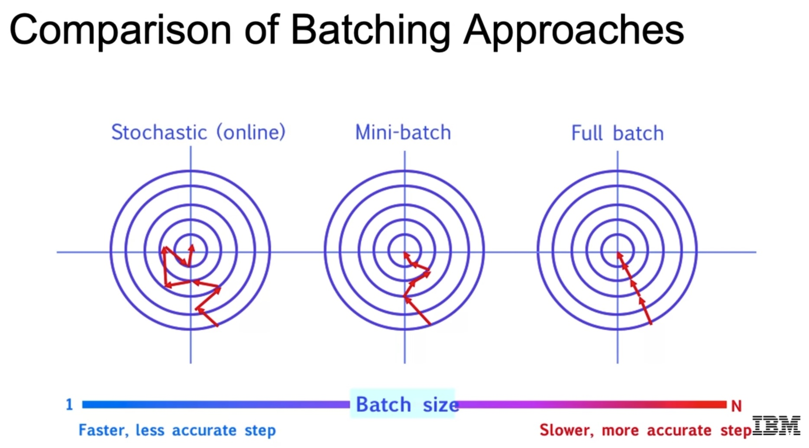

### 1.3 Lab: Gradient Descend and Neural Networks

Notebooks provided and commented:

- `05a_DEMO_Gradient_Descent.ipynb`
- `05b_LAB_Intro_NN.ipynb`

In the first notebook (`05a`), linear regression is solved  with the closed form formula, gradient descend and stochastic gradient descend. The results are compared. We use gradient descend or its variants for MLPs and deep learning because no closed form formula exists for solving them.

The second notebook (`05b`) has two parts:

- First, a logic gate consisting of a single neuron with 2 input values and a sigmoid activation is built. It has two weights and a bias term. The idea is that we can model many logic gates with a single neuron: `AND, OR, NAND`, etc. However, it fails with `XOR`. The `XOR` logic gate return true only if one input is true and the other false; in order to build such a gate we need to stack two layers of neurons!
- Second, a feed forward pass in a simple neural network is done with matrices.

### 1.4 Backpropagation and Activation Functions

Backpropagation consists in propagating the error derivative backwards in the network so that we can compute every `dJ/dw_i`, i.e., the partial derivative of the cost with respect to each of the weights. Then, with that derivative, we can update each weight. All these derivatives form the gradient.

The derivatives are obtained by applying the chain rule. In practice, we see that the derivatives seem to be the error fed backwards in the network:


Vanishing gradient problem: since we chain multiplications and the slope of the sigmoid is small at extremes, products become very small, so the gradient vanishes. A solution is to use other activation functions, such as ReLU.

Typical activation functions:

- Sigmoid: problems with vanishing gradient.
- Hyperbolic tangent: stretched sigmoid; also prone to vanishing gradient.
- ReLU: Rectified Linear Unit. Better than sigmoid and `tanh`; bit for negative values we don't learn anything.
- Leaky ReLU: a slope is added for negative values in the ReLU function, so we can learn something. However, leaky ReLUs are not always better than ReLU!

### 1.5 Lab: Backpropagation

Notebook provided and commented: `05c_DEMO_Backpropagation.ipynb`.

A simple neural network with a hidden layer is defined with numpy and the feedforward and backpropagation passes are carried out manually. 

### 1.6 Regularization

Deep NN: Those with >=2 hidden layers; the more hidden layers, the more complex patterns that can be learned. But we risk overfitting = learning noise and not being able to generalize.

Regularization: any technique done to reduce generalization error, but not the training error:

- Regularization penalty in cost function; we can do that also with neural networks.
- Dropout. Typical method in NNs. We need to scale weights with `p` during test time if they were cancelled with `p` probability during training!
- Early stopping: Check validation error and stop as it starts increasing.
- Stochastic GD or mini-batch GD regularize the training, too, because we don't fit the dataset perfectly.

### 1.7 Optimizers

Optimizers perform the weight update; the easiest optimizer is gradient descend:

    w_new <- w_old - learning_rate * [dJ/d_w_i]

However, there are many more optimizers.

**Momentum**: use running average of the previous steps; momentum is the factor that scales the influence of all previous steps. Common value: `eta = 0.9`. Often times, the learning rate is chosen as `alpha = 1 - eta`. The effect of using momentum is that we smooth out the steps, as compared to stochastic/gradient descend.

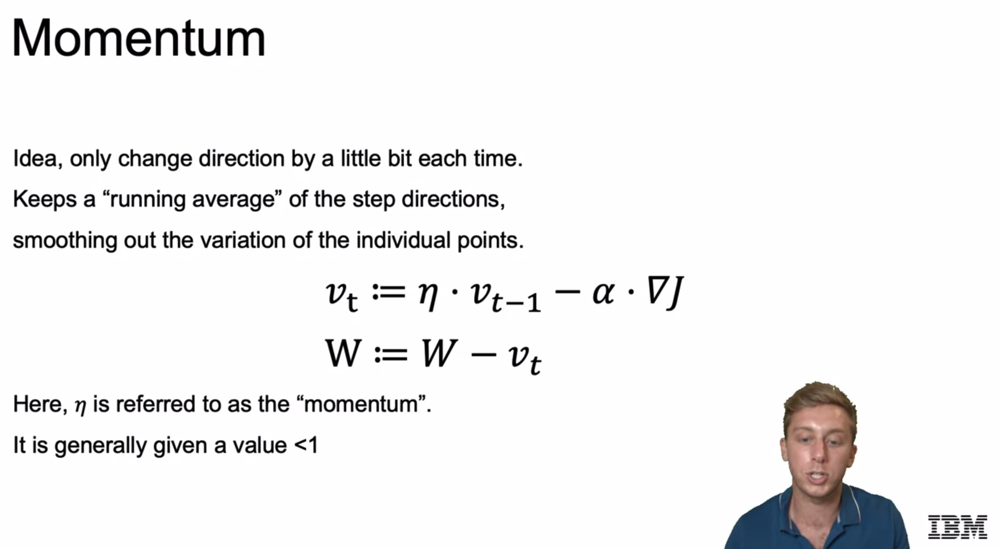

**Nesterov Momentum**: momentum alone can overshoot the optimum solution. Nesterov momentum controls that overshooting. The effect is that the steps are even more smooth.

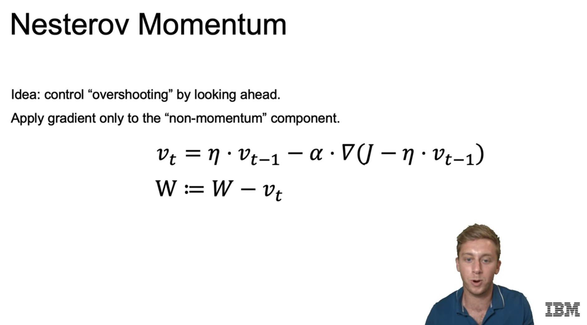

**AdaGrad**: Adaptive gradient algorithm:

- Frequently updated weights are updated less.
- We track the value `G`, sum of previous gradients, which increases every iteration and divide each learning rate with it.
- Effect: as we get closer to the solution, the learning rate is smaller, so we avoid overshooting.

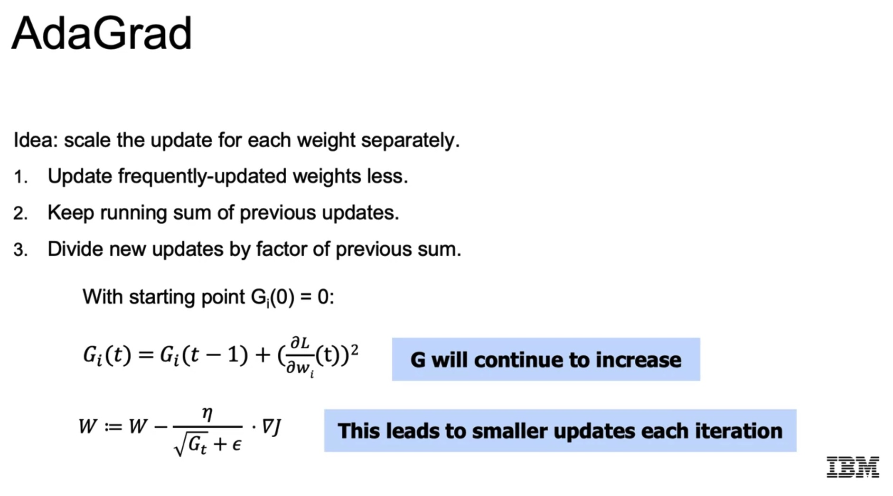

**RMSProp**: Root mean square propagation. Similar to AdaGrad, but more efficient. It tracks `G`, but older gradients have a smaller weight; the effect is that newer gradients have more impact.

**Adam**: Momentum and RMSProp combined. We have two parameters to tune, which have these default values:

- `beta1 = 0.9`
- `beta2 = 0.999`

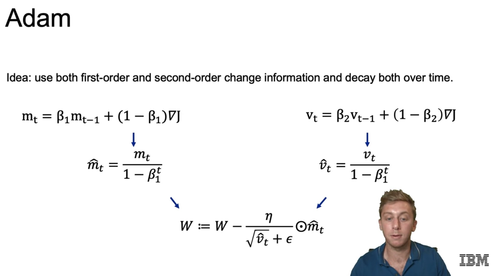

Which one should we use? Adam and RMSProp are very popular and work very well: they're fast. However, if we have convergence issues, we should try simple optimizers, like stochastic gradient descend.

### 1.8 Data Shuffling

We need to shuffle our data every epoch to avoid cyclical movement and doing the same path every epoch! When we shuffle, the batches are different each time, and of course, the order is not the same.

### 1.9 Loss Functions

See also: [keras/losses](https://www.tensorflow.org/api_docs/python/tf/keras/losses).

- Regression:
    - `MeanSquaredError()`
    - `MeanAbsoluteError()`
    - `cosine_similarity()`
    - ...
- Classification:
    - `BinaryCrossentropy()`
    - Multi-class: `CategoricalCrossentropy()`
    - ...

## 2. Keras: Basics

In this section, the following notebook is shown, which introduces how the workflow and calls in Tensorflow/Keras work:

`05d_LAB_Keras_Intro.ipynb`

The [Diabetes Dataset](https://archive.ics.uci.edu/ml/datasets/diabetes) is used and a random forest is compared to a very simple neural network.

Random forests and gradient boosting methods (e.g., XGBoost) often outperform neural networks for tabular data; that's the case also here.

With neural network it's very important to use a validation split and to plot the learning curves. We should also vary the used optimizer, the learning rate, activation functions, etc.

Notes:

- Neural networks are not the best option for tabular data.
- Neural networks require large datasets (many rows).

Most important code blocks:

1. Imports
2. Load and prepare dataset: split + normalize
3. Define model: Sequential + Compile (Optimizer, Loss, Metrics)
4. Train model
5. Evaluate model and Inference
6. Save and Load

```python

#####
## 1. Imports
#####

# Import basic ML libs
import numpy as np
import pandas as pd
import matplotlib.pyplot as plt
import seaborn as sns
from sklearn.model_selection import train_test_split
from sklearn.preprocessing import StandardScaler
from sklearn.metrics import confusion_matrix, precision_recall_curve, roc_auc_score, roc_curve, accuracy_score

# Import Keras objects for Deep Learning
from tensorflow.keras.models  import Sequential
from tensorflow.keras.layers import Input, Dense, Flatten, Dropout, BatchNormalization
from tensorflow.keras.optimizers import Adam, SGD, RMSprop
from tensorflow.keras.models import load_model

#####
## 2. Load and prepare dataset: split + normalize
#####

# Load in the data set 
names = ["times_pregnant",
         "glucose_tolerance_test",
         "blood_pressure",
         "skin_thickness",
         "insulin", 
         "bmi",
         "pedigree_function",
         "age",
         "has_diabetes"]
diabetes_df = pd.read_csv('diabetes.csv', names=names, header=0)

print(diabetes_df.shape) # (768, 9): very small dataset to do deep learning

# Split and scale
X = diabetes_df.iloc[:, :-1].values
y = diabetes_df["has_diabetes"].values
X_train, X_test, y_train, y_test = train_test_split(X, y, test_size=0.25, random_state=11111)

normalizer = StandardScaler()
X_train_norm = normalizer.fit_transform(X_train)
X_test_norm = normalizer.transform(X_test)

#####
## 3. Define model: Sequential + Compile (Optimizer, Loss, Metrics)
#####

# Define a fully connected model 
# - Input size: 8-dimensional
# - Hidden layers: 2 layers, 12 hidden nodes/each, relu activation
# - Dense layers: we specify number of OUTPUT units; for the first layer we specify the input_shape, too
# - Activation: we can either add as layer add(Activation('sigmoid')) or as parameter of Dense(activation='sigmoid')
# - Without an activation function, the activation is linear, i.e. f(x) = x -> regression
# - Final layer has just one node with a sigmoid activation (standard for binary classification)
model = Sequential()
model.add(Dense(units=12, input_shape=(8,), activation='relu'))
model.add(Dense(units=12, input_shape=(8,), activation='relu'))
model.add(Dense(units=1, activation='sigmoid'))

# Summary, parameters
model.summary()

# Compile: Set the the model with Optimizer, Loss Function and Metrics
model.compile(optimizer=SGD(lr = .003),
                loss="binary_crossentropy", 
                metrics=["accuracy"])
# Other options:
# For a multi-class classification problem
# model.compile(optimizer='adam',
#               loss='categorical_crossentropy',
#               metrics=['accuracy']) # BUT: balanced
# For a binary classification problem
# model.compile(optimizer='adam',
#               loss='binary_crossentropy',
#               metrics=['accuracy']) # BUT: balanced
# For a mean squared error regression problem
# model.compile(optimizer='adam',
#               loss='mse')
#
# opt = keras.optimizers.Adam(learning_rate=0.01)
# opt = keras.optimizers.SGD(learning_rate=0.01)
# opt = keras.optimizers.RMSprop(learning_rate=0.01)
# ...
# model.compile(..., optimizer=opt)

#####
## 4. Train model
#####

# Train == Fit
# We pass the data to the fit() function,
# including the validation data
# The fit function returns the run history:
# it contains 'val_loss', 'val_accuracy', 'loss', 'accuracy'
run_hist = model.fit(X_train_norm,
                         y_train,
                         validation_data=(X_test_norm, y_test),
                         epochs=200)

#####
## 5. Evaluate model and Inference
#####

# Two kinds of predictions
# One is a hard decision,
# the other is a probabilitistic score.
y_pred_class_nn_1 = model.predict_classes(X_test_norm) # {0, 1}
y_pred_prob_nn_1 = model.predict(X_test_norm) # [0, 1]

# Print model performance and plot the roc curve
print('accuracy is {:.3f}'.format(accuracy_score(y_test,y_pred_class_nn_1))) # 0.755
print('roc-auc is {:.3f}'.format(roc_auc_score(y_test,y_pred_prob_nn_1))) # 0.798

# Plot ROC
def plot_roc(y_test, y_pred, model_name):
    fpr, tpr, thr = roc_curve(y_test, y_pred)
    fig, ax = plt.subplots(figsize=(8, 8))
    ax.plot(fpr, tpr, 'k-')
    ax.plot([0, 1], [0, 1], 'k--', linewidth=.5)  # roc curve for random model
    ax.grid(True)
    ax.set(title='ROC Curve for {} on PIMA diabetes problem'.format(model_name),
           xlim=[-0.01, 1.01], ylim=[-0.01, 1.01])

plot_roc(y_test, y_pred_prob_nn_1, 'NN')

# Learning curves
run_hist_1.history.keys() # ['val_loss', 'val_accuracy', 'loss', 'accuracy']
fig, ax = plt.subplots()
ax.plot(run_hist_1.history["loss"],'r', marker='.', label="Train Loss")
ax.plot(run_hist_1.history["val_loss"],'b', marker='.', label="Validation Loss")
ax.legend()

# Learning curves: Another option
losses = pd.DataFrame(model.history.history)
losses.plot()

# We can further train it!
# That's sensible if curves are descending
run_hist_ = model.fit(X_train_norm, y_train, validation_data=(X_test_norm, y_test), epochs=1000)

# Also: evaluate
# Evaluate the model: Compute the average loss for a new dataset = the test split
model.evaluate(X_test_norm,y_test)

#####
## 6. Save and Load
#####

model.save('my_model.h5')
later_model = load_model('my_model.h5')
later_model.predict(X_test_norm.iloc[101, :])
```

## 3. Convolutional Neural Networks (CNNs)

### 3.1 Main Concepts

Very brief notes on the main concepts:

- Fully connected too many parameters
- Images contain object that need to be identified with invariance wrt
  - Translation
  - Size/scale
  - Rotation
- Pixel values change few values in their neighborhood unless we have edges or salient texture.
- Convolutional layers: 
  - Kernels or grid are overlaid on image patches centered in a pixel.
  - Kernel grid is multiplied one-by-one to pixel values beneath.
  - Sum is the result of the center pixel.
  - Kernel is strided/swept along the X & Y axes of the image.
- Kernels are filters: low pass (blur) or high pass (edges).
- The weights of the kernels are learnt.
- Convolutional kernels require much less parameters than dense/fully connected layers and are much better suited to the spatial information contained in images.

Common settings/parameters:

- **Kernel size**: width and height pixels of the filters; usually square kernels are applied with odd numbers: `3 x 3` (recommended), `5 x 5` (less recommended, because more parameters).
- **Padding**: so that we can use corner/edge pixels as centers for the kernels, we add extra pixels on the edges corner; usually, the added pixels have value 0, i.e., *zero-padding*.
  - If we add no padding, the output activation map will be smaller than the input.
  - To conserve image size: `padding = (F-1)/2` with `F` kernel/filter size.
- **Stride**: movement of the kernel in X & Y directions.
  - Usually same stride is used in X & Y.
  - If `stride > 2` we're dividing the image size by `stride`.
- **Depth**: number of channels; we have input and output channels.
  - Each input image has `n` channels.
  - Each output image/map has `N` channels.
  - We have `N` filters, each with `n` kernels applied to the input image.

Another important layer in CNNs: **Pooling**: Pooling reduces image size by mapping an image patch to a value. Commonly `2 x 2` pooling is done, using as stride the pooling window size (i.e., no overlap). We have different types:

- Max-pooling.
- Average-pooling.

### 3.2 Lab: CNNs on CIFAR-10

In this section, this notebook is explained:

`05e_DEMO_CNN.ipynb`

In it, the [CIFAR-10](https://www.cs.toronto.edu/~kriz/cifar.html) dataset is used, which consists of 60000 32x32 color images in 10 classes, with 6000 images per class. There are 50000 training images and 10000 test images. Check the current [performance results here](http://rodrigob.github.io/are_we_there_yet/build/classification_datasets_results.html).

The 10 classes are:

<ol start="0">
<li> airplane
<li> automobile
<li> bird
<li> cat
<li> deer
<li> dog
<li> frog
<li> horse
<li> ship
<li> truck
</ol>

In the notebook, the following steps are carried out:

1. Imports
2. Load dataset
3. Prepare dataset: encode & scale
4. Define model
5. Train model
6. Evaluate model

```python

###
# 1. Imports
##

import keras
#from tensorflow.keras.datasets import cifar10
#from tensorflow.keras.preprocessing.image import ImageDataGenerator
#from tensorflow.keras.models import Sequential
#from tensorflow.keras.layers import Dense, Dropout, Activation, Flatten
#from tensorflow.keras.layers import Conv2D, MaxPooling2D
from keras.datasets import cifar10
from keras.preprocessing.image import ImageDataGenerator
from keras.models import Sequential
from keras.layers import Dense, Dropout, Activation, Flatten
from keras.layers import Conv2D, MaxPooling2D
import matplotlib.pyplot as plt

###
# 2. Load dataset
##

# The data, shuffled and split between train and test sets:
(x_train, y_train), (x_test, y_test) = cifar10.load_data()
print('x_train shape:', x_train.shape) # (50000, 32, 32, 3)
print(x_train.shape[0], 'train samples') # 50000 train samples
print(x_test.shape[0], 'test samples') # 10000 test samples

###
# 3. Prepare dataset: encode & scale
##

# Each image is a 32 x 32 x 3 numpy array
x_train[444].shape

# Visualize the images
print(y_train[444]) # [9]
plt.imshow(x_train[444]);

# One-hot encoding in Keras/TF
num_classes = 10
y_train = keras.utils.to_categorical(y_train, num_classes)
y_test = keras.utils.to_categorical(y_test, num_classes)

y_train[444] # [0., 0., 0., 0., 0., 0., 0., 0., 0., 1.]

# Let's make everything float and scale
x_train = x_train.astype('float32')
x_test = x_test.astype('float32')
x_train /= 255
x_test /= 255

###
# 4. Define model
##

# Let's build a CNN using Keras' Sequential capabilities

model = Sequential()

# Conv2D has these parameters:
# - filters: the number of filters used (= depth of output)
# - kernel_size: an (x,y) tuple giving the height and width of the kernel
# - strides: an (x,y) tuple giving the stride in each dimension; default and common (1,1)
# - input_shape: required only for the first layer (= image channels)
# - padding: "valid" = no padding, or "same" = zeros evenly;
# When padding="same" and strides=1, the output has the same size as the input
# Otherwise, general formula for the size:
# W_out = (W_in + 2P - F)/S + 1; P: "same" = (F-1)/2 ?
model.add(Conv2D(filters=32,
                   kernel_size=(3,3), # common
                   padding='same', # 
                   strides=(1,1), # common, default value
                   input_shape=x_train.shape[1:]))
# We can specify the activation as a layer (as done here)
# or in the previous layer as a parameter
model.add(Activation('relu'))
model.add(Conv2D(32, (3, 3)))
model.add(Activation('relu'))
# Parameters od MaxPooling2D:
# - pool_size: the (x,y) size of the grid to be pooled; 2x2 (usual) halvens the size
# - strides: assumed to be the pool_size unless otherwise specified
# - padding: assumed "valid" = no padding
model.add(MaxPooling2D(pool_size=(2, 2)))
model.add(Dropout(0.25))

model.add(Conv2D(64, (3, 3), padding='same'))
model.add(Activation('relu'))
model.add(Conv2D(64, (3, 3)))
model.add(Activation('relu'))
model.add(MaxPooling2D(pool_size=(2, 2)))
model.add(Dropout(0.25))

# Flatten appears when going from convolutional layers to
# fully connected layers.
model.add(Flatten())
model.add(Dense(units=512))
model.add(Activation('relu'))
model.add(Dropout(0.5))
model.add(Dense(units=num_classes))
model.add(Activation('softmax'))

# Always check number of paramaters!
model.summary()

###
# 5. Train model
##

# initiate RMSprop optimizer
opt = keras.optimizers.RMSprop(lr=0.0005)

# Let's train the model using RMSprop
model.compile(loss='categorical_crossentropy',
              optimizer=opt,
              metrics=['accuracy'])

# Note that here we pass batch_size and epochs!
model.fit(x_train, y_train,
              batch_size=batch_size,
              epochs=5,
              validation_data=(x_test, y_test),
              shuffle=True)

###
# 6. Evaluate model
##

# Validation loss and Validation accuracy
model.evaluate(x_test, y_test)

# Manual computation of the accuracy
import numpy as np
from sklearn.metrics import accuracy_score

y_pred = model.predict_classes(x_test)
y_true = np.argmax(y_test, axis=1) # undo one-hot encoding
print(accuracy_score(y_true, y_pred))

```

### 3.3 Transfer Learning

- First layers learn filter weights able to detect edges; as we go deeper, the learned shapes start getting more complex.
- Edges and simple shapes generalize well, that's why we can apply transfer learning: we take the backbone/initial part of the trained complex CNN and re-use it for our application. Last layers (the classifier) are the ones that are trained.
- Possible transfer learning techniques:
    - Only the classifier: transfer learning
    - Additional training of the pre-trained network: fine tuning
        - We can choose to re-train the entire network using as initialization the pre-trained weights or we can select an amount of layers.
    - Which one should we use?
        - The more similar the datasets, the less fine-tuning necessary.
        - The more data we have available, the more the model will benefit from fine-tuning

### 3.4 Lab: Transfer Learning

In this section, this notebook is explained:

`05f_DEMO_Transfer_Learning.ipynb`

In it, the MNIST dataset is used. First, a model is trained with the digits `0-4`; then, we freeze the *feature layer* weights and apply transfer learning to the model in which only the *classifier layers* are re-trained with the digits `5-9`. The training is faster because we train only the classifier.

Most important steps:

1. Imports
2. Define parameters
3. Define data pre-processing + training function
4. Load dataset + split
5. Train: Digits 5-9
6. Freeze feature layers and re-train with digits 0-4

```python

###
# 1. Imports
###

import datetime
import keras
from keras.datasets import mnist
from keras.models import Sequential
from keras.layers import Dense, Dropout, Activation, Flatten
from keras.layers import Conv2D, MaxPooling2D
from keras import backend as K
#from tensorflow import keras
#from tensorflow.keras.datasets import mnist
#from tensorflow.keras.models import Sequential
#from tensorflow.keras.layers import Dense, Dropout, Activation, Flatten
#from tensorflow.keras.layers import Conv2D, MaxPooling2D
#from tensorflow.keras import backend as K

# Used to help some of the timing functions
now = datetime.datetime.now

###
# 2. Define parameters
###

# set some parameters
batch_size = 128
num_classes = 5
epochs = 5

# set some more parameters
img_rows, img_cols = 28, 28
filters = 32
pool_size = 2
kernel_size = 3

## This just handles some variability in how the input data is loaded
if K.image_data_format() == 'channels_first':
    input_shape = (1, img_rows, img_cols)
else:
    input_shape = (img_rows, img_cols, 1)

###
# 3. Define data pre-processing + training function
###

# To simplify things, write a function to include all the training steps
# As input, function takes a model, training set, test set, and the number of classes
# Inside the model object will be the state about which layers we are freezing and which we are training
def train_model(model, train, test, num_classes):
    # train = (x_train, y_train)
    # test = (x_test, y_test)
    x_train = train[0].reshape((train[0].shape[0],) + input_shape) # (60000, 28, 28, 1)
    x_test = test[0].reshape((test[0].shape[0],) + input_shape) # (60000, 28, 28, 1)
    x_train = x_train.astype('float32')
    x_test = x_test.astype('float32')
    x_train /= 255
    x_test /= 255
    print('x_train shape:', x_train.shape)
    print(x_train.shape[0], 'train samples')
    print(x_test.shape[0], 'test samples')

    # convert class vectors to binary class matrices
    y_train = keras.utils.to_categorical(train[1], num_classes)
    y_test = keras.utils.to_categorical(test[1], num_classes)

    model.compile(loss='categorical_crossentropy',
                  optimizer='adadelta',
                  metrics=['accuracy'])
    # Measure time
    t = now()
    model.fit(x_train, y_train,
              batch_size=batch_size,
              epochs=epochs,
              verbose=1,
              validation_data=(x_test, y_test))
    print('Training time: %s' % (now() - t)) # Measure time

    score = model.evaluate(x_test, y_test, verbose=0)
    print('Test score:', score[0])
    print('Test accuracy:', score[1])

###
# 4. Load dataset + split
###

# the data, shuffled and split between train and test sets
(x_train, y_train), (x_test, y_test) = mnist.load_data()

# create two datasets: one with digits below 5 and the other with 5 and above
x_train_lt5 = x_train[y_train < 5]
y_train_lt5 = y_train[y_train < 5]
x_test_lt5 = x_test[y_test < 5]
y_test_lt5 = y_test[y_test < 5]

x_train_gte5 = x_train[y_train >= 5]
y_train_gte5 = y_train[y_train >= 5] - 5
x_test_gte5 = x_test[y_test >= 5]
y_test_gte5 = y_test[y_test >= 5] - 5

x_train.shape # (60000, 28, 28)
y_train.shape # (60000,)
input_shape # (28, 28, 1)

###
# 5. Define model: feature layers + classifier
###

# Define the "feature" layers.  These are the early layers that we expect will "transfer"
# to a new problem.  We will freeze these layers during the fine-tuning process
feature_layers = [
    Conv2D(filters, kernel_size,
           padding='valid',
           input_shape=input_shape),
    Activation('relu'),
    Conv2D(filters, kernel_size),
    Activation('relu'),
    MaxPooling2D(pool_size=pool_size),
    Dropout(0.25),
    Flatten(),
]

# Define the "classification" layers.  These are the later layers that predict the specific classes from the features
# learned by the feature layers.  This is the part of the model that needs to be re-trained for a new problem
classification_layers = [
    Dense(128),
    Activation('relu'),
    Dropout(0.5),
    Dense(num_classes),
    Activation('softmax')
]

# We create our model by combining the two sets of layers as follows
model = Sequential(feature_layers + classification_layers)

# Let's take a look: see "trainable" parameters
model.summary()

###
# 5. Train: Digits 5-9
###

# Now, let's train our model on the digits 5,6,7,8,9
train_model(model,
            (x_train_gte5, y_train_gte5),
            (x_test_gte5, y_test_gte5), num_classes)


###
# 6. Freeze feature layers and re-train with digits 0-4
###

# Freeze only the feature layers
for l in feature_layers:
    l.trainable = False

model.summary() # We see that the "trainable" parameters are less

train_model(model,
            (x_train_lt5, y_train_lt5),
            (x_test_lt5, y_test_lt5), num_classes)

```

### 3.5 Custom Datasets

In order to work with custom datasets, as in Pytorch, we need to have the following underlying structure:

```
train/
    class_1/
        file_1.jpg
        file_2.jpg
        ...
    class_2/
    ...
    class_n/
test/
    class_1/
    class_2/
    ...
    class_n/
```

With that file structure, we create an `ImageDataGenerator` object and use it in `model.fit_generator()`. The `ImageDataGenerator` performs **data augmentation**, too!

The following example shows how to:

- Instantiate `ImageDataGenerator` with transformation values.
- Create train and test iterators.
- Define a CNN model.
- Fit the model with generator/iterators.
- Load an image without the generators/iterators and perform inference with it.

```python
import matplotlib.pyplot as plt
import cv2
%matplotlib inline

path = './'
img = cv2.imread(path+'CATS_DOGS/train/CAT/0.jpg')
img = cv2.cvtColor(img, cv2.COLOR_BGR2RGB)

plt.imshow(img)
img.shape # (375, 500, 3) - random sized images, need to be resized
img.max # 255 - need to be scaled

# Data augmentation: for more robust and generalizable trainings
from tensorflow.keras.preprocessing.image import ImageDataGenerator

# We pass max absolute values of ranges for data augmentation
# rotation: degrees by which image can be rotated
# width, height shift: % that the image width/height can be changed
# rescale: normalization = divide by max pixel value
# shear: % by which image can be stretched from the diagonal
# zoom: % of image augmenation
# horizontal flip: flip also images?
# fill mode: when pixels are created/removed (eg., when rotating), which values do we take?
# IMPORTANT NOTE: another option is image_dataset_from_directory
# shown in the next section 3.6
image_gen = ImageDataGenerator(rotation_range=30,
                              width_shift_range=0.1,
                              height_shift_range=0.1,
                              rescale=1/255,
                              shear_range=0.2,
                              zoom_range=0.2,
                              horizontal_flip=True,
                              fill_mode='nearest')

# We can apply this augmentation transform image-wise easily!
# Every time we call it, we have a slighthly different transformed image
plt.imshow(image_gen.random_transform(img))

# We define the input shape
# All images are going to be resized to that shape
input_shape = (150, 150, 3)

# We define also a batch size
# Images are going to be delivered in batches
# A standard size is 16
batch_size = 16

train_image_gen = image_gen.flow_from_directory(path+'CATS_DOGS/train',
                                               target_size=input_shape[:2],
                                               batch_size=batch_size,
                                               class_mode='binary')

train_image_gen = image_gen.flow_from_directory(path+'CATS_DOGS/train',
                                               target_size=input_shape[:2],
                                               batch_size=batch_size,
                                               class_mode='binary')

# We can get class/category names from folder names
train_image_gen.class_indices

# Define model
from tensorflow.keras.models import Sequential
from tensorflow.keras.layers import Activation, Dropout, Flatten, Conv2D, Dense, MaxPooling2D

model = Sequential()
# Convolution + Max-Pooling 1
model.add(Conv2D(filters=32, kernel_size=(3,3), input_shape=input_shape, activation='relu'))
model.add(MaxPooling2D(pool_size=(2,2)))
# Convolution + Max-Pooling 2 (once more, because images are quite complex)
model.add(Conv2D(filters=32, kernel_size=(3,3), activation='relu'))
model.add(MaxPooling2D(pool_size=(2,2)))
# Convolution + Max-Pooling 3 (once more, because images are quite complex)
model.add(Conv2D(filters=32, kernel_size=(3,3), activation='relu'))
model.add(MaxPooling2D(pool_size=(2,2)))
model.add(Flatten())
model.add(Dense(128))
model.add(Activation('relu')) # that's a new feature: we can add activaton separately!
model.add(Dropout(0.5)) # Dropout layer: 50% of neurons shut down randomly
model.add(Dense(1)) # Binary: Cat / Dog?
model.add(Activation('softmax'))

model.compile(loss='binary_crossentropy',
             optimizer='adam',
             metrics=['accuracy'])
model.summary()

# TRAIN
# usually an epoch is a complete pass of all training images
# if we define steps_per_epoch, then,
# epoch: steps_per_epoch x batch_size images, not all of them
# We can also pass the validation/test split here to check/prevent overfitting
# Very low values are used here to get a fast training; if done seriously, use higher commented values
results = model.fit_generator(train_image_gen,
                    epochs=150, # 150
                    steps_per_epoch=1, # 1000
                    validation_data=test_image_gen,
                    validation_steps=1) # 300

# Inference
from tensorflow.keras.preprocessing import image

# We can load the image and resize it automatically
# BUT: the image is not a numpy array, so it must be converted
img = image.load_img(img, target_size=input_shape[:2])

# We can display it, but it's an image object
# not a numpy array yet
plt.imshow(img)

# We need to convert it to a numpy array manually
img = image.img_to_array(img)

# And we need to give the image the shape (Sample, W, H, C) = (1, W, H, C) = (1, 150, 150, 3)
import numpy as np
img = np.expand_dims(img, axis=0)

img.shape # (1, 150, 150, 3)

# Class 0/1 inferred
result = model.predict_classes(img) # [[1]]

train_image_gen.class_indices # {'CAT': 0, 'DOG': 1}

# Raw probability should be predicted
result = model.predict(img) # [[1.]]
```

### 3.6 Popular CNN Architectures

- LeNet
  - Yann LeCun, 1990
  - First CNN
  - Back & white images; tested with MNIST
  - Three times: Conv 5x5 + Subsampling (pooling); then, 2 fully connected layers. 
- AlexNet
  - It popularized the CNNs.
  - Turning point for modern Deep Learning.
  - 16M parameters.
  - They parallelized the network to train in 2 GPUs.
  - Data augmentation was performed to prevent overfitting and allow generalization.
  - ReLUs were used: huge step at the time.
- VGG
  - It simplified the choice of sizes: it uses only 3x3 kernels and deep networks, which effectively replace larger convolutions.
  - The receptive field of two 3x3 kernels is like the receptive field of one 5x5 kernel, but with less parameters! As we go larger, the effect is bigger.
  - VGG showed that many small kernels are better: deep networks.
- Inception
  - The idea is that we often don't know which kernel size should be better applied; thus, instead of fixing on size, we apply several in parallel for each layer and then we concatenate the results.
  - In order to control the depth for each branch, 1x1 convolutions were introduced.
  - See the architecture schematic below.
- ResNet
  - VGG showed the power of deep networks; however, from a point on, as we goo deeper, the performance decays because:
    - Early layers are harder too update
    - Vanishing gradient
  - ResNet proposed learning the residuals; in practice, that means that we add the output from the 2nd previous layer to the current output. As a result, the delta is learned and the previous signal remains untouched. With that, we alleviate considerably the vanishing gradient issue and the networks can be **very deep**!

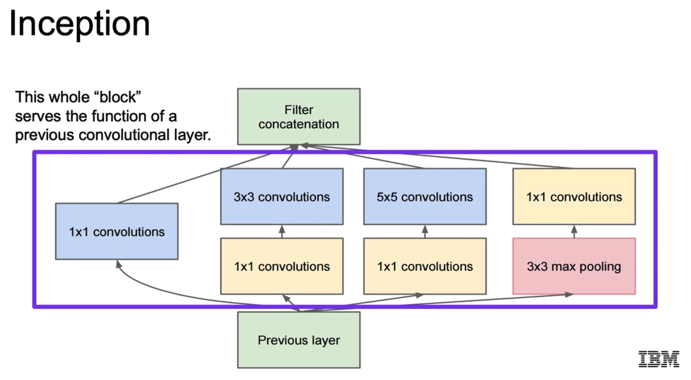

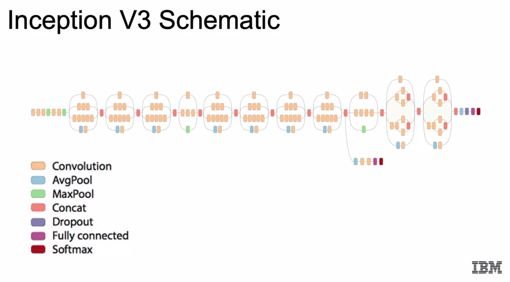

All these architectures are available at: [Keras Applications: Pre-trained Architectures](https://keras.io/api/applications/).

We can import the architectures with pre-trained weights and apply transfer learning with them.

```python
import matplotlib.pyplot as plt
import numpy as np
import PIL

import tensorflow as tf
from tensorflow.keras import layers,Dense,Flatten
from tensorflow.keras.models import Sequential
from tensorflow.keras.optimizers import Adam

# Get the data
# Let's suppose a dataset arranged as explained in the previous section
# with 5 classes
classnames = ['A', 'B', 'C', 'D', 'E']

# Create training and validation image iterators
# NOTE: another option would be ImageDataGenerator, show in previous section 3.5
img_height,img_width=180,180
batch_size=32
train_ds = tf.keras.preprocessing.image_dataset_from_directory(
  data_dir,
  validation_split=0.2,
  subset="training",
  seed=123,
  image_size=(img_height, img_width),
  batch_size=batch_size)

val_ds = tf.keras.preprocessing.image_dataset_from_directory(
  data_dir,
  validation_split=0.2,
  subset="validation",
  seed=123,
  image_size=(img_height, img_width),
  batch_size=batch_size)

# Plot some images
plt.figure(figsize=(10, 10))
for images, labels in train_ds.take(1):
  for i in range(6):
    ax = plt.subplot(3, 3, i + 1)
    plt.imshow(images[i].numpy().astype("uint8"))
    plt.title(classnames[labels[i]])
    plt.axis("off")*

#####
## Transfer Learning
#####

# Empty sequential model
resnet_model = Sequential()

# From Keras Applications, we can download many pre-trained models
# If we specify include_top=False, the original input/output layers
# are not imported.
# Note that we can specify our desired the input and output layer sizes!
pretrained_model= tf.keras.applications.ResNet50(include_top=False,
                   input_shape=(180,180,3),
                   pooling='avg',
                   classes=5,
                   weights='imagenet')
# Freeze layers
for layer in pretrained_model.layers:
        layer.trainable=False

# Add ResNet to empty sequential model
resnet_model.add(pretrained_model)

# Now, add the last layers of our model which map the extracted features
# too the classes - that's the classifier, what's really trained
resnet_model.add(Flatten())
resnet_model.add(Dense(512, activation='relu'))
resnet_model.add(Dense(5, activation='softmax'))

resnet_model.summary()

resnet_model.compile(optimizer=Adam(lr=0.001),loss='categorical_crossentropy',metrics=['accuracy'])

# Train/Fit
history = resnet_model.fit(train_ds, validation_data=val_ds, epochs=10)

# Inference
import cv2

image = cv2.imread('./path/to/image.jpg')
image = cv2.cvtColor(image, cv2.COLOR_BGR2RGB)
image_resized= cv2.resize(image, (img_height, img_width))
image=np.expand_dims(image_resized,axis=0)

pred=resnet_model.predict(image)
output_class=class_names[np.argmax(pred)]
```

## 4. Recurrent Neural Networks (RNN)

### 4.1 Simple RNN Networks

Introduced concepts:

- Sequences of words contain context information which is not captured by bags of words.
- Recurrent Neural Networks (RNN) deal with sequential data.
- A RNN neuron stores state information, which is related to the history/sequence of words/element input to it.
- The output of an RNN cell is: prediction + state.
- The state from the previous step is also passed to the neuron again.
- RNNs are not limited to word vectors! They can work with any sequential data: sales, etc.

Unrolled RNN layer:

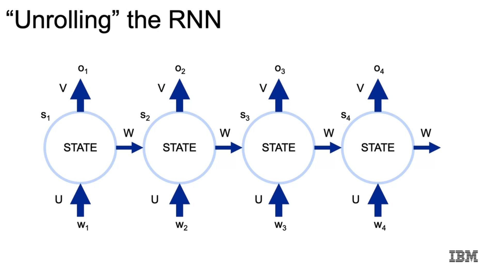

Equivalence with my previous notes:

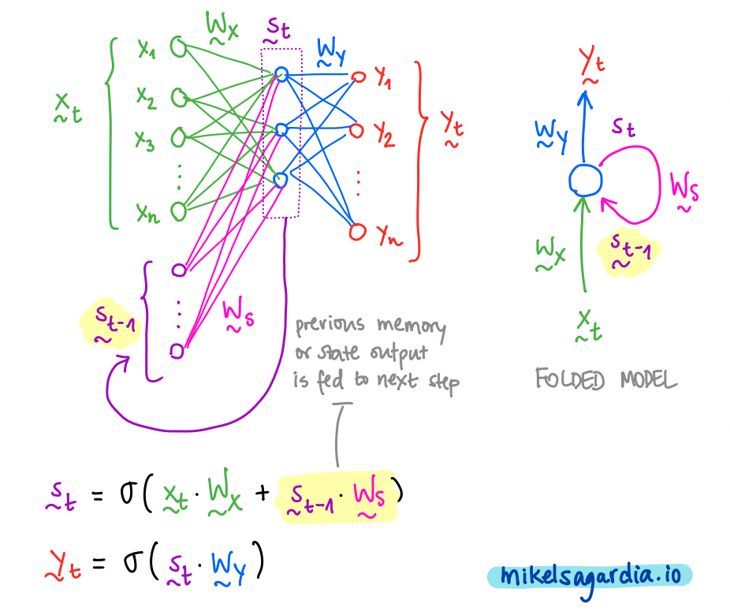

    x_t = w_i: word/vector at position t/i in sequence
    s_t = s_i: state at position t/i in sequence
    y_t = o_i: output at position t/i in sequence
    W_x = U: core RNN, dense layer applied to input
    W_s = W: core RNN, dense layer applied to previous state
    W_y = V: final dense layer (in Keras, we need to do it manually afterwards)

Dimensions

    r = dimension or input vector
    s = dimension of hidden state
    t = dimension of output

    U: r x s -> initialized with kernel_initializer
    W: s x s -> initialized with recurrent_initializer
    V: s x t (in Keras, we need to do it manually afterwards)

Notes:

- The weight matrices `U, W, V` are the same across all steps/positions!
- We usually only care about the last output!
- The backpropagation is done *through time*, thus, the vanishing gradient problem becomes more patent. Therefore, we can't work with very long sequences. A solution to that length limitation are **Long Short-Term Memory (LSTM)** cells, introduced in the next section
- We usually **pad** and **truncate** sequences to make them of a fixed length.
- Training is performed with vectors and batches, thus, the input has the shape of `(batch_size, seq_len, vector_size)`.
- If we use words, these are converted to integers using a dictionary and then an **embedding layer** is defined. The embedding layer converts the integers to word vectors in an embedding space of a fixed dimension. The embedding layer conversion is learnt during training. If desired, we can train the embedding to transform similar words to similar vectors (e.g., as measured by their cosine similarity).
- **IMPORTANT REMARK**: in Keras, apparently, the mapping `V = W_y` is not done automatically inside the `SimpleRNN`, we need to do it manually with a `Dense()` layer, if desired.

### 4.2 Lab: SimpleRNN

In this section, this notebook is explained:

`05g_DEMO_RNN.ipynb`

In it, the IMDB review dataset is loaded using Keras and sentiment analysis is performed using `SimpleRNN()`.

Most important steps:

1. Imports
2. Load dataset. process, define parameters
3. Define RNN model
4. Train and evaluate RNN model

```python

###
# 1. Imports
##

#from tensorflow import keras
#from tensorflow.keras.preprocessing import sequence
#from tensorflow.keras.models import Sequential
#from tensorflow.keras.layers import Dense, Embedding
#from tensorflow.keras.layers import SimpleRNN
#from tensorflow.keras.datasets import imdb
#from tensorflow.keras import initializers
import keras
from keras.preprocessing import sequence
from keras.models import Sequential
from keras.layers import Dense, Embedding
from keras.layers import SimpleRNN
from keras.datasets import imdb
from keras import initializers

###
# 2. Load dataset. process, define parameters
##

max_features = 20000  # This is used in loading the data, picks the most common (max_features) words
maxlen = 30  # maximum length of a sequence - truncate after this
batch_size = 32

# Load in the data.
# The function automatically tokenizes the text into distinct integers
(x_train, y_train), (x_test, y_test) = imdb.load_data(num_words=max_features)
print(len(x_train), 'train sequences')
print(len(x_test), 'test sequences')
# 25000 train sequences
# 25000 test sequences

# This pads (or truncates) the sequences so that they are of the maximum length
# The length of the sequence is very important:
# - if too short, we might fail to capture context correctly
# - if too long, the memory cannot store all the information
x_train = sequence.pad_sequences(x_train, maxlen=maxlen)
x_test = sequence.pad_sequences(x_test, maxlen=maxlen)
print('x_train shape:', x_train.shape) # (25000, 30)
print('x_test shape:', x_test.shape) # (25000, 30)

x_train[123,:]  #Here's what an example sequence looks like
# array([  219,   141,    35,   221,   956,    54,    13,    16,    11,
#         2714,    61,   322,   423,    12,    38,    76,    59,  1803,
#           72,     8, 10508,    23,     5,   967,    12,    38,    85,
#           62,   358,    99], dtype=int32)

###
# 3. Define RNN model
##

rnn_hidden_dim = 5 # dim of hidden state = dim of the output
word_embedding_dim = 50 # dim of word vectors
model_rnn = Sequential()
# Embedding: This layer takes each integer in the sequence
# and embeds it in a 50-dimensional vector
model_rnn.add(Embedding(input_dim=max_features, # vocabulary size
                        output_dim=word_embedding_dim)) # word vector size
# A SimpleRNN is the recurrent layer model with the mappings U, W, V = W_x, W_s, W_y
# The hidden state is passed automatically after each step in the sequence
# The size of the output is the size of the hidden state
# Usually the last output is taken only
# The kernel (U = W_x) and recurrent (W = W_s) mappings can be controlled
# independently for initialization and regularization
# IMPORTANT REMARK: in Keras, apparently, the mapping V = W_y is not done automatically,
# we need to do it manually with a Dense() layer
model_rnn.add(SimpleRNN(units=rnn_hidden_dim, # output size = hidden state size
                    # U = W_x: input weights: (word_embedding_dim, rnn_hidden_dim) = (50, 5)
                    kernel_initializer=initializers.RandomNormal(stddev=0.001),
                    # W = W_s: hidden state weights: (s, s) = (5, 5)
                    recurrent_initializer=initializers.Identity(gain=1.0),
                    activation='relu', # also frequent: tanh
                    input_shape=x_train.shape[1:])) # (30,)

# Sentiment analysis: sentiment score
model_rnn.add(Dense(units=1, activation='sigmoid'))

# Note that most of the parameters come from the embedding layer
model_rnn.summary()

rmsprop = keras.optimizers.RMSprop(lr = .0001)

model_rnn.compile(loss='binary_crossentropy',
              optimizer=rmsprop,
              metrics=['accuracy'])

###
# 4. Train and evaluate RNN model
##

model_rnn.fit(x_train, y_train,
          batch_size=batch_size,
          epochs=10,
          validation_data=(x_test, y_test))

score, acc = model_rnn.evaluate(x_test, y_test,
                            batch_size=batch_size)
print('Test score:', score) # 0.4531511457252502
print('Test accuracy:', acc) # 0.7853999733924866

```

### 4.3 Long Short-Term Memory (LSTM) Units

Simple RNN layers suffer from the vanishing gradient problem, so we cannot handle very long sequences. Schmidhuber published in 1997 the **Long Short-Term Memory** units, which alleviate that issue and are still used nowadays.

The LSTM cells have several gates that decide which information to forget and to remember, and their memory has two parts: short-term memory and long-term memory.

The math is in reality not very complex: we apply several sensible operations to the vectors:

- Linear mappings
- Concatenation
- Element-wise multiplication
- Activation with `tanh` and `sigmoid`
- etc.

However, the key aspects of how LSTMs work are summarized by the following picture/model:

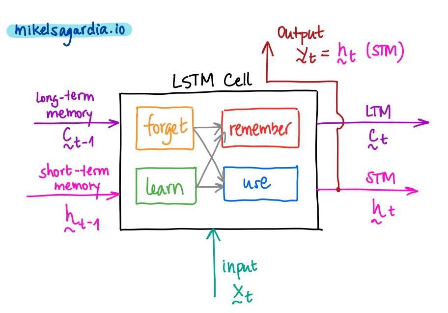

More information can be found in my DL notes: [deep_learning_udacity](https://github.com/mxagar/deep_learning_udacity)

In practice, we can easily interchange the `SimpleRNN()` and the `LSTM()` layers, because for the user the have a very similar API:

```python
from tensorflow.keras.models import Sequential
from tensorflow.keras.layers import Dense,SimpleRNN,LSTM

### SimpleRNN

n_features = 1 # size of a vector; in this case the vector is a scalar
length = 50 # length of vector sequence

model = Sequential()
model.add(SimpleRNN(units=100, input_shape=(length,n_features)))
model.add(Dense(n_features)) # Unique vector output

model.compile(optimizer='adam',loss='mse')

### LSTM

n_features = 1 # size of a vector; in this case the vector is a scalar
length = 50 # length of vector sequence

model = Sequential()
model.add(LSTM(units=100, input_shape=(length,n_features)))
model.add(Dense(n_features)) # Unique vector output

model.compile(optimizer='adam',loss='mse')

```

#### Gated Recurrent Units (GRUs)

They appeared in 2014. They are a simplification of the LSTM cell which is maybe less accurate but requires less memory and are faster.

We can easily interchange them both; maybe LSTMs are able to learn more complex patterns and GRUs are suited for smaller datasets.

### 4.4 RNN Architectures

We can arrange RNN cells in different ways:

- **Sequence-to-vector** (aka. *many to one*): we pass a sequence and expect an element. For example, we can use that architecture to generate text or forecast the next value. The *one* element is in general a vector, but if that vector is of size `1`, it's a scalar; e.g., in price forecasting we predict one price value.
- **Vector-to-sequence** (aka. *one to many*): for instance, given a word, predict the next 5. That *one* vector can be a scalar, too, as before.
- **Sequence-to-sequence** (aka. *many to many*): we pass a sequence and expect a sequence. For example, we could train a chatbot with Q-A sequences or perform machine translation.

#### Sequence to Sequence Models: Seq2Seq

Sequence to sequence models can be used for instance in machine translation. They have an **encoder-decoder** architecture:

- The encoder can be an RNN: we pass a sequence of words (sentence) which finishes with special token `<EOS>` (i.e., *end of sentence*).
- We take the last hidden state: it contains information of the complete sequence we introduced.
- We pass to the decoder the last hidden state of the encoder as the initial state and the initial special token `<SOS>` (i.e., *start of sentence*).
- The decoder starts outputting a sequence of words/tokens step by step and we collect them.
- We input the last token in the next step.
- The sequence ends when the decoder outputs `<EOS>`.

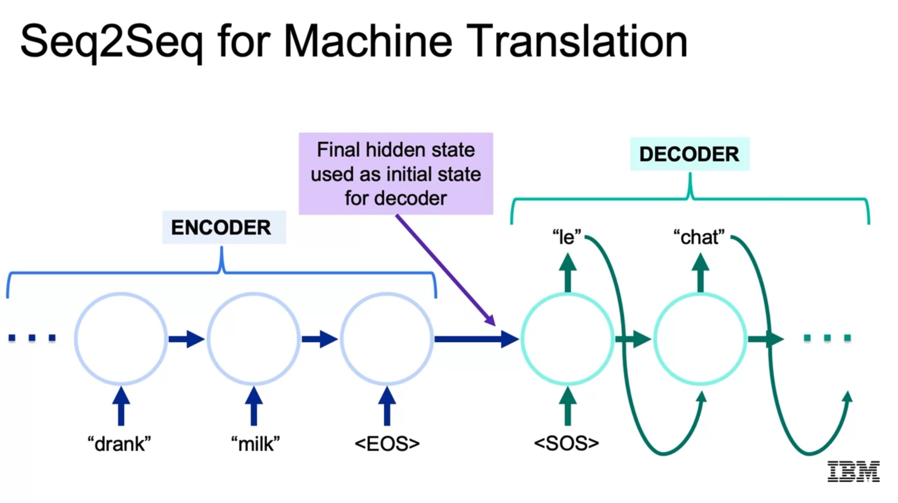

However, the explained approach can be improved:

- We can use **beam search**: the decoder outputs in each step probabilities for all possible words; thus, we can consider several branches of possible sentences, instead of taking one word at a time (aka. *greedy search#*). Since the selected word conditions the next output, it is important which word we select. Beam search consists in performing a more complex selection that considers several options, which lead to several sentences.
- Instead of passing the final hidden state from the encoder, we can pass all the intermediate hidden states and apply **attention**. Attention consists in inputing the hidden state which is most similar to the last output. That is achieved, e.g., by measuring the cosine similarity. This is useful in language translation, since the word order in different languages is not the same.

### 4.5 Times Series

Time series can be performed with a *many-to-one* architecture, but several aspects should be taken into account:

- The sequence length must capture the trend and the seasonality, i.e., the low and high frequency components of the series.
- We should apply early stopping.
- Dates need to be converted to `datetime`, probably.
- The class `TimeseriesGenerator` is very helpful to generate sequences from a time series.

The following example is from the notebook

`19_07_2_RNN_Example_1_Sales.ipynb`

which originally comes from J.M. Portilla's course on Tensforlow 2. The example works on a time series downloaded from the FRED website: [Retail Sales: Clothing and Clothing Accessory Stores (Not Seasonally Adjusted)](https://fred.stlouisfed.org/series/RSCCASN). It consists of 334 entries of monthly date-sales pairs. It is a very simple dataset, but the example shows how to deal with a time series in general.

These steps are carried out:

1. Imports
2. Load dataset and prepare
3. Generator
4. Define the model
5. Train the model
6. Forecasting: Test Split + Future (New Timestamps)

```python
###
# 1. Imports
###

import pandas as pd
import numpy as np
import matplotlib.pyplot as plt
from sklearn.preprocessing import MinMaxScaler

###
# 2. Load dataset and prepare
###

# We load the dataset
# We convert the date string to datetime type on the fly
# and be set that column to be the index
# If we have datetime values, we can use
# - parse_dates=True, or
# - infer_datetime_format=True
df = pd.read_csv('./RSCCASN.csv', parse_dates=True, index_col='DATE')
df.shape # (334, 1)

# We change the name of the column so that it's easier to remember
# Note that it contains sales in millions by day
df.columns = ['Sales']

# We can see that a year (12 months or data points) y a cycle or period
# which contains the major trend and a seasonality components.
# Thus, we need to take that time span into consideration for splitting
df.plot(figsize=(16,6))

# Train/Test Split
# Due to the observation above,
# we split in the last 1.5 years = 18 months
test_size = 18
test_ind = len(df) - test_size
train = df.iloc[:test_ind]
test = df.iloc[test_ind:]

# Scaling
scaler = MinMaxScaler()
scaler.fit(train)
scaled_train = scaler.transform(train)
scaled_test = scaler.transform(test)

###
# 3. Generator
###

# Time series generator
from tensorflow.keras.preprocessing.sequence import TimeseriesGenerator

# The length of the input series must be smaller than the length of the test split
# if we do early-stopping validation
length = 12
batch_size = 1
generator = TimeseriesGenerator(data=scaled_train,
                                targets=scaled_train,
                                length=length,
                                batch_size=batch_size)

# We check the first (X,y) pair of the generator
X,y = generator[0]
X.shape # (1, 12, 1)
y.shape # (1, 1)

###
# 4. Define the model
###

from tensorflow.keras.models import Sequential
from tensorflow.keras.layers import Dense, SimpleRNN, LSTM

n_features = 1
model = Sequential()
#model.add(SimpleRNN(units=100, input_shape=(length,n_features)))
# We explicitly use the ReLu activation
model.add(LSTM(units=100, activation='relu', input_shape=(length,n_features)))
model.add(Dense(n_features))
model.compile(optimizer='adam', loss='mse')

# Early Stopping
from tensorflow.keras.callbacks import EarlyStopping

early_stop = EarlyStopping(monitor='val_loss', patience=5)
# We need to create a validation generator
# The length is the same as before,
# taking into account that it must be shorter than the length of the validation split
validation_generator = TimeseriesGenerator(scaled_test,
                                          scaled_test,
                                          length=length,
                                          batch_size=1)

###
# 5. Train the model
###

# We train with an early stop callback
model.fit_generator(generator,
                    epochs=20,
                    validation_data=validation_generator,
                    callbacks=[early_stop])

# We get the loss values and plot them
losses = pd.DataFrame(model.history.history)
losses.plot()

###
# 6. Forecasting
###

### 6.1 Test Split

# We forecast one by one all the values in the test split
# For that, the batch previous to the test split is taken
# a prediction done for it, and then,
# the batch is moved in time to contain predicted values
test_predictions = []
current_batch = scaled_train[-length:].reshape((1,length,n_features))
for i in range(len(test)):
    predicted = model.predict(current_batch)[0]
    test_predictions.append(predicted)
    current_batch = np.append(current_batch[:,1:,:],[[predicted]],axis=1)

true_predictions = scaler.inverse_transform(test_predictions)
test['LSTM Predictions'] = true_predictions

test.plot(figsize=(10,5))

# Compute the RMSE
from sklearn.metrics import mean_squared_error

np.sqrt(mean_squared_error(test['Sales'],test['LSTM Predictions']))

### 6.2 Future: New Timestamps

scaled_full_data = scaler.transform(df)

forecast = []
periods_into_future = 24
current_batch = scaled_full_data[-length:].reshape((1,length,n_features))
for i in range(periods_into_future):
    predicted = model.predict(current_batch)[0]
    forecast.append(predicted)
    current_batch = np.append(current_batch[:,1:,:],[[predicted]],axis=1)

# We inverse the scaling
forecast = scaler.inverse_transform(forecast)

# Pick last date: 2019-10-01
df.tail()

# Since we finish on 2019-10-01 with stapsize of 1 month in our full dataset
# we take the next day as start day and the frequency tring 'MS' for monthly data
# More on freq strings: google("pandas frequency strings")
# https://stackoverflow.com/questions/35339139/what-values-are-valid-in-pandas-freq-tags
forecast_index = pd.date_range(start='2019-11-01',
                               periods=periods_into_future,
                               freq='MS')

# Create a dataframe
forecast_df = pd.DataFrame(forecast,index=forecast_index)
forecast_df.columns = ['Sales']

# Plot
ax = df.plot(figsize=(16,6))
forecast_df.plot(ax=ax)
# We can zooom in if desired
plt.xlim('2018-01-01','2021-02-01')
```

## 5. Autoencoders

PCA can find compressed representations of data, e.g., images. We can use those representations to detect anomalies/defects, reduce noise, remove background, etc.

However, PCA is a **linear** combination of principal elements/components which capture the vectors with maximum variance. In contrast, we might have non-linear relationships between basic components. That can be accomplished with autoencoders.

Autoencoders have these parts:

- Encoder: layers that compress the dimensionality of the input vector to a **compressed** or **latent representation**, also known as **bottleneck**.
- Decoder: layers that upscale the compressed or latent representation to a vector of the dimension as the input.

For training, the loss is defined as the difference between the input and output vectors; then, the gradient of that loss is propagated through the entire network (encoder + decoder).

Autoencoders can be:

- Deep: we have many layers
- Not deep: a single layer for the encoder/decoder
- Sparse: only some nodes fire; these have been shown to be successful in recommender systems.

Applications of autoencoders:

- Compress data, dimensionality reduction
- Noise reduction in data, e.g., images
- Sharpening of images/data
- Identifying key components
- Anomaly detection
- Similarity: we can find similar images by checking their compressed representation vectors, e.g., with cosine similarity.
- Machine translation: we reduce dimensionality and improve the translation process (machine translation has typically a high dimensionality).
- Generation of data, e.g., images. However, typically **variational autoencoders** are used and often **GANs** are superior.
- Neural inpainting: if we remove a part from an image, we can reconstruct it (e.g., remove watermarks).

### 5.1 Variational Autoencoders (VAE)

Variational autoencoders work the same way as regular autoencoders, except the latent space contains normal distributions instead of scalar values, i.e., the parameters (mean and std. deviation) of distributions are obtained. Then, the decoder samples those distributions and upscales them.

The main application of variational autoencoders is **image generation**. This is the workflow:

- We compress an image to latent vectors: `mu = [m1, m2, ...]` and `sigma = [s1, s2, ...]`.
- We create a latent representation with noise as follows: `x = mu + sigma*noise`; `noise = N(0,1)`
- We feed `x` to the decoder, which upscales it to be an image.

The loss function has two terms which are summed:

- Reconstruction loss: Pixel-wise difference between input and output vectors/images. Binary crossentropy can be used (as done with regular autoencoders).
- Penalty for generating `mu` and `sigma` vectors which are different from `0` and `1`, i.e., we penalize deviations form the **standard distribution**.

In order to penalize deviations from the standard distribution the **Kullback-Leibler (KL)-divergence** is used:

    mu <-> 0
    log(sigma) <-> 0 (log 1 = 0); sigma > 0

The KL divergence formula (loss function term):

$$ \frac{1}{2} (e ^{log(\sigma)} - (log(\sigma) + 1) + \mu^2)$$

Note that the second term is not strictly necessary: we can also without having the penalization of the divergence from the standard distribution. However, this term makes possible

- to compare similar images more easily, since close vectors generate similar outputs
- and to produce new digits by varying the `mu` vector uniformly.

Interesting video: [Variational Autoencoders by Xavier Steinbrugge](https://www.youtube.com/watch?v=9zKuYvjFFS8).

The nice thing of variational autoencoders is that we can vary the latent sigma values and see how the created images vary according to them. Section [5.2 Lab: Autoencoders](#5.2-Lab:-Autoencoders) has an example.

#### Disentangled Variational Autoencoders ($\beta$-VAE)

Disentangled Variational Autoencoders or beta VAEs are VAEs in which the loss function consisting of the two aforementioned components is weighted: a `beta` factor is multiplied to the KL divergernce (difference of distributions wrt. the Normal).

The consequence is very impressive! As we increase the value of `beta`:

- Some latent distributions end up converging to `N(0,1)`, so no information is conveyed by them, in other words, they can be ignored and we remain with the rest! Therefore, **the set of latent neurons in the bottleneck is minimized to the minimum**; even though we did not know at the beginning which number of neurons to take, the network itself finds it out.
- Not only that, **the different latent values tend to become uncorrelated, compared to regular VAEs**: modifying each of them causes distinct independent changes in the output.

However, note that too high `beta` values compress too much the information and we loose details; we need to define where our trade-off is. Often in Reinforcement Learning we want to compress the information space that much.

Some really cool results are shown in the video:

- Deep-Mind compresses some game images to latent variables with beta-VAEs; then, those latent values are changed and the image is reconstructed. The result is that each latent variable maps to concrete independent events in the scene: floor color changes, agent rotates, etc. With a regular VAE, changes in the latent values yield coupled changes.
- Another example is related to face reconstruction: similarly, beta-VAEs are able to reconstruct a very similar face but rotated when the latent variable related to the rotation is altered, leaving the rest fixed. With regural VAEs, changes in a latent variables produced coupled variations.

### 5.2 Lab: Autoencoders

The notebook

`05h_LAB_Autoencoders.ipynb`

shows shows how the following topics/concepts are implemented:

- Compression/Reconstruction performance of PCA applied on MNIST. Reconstruction performance is measured comparing original and reconstructed images with MSE.
- Compression/Reconstruction efficacy of Autoencoders applied on MNIST: Number of layers and units are changed to compare different models.
- Compression/Reconstruction efficacy of Variational Autoencoders applied on MNIST: Number of layers and units are changed to compare different models.
- The decoder of the Variational Autoencoder is used to generate new MNIST images: the two sigma values are varied and images are reconstructed.

One very interesting thing about the noteboook is that we learn how to use the **functional API** from Keras. That API goes beyond the `Sequential()` models; we can define layers as functions and specify operations with them (e.g., addition, concatenation), as required in more complex models (e.g., ResNets).

Example of how to build an Autoencoder and a Variational Autoencoder using the functional API:

```python

import numpy as np
import matplotlib.pyplot as plt

import tensorflow as tf

from keras.layers import Lambda, Input, Dense
from keras.models import Model
from keras.losses import mse, binary_crossentropy
from keras.utils import plot_model
from keras import backend as K
from keras.datasets import mnist

from sklearn.preprocessing import MinMaxScaler

###
# Load and prepare dataset
###

# 60k in train, 10k in test
(x_train, y_train), (x_test, y_test) = mnist.load_data();
# Convert to float and scale to [0,1]
x_train = x_train.astype('float32') / 255.
x_test = x_test.astype('float32') / 255.
# Reshape to 1D, i.e., rows of pixels
x_train_flat = x_train.reshape((len(x_train), np.prod(x_train.shape[1:])))
x_test_flat = x_test.reshape((len(x_test), np.prod(x_test.shape[1:])))
print(x_train_flat.shape) # (60000, 784)
print(x_test_flat.shape) # (10000, 784)

# Pixel values scaled again?
s = MinMaxScaler().fit(x_train_flat)
x_train_scaled = s.transform(x_train_flat)
x_test_scaled = s.transform(x_test_flat)

def mse_reconstruction(true, reconstructed):
    return np.sum(np.power(true - reconstructed, 2) / true.shape[1])

###
# Autoencoder
###

# Here the functional API from keras is introduced
# which helps building more complex architectures, e.g., where
# layers outputs are summed or concatenated (e.g., ResNets), going
# beyond the Sequential() API.
# However, for such simple models as the current,
# we could use Sequential().
# In the functional API:
# - We need to define the Input vector
# - We need to define all layers as if they are functions with their outputs
# - We collect first Input instance and last output in Model
#
# We need to define 3 models altogether:
# - full_model
# - encoder
# - decoder

ENCODING_DIM = 64
HIDDEN_DIM = 256

## Encoder model
inputs = Input(shape=(784,)) # input vector
# Functional API: layers are like functions that take arguments
encoder_hidden = Dense(HIDDEN_DIM, activation="relu")(inputs)
encoded = Dense(ENCODING_DIM, activation="sigmoid")(encoder_hidden)
# Model: we collect first Input instance and last output in Model
encoder_model = Model(inputs, encoded, name='encoder')

## Decoder model
encoded_inputs = Input(shape=(ENCODING_DIM,), name='encoding')
decoder_hidden = Dense(HIDDEN_DIM, activation="relu")(encoded_inputs)
reconstruction = Dense(784, activation="sigmoid")(decoder_hidden)
decoder_model = Model(encoded_inputs, reconstruction, name='decoder')

## Full model as the combination of the two
outputs = decoder_model(encoder_model(inputs))
full_model = Model(inputs, outputs, name='full_ae')

full_model.summary()

# We use the BINARY cross-entropy loss
# because we want to know whether the input and output images are equivalent
full_model.compile(optimizer='rmsprop',
                 loss='binary_crossentropy',
                 metrics=['accuracy'])

## Train
history = full_model.fit(x_train_scaled,
                         x_train_scaled,
                         shuffle=True,
                         epochs=2,
                         batch_size=32)

## Evaluate
decoded_images = full_model.predict(x_test_scaled)
mse_reconstruction(x_test_flat, decoded_images)

###
# Variational Autoencoder
###

def sampling(args):
    """
    Transforms parameters defining the latent space into a normal distribution.
    """
    # Need to unpack arguments like this because of the way the Keras "Lambda" function works.
    mu, log_sigma = args
    # by default, random_normal has mean=0 and std=1.0
    epsilon = K.random_normal(shape=tf.shape(mu))
    sigma = K.exp(log_sigma)
    #return mu + K.exp(0.5 * sigma) * epsilon
    return mu + sigma*epsilon

hidden_dim = 256
batch_size = 128
# this is the dimension of each of the vectors representing the two parameters
# that will get transformed into a normal distribution
latent_dim = 2 
epochs = 1

## VAE model = encoder + decoder

## Encoder model
inputs = Input(shape=(784, ), name='encoder_input')
x = Dense(hidden_dim, activation='relu')(inputs)
# We pass x to two layers in parallel
z_mean = Dense(latent_dim, name='z_mean')(x)
z_log_var = Dense(latent_dim, name='z_log_var')(x) # 2D vectors

# We can pass to Lambda our own created function
z = Lambda(sampling, name='z')([z_mean, z_log_var]) # args unpacked in sampling()
# z is now one n dimensional vector representing the inputs
# We'll have the encoder_model output z_mean, z_log_var, and z
# so we can plot the images as a function of these later
encoder_model = Model(inputs, [z_mean, z_log_var, z], name='encoder')

## Decoder model
latent_inputs = Input(shape=(latent_dim,),)
x = Dense(hidden_dim, activation='relu')(latent_inputs)
outputs = Dense(784, activation='sigmoid')(x)
decoder_model = Model(latent_inputs, outputs, name='decoder')

## Instantiate VAE model
outputs = decoder_model(encoder_model(inputs)[2]) # we take only z!
vae_model = Model(inputs, outputs, name='vae_mlp')

## Examine layers

for i, layer in enumerate(vae_model.layers):
    print("Layer", i+1)
    print("Name", layer.name)
    print("Input shape", layer.input_shape)
    print("Output shape", layer.output_shape)
    if not layer.weights:
        print("No weights for this layer")
        continue
    for i, weight in enumerate(layer.weights):
        print("Weights", i+1)
        print("Name", weight.name)
        print("Weights shape:", weight.shape.as_list())

## Loss function

# Reconstruction
reconstruction_loss = binary_crossentropy(inputs, outputs)
reconstruction_loss *= 784

# KL-Divergence
kl_loss = 0.5 * (K.exp(z_log_var) - (1 + z_log_var) + K.square(z_mean))
kl_loss = K.sum(kl_loss, axis=-1)
total_vae_loss = K.mean(reconstruction_loss + kl_loss)

# We can pass our custom loss function with add_loss()
vae_model.add_loss(total_vae_loss)

vae_model.compile(optimizer='rmsprop',
                  metrics=['accuracy'])
    
vae_model.summary()

## Train
vae_model.fit(x_train_scaled,
        epochs=epochs,
        batch_size=batch_size)

## Evaluate: Generate reconstructed images and compare to original ones
decoded_images = vae_model.predict(x_test_scaled)
mse_reconstruction(x_test_scaled, decoded_images)

```

### 5.3 Lab: Autoencoders 2

Another nice example on autoencoders is given in the notebook:

`19_09_2_Keras_Autoencoders_Image_Denoising_MNIST.ipynb`

In it, an autoencoder is built to de-noise MNIST images. The notebook comes originally from J.M. Portilla's course on Tensorflow 2.

## 6. Generative Adversarial Networks

:warning: This section is very brief; I took few notes. Please check my notes in [deep_learning_udacity](https://github.com/mxagar/deep_learning_udacity) for deeper insights.

- We have two networks trained simultaneously: Generator & Discriminator: `G(), D()`.
- Discriminator: it tries to classify between fake and real images/data samples: `D(x)`.
- Generator creates new images/samples from a noise vector `z`; it tries to fool the Discriminator: `x = G(z)`.
- Both fake and real images/data samples are used during training.
- The loss of the discriminator is backpropagated to the Generator.
- For training the Discriminator real labels are used; for training the Generator, we use the flipped/opposite labels on the `D()` output and backpropagate them back to the Generator; only the weights of `G()` are updated.
- Police-counterfeiter metaphor.

GANs are very sensible to the chosen hyperparameters; we need to take into account that we're training two **adversarial** networks and we need to keep the balance all the time so that none becomes significantly much better than the other!

Two notebooks in which a GAN and a DCGAN are implemented on the MNIST dataset:

- [`19_10_1_Keras_GANs_Intro_MNIST.ipynb`](https://github.com/mxagar/machine_learning_ibm/blob/main/05_Deep_Learning/lab/19_10_1_Keras_GANs_Intro_MNIST.ipynb)
- [`19_10_2_Keras_GANs_DCGAN_MNIST.ipynb`](https://github.com/mxagar/machine_learning_ibm/blob/main/05_Deep_Learning/lab/19_10_2_Keras_GANs_DCGAN_MNIST.ipynb)

The notebooks come originally from J.M. Portilla's course on Tensorflow 2.

## 7. Reinforcement Learning

:warning: This section is very brief; I took few notes. Please check my notes in [data_science_python_tools](https://github.com/mxagar/data_science_python_tools) for deeper insights. In particular, the folder [`24_ReinforcementLearning`](https://github.com/mxagar/data_science_python_tools/tree/main/24_ReinforcementLearning) contains a guide: [`ReinforcementLearning_Guide.md`](https://github.com/mxagar/data_science_python_tools/blob/main/24_ReinforcementLearning/ReinforcementLearning_Guide.md).


