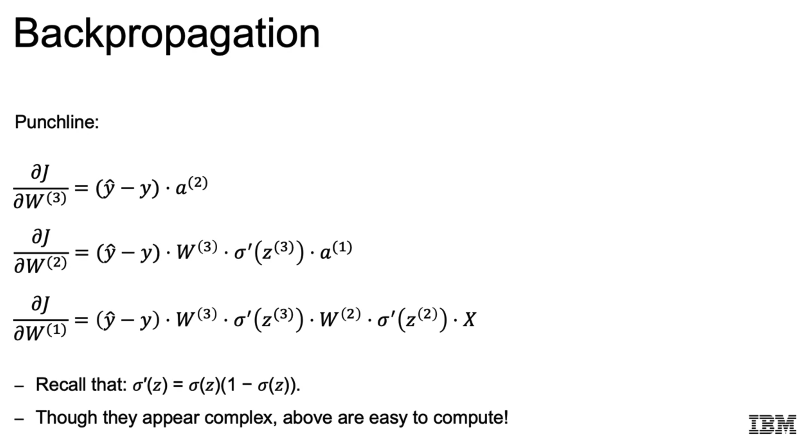
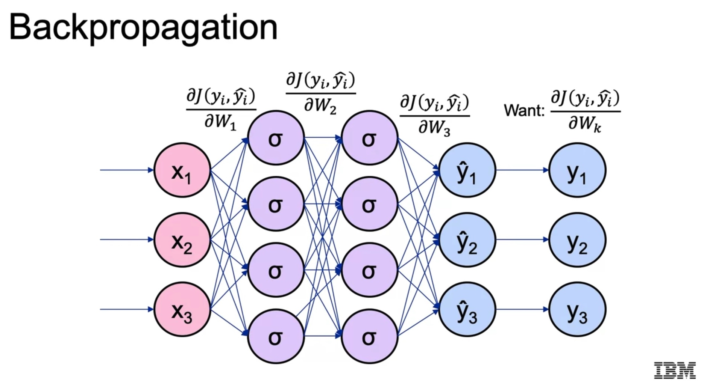

# Deep Learning and Reinforcement Learning

These are my notes and the code of the [IBM Machine Learning Professional Certificate](https://www.coursera.org/professional-certificates/ibm-machine-learning) offered by IBM & Coursera.

The Specialization is divided in 6 courses, and each of them has its own folder with its guide & notebooks:

1. [Exploratory Data Analysis for Machine Learning](https://www.coursera.org/learn/ibm-exploratory-data-analysis-for-machine-learning?specialization=ibm-machine-learning)
2. [Supervised Machine Learning: Regression](https://www.coursera.org/learn/supervised-machine-learning-regression?specialization=ibm-machine-learning)
3. [Supervised Machine Learning: Classification](https://www.coursera.org/learn/supervised-machine-learning-classification?specialization=ibm-machine-learning)
4. [Unsupervised Machine Learning](https://www.coursera.org/learn/ibm-unsupervised-machine-learning?specialization=ibm-machine-learning)
5. [Deep Learning and Reinforcement Learning](https://www.coursera.org/learn/deep-learning-reinforcement-learning?specialization=ibm-machine-learning)
6. [Specialized Models: Time Series and Survival Analysis](https://www.coursera.org/learn/time-series-survival-analysis?specialization=ibm-machine-learning)

This file focuses on the **fifth course: Deep Learning and Reinforcement Learning**

In contrast to the other courses of the Specialization, I've taken few notes this time; I you're interested in more details on Deep Learning, I suggest you to visit my repository [deep_learning_udacity](https://github.com/mxagar/deep_learning_udacity).

Also, **check my [`DL_Keras_Guide.md`](https://github.com/mxagar/deep_learning_udacity/blob/main/02_Keras_Guide/DL_Keras_Guide.md)**, located in that repository.

Mikel Sagardia, 2022.  
No guarantees

## Table of Contents

- [Deep Learning and Reinforcement Learning](#deep-learning-and-reinforcement-learning)
  - [Table of Contents](#table-of-contents)
  - [1. Introduction](#1-introduction)
    - [1.1 Introduction to Neural Networks](#11-introduction-to-neural-networks)
    - [1.2 Gradient Descend](#12-gradient-descend)
    - [1.3 Lab: Gradient Descend and Neural Networks](#13-lab-gradient-descend-and-neural-networks)
    - [1.4 Backpropagation and Activation Functions](#14-backpropagation-and-activation-functions)
    - [1.5 Lab: Backpropagation](#15-lab-backpropagation)
    - [1.6 Regularization](#16-regularization)

## 1. Introduction

### 1.1 Introduction to Neural Networks

Concepts introduced:

- Nodes = neurons.
- Input: `x` (vector).
- Weights, bias: packed into matrices: `W (n x m), n input nodes & m output nodes`.
- Raw output of a neuron: linear combination of inputs scaled by weights: `z` (vector).
- Output of a neuron, `z`, is activated, resulting in the input for next layer: `a = f(z)` (vector).
- Activation function for non-linearity: sigmoid: `f = sigmoid()`.
- Perceptron model = logistic regression!
- Nice property of sigmoid: `f' = f(1-f)`.
- By stacking neurons in layers and layers in networks, we can have very complex decision boundaries.
- MLP = Multi-Layer Perceptron.
- There are MLP models in Scikit-Learn, but we'll use Tensorflow/Keras.
- If multi-class classification, last activation is softmax.

Vector sizes: even though I wrote that `x`, `z`, `a` are vectors, they can indeed be matrices. Indeed, that's what happens with batches:

    x (b, n)
    W (n, m)
    z = x.W (b, n).(n, m) = (b, m)
    a = f(z) (b, m)

### 1.2 Gradient Descend

Concepts introduced:

- Error: difference between prediction and real label/value.
- Cost function = error: expressed in function of model parameters: `J()`.
- Minimum cost function is found in gradient descend.
- The gradient of the cost function points in the direction of the **largest increase**; so **we take the opposite direction**.
- Gradient: vector of partial derivatives of `J` wrt. each parameter: `dJ/dw_i`.
- Weight update with learning rate: `w_new <- w_old - learning_rate*[dJ/dw_i]`.
- Stochastic gradient descend: in gradient descend we compute the error/cost considering all samples; in stochastic gradient descend we take one random sample. That's more noisy.
- Mini-batch gradient descend: we compute the cost with a batch of samples. Best of both worlds: less noisy and less intensive.

### 1.3 Lab: Gradient Descend and Neural Networks

Notebooks provided and commented:

- `05a_DEMO_Gradient_Descent.ipynb`
- `05b_LAB_Intro_NN.ipynb`

In the first notebook (`05a`), linear regression is solved  with the closed form formula, gradient descend and stochastic gradient descend. The results are compared. We use gradient descend or its variants for MLPs and deep learning because no closed form formula exists for solving them.

The second notebook (`05b`) has two parts:

- First, a logic gate consisting of a single neuron with 2 input values and a sigmoid activation is built. It has two weights and a bias term. The idea is that we can model many logic gates with a single neuron: `AND, OR, NAND`, etc. However, it fails with `XOR`. The `XOR` logic gate return true only if one input is true and the other false; in order to build such a gate we need to stack two layers of neurons!
- Second, a feed forward pass in a simple neural network is done with matrices.

### 1.4 Backpropagation and Activation Functions

Backpropagation consists in propagating the error derivative backwards in the network so that we can compute every `dJ/dw_i`, i.e., the partial derivative of the cost with respect to each of the weights. Then, with that derivative, we can update each weight. All these derivatives form the gradient.

The derivatives are obtained by applying the chain rule. In practice, we see that the derivatives seem to be the error fed backwards in the network:

Vanishing gradient problem: since we chain multiplications and the slope of the sigmoid is small at extremes, products become very small, so the gradient vanishes. A solution is to use other activation functions, such as ReLU.

Typical activation functions:

- Sigmoid: problems with vanishing gradient.
- Hyperbolic tangent: stretched sigmoid; also prone to vanishing gradient.
- ReLU: Rectified Linear Unit. Better than sigmoid and `tanh`; bit for negative values we don't learn anything.
- Leaky ReLU: a slope is added for negative values in the ReLU function, so we can learn something. However, leaky ReLUs are not always better than ReLU!

### 1.5 Lab: Backpropagation

Notebook provided and commented: `05c_DEMO_Backpropagation.ipynb`.

A simple neural network with a hidden layer is defined with numpy and the feedforward and backpropagation passes are carried out manually. 

### 1.6 Regularization

Deep NN: Those with >=2 hidden layers; the more hidden layers, the more complex patterns that can be learned. But we risk overfitting = learning noise and not being able to generalize.

Regularization: any technique done to reduce generalization error, but not the training error:

- Regularization penalty in cost function; we can do that also with neural networks.
- Dropout. Typical method in NNs. We need to scale weights with `p` during test time if they were cancelled with `p` probability during training!
- Early stopping: Check validation error and stop as it starts increasing.
- Stochastic GD or mini-batch GD regularize the training, too, because we don't fit the dataset perfectly.

