# Machine Learning Capstone: Deployment of a Recommender System

These are my notes and the code of the [IBM Machine Learning Professional Certificate](https://www.coursera.org/professional-certificates/ibm-machine-learning) offered by IBM & Coursera.

The Specialization is divided in 6 courses, and each of them has its own folder with its guide & notebooks:

1. [Exploratory Data Analysis for Machine Learning](https://www.coursera.org/learn/ibm-exploratory-data-analysis-for-machine-learning?specialization=ibm-machine-learning)
2. [Supervised Machine Learning: Regression](https://www.coursera.org/learn/supervised-machine-learning-regression?specialization=ibm-machine-learning)
3. [Supervised Machine Learning: Classification](https://www.coursera.org/learn/supervised-machine-learning-classification?specialization=ibm-machine-learning)
4. [Unsupervised Machine Learning](https://www.coursera.org/learn/ibm-unsupervised-machine-learning?specialization=ibm-machine-learning)
5. [Deep Learning and Reinforcement Learning](https://www.coursera.org/learn/deep-learning-reinforcement-learning?specialization=ibm-machine-learning)
6. [Machine Learning Capstone: Deployment of a Recommender System](https://www.coursera.org/learn/machine-learning-capstone?specialization=ibm-machine-learning)

This file focuses on the **sixth course: Machine Learning Capstone: Deployment of a Recommender System**.

The goal of this course is to build a project in which a recommender system is implemented trying different machine learning techniques.

**The final project is in the repository [course_recommender_streamlit](https://github.com/mxagar/course_recommender_streamlit).**

Mikel Sagardia, 2022.  
No guarantees

## Table of Contents

- [Machine Learning Capstone: Deployment of a Recommender System](#machine-learning-capstone-deployment-of-a-recommender-system)
  - [Table of Contents](#table-of-contents)
  - [1. Introduction](#1-introduction)
    - [1.1 Introduction to Recommender Systems](#11-introduction-to-recommender-systems)
    - [1.2 Project Description](#12-project-description)
    - [1.3 My Notes on Recommender Systems](#13-my-notes-on-recommender-systems)
      - [Problem definition](#problem-definition)
      - [Content-Based RecSys](#content-based-recsys)
      - [Collaborative Filtering RecSys](#collaborative-filtering-recsys)
  - [2. Exploratory Data Analysis and Feature Engineering](#2-exploratory-data-analysis-and-feature-engineering)
    - [2.1 Download and Analyze Dataset: `lab_jupyter_eda.ipynb`](#21-download-and-analyze-dataset-lab_jupyter_edaipynb)
    - [2.2 Feature Engineering: `lab_jupyter_fe_bow_solution.ipynb`, `lab_jupyter_fe_course_sim_solution.ipynb`](#22-feature-engineering-lab_jupyter_fe_bow_solutionipynb-lab_jupyter_fe_course_sim_solutionipynb)
  - [3. Content-Based Recommender System](#3-content-based-recommender-system)
    - [3.1 Introduction to Content-Based Recommender Systems](#31-introduction-to-content-based-recommender-systems)
    - [3.2 Lab Notebooks](#32-lab-notebooks)
      - [`lab_jupyter_content_user_profile.ipynb`](#lab_jupyter_content_user_profileipynb)
      - [`lab_jupyter_content_course_similarity.ipynb`](#lab_jupyter_content_course_similarityipynb)
      - [`lab_jupyter_content_clustering.ipynb`](#lab_jupyter_content_clusteringipynb)
  - [4. Collaborative Filtering Based Recommender System](#4-collaborative-filtering-based-recommender-system)
    - [4.2 Lab Notebooks](#42-lab-notebooks)
      - [`lab_jupyter_cf_knn.ipynb`](#lab_jupyter_cf_knnipynb)
      - [`lab_jupyter_cf_nmf.ipynb`](#lab_jupyter_cf_nmfipynb)
      - [`lab_jupyter_cf_ann.ipynb`](#lab_jupyter_cf_annipynb)
      - [`lab_jupyter_cf_regression_w_embeddings.ipynb`](#lab_jupyter_cf_regression_w_embeddingsipynb)
      - [`lab_jupyter_cf_classification_w_embeddings.ipynb`](#lab_jupyter_cf_classification_w_embeddingsipynb)
      - [Forum Questions](#forum-questions)
        - [How can we obtain the embeddings of a new user/item?](#how-can-we-obtain-the-embeddings-of-a-new-useritem)
        - [The ANN is trained only with existing ratings, which default to 2 and 3](#the-ann-is-trained-only-with-existing-ratings-which-default-to-2-and-3)
  - [5. Deployment and Presentation](#5-deployment-and-presentation)
    - [5.1 Notes on the First App](#51-notes-on-the-first-app)
    - [5.2 Notes on the Project Template](#52-notes-on-the-project-template)
      - [Streamlit App Structure](#streamlit-app-structure)
      - [Interesting Links](#interesting-links)
    - [5.3 Notes on the Presentation](#53-notes-on-the-presentation)
  - [6. Project Submission](#6-project-submission)

## 1. Introduction

The notebooks and the code associated to this module and the project are located in [`./lab`](https://github.com/mxagar/machine_learning_ibm/tree/main/06_Capstone_Project/lab).

**Note that the final project is in the repository [course_recommender_streamlit](https://github.com/mxagar/course_recommender_streamlit).**

### 1.1 Introduction to Recommender Systems

:warning: For a more theoretical introduction, check my notes in [`ML_Anomaly_Recommender.md`](https://github.com/mxagar/machine_learning_coursera/blob/main/07_Anomaly_Recommender/ML_Anomaly_Recommender.md). Also, see section [1.3 My Notes on Recommender Systems](#13-my-notes-on-recommender-systems).

Even though people's taste might vary, they follow patterns: they like things of the same category, with similar contents, etc. Recommender systems are everywhere and they suggest us many things based on a model:

- Books to buy.
- Where to eat.
- Movies to see.
- Jobs to apply to.
- Who to be friends with.
- News to read.
- etc.

One could argue that recommender systems are good for the two parties involved in the transaction:

- The service provider, because they sell more.
- The consumer, because they get more of what they like.

There are two main types of recommender systems:

1. Content-based: "Show me more of the same of what I've liked before".
   - The system figures out the elements the user likes and tries to find items that share those aspects.
2. Collaborative Filtering: "Tell me what's popular among my neighbors, I also might like it".
   - Users are put into groups of similarity, and the items popular in those groups are suggested to the peers that haven't experienced them.
3. Hybrid: a combination of both.

Implementation can be:

1. Memory-based
   - Entire user-item dataset used.
   - Items and users are represented as vectors and their similarities can be compute: cosine, correlation, Euclidean distance, etc.
2. Model-based
   - A model of users is developed to learn their preferences.
   - Models can be anything: regression, classification, clustering, etc.

### 1.2 Project Description

We need to build a recommender system which suggests AI courses to students. The system will be deployed as a Streamlit web app.

The following picture shows the different components of the project:

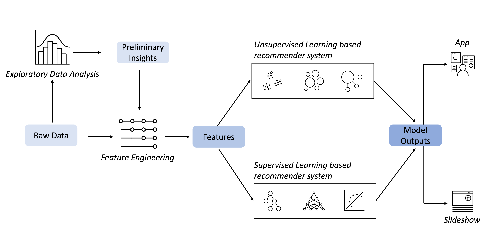

Tasks:

- Collecting and understanding data
- EDA
- Extracting Bag of Words (BoW) features from course textual content
- Calculating course similarity using BoW features
- Building content-based recommender systems using various unsupervised learning algorithms, such as: Distance/Similarity measurements, K-means, Principal Component Analysis (PCA), etc.
- Building collaborative-filtering recommender systems using various supervised learning algorithms: K Nearest Neighbors, Non-negative Matrix Factorization (NMF), Neural Networks, Linear Regression, Logistic Regression, RandomForest, etc.
- Creating an insightful and informative slideshow and presenting it to your peers

### 1.3 My Notes on Recommender Systems

:warning: I prefer the theoretical explanation of [Recommender Systems by Andrew Ng](https://github.com/mxagar/machine_learning_coursera/blob/main/07_Anomaly_Recommender/ML_Anomaly_Recommender.md#2-recommender-systems).

After revisiting my notes there, I add a summary here; note that the approach by Ng is different than the approaches explained in later sections.

#### Problem definition

In recommender systems, we usually have **items** (e.g., courses - rows) and **users** (columns). The users rate some items and we'd like to:

- Guess missing ratings
- Recommend to users items the might like

The fact that one item is similar to another or is liked or not depends on its properties; those properties are the **features**. Depending on whether we know which these properties are or not, the approach of solving the problem can be

1. Content-based: we know the features of the items and their values.
2. Collaborative-filtering: we obtain the values of the latent features; these features are latent because we don't know which they're, we only know how many we want to have!

The problem is formally described with these variables:

      n_m: number of items
      n_u: number of users
      k: number of features

      x^(i): feature vector of item i,
         i.e., degree of alignment of the item i with each feature k;
         k (+1) elements
      theta^(j): importance for each feature k given by the user j,
         k (+1) elements
      y^(i,j): real rating of user j to item i
      r^(i,j): whether user j has rated item i

      y_hat^(i,j) = theta^(j)' * x^(i)
         predicted rating of user j to item i

      Theta = [theta^(1)'; ...; theta^(n_u)']: n_u x k
      theta^(j): k x 1

      X = [x^(1)'; ...; x^(n_m)']: n_m x k
      theta^(j): k x 1

      y^(i,j) ~ y_hat^(i,j) = theta^(i)' * x^(j)

      Y_hat = X * Theta': n_m x n_u
         this is the estimation of user-movie rating matrix!

#### Content-Based RecSys

In the content-based approach, all `x` vectors are known, i.e., `X` is known: the features of the movies and their values. The goal is to obtain `Theta` so that `Y_hat = X * Theta'` is the closes possible to `Y`. That is achieved with a regression optimization in which we get the `Theta` matrix.

In the IBM approach for content-based systems, the methodology is different:

- `X` is known: item features and their values.
- Users rate *some* items: `y^(i,j)`.
- Ratings are multiplied to feature vectors: `y^(i,j)*x^(i), for each item i`
- All resulting multiplications are summed and normalized so that we get the **user profile vector**: the weight each user gives to each feature.
- The rating of a user to a new item can be estimated by multiplying (dot product) the user profile vectors with the feature vector of the item: the values lies between 0 and 1.

#### Collaborative Filtering RecSys

In collaborative filtering, we only know the size `k`; neither the values from `X` nor `Theta` are known. The goal is to obtain `Theta` and `X` so that `Y_hatX * Theta'` is the closes possible to `Y`. That is achieved with double regression optimization in which we get both `Theta` and `X` values.

In practice, that is done with the **non-negative matrix factorization**.

See my hand-written notes in [Matrix_Factorization.pdf](Matrix_Factorization.pdf).

## 2. Exploratory Data Analysis and Feature Engineering

### 2.1 Download and Analyze Dataset: `lab_jupyter_eda.ipynb`

Notebook: [`lab_jupyter_eda.ipynb`](https://github.com/mxagar/machine_learning_ibm/blob/main/06_Capstone_Project/lab/lab_jupyter_eda.ipynb)

Nothing really new is done in the notebook/exercise.

The dataset consists on these files:

1. `course_genre.csv`: `(307, 16)`: course id, title and binary values of topics covered in each course.
2. `ratings.csv`: `(233306, 3)`: user id, course id and rating of each course by the user; the rating has only two possible values: `2: enrolled, not finished`, `3: enrolled and finished`.
3. `user_profile.csv`: `(33901, 15)`: user id and weight for each course feature for each student. The weights span from 0 to 63, so I understand they are summed/aggregated values for each student, i.e., the accumulated ratings (2 or 3) of the students for each course feature. In other words, these weights seem not to be normalized.
4. `rs_content_test.csv`: `(9402, 3)`: some test user rating data, consisting of `user` (student id), `item` (`COURSE_ID`), `rating`. Altogether 1000 unique users are contained, so some users have rated some courses.

Other values for ratings would be possible (but not present), e.g.: `1` clicked on it, `0` or `NA` no exposure. It is interesting the fact that we don't use a real rating, but only attendance and completion information. This is very practical, because probably few people rate courses/movies, but we know for all users, who started watching a course/movie, and who finished it.

Steps followed:

- All titles are joined to created a `wordcloud`.
- Course counts for topics are analyzed: sorted according to counts (popularity of each topic).
- Users with most enrollments are ranked.
- Courses with most enrollments are ranked: 20 most popular.
- A join (`merge()`) is performed to get course names.

### 2.2 Feature Engineering: `lab_jupyter_fe_bow_solution.ipynb`, `lab_jupyter_fe_course_sim_solution.ipynb`

New but complementary datasets are presented:

1. `course_processed.csv`: it adds a course description to `course_genre.csv`.
2. `course_bows.csv`: the result of the first notebook in this section/part: `lab_jupyter_fe_bow_solution.ipynb`.

Notebooks:

- [`lab_jupyter_fe_bow_solution.ipynb`](https://github.com/mxagar/machine_learning_ibm/blob/main/06_Capstone_Project/lab/lab_jupyter_fe_bow_solution.ipynb)
- [`lab_jupyter_fe_course_sim_solution.ipynb`](https://github.com/mxagar/machine_learning_ibm/blob/main/06_Capstone_Project/lab/lab_jupyter_fe_course_sim_solution.ipynb)

Steps followed:

- Course title and description are merged to form a text field from which features are extracted, i.e., token counts (Bags of Words, BoW).
- Text field tokenization is performed with NLTK, removing stop words and taking only nouns (after POS tagging).
- A vocabulary/dictionary is created with gensim.
- BoWs are created for each course text field, storing them stacked in a dataframe in which each course-token pair has an entry.
- The created dataframe is pivoted to create sparse BoW entries, one for each course.
- Similarities between courses are computed: given a course with its BoW sparse array, the most similar ones are found.

## 3. Content-Based Recommender System

### 3.1 Introduction to Content-Based Recommender Systems

Content based Recomender Systems try to recommend similar products to users based on their profile; the profile is built with

- user preferences
- items the user has consumed
- items the users has seen/clicked on

Thus, the recommendation process is based on the similarity between items; **similarity in content**: category, genre, etc. And the recommendation happens within the user profile.

Example: a user has viewed and voted 3 movies, now we need to suggest which one to watch; all movies have a genres encoded as dummies.

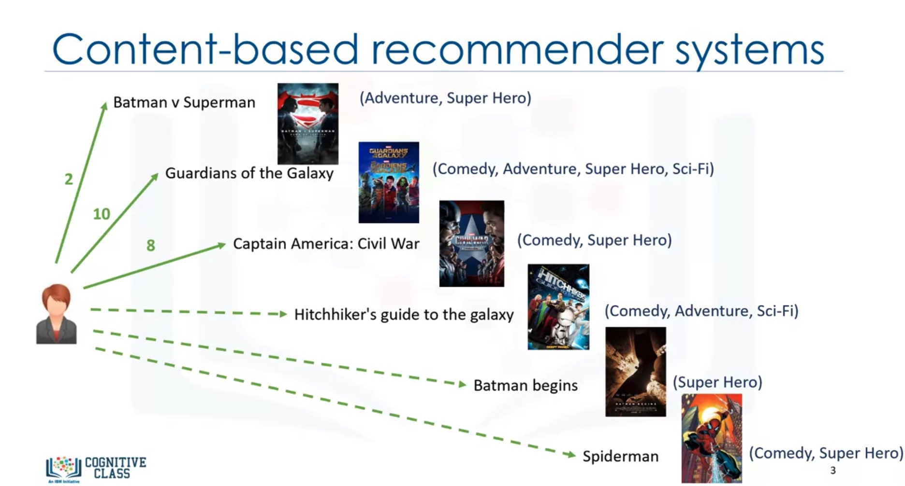

To create the **user profile**, the following matrices are created:

- Input user ratings: the rating the user has given to the movies (not all, the available ones).
- Movies matrix: the one-hot encoded genre properties of the rated movies.
- Weighted genre matrix: user ratings are multiplied to genre matrix.
- The user profile is the normalized sum of all values in the weighted matrix along the columns, i.e., it tells us **the importance of each genre/property for the user**.

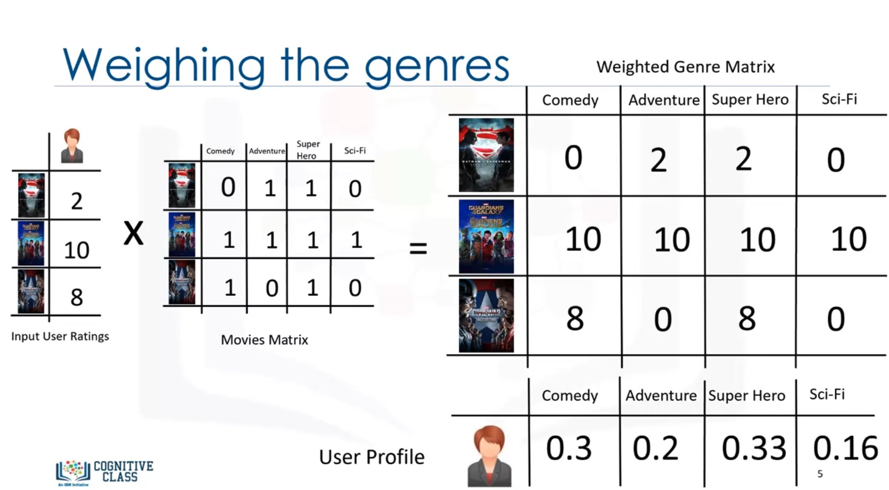

To **generate the recommendation rating of each unseen movie**, the user profile is used in conjunction with the one-hot-encoded genres of the (unseen) movies, following these steps:

- The rows of the movies matrix (one-hot values) are multiplied one-by-one by the user profile. That results in the weighted movies matrix.
- The weights are summed along the rows, i.e., for each unseen movie we get an aggregated value, which is the weighted average or **expected rating** (in the scale 0-1).

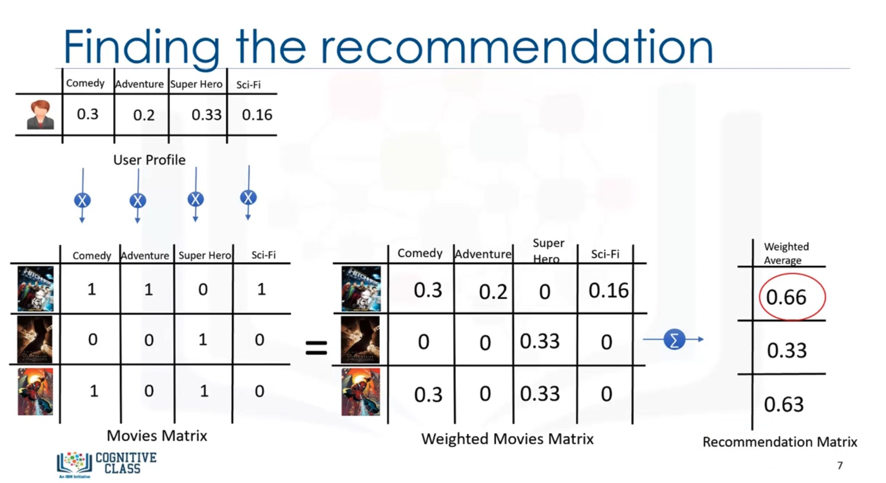

These kind of Recommender Systems work usually very well, but have a major issue: the user might like movies from a genre which has not been seen in the platform (e.g., drama, as opposed to Sci-Fi). Such movies are undetected. Methods such as **collaborative filtering** can handle those cases.

### 3.2 Lab Notebooks

In this section, 3 notebooks are implemented in sequence:

- [`lab_jupyter_content_user_profile.ipynb`](https://github.com/mxagar/machine_learning_ibm/blob/main/06_Capstone_Project/lab/lab_jupyter_content_user_profile.ipynb)
- [`lab_jupyter_content_course_similarity.ipynb`](https://github.com/mxagar/machine_learning_ibm/blob/main/06_Capstone_Project/lab/lab_jupyter_content_course_similarity.ipynb)
- [`lab_jupyter_content_clustering.ipynb`](https://github.com/mxagar/machine_learning_ibm/blob/main/06_Capstone_Project/lab/lab_jupyter_content_clustering.ipynb)

#### `lab_jupyter_content_user_profile.ipynb`

Recommendations based on user profiles:

- We consider that the course-genre weights are known.
- We have a user profile, i.e., a matrix which contains the weight each user gives to a genre/feature. These weights are not normalized.
- The rating of a user to a new item can be estimated by multiplying (dot product) the user profile vectors with the feature vector of the item. Since there is no normalization, we call that estimation score.

#### `lab_jupyter_content_course_similarity.ipynb`

Recommendations based on course similarities:

- We have computed course similarities (matrix) using the BoWs of course descriptions in the FE notebook.
- For each test user with the list of courses he/she took, we get the list of unattended courses with a similarity larger than a threshold value.

#### `lab_jupyter_content_clustering.ipynb`

Recommendations based on user profile clustering:

- User profiles are reduced to less dimensions with PCA.
- User profiles are clustered with K-Means applying the elbow method for k value discovery
- For each user in a cluster, his un-attended courses are found.
- For each user cluster, the most attended courses are listed.
- For each user, the most attended courses in theirs cluster are recommended, if these were not visited by them yet.

## 4. Collaborative Filtering Based Recommender System

Collaborative filtering is based on the assumption/fact that there is a relationship between users and items, so that we can determine which items a user might prefer.

There are two major collaborative filtering approaches:´, depending on which similarites or point neighborhoods we observe:

- User-based
- Item-based

In the **user-based** approach we have a target/active user for whom similar users or users in the clustering neighborhood are found. Similarity is determined by preferences, which can be derived as liked movies. From those similar users, movies that the target user has not watched/liked but the similar user has are taken as recommendations. Note that user profiles don't need to be formally genre preferences, but it suffices with the item preferences; therefore, we don't expect feature extraction from movies/items. However, the user-item matrix is required: the matrix that contains the ratings the users give to the items. The similarities are computed between the rows (users).

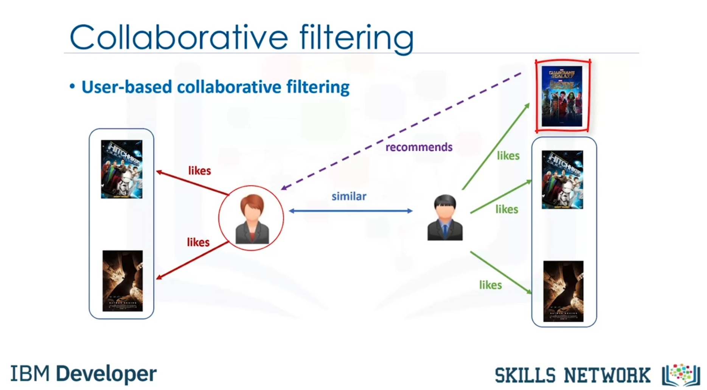

Given a user-item matrix and an active/target user, we'd like to fill in his/her missing ratings. To that end:

- The similarity weights of the active user wrt. other users are computed.
- The weighted ratings matrix is computed: for the missing ratings, we take the ratings of the other users and apply to them the similarity weight; then, those multiplications are summed to obtain an approximate estimation. That sum is normalized by the sum of all similarity weights used in the operation.

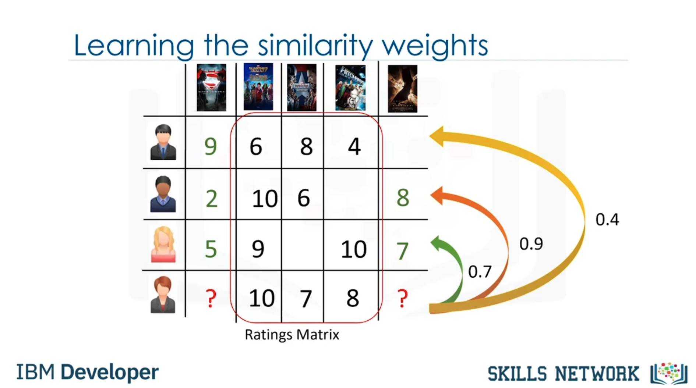

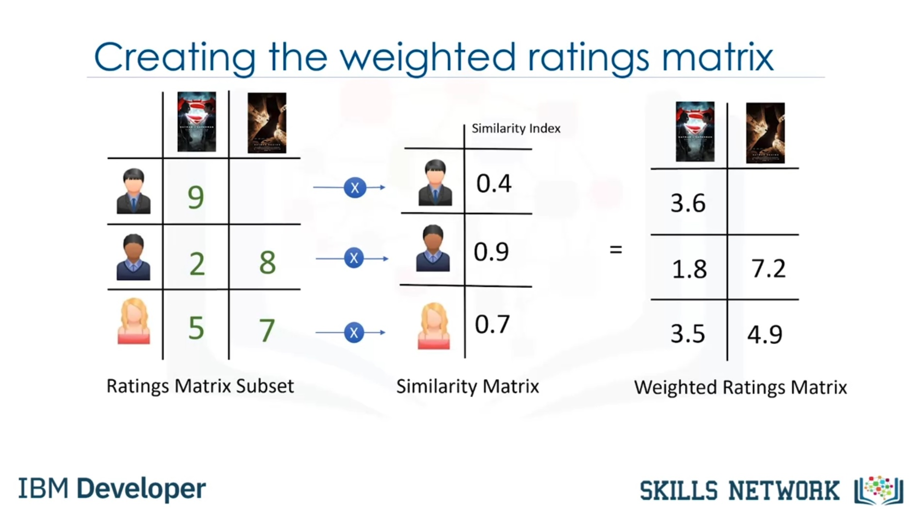

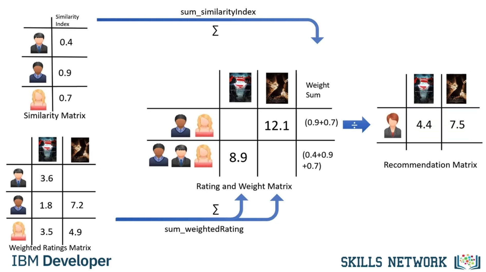

In the **item-based** approach, similar items are found, however, that similarity is not based on the content, but on the ratings by the users! Thus, regardless of the content, items are suggested which were liked by other users that have seen some of the movies we have. In other words, similarity is not given by the content, but with the motto "other users also liked". In practice, we need the user-item matrix and instead of looking similarities in the rows (user-based approach), we look for similarities in the columns (items).

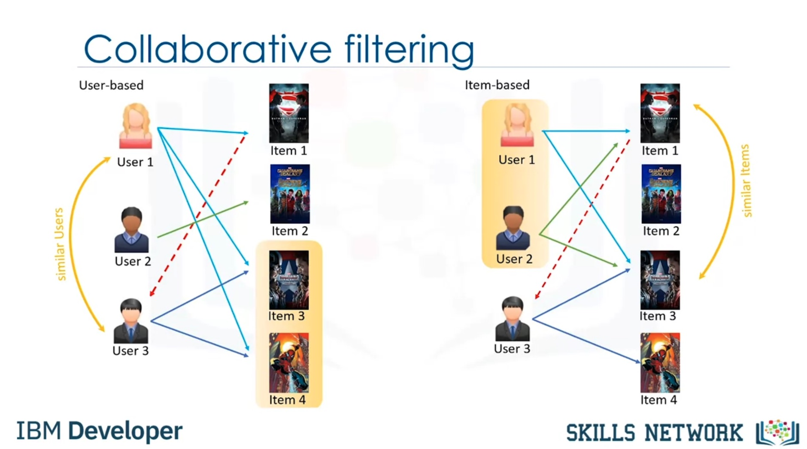

Collaborative filtering is very effective but has the following challenges:

- Sparsity: users rate only a limited number of items; we might not have enough ratings sometimes to make a prediction.
- Cold start: it is difficult to make a recommendation to new users or new items.
- Scalability: as the number of users and items increases, the performance drops, because we start to have many similar items.

### 4.2 Lab Notebooks

In this section, 5 notebooks are implemented in sequence:

- [`lab_jupyter_cf_knn.ipynb`](https://github.com/mxagar/machine_learning_ibm/blob/main/06_Capstone_Project/lab/lab_jupyter_cf_knn.ipynb)
- [`lab_jupyter_cf_nmf.ipynb`](https://github.com/mxagar/machine_learning_ibm/blob/main/06_Capstone_Project/lab/lab_jupyter_cf_nmf.ipynb)
- [`lab_jupyter_cf_ann.ipynb`](https://github.com/mxagar/machine_learning_ibm/blob/main/06_Capstone_Project/lab/lab_jupyter_cf_ann.ipynb)
- [`lab_jupyter_cf_regression_w_embeddings.ipynb`](https://github.com/mxagar/machine_learning_ibm/blob/main/06_Capstone_Project/lab/lab_jupyter_cf_regression_w_embeddings.ipynb)
- [`lab_jupyter_cf_classification_w_embeddings.ipynb`](https://github.com/mxagar/machine_learning_ibm/blob/main/06_Capstone_Project/lab/lab_jupyter_cf_classification_w_embeddings.ipynb)

The first 2 use "classical" ML methods with Scikit-Learn and the [Surprise](https://surpriselib.com/) library. The last 3 use Artificial Neural Networks (ANN) with Keras.

#### `lab_jupyter_cf_knn.ipynb`

  - A dense user-items ratings table is converted to a sparse table.
  - Item-based and user-based k-NN search is applied to find the closest items/users given their similarity and perform a prediction with a weighted sum. This is done with the [surprise](https://surprise.readthedocs.io/en/stable/index.html) library and manually.

#### `lab_jupyter_cf_nmf.ipynb`

In this notebook, Non-Negative Matrix Factorization (NMF) is used to decompose a ratings table into lower rank matrices which encode latent features. This is done with the [surprise](https://surprise.readthedocs.io/en/stable/index.html) library and with Scikit-Learn.

#### `lab_jupyter_cf_ann.ipynb`

In this notebook, a very simple ANN is created with Keras using OOP, i.e., inheriting the `tensorflow.keras.Model` class. The model takes the dense ratings dataframe encoded with indices and it builds two embeddings: one for the user representations and the other for the item representations. Both embeddings have size 16 and are multiplied (dot product) to predict the rating.

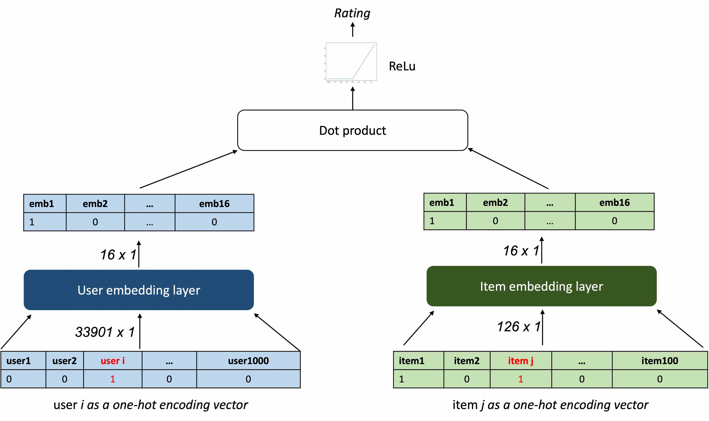

The training results in two important embedding matrices, which encode latent features. These are persisted and used in the next notebooks.

#### `lab_jupyter_cf_regression_w_embeddings.ipynb`

In this notebook, the user and item embeddings are loaded, as well as the dense ratings dataframe; they have the following shapes:

- user embeddings: `(33901, 17)`
- item embeddings: `(126, 17)`
- ratings (dense): `(233306, 3)`

The embeddings are joined to the ratings dataframe so that we get a table of shape `(233306, 3+16+16)`. Then, the two embedding vectors are summed and we collapse the large dataframe to a shape of `(233306, 16+1)`, i.e., 16 features (summed embedding vectors) and the rating (target).

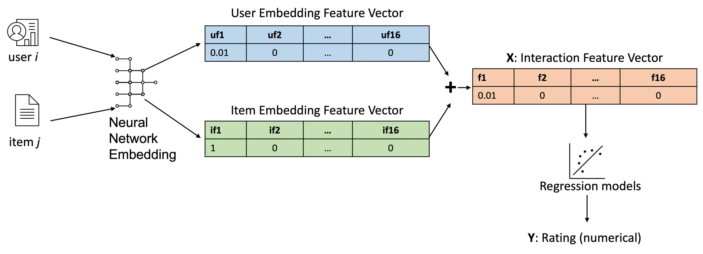

With this dataset, regression models are applied:

- Linear regression.
- Lasso regression with cross-validation.
- Ridge regression with cross-validation.

#### `lab_jupyter_cf_classification_w_embeddings.ipynb`

This notebook applies classification (random forest) to the dataset processed in the previous notebook.

#### Forum Questions

##### How can we obtain the embeddings of a new user/item?

In the collaborative filtering notebooks with artificial NNs of the 4th week user and item embeddings are computed. Then, those embeddings are used as features to create regression and classification models.

My question is related to the situation in which we have a new user or a new course/item: how should we obtain the embedding representation of them? Those embedding vectors are necessary to use the regression/classification models. However, the new items are not part of the training set, and therefore, the embedding layers don't contain them.

So which is the recommended approach?

##### The ANN is trained only with existing ratings, which default to 2 and 3

In the collaborative filtering notebooks with artificial NNs of the 4th week, user and item embeddings are computed. Then, those embeddings are used as features to create regression and classification models.

That approach re-frames the problem as a supervised learning case. In that setting, we have the following issue: the training labels can refer only to ratings which have the values 2 and 3, thus, the model will predict only those values/classes; however, we would like to predict cases in which the user has no interest at all in the course, i.e., ratings other than 2 and 3, e.g., 0. Therefore, I'm afraid such a supervised learning model doesn't make much sense in the present case.

Is my reasoning correct? If not, where am I wrong?

## 5. Deployment and Presentation

This section is about how to use [Streamlit](https://streamlit.io/) and how to present the project.

For a more detailed guide to `streamlit`, check my notes: [streamlit_guide](https://github.com/mxagar/streamlit_guide).

The content of this section are in the following files:

- [`lab-intro-streamlit.pdf`](lab-intro-streamlit.pdf)
- [`lab-cloudide-recommender-w-streamlit.md.pdf`](lab-cloudide-recommender-w-streamlit.md.pdf)

Two app templates are provided:

- [`lab/first_app`](lab/first_app)
- [`lab/project_template`](lab/project_template)

Additionally, the section focuses on how to present the findings of such a project.

### 5.1 Notes on the First App

File: [`lab/first_app/app.py`](lab/first_app/app.py)

```python
import streamlit as st
import pandas as pd

# 1. Create a streamlit title widget, this will be shown first
st.title("This is a sample app")
    
# 2. Then create a streamlit button widget, this will be shown after title
button1 = st.button("Click to show a dataframe")
print(button1)

if button1:
    df = pd.DataFrame({
    'column1': [1, 2, 3, 4],
    'column2': [10, 20, 30, 40]
    })
    # Show the Pandas dataframe using st.dataframe() method
    st.dataframe(df)
    # Visualize the column1 series using st.line_chart() method
    st.line_chart(df['column1'])


# 3. Create two streamlit slider widget for receiving a numerical value input
slider1 = st.slider("Slider1", min_value=1, max_value=10, value=1)
print(slider1)
slider2 = st.slider("Slider2", min_value=1, max_value=10, value=2)
print(slider2)

# 4. Create a streamlit text widget to show the sum result of two slider values
# Create a streamlit subheader widget
st.subheader("The sum of slider1 and slider2 is: ")
st.text(slider1 + slider2)
```

To run/use it:

```bash
pip install -r requirements.txt
streamlit run app.py
```

### 5.2 Notes on the Project Template

Files: 

- [`lab/project_template/backend.py`](lab/project_template/backend.py)
- [`lab/project_template/recommender_app.py`](lab/project_template/recommender_app.py)
- `data/`
- `requirements.txt`

To run/use it:

```bash
# In a dedicated environment
pip install -r requirements.txt
streamlit run recommender_app.py
```

The project implementation consists in completing the files `backend.py` and `recommender_app.py`.

Some notes:

- The structure of the `streamlit` app is quite nice and shows how to create a medium-sized app with Streamlit. However, two important things are missing in the template:
  - The functionality should be written in a package/library.
  - Tests, e.g., with `pytest`.
- The `st_aggrid` package is used, which allows for the user to manually filter from a displayed dataframe &mdash; very cool: [streamlit-aggrid](https://github.com/PablocFonseca/streamlit-aggrid).
- I added all new elements to [streamlit_guide](https://github.com/mxagar/streamlit_guide).

In order to complete the app, the guide [`lab-cloudide-recommender-w-streamlit.md.pdf`](lab-cloudide-recommender-w-streamlit.md.pdf) can be followed.

The final app is in the `lab/project_template` folder as well as:

- in the Github repository [course_recommender_streamlit](https://github.com/mxagar/course_recommender_streamlit)
- and deployed to Heroku: [https://ai-course-recommender-demo.herokuapp.com/](https://ai-course-recommender-demo.herokuapp.com/).

#### Streamlit App Structure

User interface:

- Sidebar:
  - Select model:
    - "Course Similarity"
    - "User Profile"
    - "Clustering"
    - "Clustering with PCA"
    - "KNN"
    - "NMF"
    - "Neural Network"
    - "Regression with Embedding Features"
    - "Classification with Embedding Features"
  - Tune hyperparameters
  - Training button
  - Prediction button
- Main body:
  - Courses dataframe: title + description; user needs to select courses!
  - Selected courses shown
  - Recommendations generated

Files:

- `recommender_app.py`
- `backend.py`

#### Interesting Links

- [Streamlit AgGrid](https://pypi.org/project/streamlit-aggrid/)
- [Medium: Streamlit App with Aggrid and Google Sheets](https://towardsdatascience.com/automate-streamlit-web-app-using-interactive-aggrid-with-google-sheets-81b93fd9e648)
- [Medium: 7 Reasons Why You Should Use the Streamlit AgGrid Component](https://towardsdatascience.com/7-reasons-why-you-should-use-the-streamlit-aggrid-component-2d9a2b6e32f0)


### 5.3 Notes on the Presentation

## 6. Project Submission